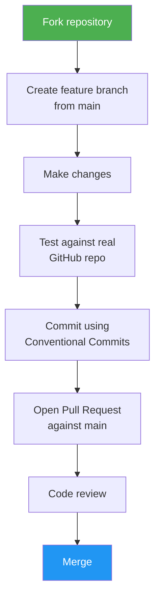
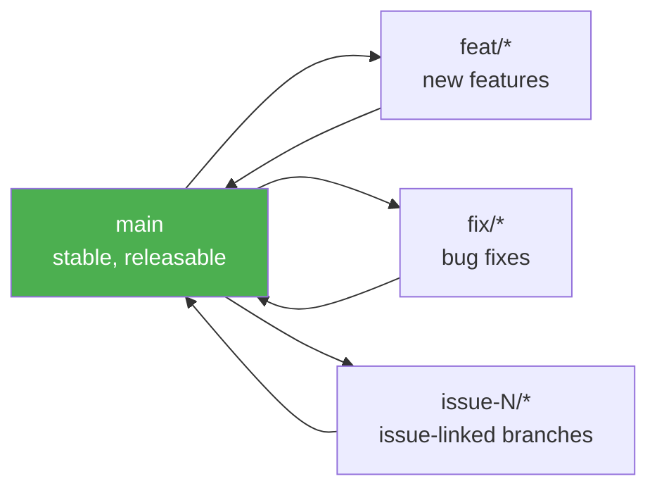
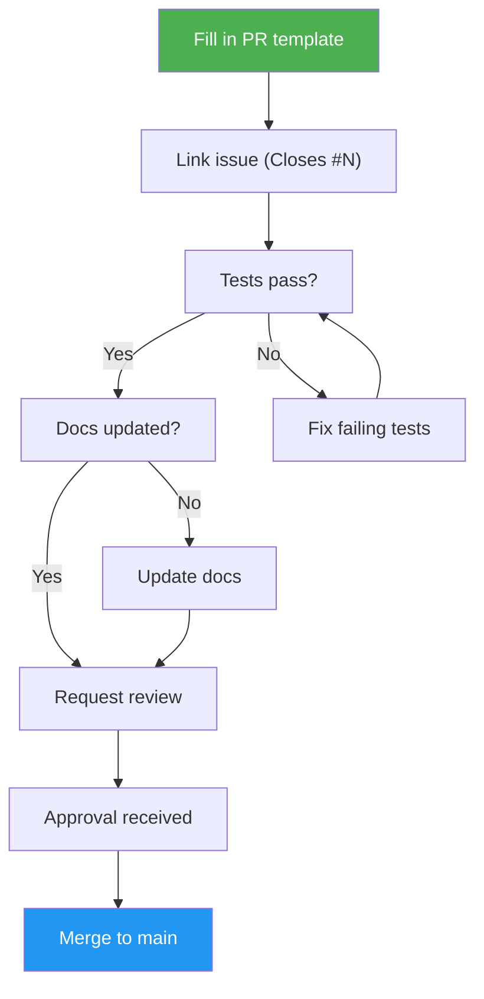

# Contributing to issue-dev

Thanks for your interest in contributing! issue-dev is a skills-only project — there's no runtime code, just Claude Code skills written in Markdown. This makes contributing accessible to anyone comfortable with Markdown and GitHub.

## How to Contribute

### Reporting Bugs

- Use the [bug report template](https://github.com/luongnv89/idd/issues/new?template=bug_report.md)
- Include the skill name (`/issue-creator`, `/issue-resolver`, etc.)
- Paste the full terminal output (redact any sensitive info)
- Mention your `gh` CLI version (`gh --version`)

### Suggesting Features

- Use the [feature request template](https://github.com/luongnv89/idd/issues/new?template=feature_request.md)
- Describe the problem you're solving, not just the feature you want
- Check existing issues first to avoid duplicates

### Submitting Changes



1. Fork the repository
2. Create a feature branch from `main`:
   ```bash
   git checkout -b feat/your-change
   ```
3. Make your changes
4. Test your skill changes against a real GitHub repo (see [Development Setup](#development-setup))
5. Commit using [Conventional Commits](#commit-conventions)
6. Open a Pull Request against `main`

## Development Setup

### Prerequisites

- [GitHub CLI](https://cli.github.com) (`gh`) 2.0+ — authenticated via `gh auth login`
- [Claude Code](https://docs.anthropic.com/en/docs/claude-code) or any SKILL.md-compatible agent
- Git 2.30+

### Project Structure

```
src/
├── skills/
│   ├── issue-creator/      # /issue-creator — create and normalize issues
│   │   ├── SKILL.md        # Skill definition (the "code")
│   │   ├── templates/      # Issue templates (bug, feature, improvement)
│   │   └── references/     # Error messages, detailed patterns
│   ├── issue-resolver/     # /issue-resolver N — resolve issues end-to-end
│   │   ├── SKILL.md
│   │   └── references/
│   ├── issue-triage/       # /issue-triage — backlog analysis
│   │   ├── SKILL.md
│   │   └── references/
│   └── init-gitissue/      # /init-gitissue — config generator
│       ├── SKILL.md
│       └── references/
├── internal-skills/        # /idd-doctor and other internal-only skills
├── deprecated-skills/      # Skills retained one release cycle past deprecation
├── shared/
│   └── agents/             # Shared agent definitions used by multiple skills
└── docs/                   # Runtime docs consumed by skills
    ├── config-schema.md
    ├── idd-methodology.md
    ├── naming-conventions.md
    └── github-projects-sync.md
docs/                       # Top-level project documentation (humans only)
tests/                      # Integration test scripts
```

### Testing

Each skill should be tested against a real (or test) GitHub repository:

1. Install the skill locally in Claude Code
2. Run the skill against a test repo with known issues
3. Verify the terminal output matches expected patterns from `DESIGN.md`
4. Check that `gh` CLI calls use `--json` with explicit field selection

See `tests/` for integration test scripts and setup instructions.

## Commit Conventions

We use [Conventional Commits](https://www.conventionalcommits.org/):

| Prefix | Use |
|--------|-----|
| `feat:` | New skill capability or feature |
| `fix:` | Bug fix in a skill |
| `docs:` | Documentation changes |
| `refactor:` | Skill restructuring without behavior change |
| `test:` | Adding or updating tests |
| `chore:` | Maintenance (CI, config, dependencies) |

Examples:
```
feat: add batch creation mode to issue-creator
fix: handle missing labels gracefully in issue-resolver
docs: add triage workflow example to README
```

## Branching Strategy



- `main` — stable, always releasable
- `feat/*` — new features
- `fix/*` — bug fixes
- `issue-N/*` — issue-linked branches (created by `/issue-resolver`)

## Pull Request Process



1. Fill in the PR template completely
2. Link to the related issue (use `Closes #N`)
3. Ensure all existing tests pass
4. Add tests for new functionality
5. Update docs if your change affects user-facing behavior
6. One approval required before merge

## Coding Standards

Since this is a skills-only project, "code" means SKILL.md files and references:

- **`gh` CLI calls** — always use `--json` with explicit field selection, never parse text output
- **Terminal output** — follow the symbol vocabulary and formatting rules in `DESIGN.md`
- **Error messages** — include what went wrong, how to fix it, and where to learn more
- **Skills are isolated** — no cross-skill imports or shared state
- **Templates** — include the `<!-- gitissue:normalized v1 -->` marker

## Code of Conduct

This project follows the [Contributor Covenant Code of Conduct](CODE_OF_CONDUCT.md). By participating, you agree to uphold this code.

## Questions?

Open a [discussion](https://github.com/luongnv89/idd/discussions) or file an issue. We're happy to help!
