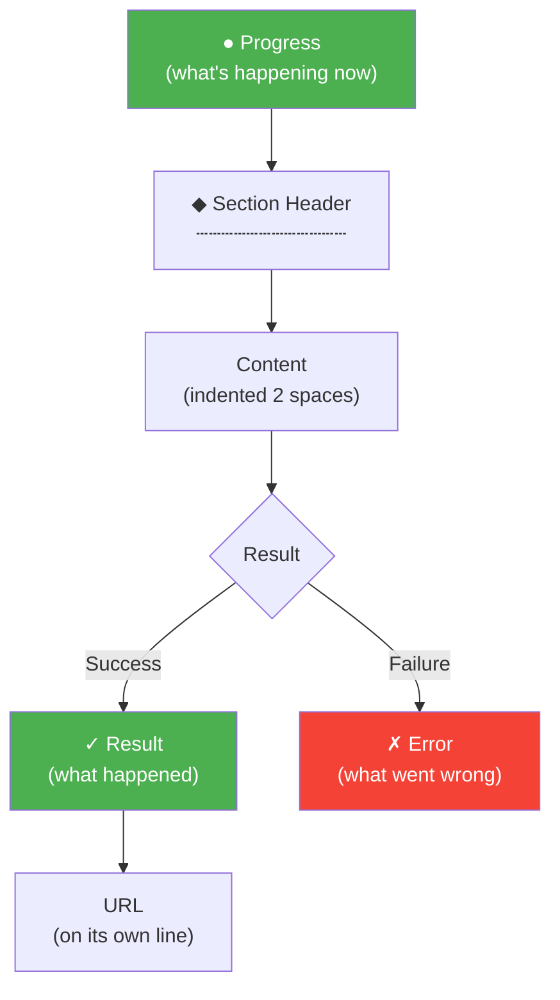

# gitissue CLI Style Guide

The terminal is the interface. Every character of output is a design decision.

## Principles

1. **Show, don't dump.** Structured output > raw text. Tables > JSON. Sections > walls of text.
2. **Transparency builds trust.** Show confidence scores, step progress, and what's happening at each phase. No black boxes.
3. **Errors are help.** When something fails, show what went wrong + how to fix + where to learn more.
4. **Warmth in empty states.** "No items found" is not a design. Every empty state has context and a next action.
5. **Distinctive, not decorative.** Step counters, confidence markers, and semantic symbols give gitissue its own feel — not generic AI slop.

## Symbol Vocabulary

| Symbol | Meaning | Color | Example |
|--------|---------|-------|---------|
| `●` | In progress | — | `● Scanning codebase...` |
| `✓` | Success / complete | Green | `✓ Created issue #42` |
| `✗` | Failure / error | Red | `✗ Not authenticated` |
| `◆` | Section header | Bold | `◆ Issue Preview` |
| `⚡` | Action / recommendation | — | `⚡ Parallelizable: #12 + #8` |
| `⚠` | Warning | Yellow | `⚠ Stale: 1 issue (>14d)` |
| `○` | Info / neutral | — | `○ First run — using defaults` |
| `+` | Added field | — | `+ Files: auth.py (high)` |
| `=` | Preserved field | — | `= Original: preserved` |

All symbols carry meaning without color. Never rely on color alone.

## Color Palette

When the terminal supports color:

- **Green**: success, created, passed, complete
- **Red**: failure, error, failed, aborted
- **Yellow**: warning, stale, low confidence
- **Cyan**: URLs, file paths, issue/PR numbers (`#42`, `PR #87`)
- **Bold**: section headers (`◆`), command names
- **Dim**: progress text, secondary info, timestamps

Text-only fallback: output is fully readable without any color.

## Output Structure



Every command follows this hierarchy:

```
  ● Progress (what's happening now)

  ◆ Section Header
  ┄┄┄┄┄┄┄┄┄┄┄┄┄┄┄┄
    Content (indented 2 spaces)
    More content

  ✓ Result (what happened)
    https://url (always on its own line)
```

Rules:
- One blank line between sections
- Two-space indent for content under headers
- No trailing blank lines
- URLs always on their own line, in cyan
- Section separators: `┄` (light dash, not heavy box)

## Progress Patterns

**Multi-step pipeline** (issue-resolver):
```
  [1/7] Fetch        ✓ issue #42 loaded
  [2/7] Branch       ✓ issue-42/fix-auth
  [3/7] Research     ● reading 5 files...
```

**Single operation** (issue-creator):
```
  ● Scanning codebase...
```

## Table Format

```
  #  │ Issue              │ Pri │ Blocks │ Status
  ───┼────────────────────┼─────┼────────┼───────────
  1  │ #12 Fix auth       │ P1  │ #15    │ ready
  2  │ #8  Add pagination │ P2  │ —      │ ready
```

- Box-drawing characters: `│ ─ ┼`
- Right-align numbers, left-align text
- Max width: 80 characters (truncate with `...` if needed)
- Use `—` for empty cells (not blank)

## Error Format


Errors are the moment users need the most help.

```
  ✗ Short error description

    To fix:  <actionable command>
    Docs:    <url to relevant documentation>
```

Always include: what went wrong, how to fix it, where to learn more.

## Confirmation Prompts

```
  Apply normalization? [Y/n]
```

Default option in uppercase. Alternatives in lowercase.

## Confidence Markers

Unique to gitissue. Show honesty about what's inferred:

```
  + Files:    auth.py (high), config.py (medium)
  + Criteria: 3 acceptance criteria (medium)
```

Levels: `high` (direct match), `medium` (keyword inference), `low` (best guess, marked `(needs review)` in the issue).

## First-Run Experience

When no `.gitissue.yml` exists:

```
  ○ First run — using default config. Run /init-gitissue to customize.
```

One line, then proceed normally. Non-intrusive.

## Empty States

Every empty state has warmth and a next action:

| Scenario | Output |
|----------|--------|
| No files identified | `⚠ Could not identify affected files. Issue created with manual-review flag. Tip: mention specific filenames for better results.` |
| No open issues (triage) | `○ No open issues found. Nothing to triage! Create issues with /issue-creator to get started.` |
| Already normalized | `✓ Issue #42 is already normalized (v1, 2026-03-15). No changes needed.` |
| Issue not found | `✗ Issue #42 not found\n\n  To fix: gh issue list\n  Check: is this the right repository?` |

## GitHub Markdown Rendering

Normalized issues must render cleanly in GitHub's web UI:

- Use standard markdown (no HTML except the invisible marker)
- Section headers: `## Type`, `## Description`, `## Acceptance Criteria`
- Code blocks for file paths and technical details
- Normalization marker: `<!-- gitissue:normalized v1 -->` (invisible in rendered view)
- Reporter's original text: in a `> Reporter Context` blockquote
- Confidence markers in parentheses: `(high confidence)`, `(needs review)`

## Terminal Output Mockups

### /issue-creator (single)

```
  ● Scanning codebase...
    Found 3 relevant files

  ◆ Issue Preview
  ┄┄┄┄┄┄┄┄┄┄┄┄┄┄┄┄┄┄
  Type:     bug
  Title:    Fix mobile auth redirect loop
  Files:    auth.py, middleware.py, config.py
  Labels:   bug, auth, mobile
  Criteria: 3 acceptance criteria generated

  ✓ Created issue #42
    https://github.com/user/repo/issues/42
```

### /issue-creator N (normalize)

```
  ● Fetching issue #42...
  ● Scanning codebase for context...

  ◆ Normalization Preview
  ┄┄┄┄┄┄┄┄┄┄┄┄┄┄┄┄┄┄┄┄┄┄
  + Type:        bug (high confidence)
  + Files:       auth.py (high), config.py (medium)
  + Criteria:    3 acceptance criteria (medium)
  + Labels:      +bug, +auth
  = Original:    preserved in Reporter Context block

  Apply normalization? [Y/n/dry-run]

  ✓ Backup posted (comment #5)
  ✓ Issue #42 normalized
    https://github.com/user/repo/issues/42
```

### /issue-resolver N

```
  ● Fetching issue #42...
  ● Auto-normalizing...

  ◆ Resolve Pipeline
  ┄┄┄┄┄┄┄┄┄┄┄┄┄┄┄┄┄┄
  [1/7] Fetch        ✓ issue #42 loaded
  [2/7] Branch       ✓ issue-42/fix-mobile-auth
  [3/7] Research     ✓ read 5 files, traced 3 deps
  [4/7] Plan         ✓ approach: fix redirect logic
  [5/7] Execute      ✓ 2 files changed, 45 lines
  [6/7] Verify       ✓ 12 tests passed
  [7/7] Ship         ✓ PR #87 created

  ✓ Done — PR #87: Fix mobile auth redirect
    https://github.com/user/repo/pull/87
    Closes #42
```

### /issue-analysis N

```
  ● Fetching issue #42...

  ◆ Analysis Pipeline
  ┄┄┄┄┄┄┄┄┄┄┄┄┄┄┄┄┄┄
  [1/8] Fetch          ✓ issue #42 loaded (bug)
  [2/8] Extract        ✓ 8 keywords, 2 file refs
  [3/8] Research       ✓ read 18 files, traced 12 deps
  [4/8] History        ✓ 5 related commits, 1 regression
  [5/8] Cross-refs     ✓ 2 related issues
  [6/8] Analysis       ✓ root cause identified
  [7/8] Options        ✓ 3 approaches proposed
  [8/8] Report         ✓ analysis complete

  ◆ Issue Analysis: #42 Fix mobile auth redirect loop
  ┄┄┄┄┄┄┄┄┄┄┄┄┄┄┄┄┄┄┄┄┄┄┄┄┄┄┄┄┄┄┄┄┄┄┄┄┄┄┄┄┄┄┄┄┄┄┄

  Type:        bug
  Labels:      bug, auth, mobile

  ◆ Git History
  ┄┄┄┄┄┄┄┄┄┄┄┄
    Domain experts:  @jdoe (12), @asmith (5)
    ⚡ Possible regression: e4f5g6h 2026-03-10

  ◆ Cross-references
  ┄┄┄┄┄┄┄┄┄┄┄┄┄┄┄┄┄
    Blocks: #55, #60
    ⚠ Possible duplicate: #51

  ◆ Implementation Options
  ┄┄┄┄┄┄┄┄┄┄┄┄┄┄┄┄┄┄┄┄┄┄
    Option 1: Minimal fix (S)
      + Smallest change, lowest risk

    Option 2: Route-based config (M)
      + Declarative auth per route

  ◆ Summary
  ┄┄┄┄┄┄┄┄┄
    Complexity:   S │ Risk: Low
    Recommended:  Option 1 — Minimal fix

  ✓ Done — analysis of #42: Fix mobile auth ...
    Saved: .gitissue/analysis-42.json
```

### /issue-triage

```
  ● Fetching 23 open issues...
  ● Analyzing dependencies...

  ◆ Issue Triage
  ┄┄┄┄┄┄┄┄┄┄┄┄┄┄
  #  │ Issue              │ Pri │ Blocks │ Status
  ───┼────────────────────┼─────┼────────┼───────────
  1  │ #12 Fix auth       │ P1  │ #15    │ ready
  2  │ #8  Add pagination │ P2  │ —      │ ready
  3  │ #15 Refactor DB    │ P2  │ —      │ blocked #12
  4  │ #3  Old UI bug     │ P3  │ —      │ stale (28d)

  ⚡ Parallelizable: #12 + #8 (independent)
  ⚠  Stale: 1 issue (>14 days inactive)
  ○  Suggested order: #12 → #15 → #8 → #3
```
