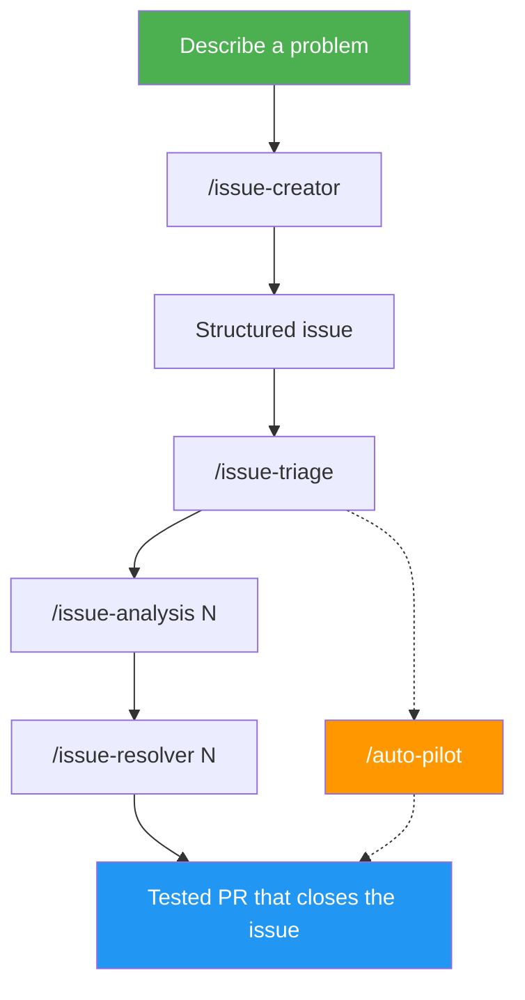
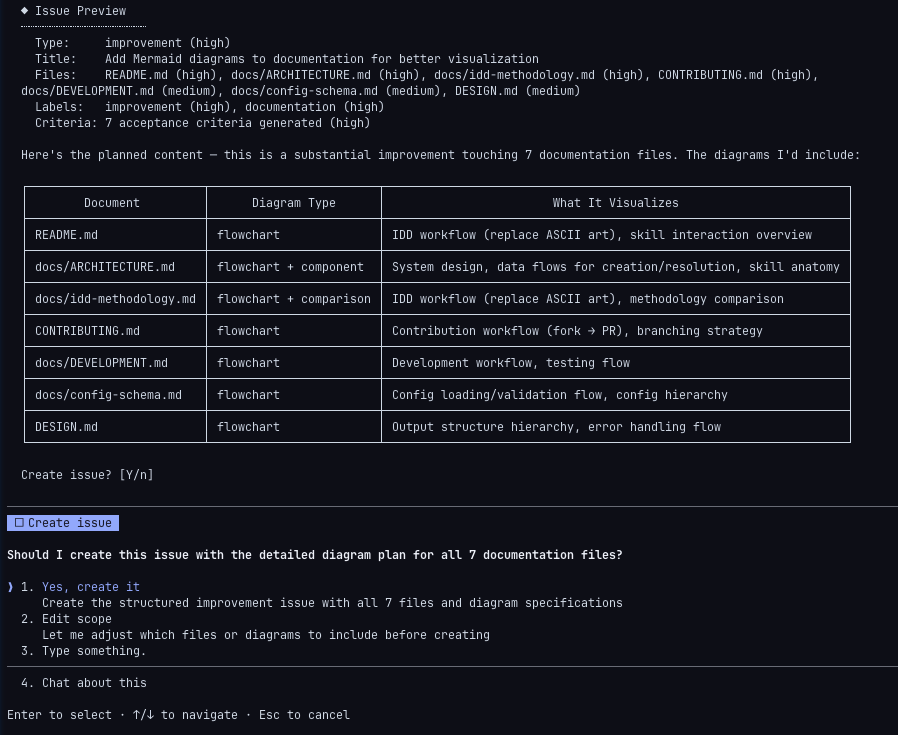
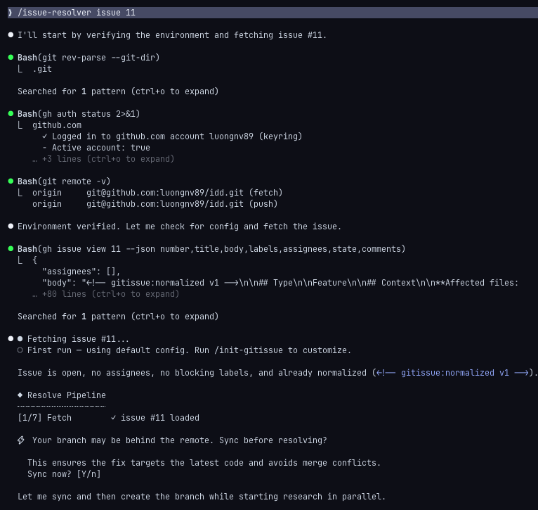
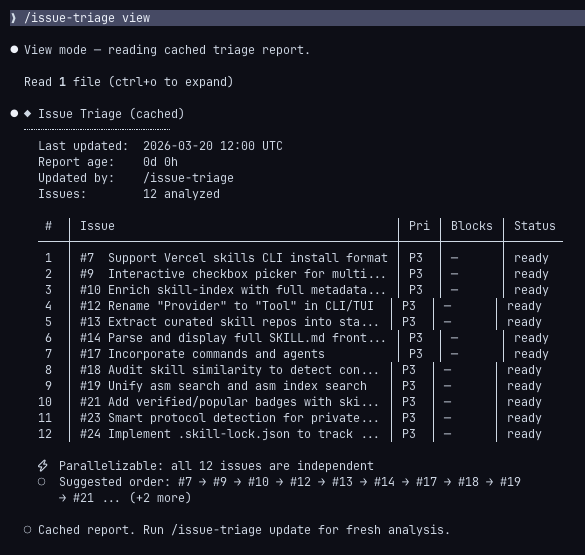
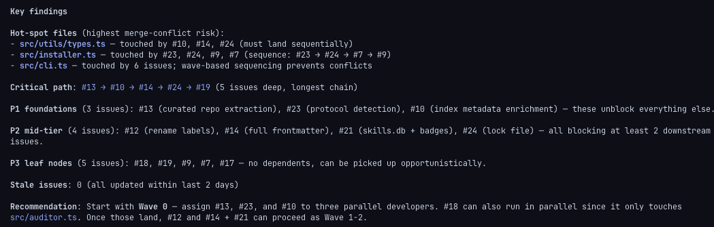
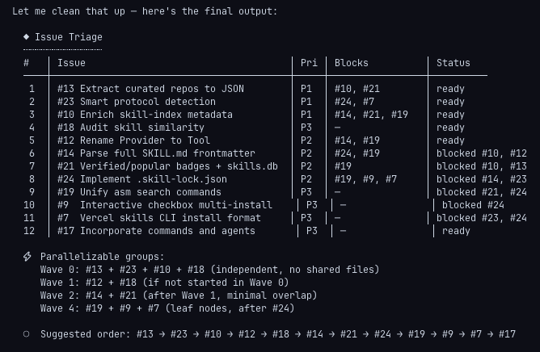
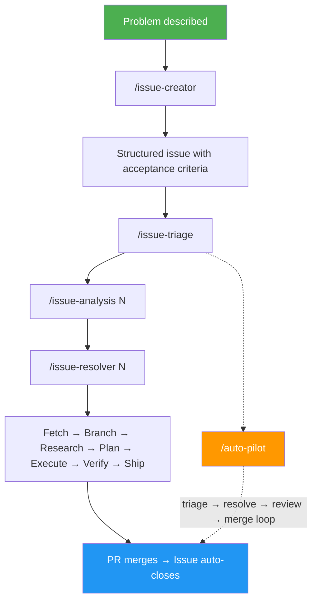

<p align="center">
  <picture>
    <source media="(prefers-color-scheme: dark)" srcset="assets/logo/logo-white.svg">
    <source media="(prefers-color-scheme: light)" srcset="assets/logo/logo-black.svg">
    
  </picture>
</p>

<p align="center">
  <a href="https://luongnv.com/idd/"></a>
  <a href="https://github.com/luongnv89/idd/releases/latest"></a>
  <a href="https://github.com/luongnv89/idd/blob/main/LICENSE"></a>
  <a href="https://github.com/luongnv89/idd"></a>
  <a href="https://github.com/luongnv89/idd/blob/main/CONTRIBUTING.md"></a>
</p>

<p align="center">
  <a href="https://luongnv.com/idd/"><b>🌐 Visit the website →</b></a>
</p>

# Turn GitHub Issues Into Structured, Agent-Ready Work Orders

Eight terminal commands that structure, analyze, triage, resolve, review, and self-check GitHub issue workflows — so any developer or AI agent can pick up an issue and ship a tested PR.

[**Website**](https://luongnv.com/idd/) · [**Get Started**](#get-started) · [**What is IDD?**](#what-is-idd) · [**Intention-Driven Development**](#idd-as-intention-driven-development) · [**Why Good Issues & Commits Matter**](#why-good-issues-and-commit-messages-matter) · [**Works With Any Tool**](#works-with-any-tool)

---

## The Problem

Unstructured issues kill velocity — and destroy your project history.

Someone files "the login is broken on mobile." A developer — human or AI — spends 30 minutes figuring out which files to open before writing a line of code. An AI agent produces changes to the wrong files because the issue lacked context. Meanwhile, 47 open issues sit in the backlog with no dependency awareness and no execution order.

Worse: when issues are vague, the commits that resolve them are vague too. Six months later, `git log` reads like `"fix stuff"`, `"update"`, `"WIP"`. Nobody can trace *why* a change was made, *what problem* it solved, or *what decision* led to that approach. The development history — which should be your project's most valuable knowledge base — becomes noise.

GitHub issues were designed for humans to read, not for agents to execute. And commit messages were designed to tell a story, not to fill a required field.

## The Fix

gitissue turns every GitHub issue into a self-contained work order: typed, structured, and enriched with acceptance criteria. Then it resolves them — with commit messages and PR titles that link every line of code back to the intention that created it.



| Command | What it does | Version | Effort |
|---------|-------------|---------|--------|
| `/issue-creator` | Classify type, generate acceptance criteria, create a structured issue | 0.4.1 | medium |
| `/issue-analysis N` | Root cause, git history, implementation options, complexity and risk | 0.4.1 | high |
| `/issue-resolver N` | 6-step pipeline: preflight, research, plan, implement, QA, deliver PR with `Closes #N` | 0.7.2 | max |
| `/issue-triage` | Dependency graph, stale detection, already-fixed detection via commit/PR scanning, priority and execution order | 0.5.2 | medium |
| `/init-gitissue` | Auto-detect language/framework/test runner, generate `.gitissue.yml` | 0.3.2 | low |
| `/auto-pilot` | Triage → resolve → review → merge loop. Balanced-by-default merge modes (`conservative`/`balanced`/`aggressive`), explicit issue lists for targeted runs, and a dependency-aware merge gate (`Depends on #N` / `Blocked by #N`) | 2.3.1 | max |
| `/issue-pr-review` | Review PR end-to-end: script pre-pass (lint/format/test auto-fix), per-criterion AC verification, five-dimension scoring (correctness, acceptance_criteria, traceability, maintainability, safety), reuses reviewer/fixer agents across cycles | 0.5.1 | high |

### Internal tooling

Internal-only skills are not published in the public skill index and are not built into `dist/`. They live alongside the source for repo maintainers to invoke directly from a working tree.

| Skill | Folder | Purpose |
|-------|--------|---------|
| `/idd-doctor` | [`src/internal-skills/idd-doctor/`](src/internal-skills/idd-doctor/) | Read-only health check for IDD repository invariants — runs against the local `src/` checkout; not distributed |

---

## How It Works

### 1. Create a structured issue

<p align="center">
  
</p>

Describe a bug, feature, or improvement in plain text. gitissue classifies it, generates acceptance criteria, and creates a GitHub issue with labels.

### 2. Resolve it in one command

<p align="center">
  
</p>

Six steps run automatically: preflight, research, plan, implement, QA, and deliver a PR with `Closes #N`.

### 3. Triage the backlog

<p align="center">
  
</p>

<p align="center">
  
</p>

<p align="center">
  
</p>

Dependency detection, priority suggestions, parallelizable work, stale issue warnings, and already-fixed detection — one command for the entire backlog.

### 4. Deep-dive on a single issue

```
  [1/8] Fetch          ✓ issue #42 loaded (bug)
  [2/8] Extract        ✓ 8 keywords, 2 file refs
  [3/8] Research       ✓ read 18 files, traced 12 deps
  [4/8] History        ✓ 5 related commits, 1 regression
  [5/8] Cross-refs     ✓ 2 related issues
  [6/8] Analysis       ✓ root cause identified
  [7/8] Options        ✓ 3 approaches proposed
  [8/8] Report         ✓ saved to .gitissue/analysis-42.json
```

### 5. Go hands-free with auto-pilot

```
  ◆ auto-pilot        starting (5 open issues)
  ┄┄┄┄┄┄┄┄┄┄┄┄┄┄┄┄┄┄┄┄┄┄┄┄┄┄┄┄┄┄┄┄┄┄┄┄┄┄┄┄┄┄┄
  [1/5] #42            ✓ resolved → PR #51 merged
  [2/5] #38            ✓ resolved → PR #52 merged
  [3/5] #35            ✗ stopped — test failures after 2 fix cycles
  [4/5] #29            ✓ resolved → PR #53 merged
  [5/5] #21            ✓ resolved → PR #54 merged
  ┄┄┄┄┄┄┄┄┄┄┄┄┄┄┄┄┄┄┄┄┄┄┄┄┄┄┄┄┄┄┄┄┄┄┄┄┄┄┄┄┄┄┄
  ◆ complete           4/5 resolved, 1 stopped
```

Triage, resolve, review, merge — repeated for every open issue. Up to three review-fix cycles per PR with a script pre-pass (lint/format/test auto-fix) before any LLM cycle is spent. Balanced by default: clean PRs are merged, partial PRs are left open for review unless `autopilot.mode: aggressive` is explicitly set. Supports explicit issue lists for targeted runs.

---

## Works With Any Tool

IDD is a methodology, not a vendor lock-in. The structured issue format is plain GitHub markdown — any tool that reads GitHub issues can consume it. gitissue adds structure to your issues; your existing tools keep working exactly as before.

| Tool | How it works with gitissue |
|------|---------------------------|
| **Claude Code** | Load skills directly — `/issue-creator`, `/issue-resolver` |
| **Codex CLI** | `gh issue view 42 --json body` and pass to codex as context |
| **Gemini CLI** | Pipe issue body to gemini for resolution |
| **GitHub Copilot** | Structured issues give Copilot better context for suggestions |
| **Any SKILL.md agent** | Load skills from `src/skills/` directory |
| **Human developers** | Read the issue — acceptance criteria and structure are right there |

gitissue is **complementary** to your existing workflow. Use it alongside TDD, BDD, CI/CD pipelines, project management tools, or any AI coding agent. It fills one gap — structuring and triaging issues — and stays out of the way for everything else.

---

## Get Started

### Prerequisites

- [GitHub CLI](https://cli.github.com) (`gh`) 2.0+, authenticated via `gh auth login`
- [Claude Code](https://docs.anthropic.com/en/docs/claude-code) or any SKILL.md-compatible agent
- Git 2.30+

### Install

Standalone is the recommended default. Each skill ships as a self-contained directory under the top-level [`skills/`](skills/) tree, ready to drop into any SKILL.md-compatible harness — Claude Code, Codex CLI, or anything else that loads SKILL.md trees. The same generated packages are also mirrored under [`dist/skills/`](dist/skills/) for backward-compatible subpath installs.

#### Recommended — Standalone via `asm install`

[`asm`](https://github.com/luongnv89/asm) is the primary install tool. It pulls the flat skill index straight from this repo (no clone required) and lets you select all skills or any specific skill using ASM's standard picker:

```bash
# Recommended: install from the repo root and choose all or selected skills
asm install https://github.com/luongnv89/idd

# Non-interactive single-skill install
asm install https://github.com/luongnv89/idd --skill issue-resolver
```

`asm` is idempotent — re-running the same command updates selected skills in place with no duplicate files. Each installed skill is complete: its required subagent prompts and runtime docs are bundled under `references/agents/` and `references/docs/`, so no separate shared-agent install step is required.

After install, restart Claude Code so it picks up the new skill(s). The full flat install surface lives under [`skills/`](skills/) and includes `issue-creator`, `issue-analysis`, `issue-resolver`, `issue-triage`, `issue-pr-review`, `auto-pilot`, and `init-gitissue`.

#### From-source alternative (no `asm` required)

If you can't or don't want to install `asm`, clone the repo and run the bundled install script. One command, no manual `tar`/`cp`, idempotent on re-run:

```bash
git clone https://github.com/luongnv89/idd.git
cd idd
./scripts/install.sh                          # interactive tool picker — choose one or more tools
# the picker lists every supported tool; pick by number (e.g. "1 3 4"), "a" for all,
# or press Enter for Claude Code. Bypass the picker by naming tools explicitly:
# or: ./scripts/install.sh --skill issue-resolver
# or target another tool: ./scripts/install.sh --tool codex
# or several at once:      ./scripts/install.sh --tools claude,codex,pi
# or every supported tool: ./scripts/install.sh --tools all
```

> When run on a terminal with no `--tool`/`--tools` flag, the script shows an interactive picker so you can select one or more tools. In a non-interactive context (CI, `curl | bash` without a TTY, piped input) it falls back to Claude Code so automation keeps working.

The script copies each `dist/skills/<name>/` to the selected tool's skills directory (default `~/.claude/skills/<name>/`). It supports `claude`, `agents`, `codex`, `opencode`, `pi`, `openclaw`, `hermes`, `antigravity`, and `windsurf` — each `dist/skills/<name>/` is a self-contained SKILL.md tree (the shared agents are bundled inside it at `references/agents/`), so a skill runs on any SKILL.md-compatible tool. Shared agents are *also* installed standalone from `dist/agents/*.md` into `~/.claude/agents/` (and `~/.agents/agents/`) — a Claude Code optimization for native subagent spawning; other tools use the bundled copies. The installer replaces IDD-managed agents cleanly, removes stale managed agents on update, and skips unmanaged same-name agents unless you pass `--force-agents` (which backs them up before replacement). Use `./scripts/install.sh --target <dir>` to target a different Claude root (Claude tool only; other tools use their fixed conventions). Pure POSIX bash — no extra runtime needed.

You can also do the copy by hand if you prefer to see every file move:

```bash
mkdir -p ~/.claude/skills ~/.claude/agents
cp -r skills/<name> ~/.claude/skills/
cp dist/agents/*.md ~/.claude/agents/
```

`skills/` is committed to the repository, so this path works on a fresh clone without running a build. (Run `./scripts/build.sh` first to produce `dist/agents/`.)

#### Plugin path (advanced — Claude Code only)

The plugin layout bundles every public skill under one `~/.claude/plugins/idd/` tree. It is the heavier option; pick it only if you want all skills installed atomically as a single Claude Code plugin.

Grab the `idd-plugin-<tag>.tar.gz` asset from the [latest release](https://github.com/luongnv89/idd/releases/latest) and extract it into your Claude Code plugins directory:

```bash
mkdir -p ~/.claude/plugins/idd
# Download idd-plugin-<tag>.tar.gz from the release page (browser or `gh release download`)
tar -xzf idd-plugin-<tag>.tar.gz -C ~/.claude/plugins/idd
```

The tarball unpacks to `.claude-plugin/plugin.json`, `agents/`, `skills/`, `shared/`, and `docs/` at its root. Restart Claude Code to load the new plugin.

> **Heads up — `claude plugin install <tarball-url>` is not supported.** Claude Code's `claude plugin install` only accepts `plugin@marketplace` references and resolves them through configured marketplaces, not direct tarball URLs or paths. Running `claude plugin install https://github.com/luongnv89/idd/releases/download/<tag>/idd-plugin-<tag>.tar.gz` returns `not found in any configured marketplace` and does nothing. Use the manual `tar -xzf` extract above — that is the supported install path today. (Tracked in [#79](https://github.com/luongnv89/idd/issues/79).)

If you cloned the repo, you can build the plugin tree locally and install it with the script: `./scripts/build.sh && ./scripts/install.sh --plugin`. `dist/plugin/` is generated only at release time and gitignored, so the build step is required.

> **Note:** `skills/` is committed so the standalone paths work without running a build. `dist/agents/` and `dist/plugin/` are built by `./scripts/build.sh` and shipped as release assets.

### First issue in 30 seconds

Create a structured issue:

```bash
/issue-creator "Login fails on mobile when session cookie expires"
```

Resolve it:

```bash
/issue-resolver 42
```

Triage the backlog:

```bash
/issue-triage
```

Or go hands-free — triage, resolve, review, and merge everything:

```bash
/auto-pilot
```

Zero config required. Run `/init-gitissue` to customize.

Browse the authored source for each skill — these links point to `src/` for reading; install copies come from `skills/<name>/` (see [Install](#install)):

| Skill | Source |
|-------|--------|
| `/issue-creator` | [`src/skills/issue-creator/`](src/skills/issue-creator/) |
| `/issue-analysis` | [`src/skills/issue-analysis/`](src/skills/issue-analysis/) |
| `/issue-resolver` | [`src/skills/issue-resolver/`](src/skills/issue-resolver/) |
| `/issue-triage` | [`src/skills/issue-triage/`](src/skills/issue-triage/) |
| `/auto-pilot` | [`src/skills/auto-pilot/`](src/skills/auto-pilot/) |
| `/issue-pr-review` | [`src/skills/issue-pr-review/`](src/skills/issue-pr-review/) |
| `/init-gitissue` | [`src/skills/init-gitissue/`](src/skills/init-gitissue/) |
| `/idd-doctor` _(internal)_ | [`src/internal-skills/idd-doctor/`](src/internal-skills/idd-doctor/) |

---

## What is IDD?

Issue-Driven Development — also **Intention-Driven Development** — treats GitHub issues as the atomic unit of all development work. Every change starts as a structured issue and ends as a PR linked to that issue.

The key idea: the gap between "someone describes a problem" and "someone ships a fix" is both a **translation gap** and an **intention gap**. IDD automates that translation — turning vague reports into structured work orders with acceptance criteria — while helping creators discover and articulate what they actually want through iterative refinement.



### IDD as Intention-Driven Development

IDD is also **Intention-Driven Development** — and that name captures something deeper about what it solves.

Expressing what you actually want is hard. Even experienced developers struggle to articulate a problem clearly enough for someone else — human or AI — to act on it. Vague descriptions lead to wrong assumptions, wasted effort, and solutions that miss the point.

`/issue-creator` changes this dynamic. When you describe a problem in plain language, it structures your input into a typed issue with reporter context and acceptance criteria — capturing intent only, never guessing affected files or implementation notes. But the real value isn't the output — it's the **feedback loop**:

1. **You describe the problem** — loosely, incompletely, however it comes to mind
2. **The agent proposes a structured issue** — classifying the type, filling in context, generating acceptance criteria
3. **You read back what it captured** — and realize what you actually meant, what's missing, what's wrong
4. **You refine through conversation** — correcting, adding detail, sharpening the intent until the issue says exactly what you want

This iterative process does something no template or form can do: it helps you **discover your own intention**. By the time the issue is finalized, it accurately represents what the creator wants — expressed in a way that both humans and AI agents can understand and execute.

This matters because understanding user requirements is one of the hardest steps in the software development lifecycle. Most bugs and missed features trace back to requirements that were never clearly stated. IDD makes that step explicit, collaborative, and repeatable — turning an informal complaint into a precise, agent-ready work order.

The structured issue becomes the **single source of truth** for what needs to happen. When `/issue-resolver` picks it up, there's no guesswork — the intention is already captured.

### Why Good Issues and Commit Messages Matter

A well-defined issue and a well-written commit message are two halves of the same story. Together, they turn your git history into a **searchable, navigable record** of every decision your project has ever made.

**The issue captures the _why_** — what was broken, what was needed, what the user actually wanted. **The commit captures the _how_** — what was changed, which approach was chosen, and what trade-offs were made. **The PR links them together** — providing the full narrative from problem to solution.

When these artifacts are well-crafted:

- **Debugging becomes archaeology, not guesswork.** `git log --oneline` tells you which issue motivated each change. `git blame` on any line links to the commit that changed it, which links to the PR, which links to the issue. You can trace any line of code back to the original problem report.
- **Onboarding accelerates.** New team members read the git history and understand not just *what* the code does, but *why* it does it that way. The history teaches the project's evolution.
- **AI agents get better context.** When `/issue-analysis` scans git history for related commits, structured commit messages with issue references surface relevant changes instantly. Vague commits like `"fix bug"` are invisible to this analysis.
- **Reverts and rollbacks are safe.** When every commit is atomic and linked to an issue, you can revert a specific change with confidence — you know exactly what it did and why.
- **Changelogs write themselves.** Conventional commit messages (`feat:`, `fix:`, `refactor:`) can be parsed automatically into release notes grouped by type.

gitissue enforces this discipline automatically. `/issue-creator` structures the issue. `/issue-resolver` creates branches, commits, and PRs that follow [naming conventions](docs/naming-conventions.md) — linking every artifact back to the issue that started it. The result: a development history that remains useful and valuable for the entire lifetime of the project.

### IDD and other methodologies

IDD operates at a different layer than TDD, BDD, or spec-driven development. It structures the *work* before you write the *code or tests*. This makes it complementary, not competitive.

| Aspect | IDD | TDD | BDD | Spec-Driven |
|--------|-----|-----|-----|-------------|
| **Source of truth** | GitHub issue | Test suite | Feature specs | Spec documents |
| **Starts with** | Problem description | Failing test | User story | Detailed spec |
| **Agent-compatible** | Any agent | Needs framework | Needs framework | Needs parser |
| **Overhead** | Zero-config CLI | Test setup | Gherkin syntax | Spec authoring |
| **Best for** | Brownfield, mixed teams | New code | User-facing features | Formal contracts |

Use IDD **with** TDD: structure the issue first, then write tests during resolution. Use IDD **with** BDD: let acceptance criteria inform your Gherkin scenarios. They compose.

---

## FAQ

**Is it free?**
MIT licensed. No telemetry, no accounts, no cloud dependency.

**Does it work without Claude Code?**
The skills are designed for Claude Code, but the structured issue format works with any AI agent or human developer. The issue is the interface.

**Will it modify my existing issues?**
Only when you explicitly run `/issue-creator N`. A backup comment is posted before any changes. If the backup fails, it aborts.

**How does it handle security issues?**
Issues labeled `security`, `CVE`, or `vulnerability` are automatically skipped during normalization. Use `--force` to override.

**Can I use it with my existing tools?**
Yes. gitissue adds structure to issues. Your CI/CD, project boards, code review tools, and AI agents all keep working. Structured issues give them better input.

**Does it work with private repos?**
Yes. It uses `gh` CLI authentication — whatever repos you can access via `gh auth login` will work.

---

## Contributing

Contributions welcome. See [CONTRIBUTING.md](CONTRIBUTING.md) for guidelines.

MIT Licensed · [View on GitHub](https://github.com/luongnv89/idd)

---

<details>
<summary><strong>Commands Reference</strong></summary>

### /issue-creator -- Create and Normalize Issues

| Invocation | Mode | Description |
|------------|------|-------------|
| `/issue-creator <text>` | Create | Create a structured issue from text |
| `/issue-creator <N>` | Normalize | Structure existing issue #N with acceptance criteria |
| `/issue-creator <N> --dry-run` | Preview | Show normalization preview without applying |
| `/issue-creator <N> --force` | Force | Normalize even if issue has a security label |
| `/issue-creator <multi-item text>` | Batch | Extract and create multiple issues from one input |

**Create mode** classifies the issue type (bug/feature/improvement), generates acceptance criteria, uploads screenshots to GitHub, and creates a structured issue.

**Normalize mode** restructures an existing issue: preserves original text in a Reporter Context blockquote, generates acceptance criteria, and posts a backup before editing.

**Batch mode** auto-detects multiple items (numbered lists, bullet points, planning documents) and creates them sequentially with a preview table and approval step.

### /issue-analysis N -- Deep Issue Analysis

Analyzes issue #N in depth without making code changes:

```
[1/8] Fetch          — Load issue, classify type
[2/8] Extract        — Parse keywords, file refs, error messages
[3/8] Research       — Deep codebase scan (30 files, 3-level import tracing)
[4/8] History        — Git log: prior fix attempts, regressions, domain experts
[5/8] Cross-refs     — Related issues/PRs, duplicates, already resolved
[6/8] Analysis       — Root cause (bugs), architecture fit (features)
[7/8] Options        — 2-3 implementation approaches with pros/cons
[8/8] Report         — Terminal report + .gitissue/analysis-N.json
```

### /issue-resolver N -- Resolve Issues

Resolves issue #N through a 6-step pipeline:

```
[0/5] Preflight    — Check issue status, verify not already resolved
[1/5] Research     — Scan codebase, trace dependencies
[2/5] Plan         — Propose 3 approaches, pick one
[3/5] Implement    — Write code + tests, atomic commits
[4/5] QA           — Code review + test + build + fix loop
[5/5] Deliver      — Push branch, create PR with "Closes #N"
```

### /issue-triage -- Triage the Backlog

Dependency detection via codebase scanning, topological sort for execution order, parallelizable issue identification, stale issue detection (>14 days), already-fixed detection (scans commit history and merged PRs with confidence levels), priority suggestions.

### /auto-pilot -- Automated Backlog Processing

Fully automated loop: triage open issues, pick the highest-priority task, resolve it end-to-end, review the PR with up to three review-fix cycles (script pre-pass first, LLM cycles only for issues the pre-pass can't resolve), merge, and repeat. Supports explicit issue lists to process specific issues in user-defined order. Stop conditions prevent runaway execution.

```
/auto-pilot                          # triage and resolve all open issues
/auto-pilot --issues 5,12,3          # resolve these issues in this order
/auto-pilot --limit 5                # cap to 5 iterations
/auto-pilot --dry-run                # show plan without resolving
```

Merge modes (configured under `autopilot.mode` in `.gitissue.yml`):

| Mode | Clean PR | Partial PR (review issues remain) |
|------|----------|-----------------------------------|
| `conservative` | leave open | leave open + create follow-up issue |
| `balanced` (default) | merge | leave open + create follow-up issue |
| `aggressive` | merge | merge + create follow-up issue (requires `merge_partial: true`) |

### /idd-doctor -- Read-Only Health Check

Quick read-only diagnostic that verifies the IDD invariants of the current repo. Checks four things and reports per-check pass/fail with file/line evidence:

1. `/issue-creator` keeps its intent-only contract (no `affected_files` / `technical_notes` / `architecture_constraints` in templates or output)
2. Every `gh` invocation in skills uses `--json` with explicit field selection
3. Each skill has a `references/error-messages.md` using the three-part format
4. Repo merge strategy is set to squash so PR bodies land in `git log` (durable analysis-artifact rule from #35)

Read-only by design — never modifies files, branches, or remote state.

```
/idd-doctor                          # run all checks
```

### /issue-pr-review -- PR Review Pipeline

Reviews a PR end-to-end: script pre-pass (lint/format/test auto-fix, zero LLM cost), code review with confidence-based filtering classified as `fix` (critical/high) vs `note` (medium), per-criterion acceptance-criteria verification, traceability checks (Closes link, Decision Record, AC Verification table), runs tests and build, checks CI status, fixes only `fix` issues, and repeats until clean. Soft-pass when zero `fix` issues remain. Supports auto-merge in auto-pilot mode.

```
/issue-pr-review 87              # review PR #87
/issue-pr-review                 # auto-detect PR for current branch
```

Pipeline:

```
[1/7] PR Info      ✓ PR #87: fix(auth): resolve redirect (#42)
[2/7] Pre-pass     ✓ lint clean, format clean, 17 tests passed
[3/7] Review       ● analyzing changes...
[4/7] Test         ✓ 17 tests passed, build ok
[5/7] CI Status    ✓ all checks passed
[6/7] Fix          ○ no issues to fix
[7/7] Report       ✓ PR is clean — ready to merge
```

Max 3 review-fix cycles with stagnation detection.

### /init-gitissue -- Generate Config

Scans your repository and generates `.gitissue.yml` with sensible defaults: detects language, framework, test runner, existing templates, and adjusts timeouts based on repo size.

</details>

<details>
<summary><strong>Configuration</strong></summary>

gitissue works with **zero configuration**. All settings have sensible defaults.

To customize, create `.gitissue.yml` in your repo root (or run `/init-gitissue`):

```yaml
platform: github                # github | gitlab (future)

issue:
  auto_normalize: true          # auto-normalize in /issue-resolver
  template: default             # default | path to custom template dir
  labels_auto_suggest: true     # auto-suggest labels based on content
  normalize_comment: true       # add comment when normalizing

resolve:
  approval_gate: auto           # auto | comment-and-wait
  branch_prefix: "auto"         # type-based: fix/42-description, feat/15-description
  auto_test: true               # run tests before creating PR
  test_timeout: 300             # abort verify phase after N seconds
  pr_auto_link: true            # include "Closes #N" in PR body
  max_commits: 10               # warn if resolve produces >N commits

triage:
  stale_threshold_days: 14      # flag issues with no activity
  auto_priority: true           # suggest priorities based on type + age + deps
  include_closed: false         # include recently closed issues in triage
  scan_timeout_per_issue: 30    # max seconds to scan codebase per issue

autopilot:
  mode: balanced                 # conservative | balanced | aggressive
  merge_partial: false          # only meaningful when mode: aggressive
  max_iterations: 10
  review_cycles: 3              # max LLM review-fix cycles per PR
  skip_labels: ["wontfix", "blocked", "do-not-merge"]
  critical_labels: ["critical", "priority:critical"]

review:
  require_traceability_check: true        # block soft-pass if Closes #N is missing (covers Decision Record presence)
  require_acceptance_criteria_check: true # block soft-pass if AC Verification fails
```

Full schema: [`docs/config-schema.md`](docs/config-schema.md)

</details>

<details>
<summary><strong>Issue Templates</strong></summary>

Three default templates:

- **Bug** -- current vs expected behavior, reproduction context
- **Feature** -- user story, acceptance criteria
- **Improvement** -- current state, proposed change

Each normalized issue includes:
- `<!-- gitissue:normalized v1 -->` marker (invisible in GitHub UI)
- Reporter's original text in a `> Reporter Context` blockquote
- Acceptance criteria derived from the reporter's intent

`/issue-creator` is **intent-only** — it never scans the codebase, never lists "affected files", and never proposes implementation notes. Codebase analysis is performed at execution time by `/issue-resolver`, `/issue-triage`, and `/issue-analysis`, always against current code.

</details>

<details>
<summary><strong>Project Structure</strong></summary>

```
src/
├── shared/
│   └── agents/                    # Shared agent definitions (used by multiple skills)
│       ├── codebase-researcher.md # Deep codebase scan + solution research
│       ├── synthesizer.md         # Analysis + implementation options
│       ├── implementer.md         # Code + tests implementation
│       ├── code-reviewer.md       # Confidence-based code review
│       ├── duplicate-detector.md  # Issue dedup scoring
│       └── issue-relationship-scanner.md  # File deps + already-fixed detection
│
├── skills/
│   ├── auto-pilot/         # /auto-pilot
│   ├── issue-analysis/     # /issue-analysis N
│   ├── issue-creator/      # /issue-creator (+ templates/)
│   ├── issue-resolver/     # /issue-resolver N
│   ├── issue-triage/       # /issue-triage
│   ├── issue-pr-review/    # /issue-pr-review — review, test, CI, fix, merge
│   └── init-gitissue/      # /init-gitissue
│       (each skill has SKILL.md, README.md, references/)
│
├── internal-skills/
│   └── idd-doctor/         # /idd-doctor — read-only repo health check
│
└── (no docs/ — see below)

docs/                             # Single docs tree (issue #81)
├── config-schema.md              # ↓ Runtime docs — bundled into each skill
├── idd-methodology.md            #   at build time via transitive-closure scan
├── naming-conventions.md         #   on bare `docs/X.md` tokens
├── sync-conventions.md
├── github-projects-sync.md       # ↑
├── ARCHITECTURE.md               # ↓ Project docs — humans only, not bundled
├── CHANGELOG.md
├── DEVELOPMENT.md                # ↑
├── decisions/                    # Decision records
├── experiments/                  # Experimental design notes
└── release-notes/                # Per-release smoke-test reports
```

</details>

<details>
<summary><strong>IDD Methodology</strong></summary>

Full documentation: [`docs/idd-methodology.md`](docs/idd-methodology.md)

</details>
