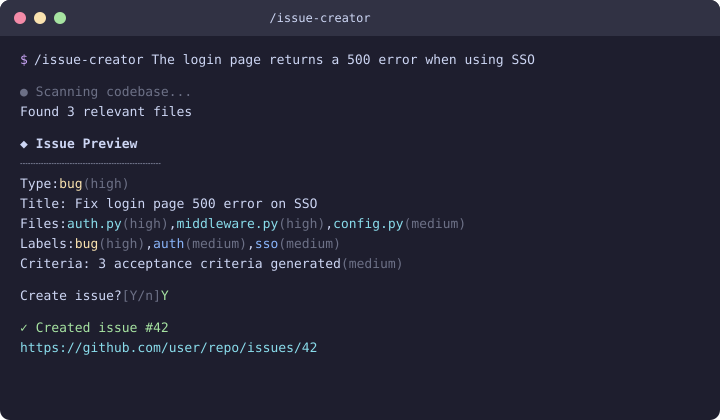
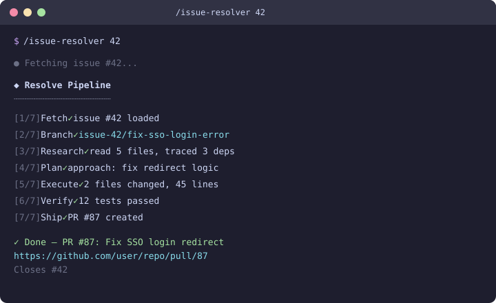
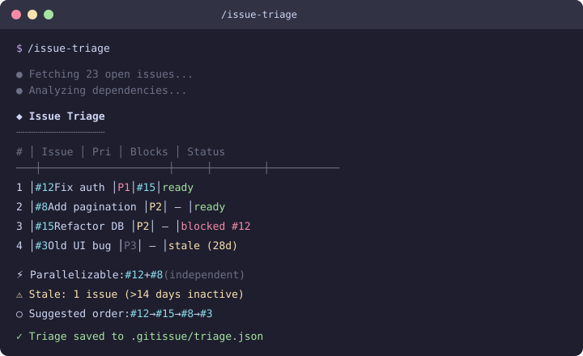
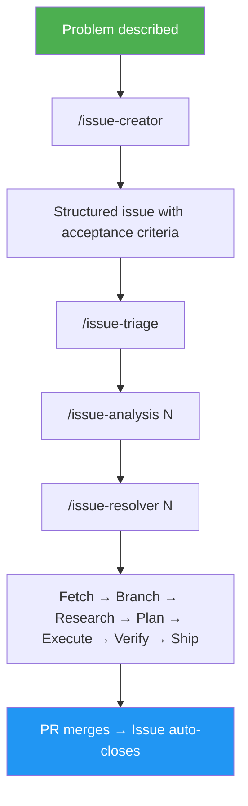

<p align="center">
  <picture>
    <source media="(prefers-color-scheme: dark)" srcset="assets/logo/logo-white.svg">
    <source media="(prefers-color-scheme: light)" srcset="assets/logo/logo-black.svg">
    
  </picture>
</p>

<p align="center">
  <a href="https://github.com/luongnv89/idd/releases/latest"></a>
  <a href="https://github.com/luongnv89/idd/blob/main/LICENSE"></a>
  <a href="https://github.com/luongnv89/idd"></a>
  <a href="https://github.com/luongnv89/idd/blob/main/CONTRIBUTING.md"></a>
</p>

# Turn GitHub Issues Into Structured, Agent-Ready Work Orders

Five terminal commands that structure, analyze, triage, and resolve GitHub issues — so any developer or AI agent can pick up an issue and ship a tested PR.

[**Get Started**](#get-started) · [**What is IDD?**](#what-is-idd) · [**Intention-Driven Development**](#idd-as-intention-driven-development) · [**Works With Any Tool**](#works-with-any-tool)

---

## The Problem

Unstructured issues kill velocity.

Someone files "the login is broken on mobile." A developer — human or AI — spends 30 minutes figuring out which files to open before writing a line of code. An AI agent produces changes to the wrong files because the issue lacked context. Meanwhile, 47 open issues sit in the backlog with no dependency awareness and no execution order.

GitHub issues were designed for humans to read, not for agents to execute.

## The Fix

gitissue turns every GitHub issue into a self-contained work order: typed, structured, and enriched with acceptance criteria. Then it resolves them.


| Command | What it does | Version | Effort |
|---------|-------------|---------|--------|
| `/issue-creator` | Classify type, generate acceptance criteria, create a structured issue | 0.2.0 | medium |
| `/issue-analysis N` | Root cause, git history, implementation options, complexity and risk | 0.1.0 | high |
| `/issue-resolver N` | Fetch, branch, scan codebase, write code + tests, open PR with `Closes #N` | 0.2.0 | max |
| `/issue-triage` | Dependency graph, stale detection, priority and execution order | 0.2.0 | medium |
| `/init-gitissue` | Auto-detect language/framework/test runner, generate `.gitissue.yml` | 0.2.0 | low |

---

## How It Works

### 1. Create a structured issue

<p align="center">
  
</p>

Describe a bug, feature, or improvement in plain text. gitissue classifies it, generates acceptance criteria, and creates a GitHub issue with labels.

### 2. Resolve it in one command

<p align="center">
  
</p>

Seven steps run automatically: fetch the issue, create a branch, scan the codebase, plan the fix, write code + tests, verify, and ship a PR with `Closes #N`.

### 3. Triage the backlog

<p align="center">
  
</p>

Dependency detection, priority suggestions, parallelizable work, and stale issue warnings — one command for the entire backlog.

### 4. Deep-dive on a single issue

```
  [1/8] Fetch          ✓ issue #42 loaded (bug)
  [2/8] Extract        ✓ 8 keywords, 2 file refs
  [3/8] Research       ✓ read 18 files, traced 12 deps
  [4/8] History        ✓ 5 related commits, 1 regression
  [5/8] Cross-refs     ✓ 2 related issues
  [6/8] Analysis       ✓ root cause identified
  [7/8] Options        ✓ 3 approaches proposed
  [8/8] Report         ✓ saved to .gitissue/analysis-42.json
```

---

## Works With Any Tool

IDD is a methodology, not a vendor lock-in. The structured issue format is plain GitHub markdown — any tool that reads GitHub issues can consume it. gitissue adds structure to your issues; your existing tools keep working exactly as before.

| Tool | How it works with gitissue |
|------|---------------------------|
| **Claude Code** | Load skills directly — `/issue-creator`, `/issue-resolver` |
| **Codex CLI** | `gh issue view 42 --json body` and pass to codex as context |
| **Gemini CLI** | Pipe issue body to gemini for resolution |
| **GitHub Copilot** | Structured issues give Copilot better context for suggestions |
| **Any SKILL.md agent** | Load skills from `skills/` directory |
| **Human developers** | Read the issue — acceptance criteria and structure are right there |

gitissue is **complementary** to your existing workflow. Use it alongside TDD, BDD, CI/CD pipelines, project management tools, or any AI coding agent. It fills one gap — structuring and triaging issues — and stays out of the way for everything else.

---

## Get Started

### Prerequisites

- [GitHub CLI](https://cli.github.com) (`gh`) 2.0+, authenticated via `gh auth login`
- [Claude Code](https://docs.anthropic.com/en/docs/claude-code) or any SKILL.md-compatible agent
- Git 2.30+

### Install

```bash
npx skills add https://github.com/luongnv89/idd
```

Or with Agent Skill Manager:

```bash
asm install https://github.com/luongnv89/idd
```

### First issue in 30 seconds

Create a structured issue:

```bash
/issue-creator "Login fails on mobile when session cookie expires"
```

Resolve it:

```bash
/issue-resolver 42
```

Triage the backlog:

```bash
/issue-triage
```

Zero config required. Run `/init-gitissue` to customize.

You can also install individual skills. See each skill folder for per-skill commands:

| Skill | Folder |
|-------|--------|
| `/issue-creator` | [`skills/issue-creator/`](skills/issue-creator/) |
| `/issue-analysis` | [`skills/issue-analysis/`](skills/issue-analysis/) |
| `/issue-resolver` | [`skills/issue-resolver/`](skills/issue-resolver/) |
| `/issue-triage` | [`skills/issue-triage/`](skills/issue-triage/) |
| `/init-gitissue` | [`skills/init-gitissue/`](skills/init-gitissue/) |

---

## What is IDD?

Issue-Driven Development — also **Intention-Driven Development** — treats GitHub issues as the atomic unit of all development work. Every change starts as a structured issue and ends as a PR linked to that issue.

The key idea: the gap between "someone describes a problem" and "someone ships a fix" is both a **translation gap** and an **intention gap**. IDD automates that translation — turning vague reports into structured work orders with acceptance criteria — while helping creators discover and articulate what they actually want through iterative refinement.



### IDD as Intention-Driven Development

IDD is also **Intention-Driven Development** — and that name captures something deeper about what it solves.

Expressing what you actually want is hard. Even experienced developers struggle to articulate a problem clearly enough for someone else — human or AI — to act on it. Vague descriptions lead to wrong assumptions, wasted effort, and solutions that miss the point.

`/issue-creator` changes this dynamic. When you describe a problem in plain language, it structures your input into a typed issue with acceptance criteria, context, and technical notes. But the real value isn't the output — it's the **feedback loop**:

1. **You describe the problem** — loosely, incompletely, however it comes to mind
2. **The agent proposes a structured issue** — classifying the type, filling in context, generating acceptance criteria
3. **You read back what it captured** — and realize what you actually meant, what's missing, what's wrong
4. **You refine through conversation** — correcting, adding detail, sharpening the intent until the issue says exactly what you want

This iterative process does something no template or form can do: it helps you **discover your own intention**. By the time the issue is finalized, it accurately represents what the creator wants — expressed in a way that both humans and AI agents can understand and execute.

This matters because understanding user requirements is one of the hardest steps in the software development lifecycle. Most bugs and missed features trace back to requirements that were never clearly stated. IDD makes that step explicit, collaborative, and repeatable — turning an informal complaint into a precise, agent-ready work order.

The structured issue becomes the **single source of truth** for what needs to happen. When `/issue-resolver` picks it up, there's no guesswork — the intention is already captured.

### IDD and other methodologies

IDD operates at a different layer than TDD, BDD, or spec-driven development. It structures the *work* before you write the *code or tests*. This makes it complementary, not competitive.

| Aspect | IDD | TDD | BDD | Spec-Driven |
|--------|-----|-----|-----|-------------|
| **Source of truth** | GitHub issue | Test suite | Feature specs | Spec documents |
| **Starts with** | Problem description | Failing test | User story | Detailed spec |
| **Agent-compatible** | Any agent | Needs framework | Needs framework | Needs parser |
| **Overhead** | Zero-config CLI | Test setup | Gherkin syntax | Spec authoring |
| **Best for** | Brownfield, mixed teams | New code | User-facing features | Formal contracts |

Use IDD **with** TDD: structure the issue first, then write tests during resolution. Use IDD **with** BDD: let acceptance criteria inform your Gherkin scenarios. They compose.

---

## FAQ

**Is it free?**
MIT licensed. No telemetry, no accounts, no cloud dependency.

**Does it work without Claude Code?**
The skills are designed for Claude Code, but the structured issue format works with any AI agent or human developer. The issue is the interface.

**Will it modify my existing issues?**
Only when you explicitly run `/issue-creator N`. A backup comment is posted before any changes. If the backup fails, it aborts.

**How does it handle security issues?**
Issues labeled `security`, `CVE`, or `vulnerability` are automatically skipped during normalization. Use `--force` to override.

**Can I use it with my existing tools?**
Yes. gitissue adds structure to issues. Your CI/CD, project boards, code review tools, and AI agents all keep working. Structured issues give them better input.

**Does it work with private repos?**
Yes. It uses `gh` CLI authentication — whatever repos you can access via `gh auth login` will work.

---

## Contributing

Contributions welcome. See [CONTRIBUTING.md](CONTRIBUTING.md) for guidelines.

MIT Licensed · [View on GitHub](https://github.com/luongnv89/idd)

---

<details>
<summary><strong>Commands Reference</strong></summary>

### /issue-creator -- Create and Normalize Issues

| Invocation | Mode | Description |
|------------|------|-------------|
| `/issue-creator <text>` | Create | Create a structured issue from text |
| `/issue-creator <N>` | Normalize | Structure existing issue #N with acceptance criteria |
| `/issue-creator <N> --dry-run` | Preview | Show normalization preview without applying |
| `/issue-creator <N> --force` | Force | Normalize even if issue has a security label |
| `/issue-creator <multi-item text>` | Batch | Extract and create multiple issues from one input |

**Create mode** classifies the issue type (bug/feature/improvement), generates acceptance criteria, uploads screenshots to GitHub, and creates a structured issue.

**Normalize mode** restructures an existing issue: preserves original text in a Reporter Context blockquote, generates acceptance criteria, and posts a backup before editing.

**Batch mode** auto-detects multiple items (numbered lists, bullet points, planning documents) and creates them sequentially with a preview table and approval step.

### /issue-analysis N -- Deep Issue Analysis

Analyzes issue #N in depth without making code changes:

```
[1/8] Fetch          — Load issue, classify type
[2/8] Extract        — Parse keywords, file refs, error messages
[3/8] Research       — Deep codebase scan (30 files, 3-level import tracing)
[4/8] History        — Git log: prior fix attempts, regressions, domain experts
[5/8] Cross-refs     — Related issues/PRs, duplicates, already resolved
[6/8] Analysis       — Root cause (bugs), architecture fit (features)
[7/8] Options        — 2-3 implementation approaches with pros/cons
[8/8] Report         — Terminal report + .gitissue/analysis-N.json
```

### /issue-resolver N -- Resolve Issues

Resolves issue #N through a 7-step pipeline:

```
[1/7] Fetch        — Load issue, check guards
[2/7] Branch       — Create issue-N/short-description branch
[3/7] Research     — Scan codebase, trace dependencies
[4/7] Plan         — Propose approach (local only)
[5/7] Execute      — Write code + tests, atomic commits
[6/7] Verify       — Run test suite, check acceptance criteria
[7/7] Ship         — Push branch, create PR with "Closes #N"
```

### /issue-triage -- Triage the Backlog

Dependency detection via codebase scanning, topological sort for execution order, parallelizable issue identification, stale issue detection (>14 days), priority suggestions.

### /init-gitissue -- Generate Config

Scans your repository and generates `.gitissue.yml` with sensible defaults: detects language, framework, test runner, existing templates, and adjusts timeouts based on repo size.

</details>

<details>
<summary><strong>Configuration</strong></summary>

gitissue works with **zero configuration**. All settings have sensible defaults.

To customize, create `.gitissue.yml` in your repo root (or run `/init-gitissue`):

```yaml
platform: github                # github | gitlab (future)

issue:
  auto_normalize: true          # auto-normalize in /issue-resolver
  template: default             # default | path to custom template dir
  labels_auto_suggest: true     # auto-suggest labels based on content
  normalize_comment: true       # add comment when normalizing

resolve:
  approval_gate: auto           # auto | comment-and-wait
  branch_prefix: "auto"         # type-based: fix/42-description, feat/15-description
  auto_test: true               # run tests before creating PR
  test_timeout: 300             # abort verify phase after N seconds
  pr_auto_link: true            # include "Closes #N" in PR body
  max_commits: 10               # warn if resolve produces >N commits

triage:
  stale_threshold_days: 14      # flag issues with no activity
  auto_priority: true           # suggest priorities based on type + age + deps
  include_closed: false         # include recently closed issues in triage
  scan_timeout_per_issue: 30    # max seconds to scan codebase per issue
```

Full schema: [`docs/config-schema.md`](docs/config-schema.md)

</details>

<details>
<summary><strong>Issue Templates</strong></summary>

Three default templates:

- **Bug** -- current vs expected behavior, reproduction context
- **Feature** -- user story, acceptance criteria, technical constraints
- **Improvement** -- current state, proposed change, migration notes

Each normalized issue includes:
- `<!-- gitissue:normalized v1 -->` marker (invisible in GitHub UI)
- Reporter's original text in a `> Reporter Context` blockquote
- Confidence markers: `(high confidence)`, `(needs review)`

</details>

<details>
<summary><strong>Project Structure</strong></summary>

```
skills/
├── issue-analysis/     # /issue-analysis N
│   ├── SKILL.md
│   └── references/
├── issue-creator/      # /issue-creator
│   ├── SKILL.md
│   ├── templates/
│   └── references/
├── issue-resolver/     # /issue-resolver N
│   ├── SKILL.md
│   └── references/
├── issue-triage/       # /issue-triage
│   ├── SKILL.md
│   └── references/
└── init-gitissue/      # /init-gitissue
    ├── SKILL.md
    └── references/
docs/
├── ARCHITECTURE.md
├── CHANGELOG.md
├── DEVELOPMENT.md
├── idd-methodology.md
├── config-schema.md
└── sample-normalized-issue.md
```

</details>

<details>
<summary><strong>IDD Methodology</strong></summary>

Full documentation: [`docs/idd-methodology.md`](docs/idd-methodology.md)

</details>
