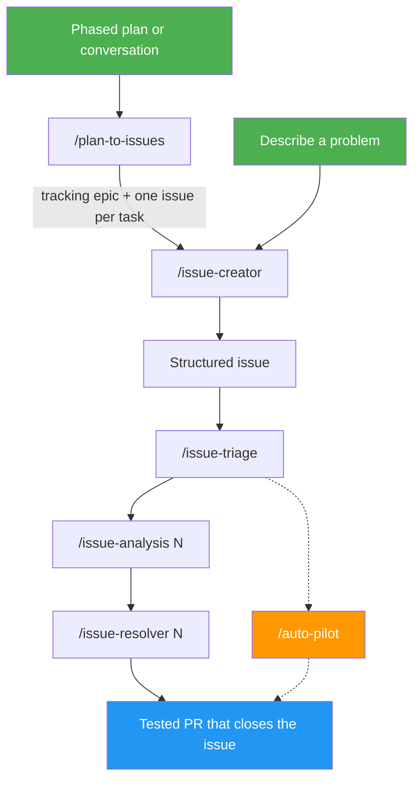
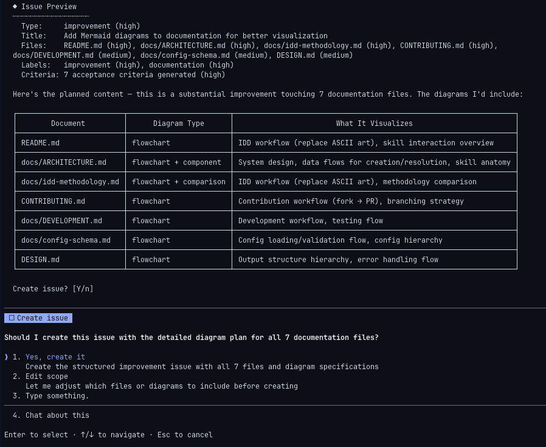
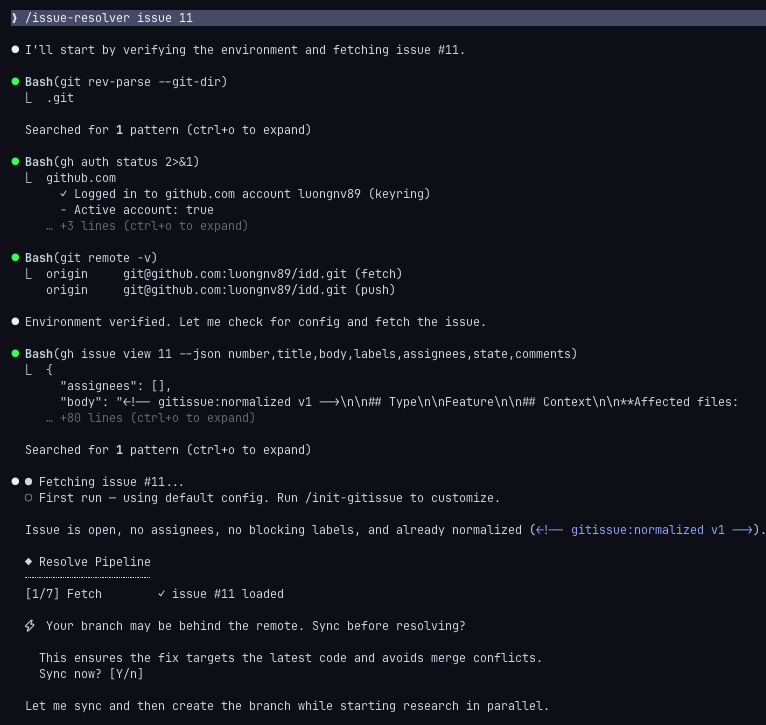
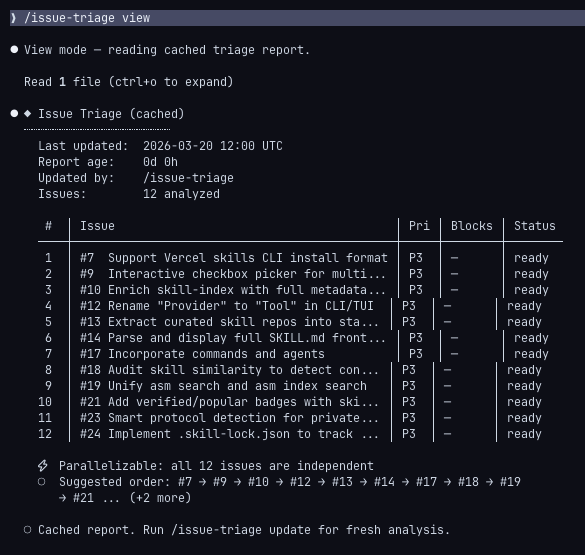
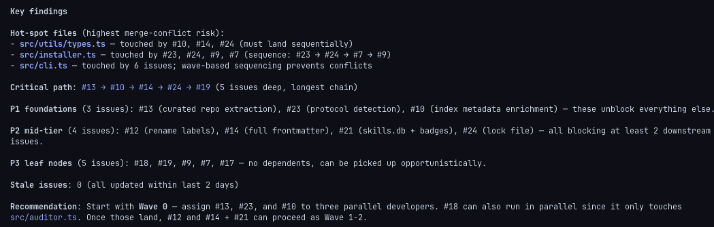
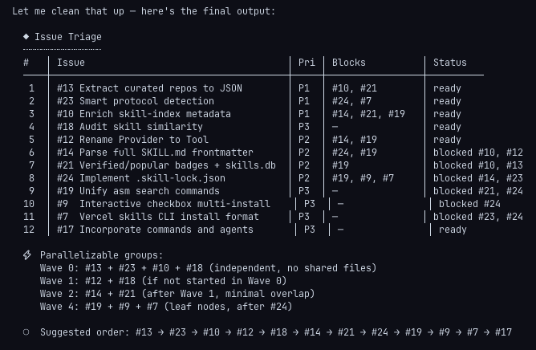
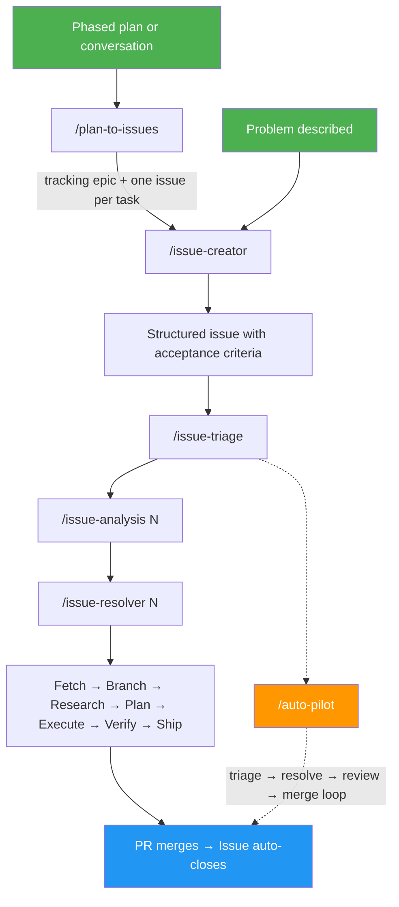

<p align="center">
  <picture>
    <source media="(prefers-color-scheme: dark)" srcset="assets/logo/logo-white.svg">
    <source media="(prefers-color-scheme: light)" srcset="assets/logo/logo-black.svg">
    
  </picture>
</p>

<p align="center">
  <a href="https://luongnv.com/idd/"></a>
  <a href="https://github.com/luongnv89/idd/releases/latest"></a>
  <a href="https://github.com/luongnv89/idd/blob/main/LICENSE"></a>
  <a href="https://github.com/luongnv89/idd"></a>
  <a href="https://github.com/luongnv89/idd/blob/main/CONTRIBUTING.md"></a>
</p>

<p align="center">
  <a href="https://luongnv.com/idd/"><b>🌐 Visit the website →</b></a>
</p>

# Turn GitHub Issues Into Structured, Agent-Ready Work Orders

**IDD Stack** is eight public skills that plan, structure, analyze, triage, resolve, review, and self-check GitHub issue workflows — so any developer or AI agent can pick up an issue and ship a tested PR (`src/skills/` — `/plan-to-issues`, `/issue-creator`, `/issue-analysis`, `/issue-resolver`, `/issue-triage`, `/init-gitissue`, `/auto-pilot`, `/issue-pr-review`).

[**Website**](https://luongnv.com/idd/) · [**Get Started**](#get-started) · [**What is IDD?**](#what-is-idd) · [**Capturing Intention**](#capturing-intention) · [**Why Good Issues & Commits Matter**](#why-good-issues-and-commit-messages-matter) · [**Works With Any Tool**](#works-with-any-tool)

---

## The Problem

Unstructured issues kill velocity — and destroy your project history.

Someone files "the login is broken on mobile." A developer — human or AI — spends 30 minutes figuring out which files to open before writing a line of code. An AI agent produces changes to the wrong files because the issue lacked context. Meanwhile, 47 open issues sit in the backlog with no dependency awareness and no execution order.

Worse: when issues are vague, the commits that resolve them are vague too. Six months later, `git log` reads like `"fix stuff"`, `"update"`, `"WIP"`. Nobody can trace *why* a change was made, *what problem* it solved, or *what decision* led to that approach. The development history — which should be your project's most valuable knowledge base — becomes noise.

GitHub issues were designed for humans to read, not for agents to execute. And commit messages were designed to tell a story, not to fill a required field.

## The Fix

IDD Stack turns every GitHub issue into a self-contained work order: typed, structured, and enriched with acceptance criteria. Then it resolves them — with commit messages and PR titles that link every line of code back to the intention that created it.


```mermaid
graph TD
    P["Phased plan or conversation"] --> Q["/plan-to-issues"]
    Q --> |"tracking epic + one issue per task"| B
    A["Describe a problem"] --> B["/issue-creator"]
    B --> C["Structured issue"]
    C --> D["/issue-triage"]
    D --> E["/issue-analysis N"]
    E --> F["/issue-resolver N"]
    F --> G["Tested PR that closes the issue"]
    D -.-> H["/auto-pilot"]
    H -.-> G

    style A fill:#4CAF50,color:#fff
    style P fill:#4CAF50,color:#fff
    style G fill:#2196F3,color:#fff
    style H fill:#FF9800,color:#fff
```

| Command | What it does | Effort |
|---------|-------------|--------|
| `/issue-creator` | Classify type, generate acceptance criteria, create a structured issue | medium |
| `/plan-to-issues` | Turn a phased plan file — or a conversation about what to build — into labelled issues under one tracking epic, each mapped to its source task; bodies written by `/issue-creator` | high |
| `/issue-analysis N` | Root cause, git history, implementation options, complexity and risk | high |
| `/issue-resolver N` | 6-step pipeline: preflight, research, plan, implement, QA, deliver PR with `Closes #N` | max |
| `/issue-triage` | Dependency graph, stale detection, already-fixed detection via commit/PR scanning, priority and execution order | medium |
| `/init-gitissue` | Auto-detect language/framework/test runner, generate `.gitissue.yml` | low |
| `/auto-pilot` | Triage → resolve → review → merge loop. Balanced-by-default merge modes (`conservative`/`balanced`/`aggressive`), explicit issue lists for targeted runs, and a dependency-aware merge gate (`Depends on #N` / `Blocked by #N`) | max |
| `/issue-pr-review` | Review PR end-to-end: script pre-pass (lint/format/test auto-fix), per-criterion AC verification, five-dimension scoring (correctness, acceptance_criteria, traceability, maintainability, safety), reuses reviewer/fixer agents across cycles | high |

Per-skill versions live in each skill's frontmatter (`skills/<name>/SKILL.md`) — the single version source.

See [`docs/skills.md`](docs/skills.md) for the full skills reference, including every supported input option.

### Internal tooling

Internal-only skills are not published in the public skill index, plugin, or any
`dist/` output. Run `./scripts/build.sh` in a clone to generate real flattened,
self-contained packages in gitignored repo-root `internal-skills/`, then load
`internal-skills/idd-doctor/` in your agent and invoke `/idd-doctor`. Authoring
stays in `src/internal-skills/`; do not invoke the source package.

Custom `--out` or `--no-promote-skills` builds leave canonical public and internal
trees untouched and discard internal staging outside `dist/`. For a retained
separate copy, the Python driver accepts `--internal-out` (see
[Development](docs/DEVELOPMENT.md)). Local public installs must target
`skills/` (e.g. `asm install ./skills --all`), not recursively scan the entire built
checkout. Gitignore hides files from Git, not filesystem skill discovery;
arbitrary recursive local scanning can discover the internal package. Remote
ASM installs and the tagged plugin contain only the public install surface.

| Skill | Folder | Purpose |
|-------|--------|---------|
| `/idd-doctor` | `internal-skills/idd-doctor/` (build from [`src/internal-skills/idd-doctor/`](src/internal-skills/idd-doctor/)) | Read-only health check for IDD repository invariants; local-only, not distributed |

---

## How It Works

### 1. Create a structured issue

<p align="center">
  
</p>

Describe a bug, feature, or improvement in plain text. IDD Stack classifies it, generates acceptance criteria, and creates a GitHub issue with labels.

### 2. Resolve it in one command

<p align="center">
  
</p>

Six steps run automatically: preflight, research, plan, implement, QA, and deliver a PR with `Closes #N`.

### 3. Triage the backlog

<p align="center">
  
</p>

<p align="center">
  
</p>

<p align="center">
  
</p>

Dependency detection, priority suggestions, parallelizable work, stale issue warnings, and already-fixed detection — one command for the entire backlog.

### 4. Deep-dive on a single issue

```
  [1/8] Fetch          ✓ issue #42 loaded (bug)
  [2/8] Extract        ✓ 8 keywords, 2 file refs
  [3/8] Research       ✓ read 18 files, traced 12 deps
  [4/8] History        ✓ 5 related commits, 1 regression
  [5/8] Cross-refs     ✓ 2 related issues
  [6/8] Analysis       ✓ root cause identified
  [7/8] Options        ✓ 3 approaches proposed
  [8/8] Report         ✓ saved to .gitissue/analysis-42.json
```

### 5. Go hands-free with auto-pilot

```
  ◆ auto-pilot        starting (5 open issues)
  ┄┄┄┄┄┄┄┄┄┄┄┄┄┄┄┄┄┄┄┄┄┄┄┄┄┄┄┄┄┄┄┄┄┄┄┄┄┄┄┄┄┄┄
  [1/5] #42            ✓ resolved → PR #51 merged
  [2/5] #38            ✓ resolved → PR #52 merged
  [3/5] #35            ✗ stopped — test failures after 2 fix cycles
  [4/5] #29            ✓ resolved → PR #53 merged
  [5/5] #21            ✓ resolved → PR #54 merged
  ┄┄┄┄┄┄┄┄┄┄┄┄┄┄┄┄┄┄┄┄┄┄┄┄┄┄┄┄┄┄┄┄┄┄┄┄┄┄┄┄┄┄┄
  ◆ complete           4/5 resolved, 1 stopped
```

Triage, resolve, review, merge — repeated for every open issue. Up to three review-fix cycles per PR with a script pre-pass (lint/format/test auto-fix) before any LLM cycle is spent. Balanced by default: clean PRs are merged, partial PRs are left open for review unless `autopilot.mode: aggressive` is explicitly set. Supports explicit issue lists for targeted runs.

---

## Works With Any Tool

IDD is a methodology, not a vendor lock-in. The structured issue format is plain GitHub markdown — any tool that reads GitHub issues can consume it. IDD Stack adds structure to your issues; your existing tools keep working exactly as before. No AI at all? The [manual IDD quickstart](docs/manual-idd-quickstart.md) proves L1 works with a text editor and your existing tracker.

| Tool | How it works with IDD Stack |
|------|---------------------------|
| **Claude Code** | Load skills directly — `/issue-creator`, `/issue-resolver` |
| **Codex CLI** | Load skills directly or as the IDD plugin — `$idd:issue-resolver 42` |
| **Gemini CLI** | Pipe issue body to gemini for resolution |
| **GitHub Copilot** | Structured issues give Copilot better context for suggestions |
| **Any SKILL.md agent** | Install the self-contained [`skills/`](skills/) packages via `asm` or manual copy |
| **Human developers** | Read the issue — acceptance criteria and structure are right there |

All tracker access is concentrated behind one **platform driver** document — [`docs/platform-github.md`](docs/platform-github.md), the operation catalog every skill's `gh` commands must match. GitHub is the only implemented driver; porting to another tracker means writing one equivalent document (e.g. `glab` mappings), not hunting through eight skills.

IDD Stack is **complementary** to your existing workflow. Use it alongside TDD, BDD, CI/CD pipelines, project management tools, or any AI coding agent. It fills one gap — structuring and triaging issues — and stays out of the way for everything else.

### Enforce the spec in CI — `idd-lint`

[`scripts/idd-lint.py`](scripts/idd-lint.py) validates [IDD Spec](SPEC.md) conformance from plain data — no LLM, no network, no dependencies beyond the Python standard library. Any repo can run it, whether or not it uses the IDD Stack skills:

```bash
# Lint the current branch name + commits against a base (local git only)
python3 scripts/idd-lint.py repo --base origin/main

# Lint an issue body, a PR body + title, a commit message, a branch name
gh issue view 42 --json body -q .body | python3 scripts/idd-lint.py issue -
gh pr view 7 --json body -q .body | python3 scripts/idd-lint.py pr - --title "$(gh pr view 7 --json title -q .title)"
python3 scripts/idd-lint.py commit "fix(auth): resolve redirect loop (#42)"
python3 scripts/idd-lint.py branch fix/42-mobile-auth-redirect

# Evidence report: trace-completeness, Decision-Record coverage, and run
# outcomes from .gitissue/runs.jsonl — tiered by issue quality when gh is available
python3 scripts/idd-lint.py stats            # add --no-github for offline, --json for machines

# Recurring corrections → deduplicated, approval-gated improvement proposals
python3 scripts/idd-lint.py corrections      # add --record to propose; see docs/correction-guards.md
```

Checks are tagged with the spec section they enforce and mapped to the L1–L3 conformance levels (`--level L2` skips Decision-Record checks for repos not claiming L3). Exit code 0/1 makes it CI-native; `/idd-doctor` remains the deep, agent-powered health check.

`stats` closes the evidence loop: it measures whether the methodology is paying for itself — what fraction of commits trace to issues, how many merged PRs carry Decision Records into git history, which pipeline phase is slowest across runs that recorded per-phase timing, and (when `gh` is available) whether normalized issues actually resolve with fewer QA cycles than unnormalized ones.

#### Run `idd-lint` from anywhere — shell shortcut

`idd-lint` lives in this repo (`scripts/idd-lint.py`) and its `stats` command reads a repo's `.gitissue/runs.jsonl` and git history. You don't have to `cd` into the idd checkout to run it — add a small shell wrapper once and call `idd-lint` (or the `idd-stats` shortcut) from any directory. **The wrapper analyzes whatever repository you are currently in**, using the idd checkout only to locate the tool itself.

**Single-command setup** (zsh — appends a wrapper to `~/.zshrc`, idempotent, no clone required beyond having this repo somewhere):

```bash
IDD_HOME="$HOME/path/to/idd" bash -c '
  cat >> ~/.zshrc <<EOF

# IDD Stack — run idd-lint from anywhere. Docs: idd/README.md
# IDD_HOME locates the tool; the repo analyzed is always your current directory.
export IDD_HOME="\${IDD_HOME:-$IDD_HOME}"
idd-lint() {
  local script=""
  if [ -f "\$IDD_HOME/scripts/idd-lint.py" ]; then script="\$IDD_HOME/scripts/idd-lint.py";
  else
    local here; here="\$(git rev-parse --show-toplevel 2>/dev/null)"
    if [ -n "\$here" ] && [ -f "\$here/scripts/idd-lint.py" ]; then script="\$here/scripts/idd-lint.py";
    else echo "idd-lint: tool not found. Set IDD_HOME to your idd checkout (currently: \${IDD_HOME:-unset})." >&2; return 1; fi
  fi
  python3 "\$script" "\$@"   # no cd — analyze the repo you are standing in
}
idd-stats() { idd-lint stats "\$@"; }
EOF' && exec zsh
```

Set `IDD_HOME` to wherever you cloned this repo. On **bash**, replace `~/.zshrc` with `~/.bashrc` (or `~/.bash_profile` on macOS) and drop the final `exec zsh`. `IDD_HOME` points at the idd checkout so the tool can be found; the report always covers the git repository of your **current working directory** — `cd` into any project and `idd-lint stats` analyzes *that* project. Run it from a non-git directory and it reports no git history.

Then, from within any repository:

```bash
idd-lint stats              # full evidence report (git + run log + GitHub)
idd-lint stats --no-github  # offline: git history + .gitissue/runs.jsonl only
idd-lint stats --json       # machine-readable
idd-stats --no-github       # shorthand for `idd-lint stats`
idd-lint repo --base origin/main   # any idd-lint subcommand works
```

`idd-lint` requires only Python 3 (standard library) and, for the git/GitHub-aware reports, `git` and optionally the `gh` CLI.

---

## Get Started

### Prerequisites

- [GitHub CLI](https://cli.github.com) (`gh`) 2.0+, authenticated via `gh auth login`
- [Claude Code](https://docs.anthropic.com/en/docs/claude-code) or any SKILL.md-compatible agent
- Git 2.30+

### Install

Each skill ships as a self-contained directory under the committed [`skills/`](skills/) tree — SKILL.md plus its bundled subagent prompts (`references/agents/`) and runtime docs (`references/docs/`) — ready to drop into any SKILL.md-compatible harness: Claude Code, Codex CLI, or anything else that loads SKILL.md trees.

#### Install with `asm`

[`asm`](https://github.com/luongnv89/asm) (agent-skill-manager) is the install tool. It pulls the skill index straight from this repo — no clone required — and installs to whichever agent tools you use:

```bash
# Install from the repo root and choose all or selected skills
asm install https://github.com/luongnv89/idd

# Non-interactive single-skill install
asm install https://github.com/luongnv89/idd --skill issue-resolver
```

Don't have `asm`? `npm install -g agent-skill-manager`.

`asm` is idempotent — re-running the same command updates installed skills in place with no duplicate files. Each installed skill is complete, so there is no separate shared-agent install step. After install, restart your agent tool so it picks up the new skill(s). The full install surface lives under [`skills/`](skills/): `issue-creator`, `plan-to-issues`, `issue-analysis`, `issue-resolver`, `issue-triage`, `issue-pr-review`, `auto-pilot`, and `init-gitissue`.

#### Alternative — Claude Code plugin

Claude Code users can install the same eight skills as one plugin. This repo is its own plugin marketplace, and the marketplace pins the plugin to the latest tagged release. A plugin install fetches only that release's `skills/` folder (about 2.7 MB), not the rest of the repository:

```bash
claude plugin marketplace add luongnv89/idd   # register the marketplace (once)
claude plugin install idd@idd                 # install the plugin
```

Inside a session, `/plugin marketplace add luongnv89/idd` and `/plugin install idd@idd` do the same. Start a new session afterwards. Plugin skills are namespaced: `/idd:issue-creator`, `/idd:issue-resolver 42`, `/idd:auto-pilot`, and so on.

- **Update** — auto-update is off by default for third-party marketplaces, so pull a new release yourself: `claude plugin marketplace update idd`, then `claude plugin update idd@idd`, then restart the session.
- **Uninstall** — `claude plugin uninstall idd@idd`. To forget the marketplace too: `claude plugin marketplace remove idd`.
- **Pick one install path.** Don't keep the plugin and an `asm` or manual copy side by side: both copies load, so every skill appears twice (`/issue-resolver` and `/idd:issue-resolver`), possibly at different versions.

#### Alternative — Codex plugin

The same eight skills ship with a Codex plugin manifest. **Release pending:**
the current release tag predates this package. The commands below become usable
once a new release includes it; for this checkout, use the
[local preview and submission guide](docs/codex-plugin-submission.md).

```bash
codex plugin marketplace add luongnv89/idd
codex plugin add idd@idd
codex plugin list --json
```

Start a new session, then invoke `$idd:issue-creator`, `$idd:issue-resolver 42`, or
`$idd:auto-pilot`. Use one installation method per host to avoid duplicate skills.
To update, run `codex plugin marketplace upgrade idd`, then
`codex plugin add idd@idd` and start a new session. To uninstall, run
`codex plugin remove idd@idd`; optionally run
`codex plugin marketplace remove idd` too. The generated marketplace pins the
same release and `skills/` payload as the Claude Code plugin.

#### Fallback — manual copy

Skills are plain directories. If you prefer to see every file move, clone and copy:

```bash
git clone https://github.com/luongnv89/idd.git
mkdir -p ~/.claude/skills
cp -r idd/skills/<name> ~/.claude/skills/
```

`skills/` is committed, so this works on a fresh clone with no build step. For other tools, copy into that tool's skills directory instead (e.g. `~/.codex/skills/`). Optional Claude Code extra: `./scripts/build.sh && cp dist/agents/*.md ~/.claude/agents/` registers the shared subagents natively — skills work without it, since every skill bundles its agent prompts.

### First issue in 30 seconds

Create a structured issue:

```bash
/issue-creator "Login fails on mobile when session cookie expires"
```

Or file a whole plan — or the conversation you just had — as an epic plus one issue per task:

```bash
/plan-to-issues docs/ROADMAP.md
```

Resolve it:

```bash
/issue-resolver 42
```

Triage the backlog:

```bash
/issue-triage
```

Or go hands-free — triage, resolve, review, and merge everything:

```bash
/auto-pilot
```

Zero config required. Run `/init-gitissue` to customize.

Browse the authored source for each skill — these links point to `src/` for reading; install copies come from `skills/<name>/` (see [Install](#install)):

| Skill | Source |
|-------|--------|
| `/issue-creator` | [`src/skills/issue-creator/`](src/skills/issue-creator/) |
| `/plan-to-issues` | [`src/skills/plan-to-issues/`](src/skills/plan-to-issues/) |
| `/issue-analysis` | [`src/skills/issue-analysis/`](src/skills/issue-analysis/) |
| `/issue-resolver` | [`src/skills/issue-resolver/`](src/skills/issue-resolver/) |
| `/issue-triage` | [`src/skills/issue-triage/`](src/skills/issue-triage/) |
| `/auto-pilot` | [`src/skills/auto-pilot/`](src/skills/auto-pilot/) |
| `/issue-pr-review` | [`src/skills/issue-pr-review/`](src/skills/issue-pr-review/) |
| `/init-gitissue` | [`src/skills/init-gitissue/`](src/skills/init-gitissue/) |
| `/idd-doctor` _(internal)_ | [`src/internal-skills/idd-doctor/`](src/internal-skills/idd-doctor/) |

---

## What is IDD?

Issue-Driven Development treats GitHub issues as the atomic unit of all development work: *capture intention, resolve against current code, remember in git.* Every change starts as a structured issue and ends as a PR linked to that issue.

IDD is a methodology, not a product. Its portable contract — issue format, naming grammar, Decision Records, traceability chain, and L1–L3 conformance levels — is defined in the tool-neutral [**IDD Spec**](SPEC.md). Any tool (or a human with a text editor) can implement it; IDD Stack, the set of skills in this repo, is the reference implementation for Claude Code + GitHub.

The key idea: the gap between "someone describes a problem" and "someone ships a fix" is both a **translation gap** and an **intention gap**. IDD automates that translation — turning vague reports into structured work orders with acceptance criteria — while helping creators discover and articulate what they actually want through iterative refinement.


```mermaid
graph TD
    P["Phased plan or conversation"] --> Q["/plan-to-issues"]
    Q --> |"tracking epic + one issue per task"| B
    A["Problem described"] --> B["/issue-creator"]
    B --> C["Structured issue with acceptance criteria"]
    C --> D["/issue-triage"]
    D --> E["/issue-analysis N"]
    E --> F["/issue-resolver N"]
    F --> G["Fetch → Branch → Research → Plan → Execute → Verify → Ship"]
    G --> H["PR merges → Issue auto-closes"]
    D -.-> I["/auto-pilot"]
    I -.-> |"triage → resolve → review → merge loop"| H

    style A fill:#4CAF50,color:#fff
    style P fill:#4CAF50,color:#fff
    style H fill:#2196F3,color:#fff
    style I fill:#FF9800,color:#fff
```

### Capturing Intention

The hardest step in the workflow is saying what you actually want. `/issue-creator` runs an iterative clarification loop: you describe the problem loosely, it proposes a structured issue, and you sharpen it until the issue says exactly what you mean — intent only, never guessed file lists. The finished issue is the source of truth every later phase executes against.

The full treatment of the loop is in the methodology doc: [Capturing Intention](docs/idd-methodology.md#capturing-intention).

### Why Good Issues and Commit Messages Matter

The issue captures the *why*, the commit captures the *how*, and the PR links them — so `git blame` on any line walks back to the original problem report. Structured history compounds: debugging becomes tracing instead of guessing, new contributors read the project's evolution, agents get instant context, and changelogs generate themselves. IDD Stack enforces the discipline automatically through the [naming conventions](docs/naming-conventions.md).

The full argument — executable project memory, the traceability chain, the compounding effect — lives in the methodology doc: [Executable Project Memory](docs/idd-methodology.md#executable-project-memory).

### IDD and other methodologies

IDD is the outer loop, not a competitor: it structures the *work* before you write the code or tests. Use it **with** TDD (issue first, tests during resolution) or **with** BDD (acceptance criteria feed your scenarios) — they compose. The full comparison table is in the methodology doc: [IDD vs Other Methodologies](docs/idd-methodology.md#idd-vs-other-methodologies).

---

## FAQ

**Is it free?**
MIT licensed. No telemetry, no accounts, no cloud dependency.

**Does it work without Claude Code?**
The skills are designed for Claude Code, but the structured issue format works with any AI agent or human developer. The issue is the interface. It even works with no AI at all — the [manual IDD quickstart](docs/manual-idd-quickstart.md) reaches L1 conformance with a text editor.

**Will it modify my existing issues?**
Only when you explicitly run `/issue-creator N`. A backup comment is posted before any changes. If the backup fails, it aborts.

**How does it handle security issues?**
Issues labeled `security`, `CVE`, or `vulnerability` are automatically skipped during normalization. Use `--force` to override.

**Can I use it with my existing tools?**
Yes. IDD Stack adds structure to issues. Your CI/CD, project boards, code review tools, and AI agents all keep working. Structured issues give them better input.

**Does it work with private repos?**
Yes. It uses `gh` CLI authentication — whatever repos you can access via `gh auth login` will work.

---

## Contributing

Contributions welcome. See [CONTRIBUTING.md](CONTRIBUTING.md) for guidelines.

MIT Licensed · [View on GitHub](https://github.com/luongnv89/idd)

---

<details>
<summary><strong>Commands Reference</strong></summary>

### /issue-creator -- Create and Normalize Issues

| Invocation | Mode | Description |
|------------|------|-------------|
| `/issue-creator <text>` | Create | Create a structured issue from text |
| `/issue-creator <N>` | Normalize | Structure existing issue #N with acceptance criteria |
| `/issue-creator <N> --dry-run` | Preview | Show normalization preview without applying |
| `/issue-creator <N> --force` | Force | Normalize even if issue has a security label |
| `/issue-creator <multi-item text>` | Batch | Extract and create multiple issues from one input |

**Create mode** classifies the issue type (bug/feature/improvement), generates acceptance criteria, uploads screenshots to GitHub, and creates a structured issue.

**Normalize mode** restructures an existing issue: preserves original text in a Reporter Context blockquote, generates acceptance criteria, and posts a backup before editing.

**Batch mode** auto-detects multiple items (numbered lists, bullet points, planning documents) and creates them sequentially with a preview table and approval step.

### /plan-to-issues -- Plan or Conversation to Epic + Issues

| Invocation | Mode | Description |
|------------|------|-------------|
| `/plan-to-issues` | Create | Resolve the input — discover a plan file, else fall back to the conversation — then create the epic and one issue per task |
| `/plan-to-issues <path.md>` | Create | Use that plan file (any path, any producer) |
| `/plan-to-issues --from-conversation` | Create | Draft the task list from the conversation, confirm once, then file it — no plan file needed |
| `/plan-to-issues --from-conversation --epic <n>` | Resume | Restore the confirmed task list from epic #n and file only the remaining tasks |
| `/plan-to-issues --dry-run` | Preview | Print the task table, labels, and plan-map preview. Creates nothing |
| `/plan-to-issues --phase P0,P1` | Create (filtered) | File only those phases; the map still lists every phase |
| `/plan-to-issues sync <epic#>` | Sync | Re-render the epic's static plan map. Creates no issues |

The bulk counterpart of `/issue-creator`, and the entry point upstream of the loop: plan → `/plan-to-issues` → `/issue-triage` → `/issue-resolver` (or `/auto-pilot`) → `/issue-pr-review`. It creates one **epic** issue (whole-effort acceptance criteria plus a static plan map grouped by phase; live status comes from GitHub native sub-issues) and one issue per task. Every body is written by `/issue-creator` in batch mode with `--parent <epic>` (`Part of #<epic>`), labelled `phase:pN`, type, `dim:`, and `priority:`, with `Depends on #N` markers that `/auto-pilot`'s merge gate reads. Re-runs are idempotent, and no source file is modified. Requires git, authenticated `gh`, and the sibling `issue-creator` skill.

### /issue-analysis N -- Deep Issue Analysis

Analyzes issue #N in depth without making code changes:

```
[1/8] Fetch          — Load issue, classify type
[2/8] Extract        — Parse keywords, file refs, error messages
[3/8] Research       — Deep codebase scan (30 files, 3-level import tracing)
[4/8] History        — Git log: prior fix attempts, regressions, domain experts
[5/8] Cross-refs     — Related issues/PRs, duplicates, already resolved
[6/8] Analysis       — Root cause (bugs), architecture fit (features)
[7/8] Options        — 2-3 implementation approaches with pros/cons
[8/8] Report         — Terminal report + .gitissue/analysis-N.json
```

### /issue-resolver N -- Resolve Issues

Resolves issue #N through a 6-step pipeline:

```
[0/5] Preflight    — Check issue status, verify not already resolved
[1/5] Research     — Scan codebase, trace dependencies
[2/5] Plan         — Propose 3 approaches, pick one
[3/5] Implement    — Write code + tests, atomic commits
[4/5] QA           — Code review + test + build + fix loop
[5/5] Deliver      — Push branch, create PR with "Closes #N"
```

### /issue-triage -- Triage the Backlog

Dependency detection via codebase scanning, topological sort for execution order, parallelizable issue identification, stale issue detection (>14 days), already-fixed detection (scans commit history and merged PRs with confidence levels), priority suggestions.

### /auto-pilot -- Automated Backlog Processing

Fully automated loop: triage open issues, pick the highest-priority task, resolve it end-to-end, review the PR with up to three review-fix cycles (script pre-pass first, LLM cycles only for issues the pre-pass can't resolve), merge, and repeat. Supports explicit issue lists to process specific issues in user-defined order. Stop conditions prevent runaway execution.

```
/auto-pilot                          # triage and resolve all open issues
/auto-pilot --issues 5,12,3          # resolve these issues in this order
/auto-pilot --limit 5                # cap to 5 iterations
/auto-pilot --dry-run                # show plan without resolving
```

Merge modes (configured under `autopilot.mode` in `.gitissue.yml`):

| Mode | Clean PR | Partial PR (review issues remain) |
|------|----------|-----------------------------------|
| `conservative` | leave open | leave open + create follow-up issue |
| `balanced` (default) | merge | leave open + create follow-up issue |
| `aggressive` | merge | merge + create follow-up issue (requires `merge_partial: true`) |

### /idd-doctor -- Read-Only Health Check

Quick read-only diagnostic that verifies the IDD invariants of the current repo. Checks four things and reports per-check pass/fail with file/line evidence:

1. `/issue-creator` keeps its intent-only contract (no `affected_files` / `technical_notes` / `architecture_constraints` in templates or output)
2. Every `gh` invocation in skills uses `--json` with explicit field selection
3. Each skill has a `references/error-messages.md` using the three-part format
4. Repo merge strategy carries the full squash-merge binding: squash-only **and** the repo's `squash_merge_commit_message` is set to `PR_BODY` — squash alone is not sufficient, since GitHub's default (`COMMIT_MESSAGES`) drops PR-body content (Decision Record, AC verification) at the merge boundary (durable analysis-artifact rule from #35; message-source enforcement from #295)

Read-only by design — never modifies files, branches, or remote state.

```
/idd-doctor                          # run all checks
```

### /issue-pr-review -- PR Review Pipeline

Reviews a PR end-to-end: script pre-pass (lint/format/test auto-fix, zero LLM cost), code review with confidence-based filtering classified as `fix` (critical/high) vs `note` (medium), per-criterion acceptance-criteria verification, traceability checks (Closes link, Decision Record, AC Verification table), runs tests and build, checks CI status, fixes only `fix` issues, and repeats until clean. Soft-pass when zero `fix` issues remain. Supports auto-merge in auto-pilot mode.

```
/issue-pr-review 87              # review PR #87
/issue-pr-review                 # auto-detect PR for current branch
```

Pipeline:

```
[1/7] PR Info      ✓ PR #87: fix(auth): resolve redirect (#42)
[2/7] Pre-pass     ✓ lint clean, format clean, 17 tests passed
[3/7] Review       ● analyzing changes...
[4/7] Test         ✓ 17 tests passed, build ok
[5/7] CI Status    ✓ all checks passed
[6/7] Fix          ○ no issues to fix
[7/7] Report       ✓ PR is clean — ready to merge
```

Max 3 review-fix cycles with stagnation detection.

### /init-gitissue -- Generate Config

Scans your repository and generates `.gitissue.yml` with sensible defaults: detects language, framework, test runner, existing templates, and adjusts timeouts based on repo size.

</details>

<details>
<summary><strong>Configuration</strong></summary>

IDD Stack works with **zero configuration**. All settings have sensible defaults.

To customize, create `.gitissue.yml` in your repo root (or run `/init-gitissue`):

These ten fields cover almost every customization in practice:

```yaml
platform: github                # tracker driver — github is the only implemented one

issue:
  auto_normalize: true          # auto-normalize in /issue-resolver

resolve:
  branch_prefix: "auto"         # type-based: fix/42-description, feat/15-description
  auto_test: true               # run tests before creating PR
  test_timeout: 300             # abort verify phase after N seconds

triage:
  stale_threshold_days: 14      # flag issues with no activity

autopilot:
  mode: balanced                # conservative | balanced | aggressive
  review_cycles: 3              # max LLM review-fix cycles per PR
  skip_labels: ["wontfix", "blocked", "do-not-merge"]

review:
  require_acceptance_criteria_check: true  # block soft-pass if AC verification fails
```

Everything you don't set falls back to a sensible default. Set `agents.model.<role>` and `agents.effort.<role>` to choose a model and thinking effort for individual subagent roles; each role falls back to its `agents.model.default` or `agents.effort.default` setting, then to the main agent configuration. See [agent overrides](docs/agent-overrides.md) for harness support and fallback behavior. Custom templates, approval gates, GitHub Projects sync, and all other settings are documented in the [full configuration schema](docs/config-schema.md).

</details>

<details>
<summary><strong>Issue Templates</strong></summary>

Three default templates:

- **Bug** -- current vs expected behavior, reproduction context
- **Feature** -- user story, acceptance criteria
- **Improvement** -- current state, proposed change

Each normalized issue includes:
- `<!-- gitissue:normalized v1 -->` marker (invisible in GitHub UI)
- Reporter's original text in a `> Reporter Context` blockquote
- Acceptance criteria derived from the reporter's intent

`/issue-creator` is **intent-only** — it never scans the codebase, never lists "affected files", and never proposes implementation notes. Codebase analysis is performed at execution time by `/issue-resolver`, `/issue-triage`, and `/issue-analysis`, always against current code.

</details>

<details>
<summary><strong>Project Structure</strong></summary>

```
src/
├── shared/
│   └── agents/                    # Shared agent definitions (used by multiple skills)
│       ├── codebase-researcher.md # Deep codebase scan + solution research
│       ├── synthesizer.md         # Analysis + implementation options
│       ├── implementer.md         # Code + tests implementation
│       ├── code-reviewer.md       # Confidence-based code review
│       ├── duplicate-detector.md  # Issue dedup scoring
│       ├── issue-relationship-scanner.md  # File deps + already-fixed detection
│       ├── fixer.md               # Applies fixes during PR review cycles
│       └── ui-reviewer.md         # UI/visual review for PR changes
│
├── skills/
│   ├── auto-pilot/         # /auto-pilot
│   ├── issue-analysis/     # /issue-analysis N
│   ├── issue-creator/      # /issue-creator (+ templates/)
│   ├── issue-resolver/     # /issue-resolver N
│   ├── issue-triage/       # /issue-triage
│   ├── issue-pr-review/    # /issue-pr-review — review, test, CI, fix, merge
│   ├── plan-to-issues/     # /plan-to-issues — plan or conversation → epic + issues
│   └── init-gitissue/      # /init-gitissue
│       (each skill has SKILL.source.md, README.md, references/)
│
├── internal-skills/
│   └── idd-doctor/         # /idd-doctor — read-only repo health check
│
└── (no docs/ — see below)

docs/                             # Single docs tree (issue #81)
├── config-schema.md              # ↓ Runtime docs — bundled into each skill
├── idd-methodology.md            #   at build time via transitive-closure scan
├── naming-conventions.md         #   on bare `docs/X.md` tokens
├── sync-conventions.md
├── github-projects-sync.md       # ↑
├── ARCHITECTURE.md               # ↓ Project docs — humans only, not bundled
├── DEVELOPMENT.md                # ↑
├── decisions/                    # Decision records
├── experiments/                  # Experimental design notes
└── release-notes/                # Early smoke-test reports (not kept
                                   # current per release — see CHANGELOG.md)
```

</details>

<details>
<summary><strong>IDD Methodology</strong></summary>

Full documentation: [`docs/idd-methodology.md`](docs/idd-methodology.md)

</details>
