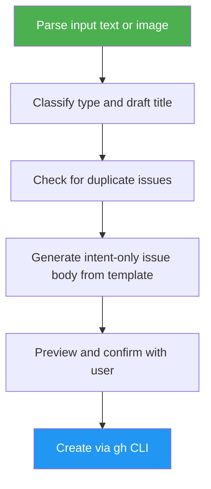
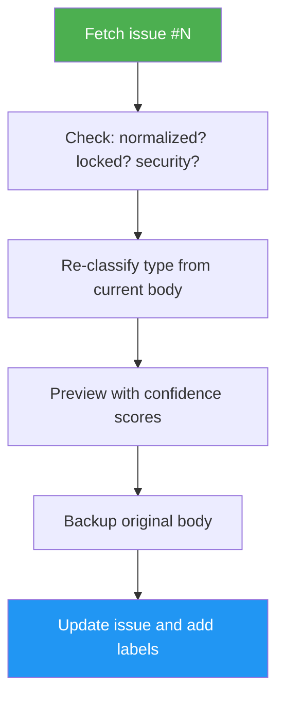

# Issue Creator

> Creates structured, intent-focused GitHub issues from text, screenshots, or lists. Preserves reporter context and generates acceptance criteria without guessing implementation details.

## Highlights

- Captures durable human intent in a standard template (type, description, reporter context, acceptance criteria, metadata)
- Auto-classifies issues as bug, feature, or improvement with confidence levels (high/medium/low)
- **Batch mode**: extract multiple issues from a single input with preview table and approval
- Normalizes messy existing issues with backup safety and security-label protection
- Generates acceptance criteria from the problem description — never from the codebase

## Output Contract

`/issue-creator` is an **intent-capture tool only**. The issue body it produces MUST NOT include any of the following:

- **No predicted affected files** — no file paths, modules, or directories guessed from the codebase
- **No generated technical notes** — no implementation approach, architecture constraints, or design notes derived from code
- **No root cause** — no diagnostic reasoning about *why* a bug occurs in the current code
- **No implementation hints** — no code snippets, function signatures, or "how to fix" instructions

Those four artifacts are produced fresh by `/issue-analysis`, `/issue-triage`, and `/issue-resolver` against the current codebase at the moment work begins. Reporter-supplied technical detail is preserved verbatim inside the Reporter Context blockquote — only skill-generated technical content is prohibited.

## When to Use

| Say this... | Skill will... |
|---|---|
| "/issue-creator the login page is broken on mobile" | Classify as a bug, draft a structured issue from your description, generate acceptance criteria from the stated problem |
| "/issue-creator 42" | Fetch issue #42, restructure into the standard intent-only template, preserve original text in a backup comment |
| "/issue-creator 42 --dry-run" | Preview what normalization would change without modifying the issue |
| "file a bug about the checkout timeout" | Create a structured bug issue from the description |
| "/issue-creator 1. Fix auth bug 2. Add dark mode 3. Refactor DB" | Detect 3 items, show preview table, create all after approval |

## How It Works



**Normalization flow** (for existing issues):



The skill never reads project source files when generating an issue. Duplicate detection compares against existing issues only, not against code.

## Installation

Install via [npx (Vercel)](https://www.npmjs.com/package/skills):

```bash
npx skills add https://github.com/luongnv89/idd --skill issue-creator
```

Or via [agent-skill-manager (asm)](https://www.npmjs.com/package/agent-skill-manager):

```bash
asm install https://github.com/luongnv89/idd --skill issue-creator
```

## Usage

```
/issue-creator <description>        # New issue from text
/issue-creator <multi-item text>    # Batch create from list/document
/issue-creator <N>                  # Normalize existing issue
/issue-creator <N> --dry-run        # Preview normalization
/issue-creator <N> --force          # Normalize security-labeled issue
```

## Resources

| Path | Description |
|---|---|
| `templates/` | Issue templates for bug, feature, and improvement types |
| `references/` | Error message catalog with exact output format |

## Output

- A structured GitHub issue with `<!-- gitissue:normalized v1 -->` marker, populated only with intent-capture content (type, description, reporter context, screenshots, acceptance criteria, metadata)
- Terminal preview with confidence scores before creation
- For batch: preview table of all items, per-item progress, summary with retry hints for failures
- For normalization: backup comment preserving original body, normalization summary comment
