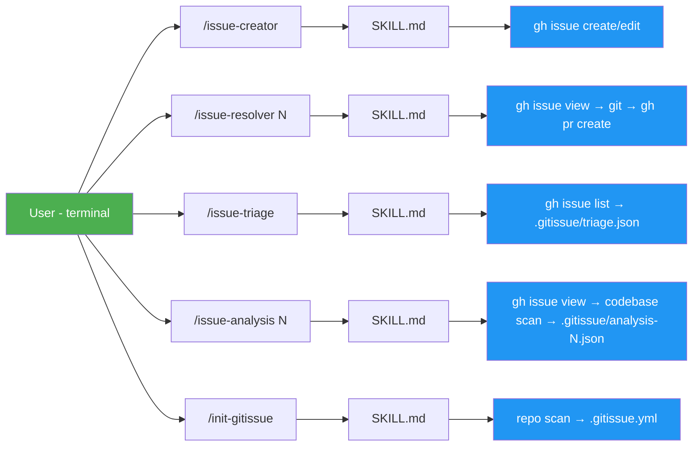
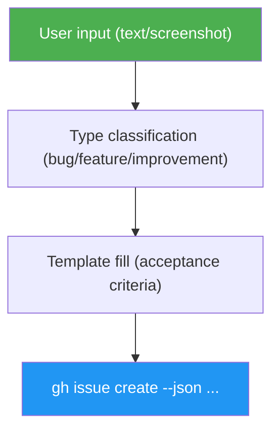
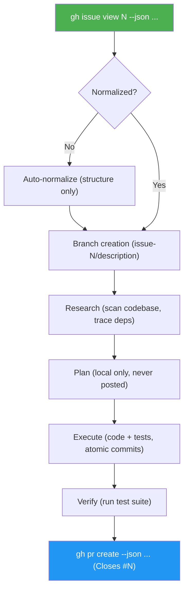
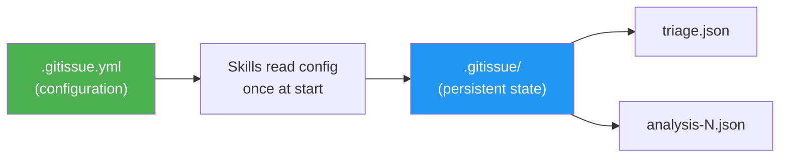

# Architecture

## Overview

issue-dev is a **skills-only** project. There is no runtime code — each skill is a self-contained Claude Code skill (SKILL.md + references/ + templates/) that instructs an AI agent how to perform a task.

The only external dependency is the GitHub CLI (`gh`), which handles all GitHub API interactions.

## System Design



## Skill Anatomy

Each skill follows the same structure:

```
skills/<skill-name>/
├── SKILL.md            # Skill definition — the "source code"
├── references/
│   └── error-messages.md   # Standardized error messages
└── templates/          # (optional) Issue templates
```

### SKILL.md

The skill definition file. Contains:
1. **Frontmatter** — name, description, trigger patterns
2. **Steps** — sequential instructions the agent follows
3. **Guards** — pre-conditions checked before execution
4. **Output format** — terminal output patterns per DESIGN.md

### references/error-messages.md

Every skill has its own error messages file. Errors follow a three-part format:
```
✗ What went wrong
  To fix:  <actionable command>
  Docs:    <url>
```

### templates/

Only used by `issue-creator`. Contains Markdown templates for bug, feature, and improvement issues. Each template includes the `<!-- gitissue:normalized v1 -->` marker.

## Data Flow

### Issue Creation



### Issue Resolution



## Persistent State



The `.gitissue/` directory stores persistent state generated by skills:

| File | Written by | Purpose |
|------|-----------|---------|
| `triage.json` | `/issue-triage` | Cached triage analysis — priorities, dependencies, execution order |
| `analysis-<N>.json` | `/issue-analysis` | Deep analysis of issue #N — affected files, root cause, implementation options, risk |

`/issue-triage view` reads from this cache without making GitHub API calls. A full re-triage overwrites the file entirely.

## Configuration

`.gitissue.yml` is loaded once at skill start. The full schema is documented in [`config-schema.md`](config-schema.md).

All settings have defaults — the system works with zero configuration.

## Design Principles

1. **Skills are isolated** — no cross-skill imports or shared state
2. **`gh` CLI is the only interface** — all GitHub interaction via `gh --json`
3. **Static sequential output** — each step prints a new line, no terminal animation
4. **Agent-agnostic** — structured issues are plain GitHub Markdown, consumable by any tool
5. **Lean issues** — issues capture human intent only; codebase analysis is performed by consumer skills (resolver, triage) at execution time against current code
