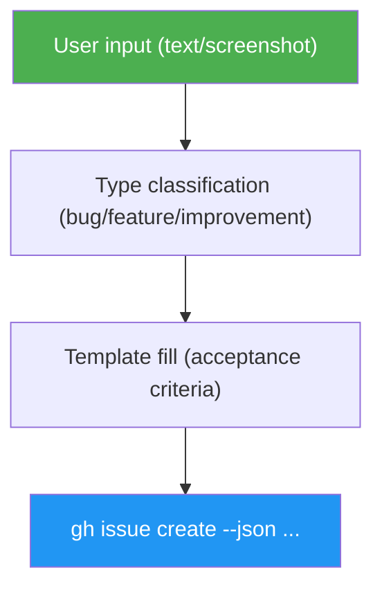
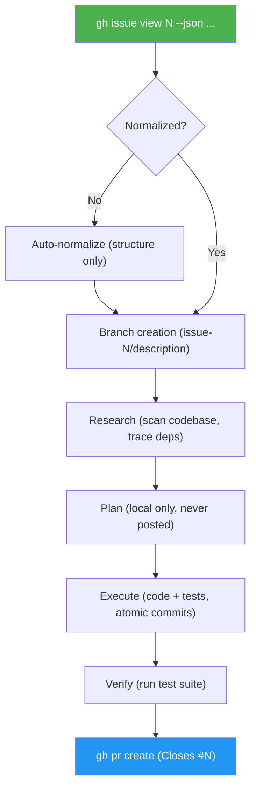
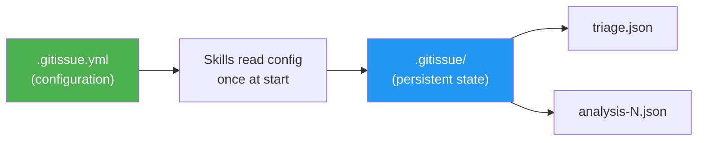

# Architecture

## Overview

issue-dev is a **skills-only** project. There is no runtime code — each skill is a self-contained Claude Code skill (SKILL.md + references/ + templates/) that instructs an AI agent how to perform a task.

The only external dependency is the GitHub CLI (`gh`), which handles all GitHub API interactions.

## System Design

```mermaid
graph LR
    U[User - terminal] --> IC["/issue-creator"]
    U --> IA["/issue-analysis N"]
    U --> IT["/issue-triage"]
    U --> IR["/issue-resolver N"]
    U --> PR["/issue-pr-review"]
    U --> AP["/auto-pilot"]
    U --> ID["/idd-doctor"]
    U --> IG["/init-gitissue"]

    IC --> G1["gh issue create/edit (intent only)"]
    IA --> G5["gh issue view → codebase scan → .gitissue/analysis-N.json"]
    IT --> G3["gh issue list → keyword scan → .gitissue/triage.json"]
    IR --> G2["gh issue view → research → plan → implement → QA → gh pr create"]
    PR --> G6["gh pr diff → script pre-pass → review-fix cycles → CI check"]
    AP --> AP2["loop: triage → resolve → review → merge"]
    AP2 --> IT
    AP2 --> IR
    AP2 --> PR
    ID --> G7["read-only checks (no writes)"]
    IG --> G4["repo scan → .gitissue.yml"]

    style U fill:#4CAF50,color:#fff
    style AP fill:#FF9800,color:#fff
    style G1 fill:#2196F3,color:#fff
    style G2 fill:#2196F3,color:#fff
    style G3 fill:#2196F3,color:#fff
    style G4 fill:#2196F3,color:#fff
    style G5 fill:#2196F3,color:#fff
    style G6 fill:#2196F3,color:#fff
    style G7 fill:#9E9E9E,color:#fff
```



## Skill Anatomy

Authored skill sources live under `src/skills/`. The build publishes each
public skill as a complete, flat, installable package under top-level `skills/`
for repo-root installers such as `asm install https://github.com/luongnv89/idd`.
The same packages are also buildable into `dist/skills/` for CI testing and
release packaging, but `dist/` is no longer committed.

```
src/skills/<skill-name>/              # authored source of truth
├── SKILL.source.md     # Skill definition — the "source code"
├── references/
│   └── error-messages.md   # Standardized error messages
└── templates/          # (optional) Issue templates

skills/<skill-name>/                  # generated install package (committed)
├── SKILL.md
├── references/
│   ├── agents/         # duplicated bundled subagents used by this skill
│   ├── docs/           # duplicated runtime docs used by this skill
│   └── ...
└── templates/          # (optional)
```

Generated skill packages are self-contained. Shared agents remain canonical in
`src/shared/agents/` for authoring, but are duplicated into each generated
skill that references them so installed skills do not rely on shared runtime
paths.

Internal-only skills live in `src/internal-skills/` (e.g., `idd-doctor`). Skills are excluded from `skills/` and `dist/`. Per issue #81, all documentation lives in a single top-level `docs/` tree: runtime docs (consumed by skills via the `docs/X.md` token; bundled into each skill's `references/docs/` by the build) and human-only project docs (architecture, changelog, development guide) coexist there.
The build generates the committed `skills/` tree via a gitignored `dist/` staging tree (verified, then promoted).

### SKILL.md

The skill definition file. Contains:
1. **Frontmatter** — name, description, trigger patterns
2. **Steps** — sequential instructions the agent follows
3. **Guards** — pre-conditions checked before execution
4. **Output format** — terminal output patterns per DESIGN.md

### references/error-messages.md

Every skill has its own error messages file. Errors follow a three-part format:
```
✗ What went wrong
  To fix:  <actionable command>
  Docs:    <url>
```

### templates/

Only used by `issue-creator`. Contains Markdown templates for bug, feature, and improvement issues. Each template includes the `<!-- gitissue:normalized v1 -->` marker.

## Data Flow

### Issue Creation



### Issue Resolution



## Persistent State



The `.gitissue/` directory stores persistent state generated by skills:

| File | Written by | Purpose |
|------|-----------|---------|
| `triage.json` | `/issue-triage` | Cached triage analysis — priorities, dependencies, execution order |
| `analysis-<N>.json` | `/issue-analysis` | Deep analysis of issue #N — affected files, root cause, implementation options, risk, `git_state`, `decision_record` |

`/issue-triage view` reads from this cache without making GitHub API calls. A full re-triage overwrites the file entirely.

### Analysis Artifacts and Durable Memory

`.gitissue/analysis-<N>.json` is **transient** — it can be deleted at any time without losing project memory. The durable signal lives in two places that survive deletion:

1. **PR body** — `/issue-resolver` lifts the `decision_record` (Root cause, Options considered, Options rejected, Selected option, Residual risk) and per-criterion AC verification table directly into the PR body.
2. **Squash-commit body** — under the project's squash-merge default, the PR body lands verbatim in `git log -p`, so a reviewer can answer "why does this change exist?" without ever opening GitHub. This half is conditional on the repo's `squash_merge_commit_message` being `PR_BODY`; GitHub's default (`COMMIT_MESSAGES`) writes the commit subjects instead and drops the record (issue #295), which is why `/issue-pr-review` reads the setting rather than assuming it.

`/issue-pr-review` enforces this dual-write rule via presence-only and per-criterion verification gates (issues #35 and #36). See [`idd-methodology.md`](idd-methodology.md) for the full rationale.

## Configuration

`.gitissue.yml` is loaded once at skill start. The full schema is documented in [`config-schema.md`](config-schema.md).

All settings have defaults — the system works with zero configuration.

## Shared References

Some infrastructure procedures are shared across multiple skills as reference documents rather than code. Each skill includes the relevant reference and follows its instructions. This preserves skill isolation — there are no cross-skill imports, just shared documentation.

| Reference | Location | Used by |
|-----------|----------|---------|
| GitHub Projects sync | `docs/github-projects-sync.md` | issue-creator, issue-resolver, issue-triage |
| Naming conventions | `docs/naming-conventions.md` | issue-creator, issue-resolver, auto-pilot |
| IDD methodology + analysis-artifact rule | `docs/idd-methodology.md` | issue-resolver, issue-pr-review, issue-analysis |
| Configuration schema (autopilot + review) | `docs/config-schema.md` | auto-pilot, issue-pr-review, init-gitissue |
| Run-log schema (`.gitissue/runs.jsonl`) | `docs/run-log-schema.md` | issue-resolver, auto-pilot, idd-doctor |

### GitHub Projects Sync

A shared utility reference that skills invoke to update issue status on a repo's GitHub Project board. It wraps the GitHub Projects v2 GraphQL API (`gh api graphql`) to discover linked projects, add issues, and update status fields (Todo, In Progress, Done). Controlled by the `projects` section in `.gitissue.yml`. Gracefully degrades when no project board exists or the API fails — skills continue without blocking. See `docs/github-projects-sync.md` for the full procedure reference.

## Scripts Pipeline

A handful of jobs are worse as prose than as code: restating the same config defaults in six skills, hand-normalizing a telemetry record, re-deriving a regex for dependency markers. Issue #251 gave those jobs a home. Shared scripts are a **third closure kind** in `scripts/build.py`, alongside shared agents and runtime docs, and they travel through the build the same way.

| Script | Job | Bundled into |
|--------|-----|--------------|
| `gi-config.py` | Derive the documented defaults from `config-schema.md`, validate and merge `.gitissue.yml`, print one JSON line | auto-pilot, issue-analysis, issue-creator, issue-pr-review, issue-resolver, issue-triage |
| `gi-runlog.py` | Validate, normalize, and append (or `--echo`) one `.gitissue/runs.jsonl` record | issue-resolver, auto-pilot |
| `gi-deps.py` | Extract local dependency issue numbers from an issue body, ignoring cross-repo refs | auto-pilot |
| `gi-secscan.py` | Apply the five pre-commit security rules to a path set and print one JSON verdict (`clean`/`warn`/`block`) | issue-pr-review, issue-resolver |
| `gi-ci-wait.py` | Poll a PR's CI checks to a settled verdict inside one invocation | auto-pilot, issue-pr-review |
| `gi-issue.py` | Serve repeat `gh issue view` reads from a TTL cache keyed by issue *and* field set | auto-pilot, issue-analysis, issue-creator, issue-pr-review, issue-resolver |
| `gi-branch.py` | Derive a branch name from an issue number, title, and type, and self-check it against the branch grammar | issue-resolver |

**Closure kind.** `SHARED_SCRIPT_RE` matches the bare token `shared/scripts/<name>.py` in a skill's own files (and in any runtime doc reachable from them). The matched name resolves against `src/shared/scripts/`; the file is copied with `shutil.copy2` so the committed `0755` mode survives into the install package. Scripts are **leaves** — the build never scans a `.py` body for further references, so a comment can't drag a document into a bundle. Discovery is regex plus filesystem, which means adding a script needs no `build.py` change. The token is directory-scoped (`shared/scripts/`, not a bare `scripts/`) because a bare form collides with the prose mentions of this repo's own `scripts/` directory that already sit inside the closure read set.

**Four rewrite forms.** Every logical reference is rendered per destination, URL spans excluded:

| Context | `shared/scripts/gi-config.py` renders as |
|---------|------------------------------------------|
| Skill source (`src/`) | unchanged — the authoring form |
| Emitted skill (`skills/`, `dist/skills/`) | `references/scripts/gi-config.py` |
| Emitted agent prompt (`references/agents/`) | absolute repo blob URL (issue #245) |
| Bundled runtime doc | `references/scripts/gi-config.py` |

Because agent prompts render absolute URLs, a script reached **only** through a shared agent is validated but never bundled — a bundled copy would be unreferenceable weight. An agent that needs a script receives its path as a spawn variable bound by the orchestrating skill, mirroring `{security_convention}`.

**`gi-requires`.** A script may declare a bundled file it reads at run time with a `# gi-requires: references/…` header. The build resolves each declaration against the same skill's bundle and fails if it is missing — `gi-config.py` declares `references/docs/config-schema.md`, which is why it derives its defaults instead of hard-coding them.

**Exit-code vocabulary.** Shared across every script: `0` ok · `2` usage error · `3` invalid input, caller should stop · `4` cannot complete, caller should degrade. Code `1` is reserved for a script-specific *verdict* — an answer, not a failure. `gi-secscan.py` is the only user: `1` means a real secret was found and the commit must stop. Because the default reading of a non-zero exit is "degrade", a script claiming `1` must say so in its docstring and at every call site — degrading past a block would invert the one check the gate exists for.

**Fatal vs. degrade.** The two failure modes are deliberately not the same:

- **File absent from the bundle → fatal.** Each skill's *Bundled dependency precheck* list names every script it ships, and the build fails in both directions if that list and the real bundle disagree. A missing file therefore means a broken or partial install, not a normal condition — the skill stops with `✗ Missing bundled dependency`.
- **Runtime failure → degrade.** No `python3`, a non-zero exit other than 3, or unparsable stdout is an environment problem. The skill prints a `⚠` line and follows the prose procedure it keeps beside every invocation — the inline defaults table for `gi-config`, the `mkdir -p` + append for `gi-runlog`, the hand-applied strip/capture steps for `gi-deps`, the Primary Pattern for `gi-secscan`, the manual `gh pr checks` loop for `gi-ci-wait`, a plain `gh issue view` for `gi-issue`, the six derivation steps for `gi-branch`. Exit 3 is the exception: it reports invalid *user* input (a malformed `.gitissue.yml`, a malformed record), so the skill stops rather than degrading — as does `gi-secscan`'s verdict code 1.

Every script is stdlib-only and answers `--help` with exit 0, so a skill can probe for a working interpreter before committing to the fast path.

## Design Principles

1. **Skills are isolated** — no cross-skill imports or shared state (shared references are documentation, not code)
2. **`gh` CLI is the only interface** — all GitHub interaction via `gh --json` and `gh api graphql`
3. **Static sequential output** — each step prints a new line, no terminal animation
4. **Agent-agnostic** — structured issues are plain GitHub Markdown, consumable by any tool
5. **Lean issues** — issues capture human intent only; codebase analysis is performed by consumer skills (resolver, triage, analysis) at execution time against current code
6. **Durable memory in git** — every resolution dual-writes its Decision Record and AC verification into both the PR body and (via squash merge) the commit body, so `git log -p` is a self-contained project history independent of `.gitissue/` files
7. **Balanced by default** — `/auto-pilot` auto-merges clean PRs (review passed); PRs with unresolved issues get a follow-up and stay open. Users can opt into `conservative` (never merge) or `aggressive` modes. Critical-labeled issues always pause for human review on partial fixes
