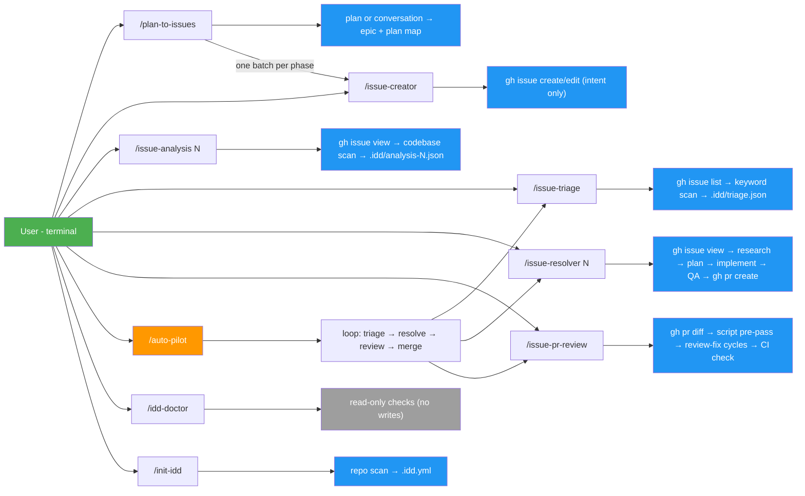
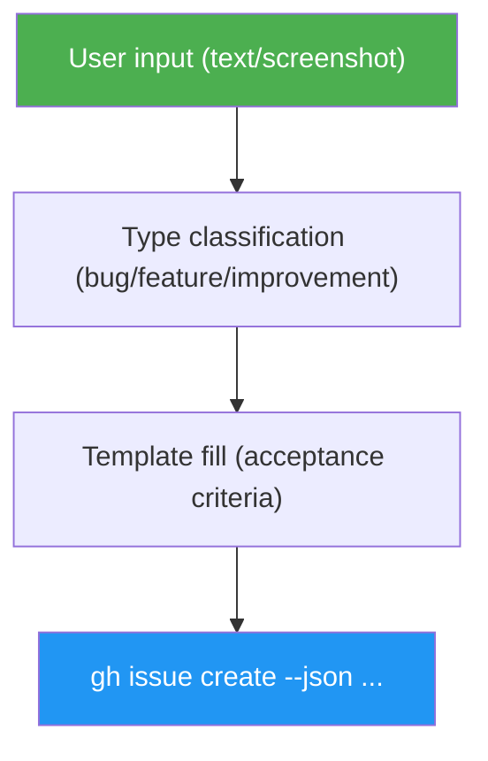
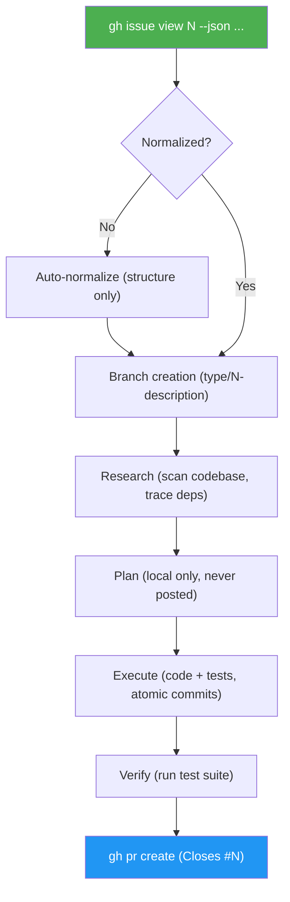
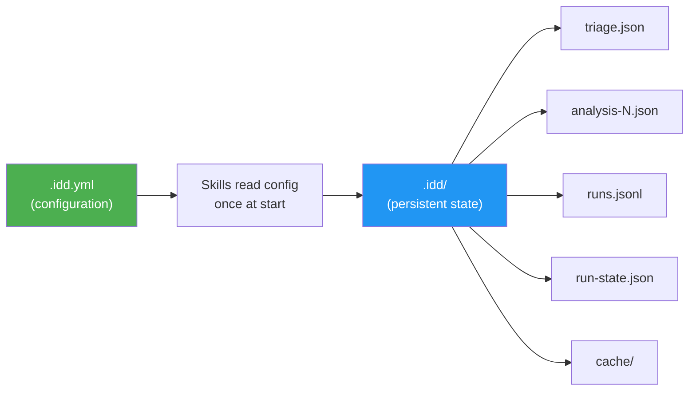

# Architecture

## Overview

IDD Stack is a **prompt-first** project. Almost all of it is prose: each skill is a self-contained Claude Code skill (`SKILL.md` + `references/` + `templates/`) that instructs an AI agent how to perform a task. The exception is `src/shared/scripts/` — small, stdlib-only Python helpers the skills shell out to when determinism beats prose (`src/shared/scripts/gi-config.py:3`).

The only external dependency for GitHub interaction is the GitHub CLI (`gh`).

## System Design


```mermaid
graph LR
    U[User - terminal] --> PI["/plan-to-issues"]
    U --> IC["/issue-creator"]
    U --> IA["/issue-analysis N"]
    U --> IT["/issue-triage"]
    U --> IR["/issue-resolver N"]
    U --> PR["/issue-pr-review"]
    U --> AP["/auto-pilot"]
    U --> ID["/idd-doctor"]
    U --> IG["/init-idd"]

    PI --> G8["plan or conversation → epic + plan map"]
    PI --> |"one batch per phase"| IC
    IC --> G1["gh issue create/edit (intent only)"]
    IA --> G5["gh issue view → codebase scan → .idd/analysis-N.json"]
    IT --> G3["gh issue list → keyword scan → .idd/triage.json"]
    IR --> G2["gh issue view → research → plan → implement → QA → gh pr create"]
    PR --> G6["gh pr diff → script pre-pass → review-fix cycles → CI check"]
    AP --> AP2["loop: triage → resolve → review → merge"]
    AP2 --> IT
    AP2 --> IR
    AP2 --> PR
    ID --> G7["read-only checks (no writes)"]
    IG --> G4["repo scan → .idd.yml"]

    style U fill:#4CAF50,color:#fff
    style AP fill:#FF9800,color:#fff
    style G1 fill:#2196F3,color:#fff
    style G2 fill:#2196F3,color:#fff
    style G3 fill:#2196F3,color:#fff
    style G4 fill:#2196F3,color:#fff
    style G5 fill:#2196F3,color:#fff
    style G6 fill:#2196F3,color:#fff
    style G7 fill:#9E9E9E,color:#fff
    style G8 fill:#2196F3,color:#fff
```

## Skill Anatomy

Authored skill sources live under `src/skills/`. The build publishes each
public skill as a complete, flat, installable package under top-level `skills/`
for repo-root installers such as `asm install https://github.com/luongnv89/idd`.
The same `skills/` tree is what the Claude Code plugin ships: `skills/` is the
plugin root (the build emits `skills/.claude-plugin/plugin.json` from
`src/plugin/plugin.json`), and the repo root is the marketplace
(`.claude-plugin/marketplace.json`), whose `git-subdir` source fetches only
`skills/` at the release tag. `claude plugin install idd@idd` therefore installs
the tagged release's `skills/` and nothing else from the repo, with no second
copy (issues #469, #492).
The same packages are also buildable into `dist/skills/` for CI testing and
release packaging, but `dist/` is no longer committed.

```
src/skills/<skill-name>/              # authored source of truth
├── SKILL.source.md     # Skill definition — the "source code"
├── references/
│   └── error-messages.md   # Standardized error messages
└── templates/          # (optional) Issue templates

skills/<skill-name>/                  # generated install package (committed)
├── SKILL.md
├── references/
│   ├── agents/         # duplicated bundled subagents used by this skill
│   ├── docs/           # duplicated runtime docs used by this skill
│   └── ...
└── templates/          # (optional)
```

Generated skill packages are self-contained. Shared agents remain canonical in
`src/shared/agents/` for authoring, but are duplicated into each generated
skill that references them so installed skills do not rely on shared runtime
paths.

**Decision #434 — build internal skills locally, never distribute them.**
Authored internal skills live in `src/internal-skills/` (e.g., `idd-doctor`).
The existing closure and flattened emitter produce real, self-contained packages
under repo-root `internal-skills/<name>/`, with `SKILL.md` and bundled dependencies.
This output is gitignored and excluded from public `skills/`, all of `dist/`,
plugin payloads/manifests, and supported public installs. `build.sh` stages
internal packages in system temporary storage outside `dist/`, verifies both
inventories before promoting either canonical tree, and discards the internal
stage on custom `--out` or `--no-promote-skills` builds. No source-only invocation
is supported: rebuild and load the emitted internal package. This chooses
Option 2; the source-only conditional acceptance criterion is not applicable.

The Python driver supports explicit `--internal-out` for independent inspection;
its default emits canonical `internal-skills/` only with canonical `dist/` and
root mirroring enabled. Custom output/no-root builds otherwise skip it. Unsafe
internal destinations overlapping source, public skills or distribution roots
(in either direction, resolving symlinks) fail before output cleanup. Inside
an authored checkout only the designated `internal-skills/` output is allowed;
retained inspection copies belong outside the checkout, never in `scripts/`,
`docs/`, `tests/` or Git metadata. The driver's own source and public trees
remain protected even when a different `--src` is selected.

Per issue #81, all documentation lives in a single top-level `docs/` tree: runtime docs (consumed by skills via the `docs/X.md` token; bundled into each skill's `references/docs/` by the build) and human-only project docs (architecture, changelog, development guide) coexist there.
The build generates the committed public `skills/` tree via a gitignored `dist/` staging tree (verified, then promoted), and the separate local-only `internal-skills/` tree from its verified temporary stage.

### SKILL.md

The skill definition file. Contains:
1. **Frontmatter** — name, description, trigger patterns
2. **Steps** — sequential instructions the agent follows
3. **Guards** — pre-conditions checked before execution
4. **Output format** — terminal output patterns per DESIGN.md

### references/error-messages.md

Every skill has its own error messages file. Errors follow a three-part format:
```
✗ What went wrong
  To fix:  <actionable command>
  Docs:    <url>
```

### templates/

Only used by `issue-creator`. Contains Markdown templates for bug, feature, and improvement issues. Each template includes the `<!-- idd:normalized v1 -->` marker.

## Data Flow

### Issue Creation


```mermaid
graph TD
    A["User input (text/screenshot)"] --> B["Type classification (bug/feature/improvement)"]
    B --> C["Template fill (acceptance criteria)"]
    C --> D["gh issue create --json ..."]

    style A fill:#4CAF50,color:#fff
    style D fill:#2196F3,color:#fff
```

### Issue Resolution


```mermaid
graph TD
    A["gh issue view N --json ..."] --> B{Normalized?}
    B -- No --> C["Auto-normalize (structure only)"]
    C --> D
    B -- Yes --> D["Branch creation (type/N-description)"]
    D --> E["Research (scan codebase, trace deps)"]
    E --> F["Plan (local only, never posted)"]
    F --> G["Execute (code + tests, atomic commits)"]
    G --> H["Verify (run test suite)"]
    H --> I["gh pr create (Closes #N)"]

    style A fill:#4CAF50,color:#fff
    style I fill:#2196F3,color:#fff
```

## Persistent State


```mermaid
graph LR
    Config[".idd.yml<br/>(configuration)"] --> Skills["Skills read config<br/>once at start"]
    Skills --> State[".idd/<br/>(persistent state)"]
    State --> TJ["triage.json"]
    State --> AJ["analysis-N.json"]
    State --> RL["runs.jsonl"]
    State --> RS["run-state.json"]
    State --> CA["cache/"]

    style Config fill:#4CAF50,color:#fff
    style State fill:#2196F3,color:#fff
```

The `.idd/` directory stores persistent state generated by skills (`docs/config-schema.md:582-587`):

| File | Written by | Purpose |
|------|-----------|---------|
| `triage.json` | `/issue-triage` | Cached triage analysis — priorities, dependencies, execution order |
| `analysis-<N>.json` | `/issue-analysis` | Deep analysis of issue #N — affected files, root cause, implementation options, risk, `git_state`, `decision_record` |
| `runs.jsonl` | `/issue-resolver`, `/auto-pilot` | Append-only run log, one line per processed issue (`src/shared/scripts/gi-runlog.py:2`). The optional `agent_overrides` field (`applied` / `partial` / `fallback`, omitted when no override is configured) records whether the per-role `agents.*` overrides reached the run's spawns; `/idd-doctor` summarises the counts read-only. The optional `phases` object carries seconds per pipeline step, from which `idd-lint stats` and `/idd-doctor` name the slowest phase |
| `run-state.json` | `/auto-pilot`; `/issue-resolver` (`borrowed_skills` only) | Resumable run state (`src/shared/scripts/gi-state.py:4`) |
| `run.lock` | `/auto-pilot` | Exclusive run lock (`src/shared/scripts/gi-state.py:4`) |
| `last-run-report.md` | `/auto-pilot` | Persisted final-run report (`src/shared/scripts/gi-state.py:4`) |
| `cache/` | `/issue-resolver` and other `gi-issue.py` callers; `/issue-triage` and `/issue-creator` via `gi-backlog.py` | TTL-cached `gh issue view` payloads (`src/shared/scripts/gi-issue.py:8`) and the shared open-issue snapshot `backlog-open-<sha12>.json` (`src/shared/scripts/gi-backlog.py:3`) |

`/issue-triage view` reads from `triage.json` without making GitHub API calls. A full re-triage overwrites the file entirely.

### Analysis Artifacts and Durable Memory

`.idd/analysis-<N>.json` is **transient** — it can be deleted at any time without losing project memory. The durable signal lives in two places that survive deletion:

1. **PR body** — `/issue-resolver` lifts the `decision_record` (Root cause, Options considered, Options rejected, Selected option, Residual risk) and per-criterion AC verification table directly into the PR body.
2. **Squash-commit body** — under the project's squash-merge default, the PR body lands verbatim in `git log -p`, so a reviewer can answer "why does this change exist?" without ever opening GitHub. This half is conditional on the repo's `squash_merge_commit_message` being `PR_BODY`; GitHub's default (`COMMIT_MESSAGES`) writes the commit subjects instead and drops the record (issue #295), which is why `/issue-pr-review` reads the setting rather than assuming it.

`/issue-pr-review` enforces this dual-write rule via presence-only and per-criterion verification gates (issues #35 and #36). See [`idd-methodology.md`](idd-methodology.md) for the full rationale.

## Configuration

`.idd.yml` is loaded once at skill start. The full schema is documented in [`config-schema.md`](config-schema.md).

All settings have defaults — the system works with zero configuration.

## Shared References

Some infrastructure procedures are shared across multiple skills as reference documents rather than code. Each skill includes the relevant reference and follows its instructions. This preserves skill isolation — there are no cross-skill imports, just shared documentation.

| Reference | Location | Used by |
|-----------|----------|---------|
| GitHub Projects sync | `docs/github-projects-sync.md` | issue-creator, issue-resolver, issue-triage |
| Naming conventions | `docs/naming-conventions.md` | issue-creator, issue-resolver, auto-pilot |
| IDD methodology + analysis-artifact rule | `docs/idd-methodology.md` | issue-resolver, issue-pr-review, issue-analysis |
| Configuration schema (autopilot + review) | `docs/config-schema.md` | auto-pilot, issue-pr-review, init-idd |
| Run-log schema (`.idd/runs.jsonl`) | `docs/run-log-schema.md` | issue-resolver, auto-pilot, idd-doctor |

### GitHub Projects Sync

A shared utility reference that skills invoke to update issue status on a repo's GitHub Project board. It wraps the GitHub Projects v2 GraphQL API (`gh api graphql`) to discover linked projects, add issues, and update status fields (Todo, In Progress, Done). Controlled by the `projects` section in `.idd.yml`. Gracefully degrades when no project board exists or the API fails — skills continue without blocking. See `docs/github-projects-sync.md` for the full procedure reference.

## Scripts Pipeline

A handful of jobs are worse as prose than as code: restating the same config defaults in six skills, hand-normalizing a telemetry record, re-deriving a regex for dependency markers. Issue #251 gave those jobs a home. Shared scripts are a **third closure kind** in `scripts/build.py`, alongside shared agents and runtime docs, and they travel through the build the same way.

| Script | Job | Bundled into |
|--------|-----|--------------|
| `gi-config.py` | Merge documented defaults with `.idd.yml` into one JSON line (`src/shared/scripts/gi-config.py:3`) | auto-pilot, issue-analysis, issue-creator, issue-pr-review, issue-resolver, issue-triage, plan-to-issues |
| `gi-runlog.py` | Validate, normalize, and append (or `--echo`) one `.idd/runs.jsonl` record (`src/shared/scripts/gi-runlog.py:2`) | issue-resolver, auto-pilot |
| `gi-deps.py` | Extract local dependency issue numbers from an issue body, ignoring cross-repo refs (`src/shared/scripts/gi-deps.py:2`) | auto-pilot |
| `gi-secscan.py` | Apply the five pre-commit security rules to a path set and print one JSON verdict (`clean`/`warn`/`block`) (`src/shared/scripts/gi-secscan.py:2`) | issue-pr-review, issue-resolver |
| `gi-ci-wait.py` | Poll a PR's CI checks to a settled verdict inside one invocation (`src/shared/scripts/gi-ci-wait.py:2`) | auto-pilot, issue-pr-review |
| `gi-issue.py` | Serve repeat `gh issue view` reads from a TTL cache keyed by issue *and* field set (`src/shared/scripts/gi-issue.py:2`) | auto-pilot, issue-analysis, issue-creator, issue-pr-review, issue-resolver |
| `gi-backlog.py` | Serve the open-issue list from one TTL snapshot shared by triage and the duplicate scorer; stale or corrupt snapshots refetch (`src/shared/scripts/gi-backlog.py:3`) | issue-creator, issue-triage |
| `gi-branch.py` | Derive a branch name from an issue number, title, and type, and self-check it against the branch grammar (`src/shared/scripts/gi-branch.py:2`) | issue-resolver, auto-pilot |
| `gi-dup-score.py` | Score proposed issues against the open backlog (`src/shared/scripts/gi-dup-score.py:3`) | issue-creator |
| `gi-gh.py` | Shared subprocess boundary for GitHub CLI calls (`src/shared/scripts/gi-gh.py:2`) | issue-analysis, issue-creator, issue-pr-review, issue-resolver, issue-triage, auto-pilot |
| `gi-model-cache.py` | Locate, seed, and age the user-level model-suggestion cache (`src/shared/scripts/gi-model-cache.py:2`) | issue-creator |
| `gi-ratelimit.py` | Rate-limit verdict, chunked pause, backoff, and runtime budget (`src/shared/scripts/gi-ratelimit.py:2`) | auto-pilot |
| `gi-stack-detect.py` | Detect repo language, framework, test runner, and size (`src/shared/scripts/gi-stack-detect.py:2`) | init-idd |
| `gi-state.py` | `/auto-pilot` resumable run state, run lock, and final report (`src/shared/scripts/gi-state.py:2`) | auto-pilot, issue-resolver |
| `gi-triage-graph.py` | Triage execution order, status, staleness, and priority (`src/shared/scripts/gi-triage-graph.py:2`) | auto-pilot, issue-triage |
| `gi-plan-map.py` | Render `/plan-to-issues`' static epic plan map: reads the render JSON on stdin, writes the sentinel-bounded plan-map markdown on stdout; exits `0` ok, `2` usage, `3` invalid input (`src/shared/scripts/gi-plan-map.py:2`) | plan-to-issues |
| `gi-receipt.py` | Write (resolver) or verify (reviewer) the revision receipt that backs a QA handoff marker, stored under the git common dir; exits `0` answered, `2` usage, `3` invalid input, `4` cannot complete (`src/shared/scripts/gi-receipt.py:2`) | issue-pr-review, issue-resolver |
| `gi-sensitive.py` | Step 2 sensitive-change gate: `--classify` labels + planned paths → sensitive, `--adjudicate` the probe/challenge ledger → `proceed`/`replan`/`stop`; exits `0` answered, `2` usage, `3` invalid input, `4` cannot complete (`src/shared/scripts/gi-sensitive.py:2`) | issue-resolver |
| `gi-premise.py` | Step 4 premise reset: QA premise ledger → whether the next fix is blocked; exits `0` answered, `2` usage, `3` invalid input, `4` cannot complete (`src/shared/scripts/gi-premise.py:2`) | issue-resolver |
| `gi-sketch.py` | Step 2 design sketches: per-caller static-check results → whether the designs are structurally distinct, which reject every invalid transition, and `proceed`/`switch`/`unproven`; exits `0` answered, `2` usage, `3` invalid input, `4` cannot complete (`src/shared/scripts/gi-sketch.py:2`) | issue-resolver |
| `gi-recipe.py` | Step 4 verification recipe: reads `.idd-recipe.json` from the base ref only, launches an owned app instance in its own process group, drives the capabilities mapped to the changed files, keeps evidence under `<git common dir>/idd/evidence/`, tears down only the owned group; exits `0` answered, `2` usage, `3` invalid recipe, `4` cannot complete (`src/shared/scripts/gi-recipe.py:2`) | issue-pr-review, issue-resolver |
| `gi-postmerge.py` | Post-merge cleanup: for a PR that reads `MERGED`, prunes, removes clean worktrees on its branch (forced only for a user-confirmed `--remove-worktree` holding untracked/ignored files only), switches the main checkout off the merged branch to the fast-forwarded base (stash-first), and deletes the local branch only when its tip is the merged head; exits `0` answered (`ok`/`problems`), `2` usage, `3` invalid `--pr`, `4` cannot complete (`src/shared/scripts/gi-postmerge.py:3`) | auto-pilot, issue-pr-review |

**Closure kind.** `SHARED_SCRIPT_RE` matches the bare token `shared/scripts/<name>.py` in a skill's own files (and in any runtime doc reachable from them). The matched name resolves against `src/shared/scripts/`; the file is copied with `shutil.copy2` so the committed `0755` mode survives into the install package. Scripts are **leaves** — the build never scans a `.py` body for further references, so a comment can't drag a document into a bundle. Discovery is regex plus filesystem, which means adding a script needs no `build.py` change. The token is directory-scoped (`shared/scripts/`, not a bare `scripts/`) because a bare form collides with the prose mentions of this repo's own `scripts/` directory that already sit inside the closure read set.

**Four rewrite forms.** Every logical reference is rendered per destination, URL spans excluded:

| Context | `shared/scripts/gi-config.py` renders as |
|---------|------------------------------------------|
| Skill source (`src/`) | unchanged — the authoring form |
| Emitted skill (`skills/`, `dist/skills/`) | `references/scripts/gi-config.py` |
| Emitted agent prompt (`references/agents/`) | absolute repo blob URL (issue #245) |
| Bundled runtime doc | `references/scripts/gi-config.py` |

Because agent prompts render absolute URLs, a script reached **only** through a shared agent is validated but never bundled — a bundled copy would be unreferenceable weight. An agent that needs a script receives its path as a spawn variable bound by the orchestrating skill, mirroring `{security_convention}`.

**`gi-requires`.** A script may declare a bundled file it reads at run time with a `# gi-requires: references/…` header. The build resolves each declaration against the same skill's bundle and fails if it is missing — `gi-config.py` declares `references/docs/config-schema.md`, which is why it derives its defaults instead of hard-coding them.

**Exit-code vocabulary.** Shared across every script: `0` ok · `2` usage error · `3` invalid input, caller should stop · `4` cannot complete, caller should degrade. Code `1` is reserved for a script-specific *verdict* — an answer, not a failure. `gi-secscan.py` is the only user: `1` means a real secret was found and the commit must stop. Because the default reading of a non-zero exit is "degrade", a script claiming `1` must say so in its docstring and at every call site — degrading past a block would invert the one check the gate exists for.

**Fatal vs. degrade.** The two failure modes are deliberately not the same:

- **File absent from the bundle → fatal.** Each skill's *Bundled dependency precheck* list names every script it ships, and the build fails in both directions if that list and the real bundle disagree. A missing file therefore means a broken or partial install, not a normal condition — the skill stops with `✗ Missing bundled dependency`.
- **Runtime failure → degrade.** No `python3`, a non-zero exit other than 3, or unparsable stdout is an environment problem. The skill prints a `⚠` line and follows the prose procedure it keeps beside every invocation — the inline defaults table for `gi-config`, the `mkdir -p` + append for `gi-runlog`, the hand-applied strip/capture steps for `gi-deps`, the Primary Pattern for `gi-secscan`, the manual `gh pr checks` loop for `gi-ci-wait`, a plain `gh issue view` for `gi-issue`, the six derivation steps for `gi-branch`. Exit 3 is the exception: it reports invalid *user* input (a malformed `.idd.yml`, a malformed record), so the skill stops rather than degrading — as does `gi-secscan`'s verdict code 1.

Every script is stdlib-only and answers `--help` with exit 0, so a skill can probe for a working interpreter before committing to the fast path.

## Design Principles

1. **Skills are isolated** — no cross-skill imports or shared state (shared references are documentation, not code)
2. **`gh` CLI is the only interface** — all GitHub interaction via `gh --json` and `gh api graphql`
3. **Static sequential output** — each step prints a new line, no terminal animation
4. **Agent-agnostic** — structured issues are plain GitHub Markdown, consumable by any tool
5. **Lean issues** — issues capture human intent only; codebase analysis is performed by consumer skills (resolver, triage, analysis) at execution time against current code
6. **Durable memory in git** — every resolution dual-writes its Decision Record and AC verification into both the PR body and (via squash merge, where `squash_merge_commit_message` is `PR_BODY` — see *Analysis Artifacts and Durable Memory*, item 2) the commit body, so `git log -p` is a self-contained project history independent of `.idd/` files
7. **Balanced by default** — `/auto-pilot` auto-merges clean PRs (review passed); PRs with unresolved issues get a follow-up and stay open. Users can opt into `conservative` (never merge) or `aggressive` modes. Critical-labeled issues always pause for human review on partial fixes
