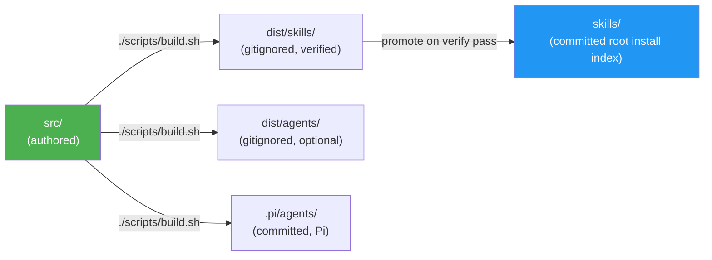
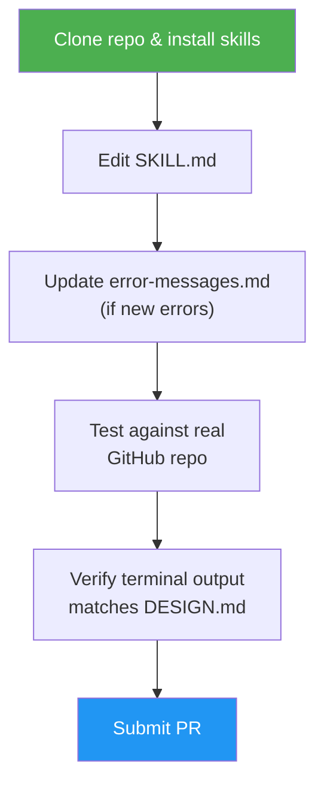
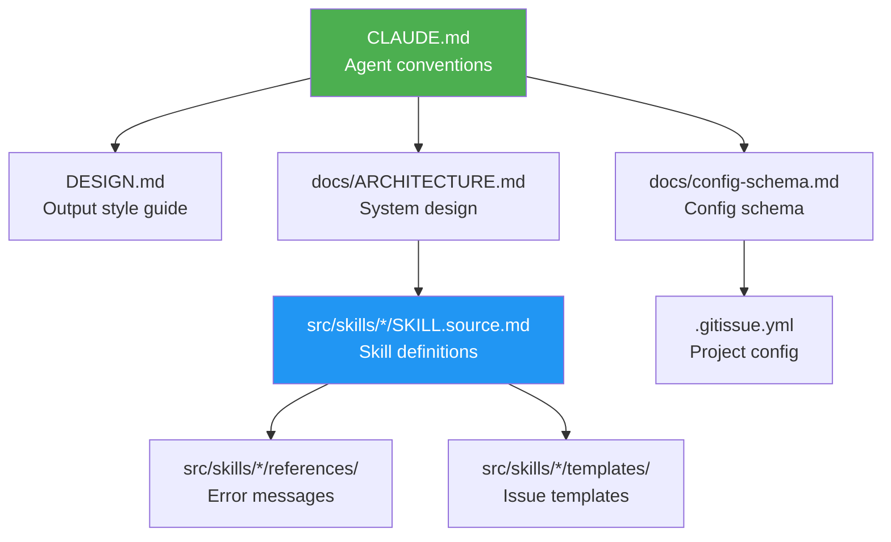

# Development Guide

## Prerequisites

- [GitHub CLI](https://cli.github.com) (`gh`) 2.0+ — authenticated via `gh auth login`
- [Claude Code](https://docs.anthropic.com/en/docs/claude-code) or any SKILL.md-compatible agent
- Git 2.30+

## Dependencies

No third-party package manifest (no `package.json`, `requirements.txt`,
`pyproject.toml`, or lockfile). Python under `src/shared/scripts/` and
`scripts/` is stdlib-only. `gi-config.py` may import PyYAML if the interpreter
already has it; that is optional and undeclared — the vendored restricted YAML
parser is the always-available path.

Reconfirmed at epic #363 close (P2 Modernize). `MODERNIZATION_PLAN.md` and
`MODERNIZATION_REPORT.md` were never committed; the tracker is issue #363.

## Local Setup

1. Clone the repository:
   ```bash
   git clone https://github.com/luongnv89/idd.git
   cd idd
   ```

2. Install skills locally — `asm` is the install tool, manual copy is the fallback:
   ```bash
   # asm (recommended; works from the clone or straight from GitHub):
   asm install https://github.com/luongnv89/idd
   asm install https://github.com/luongnv89/idd --skill issue-resolver

   # Manual copy — single skill from this checkout:
   mkdir -p ~/.claude/skills
   cp -r skills/issue-resolver ~/.claude/skills/
   ```
   Each top-level `skills/<name>/` package is a self-contained SKILL.md tree with the shared agents bundled inside it (`references/agents/`), so it runs on any SKILL.md-compatible tool — for tools other than Claude Code, copy into that tool's skills directory (e.g. `~/.codex/skills/`). No build step is needed since `skills/` is committed. Optional Claude Code extra: `./scripts/build.sh && cp dist/agents/*.md ~/.claude/agents/` registers the shared subagents natively; other tools use the bundled copies. See [README → Install](../README.md#install).

   **Pi (pi-subagents):** `./scripts/build.sh` also regenerates committed `.pi/agents/*.md` from `src/shared/agents/` (role-only `display_name`, no persona labels). Enable `npm:@tintinweb/pi-subagents` in Pi settings, then either work from this repo (project agents) or copy to your global agent dir:
   ```bash
   cp .pi/agents/*.md ~/.pi/agent/agents/
   ```
   Restart the Pi session after updating agent files. Skills still recommend spawning reviewers with `description` + prompt only (no `subagent_type`); if you use `subagent_type: code-reviewer`, the UI shows `.pi/agents/` `display_name`.

3. Verify setup:
   ```bash
   gh auth status        # Must be authenticated
   gh --version          # Must be 2.0+
   ```

## Build Flow

`src/` is the single source of truth. Top-level `skills/` is the committed install surface; `dist/` is a gitignored staging area (`dist/skills/` is verified then promoted to `skills/`; `dist/agents/` holds the optional standalone Claude Code subagent definitions).



After editing anything under `src/`, rebuild before committing:

```bash
./scripts/build.sh
```

CI's drift check fails any PR where the committed `skills/` output does not match a transient build.

## Making Changes



### Editing a Skill

Skills live in `src/skills/<name>/SKILL.source.md` (internal-only skills under `src/internal-skills/<name>/`). Hand edits go in `src/` only — never edit `skills/` directly. When editing:

1. Read the existing SKILL.md fully before making changes
2. Follow the terminal output patterns in `DESIGN.md`
3. Use `--json` with explicit field selection for all `gh` commands
4. Update `references/error-messages.md` if adding new error cases
5. Run `./scripts/build.sh` to regenerate `skills/`
6. Test against a real GitHub repository

### Adding Error Messages

Each skill has `references/error-messages.md`. Follow the three-part format:

```
✗ Short error description

  To fix:  <actionable command>
  Docs:    <url to relevant documentation>
```

### Modifying Templates

Issue templates are in `src/skills/issue-creator/templates/`. Each template must:
- Include the `<!-- gitissue:normalized v1 -->` marker
- Use intent-only sections: Type, Context, Description, Acceptance Criteria, Metadata
- Preserve the Reporter Context blockquote
- **Never** include sections that imply codebase analysis (no Affected Files, no Technical Notes, no Architecture Constraints, no Implementation Hints) — `/issue-creator` is intent-only; consumer skills (resolver, triage, analysis) scan the codebase fresh at execution time

## Testing

The automated suite is `tests/*.sh` — shell scripts that assert on `src/`, `docs/`, and the built `skills/`. They need no GitHub repo and no setup.

`.github/workflows/dist-check.yml` is the authoritative list of what runs and in what order: one named step per script, source-level checks first, then `./scripts/build.sh` and the drift gate, then the checks that read the build output. `tests/test-build-script.sh` (T9) fails if any `tests/*.sh` is missing from that workflow, so a new test is not "done" until it has a step there.

```bash
bash tests/test-build-script.sh          # run one
git ls-files 'tests/*.sh' | xargs -n1 bash   # run all
```

`tests/README.md`, `README-sprint2.md`, and `README-sprint3.md` are something else: manual, human-driven test cases that do need a scratch GitHub repo.

### Anchor markers (assert on contracts, not on sentences)

Most of this repo is prose, so a test that asserts a skill's behavior has to
read that prose. Grepping for a whole English sentence couples the suite to
wording: rewording a requirement without changing it turns CI red, and gutting
the requirement while keeping the sentence stays green (issue #358).

An **anchor** is the inline HTML comment `<!-- a:<id> -->`, appended to the line
that opens a contract-critical block in an authored `src/` file. It is inert —
invisible in rendered Markdown, never read by a skill at run time — and
`scripts/build.py` copies it byte-identically into `skills/`, so one anchor in
`src/` serves both the source-side and built-side assertions.

- An **anchor region** runs from the anchor line to the line before the next
  anchor or the next Markdown heading, whichever comes first. "Heading" means an
  ATX heading of *any* level (`^#+ `), so a `####` closes a region just as a
  `##` does. Headings and anchors inside fenced code blocks do **not** close a
  region.
- An **anchor span** (`<start-id>` … `<end-id>`) covers a block that legitimately
  contains sub-headings. Both ids name real sections, so a span replaces the two
  exact heading strings an `awk '/^## A/,/^## B/'` extraction would pin.

Tests source `tests/lib/anchors.bash` and use `anchor_check`,
`anchor_check_flat`, `anchor_lacks`, `anchor_present`, and `anchor_span`. Every
helper fails when the anchor is missing or not unique — so a migrated assertion
keeps its teeth even before its pattern is considered. Inside a region, assert a
**machine token** (identifier, config key, command string, placeholder, literal
output line) wherever the contract has one, and a short keyword stem only where
it does not. Never assert a whole English sentence.

Where the contract is a prohibition, a negation, or a condition, take the stem
from the polarity-bearing word (`**not**`, `never`, `**no**`, `without`, `only
after`, `when … links`), never from the subject noun — a subject stem survives
the claim's own inversion. Never `|`-alternate a polarity-bearing token with a
polarity-free one; the weakest branch defines the assertion. Prose here is
hard-wrapped and `anchor_check` greps line by line, so a claim that straddles a
line break needs `anchor_check_flat`, which joins the region into one line
before matching.

The library's header is the full convention reference, including the rule that
its `.bash` extension keeps it out of `git ls-files 'tests/*.sh'`.

Migrated onto `tests/lib/anchors.bash` (heading extracts are `anchor_span` /
`anchor_region`; remaining assertions are machine tokens, polarity-bearing
stems, or behavioral checks):

- `tests/test-followup-context-285.sh` and `tests/test-subagent-context-256.sh` (#358 / PR #395)
- `tests/test-autopilot-triage-cache-258.sh`
- `tests/test-qa-handoff-255.sh`
- `tests/test-analysis-reuse-254.sh`

Those three named remainder suites were the #358 Decision Record's
next-highest-churn slice; they close issue #401 together. Remaining
`tests/*.sh` files that still grep skill markdown without `anchors.bash` are
**deferred** (issue #401 AC4), not forgotten:

| Class | Suites (representative) | Why deferred |
|-------|-------------------------|--------------|
| Structural / build | `test-build-script.sh`, `test-build-negative-mutations.sh`, `test-bundled-doc-slimming-249.sh`, `test-dependency-closure.sh`, `test-disclosure-gates-250.sh`, `test-consolidated-blocks-248.sh`, `test-skill-frontmatter-keys-307.sh`, `test-skill-line-cap-247.sh`, `test-root-skills-install-surface.sh`, `test-init-template-doc-urls-source.sh` | Assert install/build shape, not skill wording. A heading rename should not be this slice. |
| Script / schema contracts | `test-scripts-252.sh`, `test-scripts-253.sh`, `test-scripts-pipeline-251.sh`, `test-config-schema-38.sh`, `test-runs-jsonl.sh`, `test-pre-commit-security.sh` | Pin commands, keys, and exit codes; already token-shaped. |
| Sibling feature suites | remaining `test-autopilot-*.sh`, `test-issue-*.sh`, `test-idd-doctor.sh`, `test-model-*.sh`, `test-projects-sync.sh`, `test-sync-safety.sh`, `test-squash-binding-295.sh`, `test-phase1-contract-truthfulness.sh`, `test-pr-body-closing-keywords-312.sh`, `test-resolver-borrow-skills-309.sh` | True remaining prose-coupling. Migrate in later slices the same way #358 then #401 did — one named cluster per PR, not the whole inventory. |

Open a new tracker when the next cluster is picked; do not retarget this
paragraph at a closed issue.

### Behavioral eval harness

`evals/` is a hermetic, network-free behavioral suite for skill *outcomes* (issue bodies, PR bodies, branch/commit names, `runs.jsonl` records). Cases run a deterministic subject under a PATH-fronted `gh` record/replay shim (`evals/harness/gh_shim.py`), then grade artifacts with `scripts/idd-lint.py` and `src/shared/scripts/gi-runlog.py` — not prose greps of skill source.

```bash
bash evals/harness/run_eval.sh evals/cases/issue-creator/basic
bash tests/test-eval-harness.sh
bash tests/test-eval-creator.sh
bash tests/test-eval-resolver.sh
bash tests/test-eval-pr-review.sh
```

No `gh` auth and no network. `EVAL_RECORD=1` is for local cassette capture only and is fail-closed in `run_eval.sh` / CI. How to add cases, cassette format, and grading: [evals/README.md](../evals/README.md).

When testing manually:
1. Create a test repository (or use an existing one)
2. Run the skill you modified
3. Verify terminal output matches `DESIGN.md` patterns
4. Check that GitHub issues/PRs are created correctly

## Key Conventions

- **`gh` CLI** — every call must use `--json` with explicit field selection
- **Terminal symbols** — `✓ ✗ ● ◆ ⚡ ⚠ ○` per `DESIGN.md`
- **No cross-skill state** — skills are fully isolated
- **Config loaded once** — `.gitissue.yml` is read at skill start, not per-step
- **Backup before edit** — always post a backup comment before modifying an issue

## File Reference



| File | Purpose |
|------|---------|
| `CLAUDE.md` | Project conventions for AI agents |
| `DESIGN.md` | Terminal output style guide |
| `docs/config-schema.md` | Full `.gitissue.yml` schema (autopilot + review sections) — bundled into skills as a per-skill excerpt (issue #249) |
| `docs/run-log-schema.md` | `.gitissue/runs.jsonl` run-log schema (fields, append rules, single-writer) |
| `docs/idd-methodology.md` | IDD methodology overview + analysis-artifact dual-write rule — bundled into skills as a normative-sections digest (issue #249) |
| `docs/naming-conventions.md` | Branch / commit / PR / issue naming |
| `docs/sample-normalized-issue.md` | Example normalized issue (intent-only) |
| `docs/ARCHITECTURE.md` | System design, data flow, durable-memory model |
| `CHANGELOG.md` | Per-release notes |
| `src/internal-skills/idd-doctor/SKILL.source.md` | Read-only health check — run before submitting a PR |
