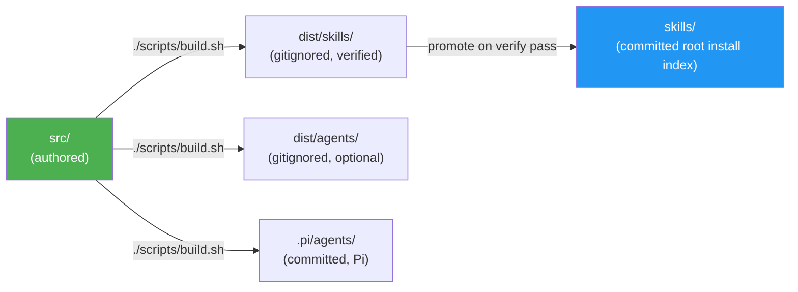
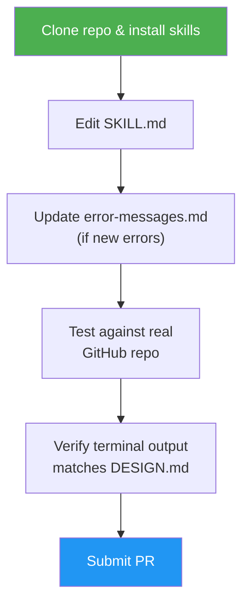
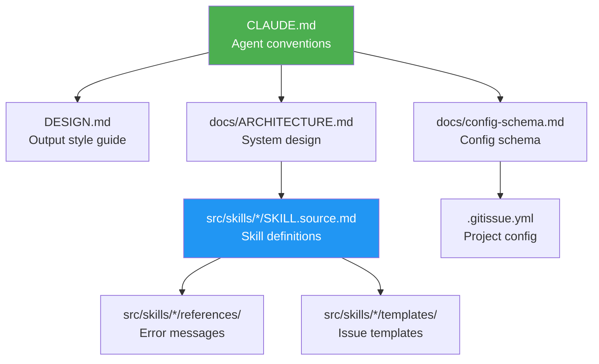

# Development Guide

## Prerequisites

- [GitHub CLI](https://cli.github.com) (`gh`) 2.0+ — authenticated via `gh auth login`
- [Claude Code](https://docs.anthropic.com/en/docs/claude-code) or any SKILL.md-compatible agent
- Git 2.30+

## Local Setup

1. Clone the repository:
   ```bash
   git clone https://github.com/luongnv89/idd.git
   cd idd
   ```

2. Install skills locally — `asm` is the install tool, manual copy is the fallback:
   ```bash
   # asm (recommended; works from the clone or straight from GitHub):
   asm install https://github.com/luongnv89/idd
   asm install https://github.com/luongnv89/idd --skill issue-resolver

   # Manual copy — single skill from this checkout:
   mkdir -p ~/.claude/skills
   cp -r skills/issue-resolver ~/.claude/skills/
   ```
   Each top-level `skills/<name>/` package is a self-contained SKILL.md tree with the shared agents bundled inside it (`references/agents/`), so it runs on any SKILL.md-compatible tool — for tools other than Claude Code, copy into that tool's skills directory (e.g. `~/.codex/skills/`). No build step is needed since `skills/` is committed. Optional Claude Code extra: `./scripts/build.sh && cp dist/agents/*.md ~/.claude/agents/` registers the shared subagents natively; other tools use the bundled copies. See [README → Install](../README.md#install).

   **Pi (pi-subagents):** `./scripts/build.sh` also regenerates committed `.pi/agents/*.md` from `src/shared/agents/` (role-only `display_name`, no persona labels). Enable `npm:@tintinweb/pi-subagents` in Pi settings, then either work from this repo (project agents) or copy to your global agent dir:
   ```bash
   cp .pi/agents/*.md ~/.pi/agent/agents/
   ```
   Restart the Pi session after updating agent files. Skills still recommend spawning reviewers with `description` + prompt only (no `subagent_type`); if you use `subagent_type: code-reviewer`, the UI shows `.pi/agents/` `display_name`.

3. Verify setup:
   ```bash
   gh auth status        # Must be authenticated
   gh --version          # Must be 2.0+
   ```

## Build Flow

`src/` is the single source of truth. Top-level `skills/` is the committed install surface; `dist/` is a gitignored staging area (`dist/skills/` is verified then promoted to `skills/`; `dist/agents/` holds the optional standalone Claude Code subagent definitions).



After editing anything under `src/`, rebuild before committing:

```bash
./scripts/build.sh
```

CI's drift check fails any PR where the committed `skills/` output does not match a transient build.

## Making Changes



### Editing a Skill

Skills live in `src/skills/<name>/SKILL.source.md` (internal-only skills under `src/internal-skills/<name>/`). Hand edits go in `src/` only — never edit `skills/` directly. When editing:

1. Read the existing SKILL.md fully before making changes
2. Follow the terminal output patterns in `DESIGN.md`
3. Use `--json` with explicit field selection for all `gh` commands
4. Update `references/error-messages.md` if adding new error cases
5. Run `./scripts/build.sh` to regenerate `skills/`
6. Test against a real GitHub repository

### Adding Error Messages

Each skill has `references/error-messages.md`. Follow the three-part format:

```
✗ Short error description

  To fix:  <actionable command>
  Docs:    <url to relevant documentation>
```

### Modifying Templates

Issue templates are in `src/skills/issue-creator/templates/`. Each template must:
- Include the `<!-- gitissue:normalized v1 -->` marker
- Use intent-only sections: Type, Context, Description, Acceptance Criteria, Metadata
- Preserve the Reporter Context blockquote
- **Never** include sections that imply codebase analysis (no Affected Files, no Technical Notes, no Architecture Constraints, no Implementation Hints) — `/issue-creator` is intent-only; consumer skills (resolver, triage, analysis) scan the codebase fresh at execution time

## Testing

Integration tests are in `tests/`. They verify skill behavior against GitHub repositories.

```bash
# See tests/README.md for setup and execution instructions
```

When testing manually:
1. Create a test repository (or use an existing one)
2. Run the skill you modified
3. Verify terminal output matches `DESIGN.md` patterns
4. Check that GitHub issues/PRs are created correctly

## Key Conventions

- **`gh` CLI** — every call must use `--json` with explicit field selection
- **Terminal symbols** — `✓ ✗ ● ◆ ⚡ ⚠ ○` per `DESIGN.md`
- **No cross-skill state** — skills are fully isolated
- **Config loaded once** — `.gitissue.yml` is read at skill start, not per-step
- **Backup before edit** — always post a backup comment before modifying an issue

## File Reference



| File | Purpose |
|------|---------|
| `CLAUDE.md` | Project conventions for AI agents |
| `DESIGN.md` | Terminal output style guide |
| `docs/config-schema.md` | Full `.gitissue.yml` schema (autopilot + review sections) — bundled into skills as a per-skill excerpt (issue #249) |
| `docs/run-log-schema.md` | `.gitissue/runs.jsonl` run-log schema (fields, append rules, single-writer) |
| `docs/idd-methodology.md` | IDD methodology overview + analysis-artifact dual-write rule — bundled into skills as a normative-sections digest (issue #249) |
| `docs/naming-conventions.md` | Branch / commit / PR / issue naming |
| `docs/sample-normalized-issue.md` | Example normalized issue (intent-only) |
| `docs/ARCHITECTURE.md` | System design, data flow, durable-memory model |
| `CHANGELOG.md` | Per-release notes |
| `src/internal-skills/idd-doctor/SKILL.source.md` | Read-only health check — run before submitting a PR |
