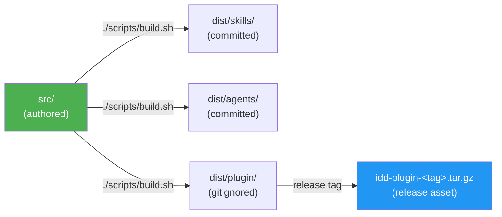
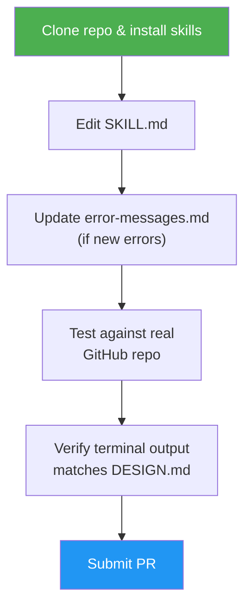
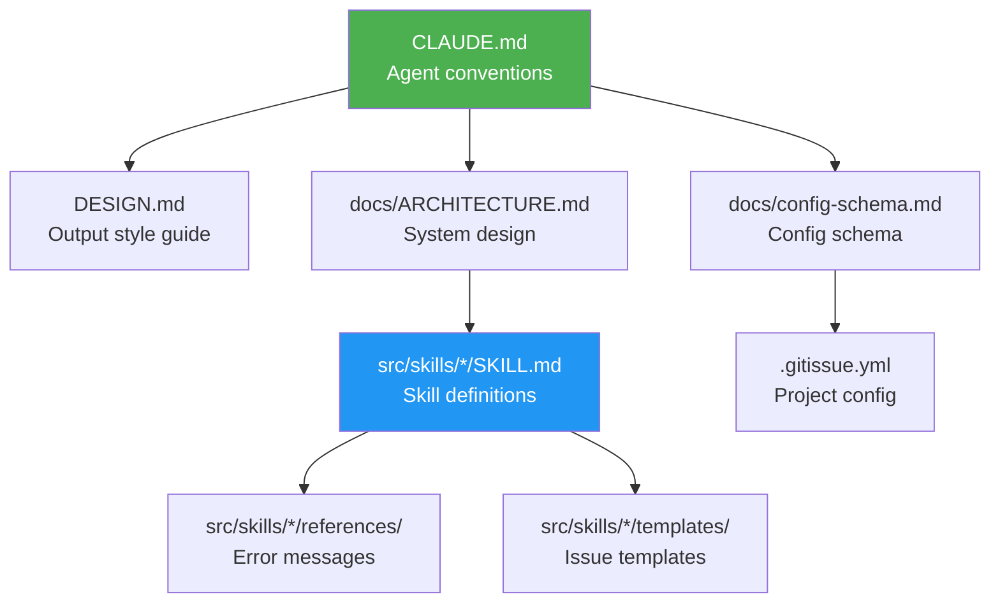

# Development Guide

## Prerequisites

- [GitHub CLI](https://cli.github.com) (`gh`) 2.0+ — authenticated via `gh auth login`
- [Claude Code](https://docs.anthropic.com/en/docs/claude-code) or any SKILL.md-compatible agent
- Git 2.30+

## Local Setup

1. Clone the repository:
   ```bash
   git clone https://github.com/luongnv89/idd.git
   cd idd
   ```

2. Install skills locally. Standalone is the recommended default — pick one of these:
   ```bash
   # Standalone (recommended) — bundled install script, all skills, idempotent:
   ./scripts/install.sh                       # interactive tool picker (TTY); Claude if non-interactive

   # Standalone — target another SKILL.md-compatible tool, or several at once (skips the picker):
   ./scripts/install.sh --tool codex          # Codex CLI
   ./scripts/install.sh --tools claude,pi     # multiple tools
   ./scripts/install.sh --tools all           # every supported tool
   # Supported: claude, agents, codex, opencode, pi, openclaw, hermes, antigravity, windsurf

   # Standalone — single skill from this checkout (manual variant):
   mkdir -p ~/.claude/skills ~/.claude/agents
   cp -r dist/skills/issue-resolver ~/.claude/skills/
   cp dist/agents/*.md ~/.claude/agents/

   # Standalone — via asm (no clone needed; targets Claude Code):
   asm install github:luongnv89/idd#main:dist/skills/issue-resolver

   # Plugin (Claude Code only) — build then install the plugin tree:
   ./scripts/build.sh && ./scripts/install.sh --plugin
   ```
   The Plugin path lands under `~/.claude/plugins/idd/`; the Standalone paths drop individual skills into each tool's skills directory (e.g. `~/.claude/skills/`, `~/.codex/skills/`, `~/.windsurf/rules/`). Each `dist/skills/<name>/` is a self-contained SKILL.md tree with the shared agents bundled inside it (`references/agents/`), so it runs on any tool. Shared agents are also installed standalone into `~/.claude/agents/` (and `~/.agents/agents/`) — a Claude Code optimization for native subagent spawning; other tools fall back to the bundled copies. See [README → Install](../README.md#install) for the full hierarchy.

3. Verify setup:
   ```bash
   gh auth status        # Must be authenticated
   gh --version          # Must be 2.0+
   ```

## Build Flow

`src/` is the single source of truth. `dist/` is generated and must not be hand-edited.



After editing anything under `src/`, rebuild before committing:

```bash
./scripts/build.sh
```

CI's drift check fails any PR where the committed `dist/skills/` or `dist/agents/` output does not match a fresh build.

## Making Changes



### Editing a Skill

Skills live in `src/skills/<name>/SKILL.md` (internal-only skills under `src/internal-skills/<name>/`, deprecated skills under `src/deprecated-skills/<name>/`). Hand edits go in `src/` only — never edit `dist/skills/` directly. When editing:

1. Read the existing SKILL.md fully before making changes
2. Follow the terminal output patterns in `DESIGN.md`
3. Use `--json` with explicit field selection for all `gh` commands
4. Update `references/error-messages.md` if adding new error cases
5. Run `./scripts/build.sh` to regenerate `dist/skills/`
6. Test against a real GitHub repository

### Adding Error Messages

Each skill has `references/error-messages.md`. Follow the three-part format:

```
✗ Short error description

  To fix:  <actionable command>
  Docs:    <url to relevant documentation>
```

### Modifying Templates

Issue templates are in `src/skills/issue-creator/templates/`. Each template must:
- Include the `<!-- gitissue:normalized v1 -->` marker
- Use intent-only sections: Type, Context, Description, Acceptance Criteria, Metadata
- Preserve the Reporter Context blockquote
- **Never** include sections that imply codebase analysis (no Affected Files, no Technical Notes, no Architecture Constraints, no Implementation Hints) — `/issue-creator` is intent-only; consumer skills (resolver, triage, analysis) scan the codebase fresh at execution time

## Testing

Integration tests are in `tests/`. They verify skill behavior against GitHub repositories.

```bash
# See tests/README.md for setup and execution instructions
```

When testing manually:
1. Create a test repository (or use an existing one)
2. Run the skill you modified
3. Verify terminal output matches `DESIGN.md` patterns
4. Check that GitHub issues/PRs are created correctly

## Key Conventions

- **`gh` CLI** — every call must use `--json` with explicit field selection
- **Terminal symbols** — `✓ ✗ ● ◆ ⚡ ⚠ ○` per `DESIGN.md`
- **No cross-skill state** — skills are fully isolated
- **Config loaded once** — `.gitissue.yml` is read at skill start, not per-step
- **Backup before edit** — always post a backup comment before modifying an issue

## File Reference



| File | Purpose |
|------|---------|
| `CLAUDE.md` | Project conventions for AI agents |
| `DESIGN.md` | Terminal output style guide |
| `docs/config-schema.md` | Full `.gitissue.yml` schema (autopilot + review sections) |
| `docs/idd-methodology.md` | IDD methodology overview + analysis-artifact dual-write rule |
| `docs/naming-conventions.md` | Branch / commit / PR / issue naming |
| `docs/sample-normalized-issue.md` | Example normalized issue (intent-only) |
| `docs/ARCHITECTURE.md` | System design, data flow, durable-memory model |
| `docs/CHANGELOG.md` | Per-release notes |
| `src/internal-skills/idd-doctor/SKILL.md` | Read-only health check — run before submitting a PR |
