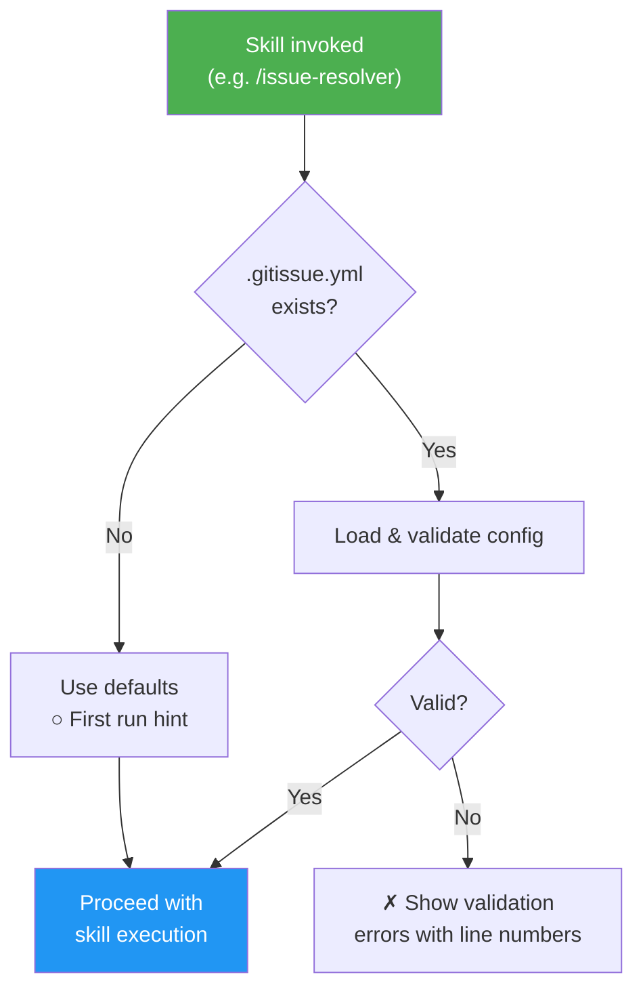
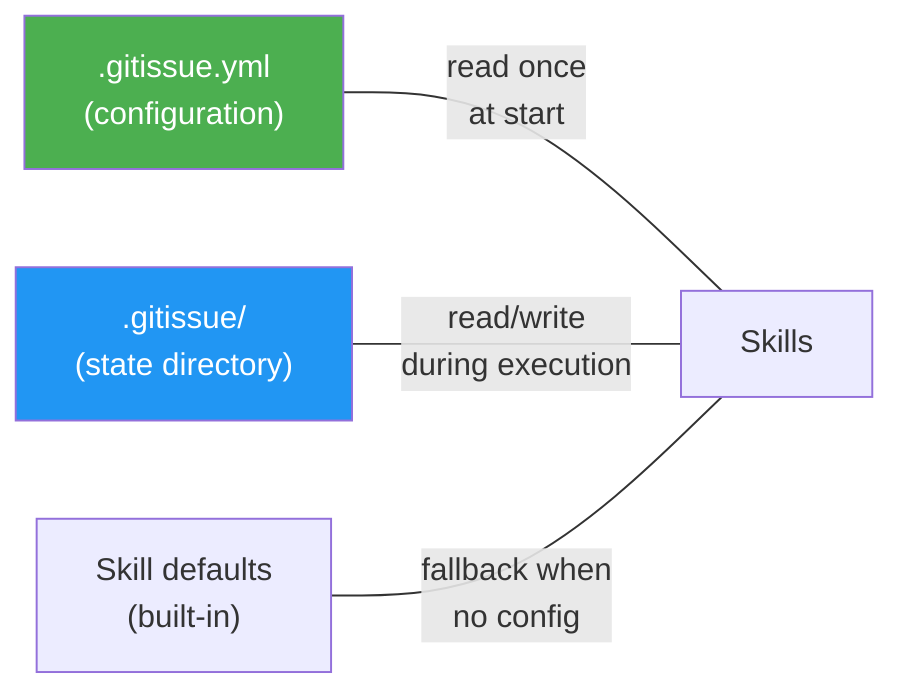
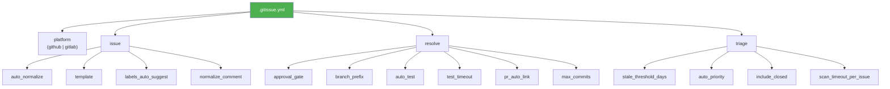

# `.gitissue.yml` Configuration Schema

gitissue works with zero configuration — all settings have sensible defaults. When no `.gitissue.yml` file exists, the first-run hint is shown:

```
○ First run — using default config. Run /init-gitissue to customize.
```

Place `.gitissue.yml` in the repository root to customize behavior.

### Config Loading Flow



### Config Hierarchy



## Full Schema

```yaml
# Platform for issue management
# Type: string
# Values: "github" | "gitlab"
# Default: "github"
platform: github

# Issue creation and normalization settings
issue:
  # Auto-normalize issues (structure-only, no codebase scan) in /issue-resolver before resolution
  # Type: boolean
  # Default: true
  auto_normalize: true

  # Issue template source
  # Type: string
  # Values: "default" | path to custom template directory
  # Default: "default"
  # When "default", uses built-in templates (bug.md, feature.md, improvement.md)
  # When a path, looks for bug.md, feature.md, improvement.md in that directory
  template: default

  # Auto-suggest labels based on issue content and type
  # Type: boolean
  # Default: true
  labels_auto_suggest: true

  # Post a comment when normalizing an issue
  # Type: boolean
  # Default: true
  normalize_comment: true

# Resolution pipeline settings
resolve:
  # Approval gate for the plan phase
  # Type: string
  # Values: "auto" | "comment-and-wait"
  # Default: "auto"
  # "auto": proceed immediately after planning
  # "comment-and-wait": show plan and wait for user approval
  approval_gate: auto

  # Branch naming prefix
  # Type: string
  # Default: "issue-"
  # Branch format: {prefix}{issue_number}/{short-description}
  # Example: issue-42/fix-auth-redirect
  branch_prefix: "issue-"

  # Run tests before creating PR
  # Type: boolean
  # Default: true
  auto_test: true

  # Abort verify phase after N seconds
  # Type: integer
  # Default: 300 (5 minutes)
  # Minimum: 30
  # Maximum: 3600
  test_timeout: 300

  # Include "Closes #N" in PR body for auto-close on merge
  # Type: boolean
  # Default: true
  pr_auto_link: true

  # Warn if resolve produces more than N commits
  # Type: integer
  # Default: 10
  # Minimum: 1
  max_commits: 10

# Triage settings
triage:
  # Flag issues with no activity beyond this threshold (days)
  # Type: integer
  # Default: 14
  # Minimum: 1
  stale_threshold_days: 14

  # Suggest priorities based on type, age, and dependency position
  # Type: boolean
  # Default: true
  auto_priority: true

  # Include recently closed issues in triage analysis
  # Type: boolean
  # Default: false
  include_closed: false

  # Max seconds to scan codebase per issue for file dependencies
  # Type: integer
  # Default: 30
  # Minimum: 5
  # Maximum: 300
  scan_timeout_per_issue: 30
```

### Config Section Map



## `.gitissue/` Directory

The `.gitissue/` directory at the repo root stores persistent state generated by gitissue skills. It sits alongside `.gitissue.yml` (configuration) and is created automatically on first use.

| File | Written by | Description |
|------|-----------|-------------|
| `.gitissue/triage.json` | `/issue-triage` | Cached triage analysis (JSON schema v1) — issue priorities, dependencies, execution order, and history |

**Conventions:**
- Skills create `.gitissue/` via `mkdir -p` if it doesn't exist
- JSON files are formatted for readable git diffs
- A full re-triage overwrites `triage.json` entirely (not append)
- The directory should be committed to the repo (it contains project state, not secrets)

## Validation

Config is validated on load at the start of every skill invocation. Errors include line numbers:

```
✗ Invalid config: .gitissue.yml

  Line 8: issue.template must be "default" or a valid directory path
  Line 15: resolve.test_timeout must be between 30 and 3600

  To fix:  edit .gitissue.yml and correct the values above
  Docs:    https://github.com/luongnv89/idd/blob/main/docs/config-schema.md
```

## Defaults Table

| Setting | Default | Description |
|---------|---------|-------------|
| `platform` | `github` | Platform for issue management |
| `issue.auto_normalize` | `true` | Auto-normalize in /issue-resolver |
| `issue.template` | `default` | Built-in templates |
| `issue.labels_auto_suggest` | `true` | Suggest labels from content |
| `issue.normalize_comment` | `true` | Comment on normalization |
| `resolve.approval_gate` | `auto` | No approval wait |
| `resolve.branch_prefix` | `issue-` | Branch naming prefix |
| `resolve.auto_test` | `true` | Run tests before PR |
| `resolve.test_timeout` | `300` | 5 minute test timeout |
| `resolve.pr_auto_link` | `true` | Auto-close issue on merge |
| `resolve.max_commits` | `10` | Max commits warning |
| `triage.stale_threshold_days` | `14` | Stale issue threshold |
| `triage.auto_priority` | `true` | Auto-suggest priorities |
| `triage.include_closed` | `false` | Exclude closed from triage |
| `triage.scan_timeout_per_issue` | `30` | Max seconds per issue scan |
