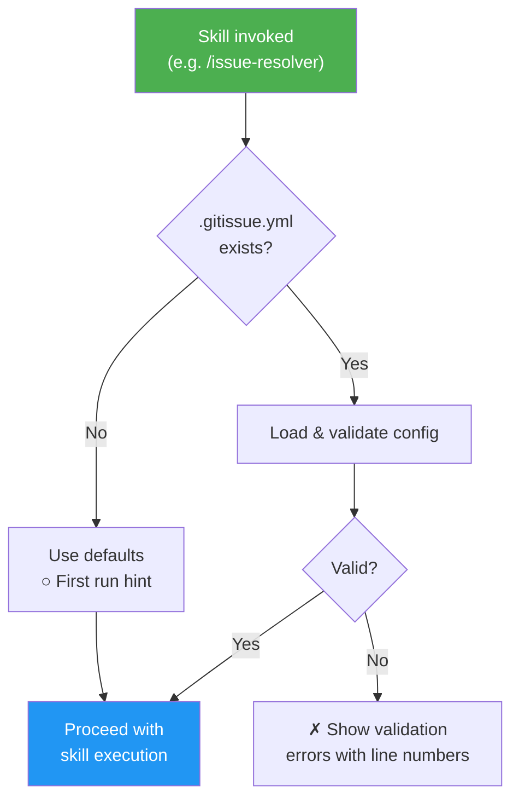
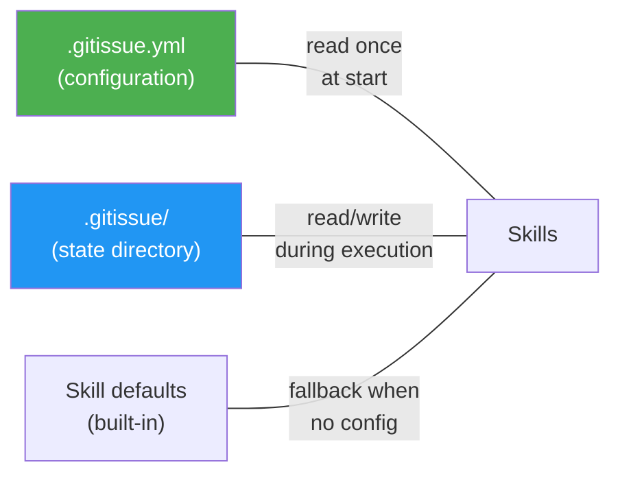

# `.gitissue.yml` Configuration Schema

gitissue works with zero configuration — all settings have sensible defaults. When no `.gitissue.yml` file exists, the first-run hint is shown:

```
○ First run — using default config. Run /init-gitissue to customize.
```

Place `.gitissue.yml` in the repository root to customize behavior.

### Config Loading Flow



### Config Hierarchy



## Full Schema

```yaml
# Platform for issue management
# Type: string
# Values: "github" | "gitlab"
# Default: "github"
platform: github

# Issue creation and normalization settings
issue:
  # Auto-normalize issues (structure-only, no codebase scan) in /issue-resolver before resolution
  # Type: boolean
  # Default: true
  auto_normalize: true

  # Issue template source
  # Type: string
  # Values: "default" | path to custom template directory
  # Default: "default"
  # When "default", uses built-in templates (bug.md, feature.md, improvement.md)
  # When a path, looks for bug.md, feature.md, improvement.md in that directory
  template: default

  # Auto-suggest labels based on issue content and type
  # Type: boolean
  # Default: true
  labels_auto_suggest: true

  # Post a comment when normalizing an issue
  # Type: boolean
  # Default: true
  normalize_comment: true

# Resolution pipeline settings
resolve:
  # Approval gate for the plan phase
  # Type: string
  # Values: "auto" | "comment-and-wait"
  # Default: "auto"
  # "auto": proceed immediately after planning
  # "comment-and-wait": show plan and wait for user approval
  approval_gate: auto

  # Branch naming prefix
  # Type: string
  # Default: "auto"
  # "auto" uses type-based prefixes: fix/, feat/, refactor/, docs/, test/, chore/
  # Branch format: {type}/{issue_number}-{short-description}
  # Examples: fix/42-mobile-auth-redirect, feat/15-add-dark-mode
  # Set a custom string (e.g., "issue-") to override type-based naming
  branch_prefix: "auto"

  # Run tests before creating PR
  # Type: boolean
  # Default: true
  auto_test: true

  # Abort verify phase after N seconds
  # Type: integer
  # Default: 300 (5 minutes)
  # Minimum: 30
  # Maximum: 3600
  test_timeout: 300

  # Include "Closes #N" in PR body for auto-close on merge
  # Type: boolean
  # Default: true
  pr_auto_link: true

  # Warn if resolve produces more than N commits
  # Type: integer
  # Default: 10
  # Minimum: 1
  max_commits: 10

  # Max QA review-fix cycles during resolve Step 4
  # Type: integer
  # Default: 5
  # Minimum: 1
  # Maximum: 10
  qa_max_cycles: 5

# PR review settings (used by /issue-pr-review and /auto-pilot)
review:
  # Max review-fix cycles before stopping
  # Type: integer
  # Default: 5
  # Minimum: 1
  # Maximum: 10
  max_cycles: 5

  # Auto-merge PR when clean (overridden to true in --auto mode)
  # Type: boolean
  # Default: false
  auto_merge: false

  # Only report issues at or above this confidence level (0-100)
  # Type: integer
  # Default: 80
  # Minimum: 50
  # Maximum: 100
  confidence_threshold: 80

  # Run tests as part of the review pipeline
  # Type: boolean
  # Default: true
  run_tests: true

  # Check CI status as part of the review pipeline
  # Type: boolean
  # Default: true
  check_ci: true

  # Seconds between CI status polls
  # Type: integer
  # Default: 30
  # Minimum: 10
  # Maximum: 120
  ci_poll_interval: 30

  # Abort CI polling after N seconds
  # Type: integer
  # Default: 600 (10 minutes)
  # Minimum: 60
  # Maximum: 3600
  ci_timeout: 600

  # Abort test suite after N seconds
  # Type: integer
  # Default: 300 (5 minutes)
  # Minimum: 30
  # Maximum: 3600
  test_timeout: 300

# Auto-pilot settings (used by /auto-pilot)
autopilot:
  # Max iterations (issues to process) before stopping
  # Type: integer
  # Default: 10
  # Minimum: 1
  # Maximum: 50
  max_iterations: 10

  # Max review-fix cycles per PR (overrides review.max_cycles in subagent prompt)
  # Type: integer
  # Default: 5
  # Minimum: 1
  # Maximum: 10
  review_cycles: 5

  # Auto-merge PRs after review passes
  # Type: boolean
  # Default: true
  auto_merge: true

  # Pause loop on failure instead of skipping to next issue
  # Type: boolean
  # Default: true
  pause_on_failure: true

  # Labels that cause an issue to be skipped
  # Type: array of strings
  # Default: ["wontfix", "duplicate", "invalid"]
  skip_labels:
    - wontfix
    - duplicate
    - invalid

# Triage settings
triage:
  # Flag issues with no activity beyond this threshold (days)
  # Type: integer
  # Default: 14
  # Minimum: 1
  stale_threshold_days: 14

  # Suggest priorities based on type, age, and dependency position
  # Type: boolean
  # Default: true
  auto_priority: true

  # Include recently closed issues in triage analysis
  # Type: boolean
  # Default: false
  include_closed: false

  # Max seconds to scan codebase per issue for file dependencies
  # Type: integer
  # Default: 30
  # Minimum: 5
  # Maximum: 300
  scan_timeout_per_issue: 30

# Issue analysis settings
analysis:
  # Max files to read during deep analysis (more thorough than resolver's 20)
  # Type: integer
  # Default: 30
  # Minimum: 5
  # Maximum: 100
  max_files: 30

  # How many levels of import dependencies to trace
  # Type: integer
  # Default: 3
  # Minimum: 1
  # Maximum: 5
  trace_depth: 3

  # Max seconds for the full codebase scan phase
  # Type: integer
  # Default: 120
  # Minimum: 30
  # Maximum: 600
  scan_timeout: 120

# GitHub Projects board sync settings
# See docs/github-projects-sync.md for the full integration reference
projects:
  # Enable automatic project board status sync
  # Type: boolean
  # Default: false
  # When false, all project sync operations are silently skipped
  sync_enabled: false

  # Explicit project number (from the project URL)
  # Type: integer or null
  # Default: null (auto-detect first linked project)
  # Set this if the repo has multiple linked projects
  project_number: null

  # Name of the Status field on the project board
  # Type: string
  # Default: "Status"
  # Must match the exact field name on the project (case-sensitive)
  status_field: "Status"

  # Map of internal status keys to project board option values
  # Type: object
  # Each value must match an option name in the Status field
  status_map:
    # Status for newly created issues
    # Type: string
    # Default: "Todo"
    todo: "Todo"

    # Status when work starts (branch created)
    # Type: string
    # Default: "In Progress"
    in_progress: "In Progress"

    # Status when PR is created
    # Type: string
    # Default: "Done"
    done: "Done"
```

### Config Section Map

```mermaid
graph TD
    R[".gitissue.yml"] --> P["platform<br/>(github | gitlab)"]
    R --> I["issue"]
    R --> RS["resolve"]
    R --> RV["review"]
    R --> AP["autopilot"]
    R --> T["triage"]
    R --> A["analysis"]
    R --> PR["projects"]

    I --> I1["auto_normalize"]
    I --> I2["template"]
    I --> I3["labels_auto_suggest"]
    I --> I4["normalize_comment"]

    RS --> R1["approval_gate"]
    RS --> R2["branch_prefix"]
    RS --> R3["auto_test"]
    RS --> R4["test_timeout"]
    RS --> R5["pr_auto_link"]
    RS --> R6["max_commits"]
    RS --> R7["qa_max_cycles"]

    RV --> RV1["max_cycles"]
    RV --> RV2["auto_merge"]
    RV --> RV3["confidence_threshold"]
    RV --> RV4["run_tests"]
    RV --> RV5["check_ci"]
    RV --> RV6["ci_poll_interval"]
    RV --> RV7["ci_timeout"]
    RV --> RV8["test_timeout"]

    AP --> AP1["max_iterations"]
    AP --> AP2["review_cycles"]
    AP --> AP3["auto_merge"]
    AP --> AP4["pause_on_failure"]
    AP --> AP5["skip_labels"]

    T --> T1["stale_threshold_days"]
    T --> T2["auto_priority"]
    T --> T3["include_closed"]
    T --> T4["scan_timeout_per_issue"]

    A --> A1["max_files"]
    A --> A2["trace_depth"]
    A --> A3["scan_timeout"]

    PR --> PR1["sync_enabled"]
    PR --> PR2["project_number"]
    PR --> PR3["status_field"]
    PR --> PR4["status_map"]

    style R fill:#4CAF50,color:#fff
```



## `.gitissue/` Directory

The `.gitissue/` directory at the repo root stores persistent state generated by gitissue skills. It sits alongside `.gitissue.yml` (configuration) and is created automatically on first use.

| File | Written by | Description |
|------|-----------|-------------|
| `.gitissue/triage.json` | `/issue-triage` | Cached triage analysis (JSON schema v1) — issue priorities, dependencies, execution order, and history |
| `.gitissue/analysis-<N>.json` | `/issue-analysis` | Deep analysis of issue #N — affected files, root cause, implementation options, complexity, and risk |

**Conventions:**
- Skills create `.gitissue/` via `mkdir -p` if it doesn't exist
- JSON files are formatted for readable git diffs
- A full re-triage overwrites `triage.json` entirely (not append)
- The directory should be committed to the repo (it contains project state, not secrets)

## Validation

Config is validated on load at the start of every skill invocation. Errors include line numbers:

```
✗ Invalid config: .gitissue.yml

  Line 8: issue.template must be "default" or a valid directory path
  Line 15: resolve.test_timeout must be between 30 and 3600

  To fix:  edit .gitissue.yml and correct the values above
  Docs:    https://github.com/luongnv89/idd/blob/main/docs/config-schema.md
```

## Defaults Table

| Setting | Default | Description |
|---------|---------|-------------|
| `platform` | `github` | Platform for issue management |
| `issue.auto_normalize` | `true` | Auto-normalize in /issue-resolver |
| `issue.template` | `default` | Built-in templates |
| `issue.labels_auto_suggest` | `true` | Suggest labels from content |
| `issue.normalize_comment` | `true` | Comment on normalization |
| `resolve.approval_gate` | `auto` | No approval wait |
| `resolve.branch_prefix` | `auto` | Type-based branch prefix (fix/, feat/, etc.) |
| `resolve.auto_test` | `true` | Run tests before PR |
| `resolve.test_timeout` | `300` | 5 minute test timeout |
| `resolve.pr_auto_link` | `true` | Auto-close issue on merge |
| `resolve.max_commits` | `10` | Max commits warning |
| `triage.stale_threshold_days` | `14` | Stale issue threshold |
| `triage.auto_priority` | `true` | Auto-suggest priorities |
| `triage.include_closed` | `false` | Exclude closed from triage |
| `triage.scan_timeout_per_issue` | `30` | Max seconds per issue scan |
| `analysis.max_files` | `30` | Max files to read during analysis |
| `analysis.trace_depth` | `3` | Import trace depth levels |
| `analysis.scan_timeout` | `120` | Max seconds for codebase scan |
| `projects.sync_enabled` | `false` | Enable project board sync |
| `projects.project_number` | `null` | Explicit project number (null = auto-detect) |
| `projects.status_field` | `"Status"` | Name of the Status field on the board |
| `projects.status_map.todo` | `"Todo"` | Status for new issues |
| `projects.status_map.in_progress` | `"In Progress"` | Status when work starts |
| `projects.status_map.done` | `"Done"` | Status when PR is created |
