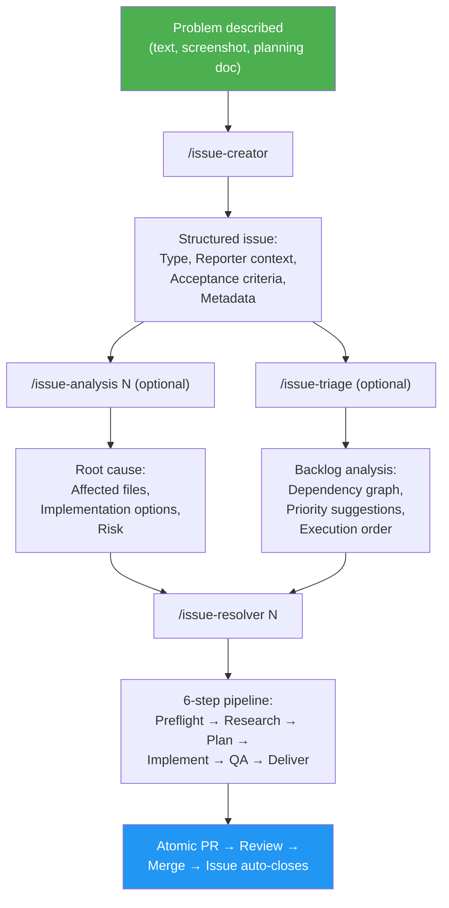
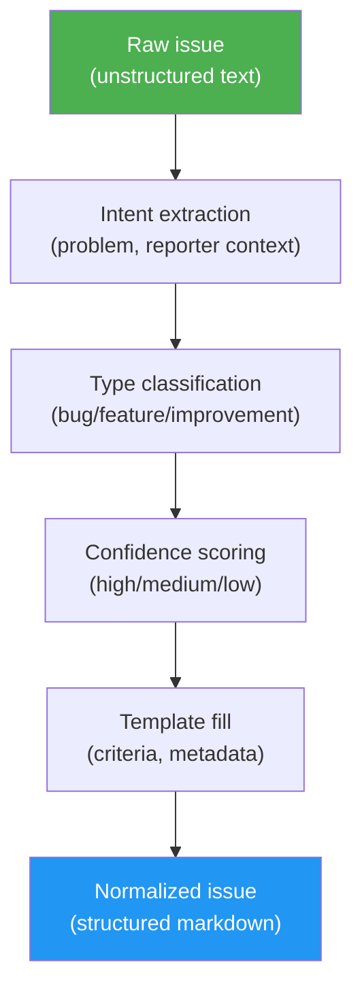

# Issue-Driven Development (IDD)

*Capture intention, resolve against current code, remember in git.*

> **Normative contract:** this document explains the *why* of IDD. The precise, tool-neutral *what* — issue format, dependency markers, naming grammar, Decision Record fields, traceability requirements, and L1–L3 conformance levels — is versioned separately in [`SPEC.md`](https://github.com/luongnv89/idd/blob/main/SPEC.md) at the repository root. Where prose here and the spec disagree, the spec wins.

## What is IDD?

Issue-Driven Development (IDD) is a software development methodology for turning an issue tracker and git history into **executable project memory**. Every code change — bug fix, feature, or improvement — starts with captured intention, is analyzed against the current codebase, and ends as an atomic PR linked back to the issue that motivated it.

The key insight: the gap between "someone describes a problem" and "someone resolves it" is both a **translation gap** and an **intention gap**. Vague reports become structured work orders through an elicitation process that helps creators discover and articulate what they actually want. Any resolver — human or AI agent — then starts from the same durable context: problem statement, reporter context, acceptance criteria, and known constraints.

IDD separates stable human intent from time-sensitive code understanding:

- **Issues** capture *what should change*
- **Analysis** discovers *where and why* in the current codebase
- **PRs** prove *how it changed*
- **Git history** preserves *why it mattered*

This makes IDD purpose-built for **brownfield projects** — everyday software work where contributors modify existing codebases and need to understand what changed, why it changed, and which previous decisions matter.

## The Thesis

IDD is not an issue template. It is a workflow for preserving project memory in artifacts the project already owns.

In many repositories, issues, commits, and PRs exist but do not form a reliable knowledge system. Issues are vague, commits are terse, PRs omit context, and future contributors reconstruct intent from scattered clues. AI agents have the same problem at higher speed: without durable context, they guess.

IDD makes the trace explicit:

```text
Intention → Current-code analysis → Implementation → Review → Historical memory
```

That trace is the product. It gives maintainers a way to accept outside reports, let humans or agents investigate them, and still keep control of the final change.

## Why IDD?

### The Problem

Most tracker issues are unstructured. A typical bug report says:

> "the login is broken on mobile"

A resolver — human or AI — receiving this issue must:

1. Figure out which files are involved
2. Understand the current behavior
3. Determine what "fixed" means
4. Find related issues and constraints
5. Only then start coding

This context-gathering phase often takes longer than the fix itself. For AI agents it is worse: they have no institutional memory and must rediscover the codebase from scratch each time.

### The Solution

IDD standardizes the path from intention to implementation as five phases. Each phase answers one question, and each is independently useful:

| Phase | Question it answers | gitissue reference implementation |
|-------|--------------------|-----------------------------------|
| **Capture** | What does the reporter actually want? | `/issue-creator` |
| **Normalize** | Does an existing issue state that intent clearly? | `/issue-creator N` |
| **Triage** | What should be worked on, in what order? | `/issue-triage` |
| **Analyze** | Where in the *current* code does this land, and how risky is it? | `/issue-analysis N` |
| **Resolve** | What change satisfies the acceptance criteria, and where is the proof? | `/issue-resolver N`, `/issue-pr-review` |

The issue defines the acceptance boundary. Analysis finds the current-code reality. The PR delivers the change. Git tracks the memory trail between them.

The phases are the methodology; the commands are one implementation of it. A team can run every phase by hand — write issues against the [spec's issue contract](https://github.com/luongnv89/idd/blob/main/SPEC.md), follow the naming grammar, dual-write Decision Records — and be fully IDD-conformant with no tooling installed.

## The IDD Workflow

In the gitissue reference implementation, the phases map onto commands like this:



## Core Concepts

### Capturing Intention

Expressing what you actually want is one of the hardest problems in software development. Even experienced developers struggle to articulate a bug or feature request clearly enough for someone else — human or AI — to act on it correctly. The result: wrong assumptions, wasted effort, and solutions that miss the point. Most bugs, missed features, and scope creep trace back to requirements that were never clearly stated.

IDD makes intention capture an explicit, iterative dialogue rather than a form to fill in:

1. **Describe the problem** — loosely, incompletely, however it comes to mind
2. **Disambiguate first** — when a core field is genuinely ambiguous (the type is unclear, the requirements are unstated), the interviewer asks one or two targeted questions before drafting, each with a recommended default, and resolves anything the repository can answer by inspecting it rather than asking. When the input is already clear, it skips straight to the draft — no needless questions
3. **Propose a structured issue** — classifying the type, preserving reporter context verbatim, generating acceptance criteria
4. **Read back what was captured** — and realize what you actually meant, what's missing, what's imprecise
5. **Refine through conversation** — correct, add detail, sharpen the intent until the issue says exactly what you want

This loop does something no template or form can do: it helps you **discover your own intention**. The interviewer — in gitissue, the `/issue-creator` agent — acts as both a mirror and a structured elicitor: reflecting your input back in a standardized format, and asking a precise question exactly when ambiguity would otherwise be guessed at. The questioning is targeted, not an interrogation: it engages only on fields that are genuinely unclear, and adds no friction when intent is already plain.

By the time the issue is finalized, it represents what the creator wants in a format that both humans and AI agents can inspect, question, and execute against. The structured issue becomes the **source of truth for intended behavior** — every downstream phase starts from it.

### Issue Normalization

Normalization restructures an existing unstructured issue into the standard contract. It is intentionally about **intent**, not code prediction.



A normalized issue contains:

- **Type classification** — bug, feature, or improvement (with confidence level)
- **Description** — synthesized from the original text with current/expected behavior
- **Acceptance criteria** — testable conditions for "done" (with confidence level)
- **Reporter Context** — original text preserved verbatim
- **Metadata** — suggested priority, effort, labels

Issues intentionally do **not** include predicted affected files, generated technical notes, or guessed architecture constraints. They may include file paths or constraints explicitly supplied by the reporter, but generated codebase analysis lives in the Analyze, Triage, and Resolve phases, because those scan the current code when they run.

The normalization marker `<!-- gitissue:normalized v1 -->` is invisible in the tracker's rendered view but detectable by tools.

### Confidence Scoring

Inferred fields — type classification, acceptance criteria, and tool-suggested Metadata values (priority, effort, labels) — carry confidence indicators:

| Level | Meaning | Display |
|-------|---------|---------|
| **high** | Explicit keywords — crash/error/500 → bug, "add new" → feature | `(high confidence)` |
| **medium** | Inferred from description context or tone | `(medium confidence)` |
| **low** | Ambiguous description, defaulted | `(needs review)` |

Low-confidence fields are marked `(needs review)` so reviewers know to verify. An unmarked field is asserted by its human author; a tool that infers a value must mark it.

### Agent-Agnostic Design

IDD issues are plain tracker markdown. Any tool that can read an issue can consume the structured format:

- **Claude Code** — reads the issue, follows the resolve pipeline
- **Codex CLI / Gemini CLI** — same structured issue, no gitissue-specific dependencies
- **Human developers** — readable sections, clear acceptance criteria
- **Future agents** — anything that can read markdown and follow a documented issue contract

No proprietary issue format, no parallel database. The workflow skills are optional automation around a human-readable issue body, and the [spec's conformance levels](https://github.com/luongnv89/idd/blob/main/SPEC.md) make the boundary explicit: **L1** (structured issues) is adoptable by a human-only team with zero tooling, **L2** adds the traceability chain, **L3** adds durable Decision Records.

### Low-Config Start

The reference implementation works without any configuration file — all settings have sensible defaults. When no `.gitissue.yml` exists:

```
○ First run — using default config. Run /init-gitissue to customize.
```

`/init-gitissue` auto-detects the project's language, framework, and test runner, and generates a tailored config.

## Intent-Code Boundary

The most important design rule in IDD is the **intent-code boundary**: do not freeze guessed code context into the issue. Code changes. Intent should remain stable.

IDD separates durable intent from time-sensitive codebase analysis:

| Artifact | Owns | Does not own |
|----------|------|--------------|
| **Issue** | Problem, reporter context, acceptance criteria, priority, labels | Predicted affected files or root cause |
| **Analysis** | Affected files, root cause, implementation options, complexity, risk | Final code changes |
| **PR** | Implementation, tests, review discussion, closing link | Rewriting the original intent |
| **Git history** | The durable story of what changed and why | Unstructured "WIP" progress logs |

This boundary keeps issues stable while allowing analysis to stay fresh. A file prediction made when an issue is created can become stale after one merge. A codebase scan run during analysis or resolution reflects the current repository.

## Analysis Artifacts and Durable Memory

`/issue-analysis` writes its findings to `.gitissue/analysis-<N>.json` so the resolver can reuse them and reviewers can inspect the current-code reality the analysis ran against. That JSON is **local cache**: it is not required to be committed, it is safe to delete, and a fresh `/issue-analysis N` regenerates it. Local cache is useful for the live workflow but cannot be the home of project memory — once the PR merges and the cache is cleared, the reasoning would disappear with it.

Durable project memory therefore lives in artifacts that already survive: the **issue body** (intent), the **PR body** (analysis lift, decision record, acceptance verification), and a **git-history artifact** on the default branch that carries the same content. The **dual-write rule** says: any analysis signal worth preserving must appear in both the PR body and git history.

Concretely, `/issue-resolver` lifts a five-field **Decision Record** — root cause, options considered, options rejected, selected option, residual risk — out of the analysis JSON and into the PR body, alongside an acceptance-criteria verification table. For **bug** issues, the Decision Record carries a sixth field — the **reproduction** evidence (the command confirmed red for the stated reason before the fix, and the regression test that proves the red → green transition) — produced by the bug-verification checkpoint that `/issue-resolver` runs before applying a fix, and likewise dual-written. `/issue-pr-review` checks for the presence of those fields as part of its traceability dimension. Deleting `.gitissue/analysis-<N>.json` after the PR merges does not destroy the reasoning — it is already in `git log -p`.

The git-history half of the dual write is satisfied by one of three bindings ([SPEC.md §4.3](https://github.com/luongnv89/idd/blob/main/SPEC.md)): the **squash-merge body** (the platform copies the PR body verbatim into the squash commit), a **merge-commit body** (the record is appended to the merge commit message), or **git notes** (the record is attached to the landing commit under a documented notes ref). The reference implementation assumes **squash-merge as the default binding** — it is the only one that needs zero extra tooling on GitHub. Repos using a different merge strategy without declaring another binding keep durable memory only in the PR body (and therefore only on the tracker). `/init-gitissue` should warn when the repo's default merge strategy silently defeats the assumed binding.

## Issue Dependencies

When one issue cannot be merged until another is merged, the relationship is recorded in the issue body using one of two synonymous markers, anywhere in the body (typically under `## Metadata` or in a dedicated `## Dependencies` section):

- `Depends on #N` — explicit dependency on issue N (or its PR) being merged first
- `Blocked by #N` — same meaning, alternative phrasing

Multiple dependencies on one line are allowed: `Depends on #12, #15`. Cross-repo references (`org/repo#N`) are out of scope and ignored. The marker is case-insensitive and may appear in any list/sentence shape (`- Depends on #12`, `Depends on: #12`, `This depends on #12`).

Skills that read the marker:

- `/auto-pilot` — Phase 5 merge gate. Before merging PR-A for issue A, fetch issue A's body and parse `Depends on #N`. If any referenced issue is open, or has an open PR (unmerged), the auto-pilot pauses with a structured alert and leaves PR-A open. The user merges the dependency, then re-runs `/auto-pilot` to resume.
- `/issue-triage` — may use the marker as an additional dependency-graph signal alongside file-overlap detection (existing behavior unchanged; this is opt-in for future enhancement).

The convention is intentionally lightweight: it lives in plain prose in the issue body, requires no schema, and is grep-friendly for any tool — not just IDD skills.

## Hierarchy of Intent

IDD's unit of work is the issue, but larger efforts need one level above it: where does the design intent of a 15-issue effort live? The answer stays inside the tracker — an **epic is an ordinary issue** that parents other issues. No new artifact type, no separate roadmap database.

- **The parent (epic)** is a normal, normalized issue whose acceptance criteria describe the outcome of the whole effort. It lists its children as a markdown checklist (`- [ ] #12 — <title>`), so trackers with task-list references or native sub-issues track completion automatically. It closes only when all children close.
- **Each child** carries `Part of #N` in its body — the hierarchy marker defined in [SPEC.md §2.1](https://github.com/luongnv89/idd/blob/main/SPEC.md). Same grammar as `Depends on #N`: plain prose, case-insensitive, grep-friendly.
- **Scope is not order.** `Part of #N` says a child contributes to the parent's outcome; it never gates merging. When child B needs child A merged first, B additionally says `Depends on #A` — the two markers answer different questions.

**Decomposing a design document.** A PRD or design doc decomposes top-down: one epic per feature area, then independently resolvable children — each with its own acceptance criteria small enough for a single atomic PR. In gitissue, `/issue-creator`'s **batch mode** is the hook: feed it a PRD section or planning list and it creates the children in one pass; add the `Part of #N` markers and the parent checklist to bind them. The intent–code boundary applies at every level: the epic captures the *why* of the effort, the children capture the *what* of each slice, and no level predicts affected files.

Skills treat the marker conservatively today: `/issue-triage` may group children under their epic as a display signal, and `/auto-pilot`'s merge gate remains driven by `Depends on #N` alone.

## Minimal Example

Raw report:

> the login is broken on mobile. it keeps spinning and says too many redirects. works fine on desktop.

Normalized issue:

```markdown
## Type
Bug

## Description
**Current behavior:**
Mobile users entering the login flow hit a redirect loop.

**Expected behavior:**
Mobile login completes and lands on the dashboard.

> **Reporter Context**
> the login is broken on mobile. it keeps spinning and says too many redirects. works fine on desktop.

## Acceptance Criteria
- [ ] Mobile login completes without a redirect loop
- [ ] Desktop login continues to work
- [ ] A regression test covers the mobile redirect path
```

Resolution trace:

```text
Issue #42 → /issue-analysis 42 → branch fix/42-mobile-login-loop
→ commit fix(auth): resolve mobile login redirect loop (#42)
→ PR fix(auth): resolve mobile login redirect loop (#42) with Closes #42
```

The issue captures what must be true. Analysis discovers where and why. The PR proves the change and closes the loop.

## Executable Project Memory

IDD's deepest payoff is not speed — it's **history**. Every software project accumulates a git history. The question is whether that history is useful or just noise.

In IDD, history is treated as executable project memory: structured enough for agents to reason over, plain enough for humans to audit. The goal is not to automate away maintainers. The goal is to make the repository's own artifacts carry enough intent, analysis, and proof that future work starts from knowledge instead of rediscovery.

### Issues as decision records

A well-defined issue is more than a task description — it's a **decision record**. It captures:

- **What was wrong or missing** — the problem as the reporter experienced it
- **What "done" looks like** — acceptance criteria that define the boundary of the work
- **Where the reasoning lives** — the analysis and the PR preserve implementation options, tradeoffs, and the chosen approach

Six months later, when someone asks "why does this code check for expired sessions before redirecting?", the answer isn't buried in someone's memory or a chat thread — it's in the issue, analysis, PR, and commit trail linked from the line of code.

### Commit messages as a narrative

A commit message is the smallest unit of project storytelling. When commits follow Conventional Commits format and reference their issue number, the git log becomes a **navigable narrative**:

```
fix(auth): resolve mobile redirect loop (#42)
feat(settings): add dark mode toggle (#15)
refactor(db): extract connection pool logic (#8)
test(auth): add login flow unit tests (#31)
```

Each line answers three questions: *what kind of change* (type), *where it happened* (scope), and *what problem it solved* (issue reference). Compare this to a typical unstructured history:

```
fix stuff
update
WIP
done
```

The first history is a knowledge base. The second is a liability.

### The traceability chain

IDD creates an unbroken chain from problem to solution:

```
Issue #42 (problem) → Branch fix/42-mobile-auth-redirect → Commits fix(auth): ... (#42) → PR fix(auth): ... (#42) with Closes #42 → Merge → Issue auto-closes
```

Every artifact links to every other artifact. `git blame` on any line leads to the commit, which leads to the PR, which leads to the issue. This traceability is what makes the history *valuable* — not just a record of what changed, but a record of why.

### Reading the memory back

The memory story is only half-done at write time — the payoff is retrieval, and it needs no agent. Every recipe below is plain git (plus `gh` where noted):

```bash
# Every commit that touched issue #42
git log --oneline --grep "(#42)"

# The full story of #42's resolution — squash commit body carries the
# PR body: Summary, Decision Record, acceptance verification
git log -p --grep "Closes #42" --format=fuller

# All Decision Records ever merged (why does this code exist?)
git log --format="%h %s" --grep "## Decision Record"

# From a line of code to the original problem report:
git blame -L 120,140 src/auth.py        # → commit hash
git show <hash>                          # → 'Closes #42' in the body → the issue
gh issue view 42 --json title,body       # → the intent that started it

# Draft release notes from the conventional-commit narrative
git log --format="%s" v1.2.0..HEAD | grep -E "^(feat|fix)"
```

`scripts/idd-lint.py stats` aggregates the same signals into an evidence report — trace completeness, Decision-Record coverage, and resolution outcomes by issue quality.

### Why this matters for AI agents

AI agents scanning git history for context depend entirely on the quality of that history. A structured commit message like `fix(auth): resolve mobile redirect loop (#42)` is instantly useful — the agent knows the type, scope, and related issue. A message like `fix bug` is invisible to meaningful analysis.

The same applies to issues. When an agent triages the backlog or analyzes dependencies, structured issues with acceptance criteria provide actionable data. Unstructured issues force the agent to guess — and guessing produces wrong results.

### The compounding effect

Good issues and commits compound over time. Each well-structured artifact makes the next one easier:

- Triage produces better dependency graphs because issues have clear scope
- Analysis finds more relevant prior art because commits reference issues
- Resolution writes better code because the issue defines precise acceptance criteria
- New team members onboard faster because the history teaches the project's evolution
- Changelogs generate automatically from conventional commit messages

Bad history also compounds — but in the wrong direction. Vague issues spawn vague commits, which make future analysis unreliable, which makes the next issue harder to resolve. IDD breaks this cycle by enforcing structure at the point of creation.

## IDD vs Other Methodologies

| Aspect | IDD | TDD | BDD | Spec-Driven |
|--------|-----|-----|-----|-------------|
| **Source of truth** | Tracker issue | Test suite | Feature specs | Specification documents |
| **Starts with** | Problem description | Failing test | User story | Detailed spec |
| **Codebase-aware** | Yes — during analysis, triage, and resolution | Depends on developer context | Depends on developer context | Manual or tool-specific |
| **Agent-compatible** | Yes — any agent reads the same format | Partial — needs test framework | Partial — needs BDD framework | Partial — needs spec parser |
| **Overhead** | Tracker-native, low ceremony | Test setup + framework | Gherkin syntax + framework | Spec authoring + review |
| **Best for** | Brownfield, mixed human/AI teams | New code with clear interfaces | User-facing features | Complex systems, formal contracts |
| **Tracks resolution** | Issue → PR with auto-close | Test passes | Spec passes | Manual verification |

**IDD vs TDD**: TDD starts with a failing test. IDD starts with a structured issue. They're complementary — IDD structures the work, TDD verifies the output. The resolve phase writes tests during implementation and QA.

**IDD vs BDD**: BDD uses Gherkin syntax (`Given/When/Then`) to describe behavior. IDD uses tracker-native markdown with acceptance criteria. BDD requires a framework; IDD requires only an issue tracker and git.

**IDD vs Spec-Driven**: Spec-driven development (Kiro, GitHub Spec-Kit) uses separate specification documents. IDD keeps the work contract in the tracker issue, reducing the chance that separate specs and issues drift apart.

IDD is not a replacement for TDD, BDD, or architecture design. It is the **outer loop** that says where work starts, how intent is captured, how implementation is traced, and how the final PR proves it addressed the original issue.

## When to Use IDD

**IDD works best for:**

- Brownfield projects with existing codebases
- Teams mixing human and AI developers
- Open-source projects receiving community bug reports
- Solo developers managing multiple projects
- Any project using an issue tracker for work tracking

**IDD is not designed for:**

- Greenfield architecture decisions before the design direction is known
- Vague strategic planning where no concrete change can be accepted or rejected
- Projects that do not use an issue tracker

## Maintainer Control and Safety

IDD is designed for maintainers who need automation without losing control:

- Normalization is previewed (`/issue-creator N --dry-run`) and existing issue bodies are backed up before rewriting
- Security-labeled issues require explicit force before rewriting
- Resolution creates branches and PRs instead of silently changing the default branch
- PRs use `Closes #N` so the tracker preserves the issue-to-code link
- Tests and build checks are part of the QA phase before delivery

## Principles

1. **The issue is the acceptance contract.** If intended behavior is not in the issue, it is not in scope.
2. **Intention before implementation.** The clarification loop ensures the issue captures what the creator actually wants before any code is written.
3. **Respect the intent-code boundary.** Issues capture durable intent; analysis and resolution inspect current code.
4. **History is a product.** Well-defined issues and commit messages create a development history that remains valuable for the lifetime of the project. Every artifact should be written for the person — or agent — who reads it six months from now.
5. **Current code beats stale assumptions.** Run codebase analysis when triaging, investigating, or resolving.
6. **Confidence over certainty.** Show what's inferred vs. what's known. Mark low-confidence fields for human review.
7. **Agent-agnostic.** The same issue works for any resolver — human, Claude, Codex, Copilot.
8. **Agent-assisted, maintainer-controlled.** Automation prepares and proposes changes; review gates preserve project ownership.
9. **Low ceremony.** Use the issue tracker and git history the project already has.
10. **Brownfield-first.** Built for existing codebases where context matters most.
11. **Data safety.** Preview and backup before mutating existing issue content.
