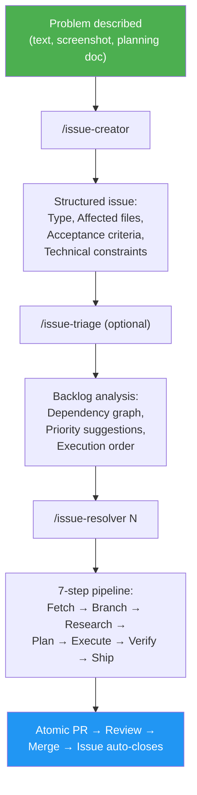
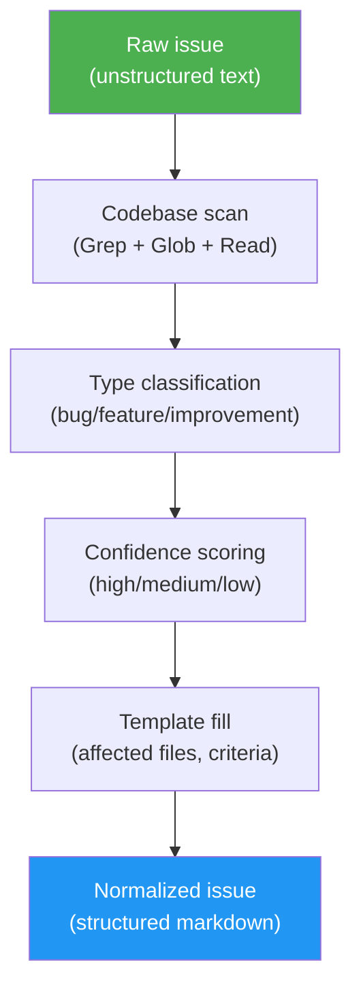

# Issue-Driven Development (IDD)

## What is IDD?

Issue-Driven Development is a software development methodology where **GitHub issues are the single source of truth** for all development work. Every change — bug fix, feature, improvement — starts as a structured issue and ends as an atomic PR linked to that issue.

The key insight: the gap between "someone describes a problem" and "someone resolves it" is a translation gap. Vague bug reports become structured work orders. Any resolver — human or AI agent — gets the same context: affected files, acceptance criteria, architecture constraints.

IDD is purpose-built for **brownfield projects** — the 90% of software work that's modifying existing codebases, not greenfield architecture.

## Why IDD?

### The Problem

Most GitHub issues are unstructured. A typical bug report says:

> "the login is broken on mobile"

A developer (human or AI) receiving this issue must:
1. Figure out which files are involved
2. Understand the current behavior
3. Determine what "fixed" means
4. Find related issues and constraints
5. Only then start coding

This context-gathering phase often takes longer than the fix itself. For AI agents, it's even worse — they have no institutional memory and must rediscover the codebase from scratch each time.

### The Solution

IDD automates the context-gathering phase:

1. **Create** — `/issue-creator` turns a one-sentence description into a structured issue with affected files, acceptance criteria, and technical constraints
2. **Normalize** — `/issue-creator N` enriches existing messy issues with codebase context
3. **Triage** — `/issue-triage` analyzes the backlog for dependencies, priorities, and execution order
4. **Resolve** — `/issue-resolver N` takes a structured issue through research → plan → code → test → PR

The issue becomes the spec. The code is the delivery. Git tracks everything in between.

## IDD vs Other Methodologies

| Aspect | IDD | TDD | BDD | Spec-Driven |
|--------|-----|-----|-----|-------------|
| **Source of truth** | GitHub issue | Test suite | Feature specs | Specification documents |
| **Starts with** | Problem description | Failing test | User story | Detailed spec |
| **Codebase-aware** | Yes — auto-enriched with affected files | No | No | Manual |
| **Agent-compatible** | Yes — any agent reads the same format | Partial — needs test framework | Partial — needs BDD framework | Partial — needs spec parser |
| **Overhead** | Zero-config CLI | Test setup + framework | Gherkin syntax + framework | Spec authoring + review |
| **Best for** | Brownfield, mixed human/AI teams | New code with clear interfaces | User-facing features | Complex systems, formal contracts |
| **Tracks resolution** | Issue → PR with auto-close | Test passes | Spec passes | Manual verification |

### Key Differences

**IDD vs TDD**: TDD starts with a failing test. IDD starts with a structured issue. They're complementary — IDD structures the work, TDD verifies the output. The `/issue-resolver` pipeline writes tests during the Execute phase.

**IDD vs BDD**: BDD uses Gherkin syntax (`Given/When/Then`) to describe behavior. IDD uses GitHub-native markdown with acceptance criteria. BDD requires a framework; IDD requires only `gh` CLI.

**IDD vs Spec-Driven**: Spec-driven development (Kiro, GitHub Spec-Kit) uses separate specification documents. IDD keeps everything in GitHub issues — no extra files, no sync overhead. The issue IS the spec.

## When to Use IDD

**IDD works best for:**
- Brownfield projects with existing codebases
- Teams mixing human and AI developers
- Open-source projects receiving community bug reports
- Solo developers managing multiple projects
- Any project using GitHub issues for work tracking

**IDD is not designed for:**
- Greenfield architecture decisions (use design docs first)
- Non-code work (documentation, design, operations)
- Projects not using GitHub or GitLab

## The IDD Workflow



## Core Concepts

### Issue Normalization



Normalization is the process of restructuring an unstructured issue into the standard template. A normalized issue contains:

- **Type classification** — bug, feature, or improvement (with confidence level)
- **Description** — synthesized from the original text with current/expected behavior
- **Acceptance criteria** — testable conditions for "done" (with confidence level)
- **Reporter Context** — original text preserved verbatim
- **Metadata** — suggested priority, effort, labels

Issues intentionally do NOT include codebase analysis (affected files, technical notes). The resolver and triage skills scan the codebase themselves when needed, against current code.

The normalization marker `<!-- gitissue:normalized v1 -->` is invisible in GitHub's rendered view but detectable by tools.

### Confidence Scoring

Type classification and acceptance criteria include confidence indicators:

| Level | Meaning | Display |
|-------|---------|---------|
| **high** | Explicit keywords — crash/error/500 → bug, "add new" → feature | `(high confidence)` |
| **medium** | Inferred from description context or tone | `(medium confidence)` |
| **low** | Ambiguous description, defaulted | `(needs review)` |

Low-confidence fields are marked `(needs review)` so reviewers know to verify.

### Agent-Agnostic Design

gitissue issues are plain GitHub markdown. Any tool that can read a GitHub issue can consume the structured format:

- **Claude Code** — reads issue via `gh`, follows the resolve pipeline
- **Codex CLI** — same structured issue, same `gh` commands
- **Gemini CLI** — same format, no gitissue-specific dependencies
- **Human developers** — readable sections, clear acceptance criteria
- **Future agents** — any agent supporting the SKILL.md standard

No vendor lock-in. No proprietary format. Just structured markdown on GitHub.

### Zero-Config Start

gitissue works without any configuration file. All settings have sensible defaults. When no `.gitissue.yml` exists:

```
○ First run — using default config. Run /init-gitissue to customize.
```

Run `/init-gitissue` to auto-detect your project's language, framework, and test runner, and generate a tailored config.

## Principles

1. **The issue is the spec.** If it's not in the issue, it's not in scope.
2. **Normalize before resolve.** Every issue gets codebase context before work begins.
3. **Confidence over certainty.** Show what's inferred vs. what's known. Mark low-confidence fields for human review.
4. **Agent-agnostic.** The same issue works for any resolver — human, Claude, Codex, Copilot.
5. **Zero overhead.** No extra tools, no platform accounts, no sync. Just `gh` and Git.
6. **Brownfield-first.** Built for existing codebases where context matters most.
7. **Data safety.** Backup before edit. Never modify without a verified backup.
