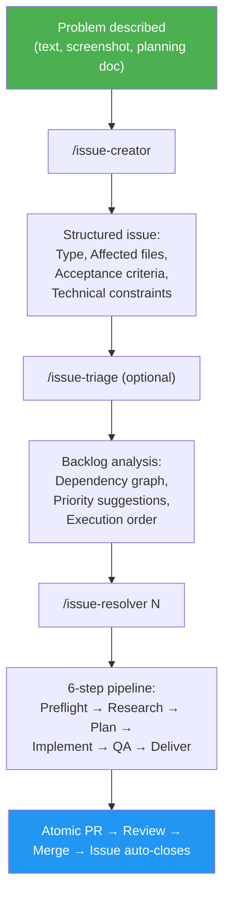
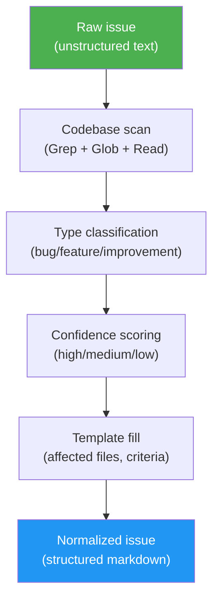

# Issue-Driven Development (IDD)

## What is IDD?

Issue-Driven Development — also **Intention-Driven Development** — is a software development methodology where **GitHub issues are the single source of truth** for all development work. Every change — bug fix, feature, improvement — starts as a structured issue and ends as an atomic PR linked to that issue.

The key insight: the gap between "someone describes a problem" and "someone resolves it" is both a **translation gap** and an **intention gap**. Vague bug reports become structured work orders through an iterative process that helps creators discover and articulate what they actually want. Any resolver — human or AI agent — gets the same context: acceptance criteria, architecture constraints, and a precise expression of intent.

IDD is purpose-built for **brownfield projects** — the 90% of software work that's modifying existing codebases, not greenfield architecture.

## IDD as Intention-Driven Development

IDD is also **Intention-Driven Development** — and that name reveals the methodology's deeper purpose.

Expressing what you actually want is one of the hardest problems in software development. Even experienced developers struggle to articulate a bug or feature request clearly enough for someone else — human or AI — to act on it correctly. The result: wrong assumptions, wasted effort, and solutions that miss the point.

`/issue-creator` addresses this through an **iterative clarification loop**:

1. **Describe the problem** — loosely, incompletely, however it comes to mind
2. **The agent proposes a structured issue** — classifying the type, filling in context, generating acceptance criteria
3. **Read back what it captured** — and realize what you actually meant, what's missing, what's imprecise
4. **Refine through conversation** — correct, add detail, sharpen the intent through multi-turn discussion until the issue says exactly what you want

This process does something no template or form can do: it helps you **discover your own intention**. The agent acts as both a mirror and a structured interviewer — reflecting your input back in a standardized format and prompting you to think more precisely about what you need.

By the time the issue is finalized, it accurately represents what the creator wants — expressed in a way that both humans and AI agents can understand and execute without ambiguity.

This matters because understanding user requirements is one of the hardest steps in the software development lifecycle. Most bugs, missed features, and scope creep trace back to requirements that were never clearly stated. IDD makes that step explicit, collaborative, and repeatable — turning an informal complaint into a precise, agent-ready work order.

The structured issue becomes the **single source of truth** for what needs to happen. When `/issue-resolver` picks it up, there's no guesswork — the intention is already captured.

## Why IDD?

### The Problem

Most GitHub issues are unstructured. A typical bug report says:

> "the login is broken on mobile"

A developer (human or AI) receiving this issue must:
1. Figure out which files are involved
2. Understand the current behavior
3. Determine what "fixed" means
4. Find related issues and constraints
5. Only then start coding

This context-gathering phase often takes longer than the fix itself. For AI agents, it's even worse — they have no institutional memory and must rediscover the codebase from scratch each time.

### The Solution

IDD automates the context-gathering phase:

1. **Create** — `/issue-creator` turns a one-sentence description into a structured issue with affected files, acceptance criteria, and technical constraints
2. **Normalize** — `/issue-creator N` enriches existing messy issues with codebase context
3. **Triage** — `/issue-triage` analyzes the backlog for dependencies, priorities, and execution order
4. **Resolve** — `/issue-resolver N` takes a structured issue through research → plan → code → test → PR

The issue becomes the spec. The code is the delivery. Git tracks everything in between.

## IDD vs Other Methodologies

| Aspect | IDD | TDD | BDD | Spec-Driven |
|--------|-----|-----|-----|-------------|
| **Source of truth** | GitHub issue | Test suite | Feature specs | Specification documents |
| **Starts with** | Problem description | Failing test | User story | Detailed spec |
| **Codebase-aware** | Yes — auto-enriched with affected files | No | No | Manual |
| **Agent-compatible** | Yes — any agent reads the same format | Partial — needs test framework | Partial — needs BDD framework | Partial — needs spec parser |
| **Overhead** | Zero-config CLI | Test setup + framework | Gherkin syntax + framework | Spec authoring + review |
| **Best for** | Brownfield, mixed human/AI teams | New code with clear interfaces | User-facing features | Complex systems, formal contracts |
| **Tracks resolution** | Issue → PR with auto-close | Test passes | Spec passes | Manual verification |

### Key Differences

**IDD vs TDD**: TDD starts with a failing test. IDD starts with a structured issue. They're complementary — IDD structures the work, TDD verifies the output. The `/issue-resolver` pipeline writes tests during the Execute phase.

**IDD vs BDD**: BDD uses Gherkin syntax (`Given/When/Then`) to describe behavior. IDD uses GitHub-native markdown with acceptance criteria. BDD requires a framework; IDD requires only `gh` CLI.

**IDD vs Spec-Driven**: Spec-driven development (Kiro, GitHub Spec-Kit) uses separate specification documents. IDD keeps everything in GitHub issues — no extra files, no sync overhead. The issue IS the spec.

## When to Use IDD

**IDD works best for:**
- Brownfield projects with existing codebases
- Teams mixing human and AI developers
- Open-source projects receiving community bug reports
- Solo developers managing multiple projects
- Any project using GitHub issues for work tracking

**IDD is not designed for:**
- Greenfield architecture decisions (use design docs first)
- Non-code work (documentation, design, operations)
- Projects not using GitHub or GitLab

## The IDD Workflow



## Core Concepts

### Issue Normalization



Normalization is the process of restructuring an unstructured issue into the standard template. A normalized issue contains:

- **Type classification** — bug, feature, or improvement (with confidence level)
- **Description** — synthesized from the original text with current/expected behavior
- **Acceptance criteria** — testable conditions for "done" (with confidence level)
- **Reporter Context** — original text preserved verbatim
- **Metadata** — suggested priority, effort, labels

Issues intentionally do NOT include codebase analysis (affected files, technical notes). The resolver and triage skills scan the codebase themselves when needed, against current code.

The normalization marker `<!-- gitissue:normalized v1 -->` is invisible in GitHub's rendered view but detectable by tools.

### Confidence Scoring

Type classification and acceptance criteria include confidence indicators:

| Level | Meaning | Display |
|-------|---------|---------|
| **high** | Explicit keywords — crash/error/500 → bug, "add new" → feature | `(high confidence)` |
| **medium** | Inferred from description context or tone | `(medium confidence)` |
| **low** | Ambiguous description, defaulted | `(needs review)` |

Low-confidence fields are marked `(needs review)` so reviewers know to verify.

### Agent-Agnostic Design

gitissue issues are plain GitHub markdown. Any tool that can read a GitHub issue can consume the structured format:

- **Claude Code** — reads issue via `gh`, follows the resolve pipeline
- **Codex CLI** — same structured issue, same `gh` commands
- **Gemini CLI** — same format, no gitissue-specific dependencies
- **Human developers** — readable sections, clear acceptance criteria
- **Future agents** — any agent supporting the SKILL.md standard

No vendor lock-in. No proprietary format. Just structured markdown on GitHub.

### Zero-Config Start

gitissue works without any configuration file. All settings have sensible defaults. When no `.gitissue.yml` exists:

```
○ First run — using default config. Run /init-gitissue to customize.
```

Run `/init-gitissue` to auto-detect your project's language, framework, and test runner, and generate a tailored config.

## The Value of Well-Defined Issues and Commit Messages

IDD's deepest payoff is not speed — it's **history**. Every software project accumulates a git history. The question is whether that history is useful or just noise.

### Issues as decision records

A well-defined issue is more than a task description — it's a **decision record**. It captures:

- **What was wrong or missing** — the problem as the reporter experienced it
- **What "done" looks like** — acceptance criteria that define the boundary of the work
- **What was considered** — when `/issue-analysis` evaluates implementation options, the structured issue preserves the reasoning behind the chosen approach

Six months later, when someone asks "why does this code check for expired sessions before redirecting?", the answer isn't buried in someone's memory or a Slack thread — it's in issue #42, linked from the commit that introduced the check.

### Commit messages as a narrative

A commit message is the smallest unit of project storytelling. When commits follow Conventional Commits format and reference their issue number, the git log becomes a **navigable narrative**:

```
fix(auth): resolve mobile redirect loop (#42)
feat(settings): add dark mode toggle (#15)
refactor(db): extract connection pool logic (#8)
test(auth): add login flow unit tests (#31)
```

Each line answers three questions: *what kind of change* (type), *where it happened* (scope), and *what problem it solved* (issue reference). Compare this to a typical unstructured history:

```
fix stuff
update
WIP
done
```

The first history is a knowledge base. The second is a liability.

### The traceability chain

IDD creates an unbroken chain from problem to solution:

```
Issue #42 (problem) → Branch fix/42-mobile-auth-redirect → Commits fix(auth): ... (#42) → PR fix(auth): ... (#42) with Closes #42 → Merge → Issue auto-closes
```

Every artifact links to every other artifact. `git blame` on any line leads to the commit, which leads to the PR, which leads to the issue. This traceability is what makes the history *valuable* — not just a record of what changed, but a record of why.

### Why this matters for AI agents

AI agents scanning git history for context (during `/issue-analysis` or `/issue-resolver`) depend entirely on the quality of that history. A structured commit message like `fix(auth): resolve mobile redirect loop (#42)` is instantly useful — the agent knows the type, scope, and related issue. A message like `fix bug` is invisible to meaningful analysis.

The same applies to issues. When an agent triages the backlog or analyzes dependencies, structured issues with acceptance criteria provide actionable data. Unstructured issues force the agent to guess — and guessing produces wrong results.

### The compounding effect

Good issues and commits compound over time. Each well-structured artifact makes the next one easier:

- `/issue-triage` produces better dependency graphs because issues have clear scope
- `/issue-analysis` finds more relevant prior art because commits reference issues
- `/issue-resolver` writes better code because the issue defines precise acceptance criteria
- New team members onboard faster because the history teaches the project's evolution
- Changelogs generate automatically from conventional commit messages

Bad history also compounds — but in the wrong direction. Vague issues spawn vague commits, which make future analysis unreliable, which makes the next issue harder to resolve. IDD breaks this cycle by enforcing structure at the point of creation.

## Principles

1. **The issue is the spec.** If it's not in the issue, it's not in scope.
2. **Intention before implementation.** The iterative clarification loop ensures the issue captures what the creator actually wants before any code is written.
3. **History is a product.** Well-defined issues and commit messages create a development history that remains valuable for the lifetime of the project. Every artifact should be written for the person — or agent — who reads it six months from now.
4. **Normalize before resolve.** Every issue gets codebase context before work begins.
5. **Confidence over certainty.** Show what's inferred vs. what's known. Mark low-confidence fields for human review.
6. **Agent-agnostic.** The same issue works for any resolver — human, Claude, Codex, Copilot.
7. **Zero overhead.** No extra tools, no platform accounts, no sync. Just `gh` and Git.
8. **Brownfield-first.** Built for existing codebases where context matters most.
9. **Data safety.** Backup before edit. Never modify without a verified backup.
