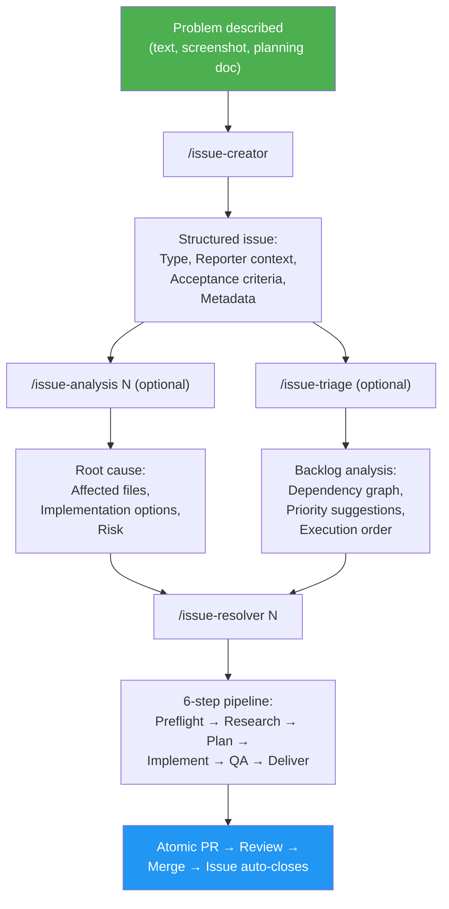
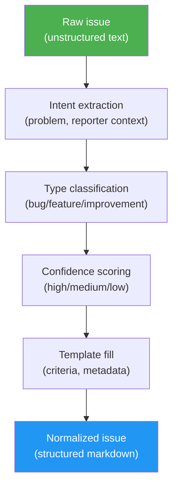

# Issue-Driven Development (IDD)

## What is IDD?

Issue-Driven Development — also **Intention-Driven Development** — is a software development methodology for turning issue trackers into **executable project memory**. Every code change — bug fix, feature, or improvement — starts with captured intent, is analyzed against the current codebase, and ends as an atomic PR linked back to the issue that motivated it.

The key insight: the gap between "someone describes a problem" and "someone resolves it" is both a **translation gap** and an **intention gap**. Vague bug reports become structured work orders through an iterative process that helps creators discover and articulate what they actually want. Any resolver — human or AI agent — starts from the same durable context: problem statement, reporter context, acceptance criteria, and known constraints.

IDD separates stable human intent from time-sensitive code understanding. Issues capture **what should change**. Analysis discovers **where and why** in the current codebase. PRs prove **how it changed**. Git history preserves **why it mattered**.

This makes IDD purpose-built for **brownfield projects** — everyday software work where contributors modify existing codebases and need to understand what changed, why it changed, and which previous decisions matter.

## The Thesis

IDD is not just an issue template. It is a workflow for preserving project memory in artifacts the project already owns.

In many repositories, issues, commits, and PRs exist, but they do not form a reliable knowledge system. Issues are vague, commits are terse, PRs omit context, and future contributors have to reconstruct intent from scattered clues. AI agents have the same problem at higher speed: without durable context, they guess.

IDD makes the trace explicit:

```text
Intent → Current-code analysis → Implementation → Review → Historical memory
```

That trace is the product. It gives maintainers a way to accept outside reports, let humans or agents investigate them, and still keep control of the final change.

## IDD as Intention-Driven Development

IDD is also **Intention-Driven Development** — and that name reveals the methodology's deeper purpose.

Expressing what you actually want is one of the hardest problems in software development. Even experienced developers struggle to articulate a bug or feature request clearly enough for someone else — human or AI — to act on it correctly. The result: wrong assumptions, wasted effort, and solutions that miss the point.

`/issue-creator` addresses this through an **iterative clarification loop**:

1. **Describe the problem** — loosely, incompletely, however it comes to mind
2. **The agent proposes a structured issue** — classifying the type, preserving reporter context, and generating acceptance criteria
3. **Read back what it captured** — and realize what you actually meant, what's missing, what's imprecise
4. **Refine through conversation** — correct, add detail, sharpen the intent through multi-turn discussion until the issue says exactly what you want

This process does something no template or form can do: it helps you **discover your own intention**. The agent acts as both a mirror and a structured interviewer — reflecting your input back in a standardized format and prompting you to think more precisely about what you need.

By the time the issue is finalized, it represents what the creator wants in a format that both humans and AI agents can inspect, question, and execute against.

This matters because understanding user requirements is one of the hardest steps in the software development lifecycle. Most bugs, missed features, and scope creep trace back to requirements that were never clearly stated. IDD makes that step explicit, collaborative, and repeatable — turning an informal complaint into a precise, agent-ready work order.

The structured issue becomes the **source of truth for intended behavior**. When `/issue-analysis`, `/issue-triage`, or `/issue-resolver` picks it up, the intention is already captured.

## Why IDD?

### The Problem

Most GitHub issues are unstructured. A typical bug report says:

> "the login is broken on mobile"

A developer (human or AI) receiving this issue must:
1. Figure out which files are involved
2. Understand the current behavior
3. Determine what "fixed" means
4. Find related issues and constraints
5. Only then start coding

This context-gathering phase often takes longer than the fix itself. For AI agents, it's even worse — they have no institutional memory and must rediscover the codebase from scratch each time.

### The Solution

IDD standardizes the path from intention to implementation:

1. **Create** — `/issue-creator` turns a one-sentence description into a structured issue with type, reporter context, acceptance criteria, and metadata
2. **Normalize** — `/issue-creator N` restructures existing messy issues into the same template without guessing affected files
3. **Analyze** — `/issue-analysis N` scans the current codebase for root cause, affected files, implementation options, complexity, and risk
4. **Triage** — `/issue-triage` analyzes the backlog for dependencies, priorities, stale work, and execution order
5. **Resolve** — `/issue-resolver N` takes a structured issue through preflight → research → plan → implement → QA → PR

The issue defines the acceptance boundary. Analysis finds the current-code reality. The PR delivers the change. Git tracks the memory trail between them.

## IDD vs Other Methodologies

| Aspect | IDD | TDD | BDD | Spec-Driven |
|--------|-----|-----|-----|-------------|
| **Source of truth** | GitHub issue | Test suite | Feature specs | Specification documents |
| **Starts with** | Problem description | Failing test | User story | Detailed spec |
| **Codebase-aware** | Yes — during analysis, triage, and resolution | Depends on developer context | Depends on developer context | Manual or tool-specific |
| **Agent-compatible** | Yes — any agent reads the same format | Partial — needs test framework | Partial — needs BDD framework | Partial — needs spec parser |
| **Overhead** | GitHub-native, low ceremony | Test setup + framework | Gherkin syntax + framework | Spec authoring + review |
| **Best for** | Brownfield, mixed human/AI teams | New code with clear interfaces | User-facing features | Complex systems, formal contracts |
| **Tracks resolution** | Issue → PR with auto-close | Test passes | Spec passes | Manual verification |

### Key Differences

**IDD vs TDD**: TDD starts with a failing test. IDD starts with a structured issue. They're complementary — IDD structures the work, TDD verifies the output. The `/issue-resolver` pipeline writes tests during the Implement and QA phases.

**IDD vs BDD**: BDD uses Gherkin syntax (`Given/When/Then`) to describe behavior. IDD uses GitHub-native markdown with acceptance criteria. BDD requires a framework; IDD requires only `gh` CLI.

**IDD vs Spec-Driven**: Spec-driven development (Kiro, GitHub Spec-Kit) uses separate specification documents. IDD keeps the work contract in GitHub issues, reducing the chance that separate specs and issues drift apart.

IDD is not a replacement for TDD, BDD, or architecture design. It is the outer workflow that says where work starts, how intent is captured, how implementation is traced, and how the final PR proves it addressed the original issue.

## When to Use IDD

**IDD works best for:**
- Brownfield projects with existing codebases
- Teams mixing human and AI developers
- Open-source projects receiving community bug reports
- Solo developers managing multiple projects
- Any project using GitHub issues for work tracking

**IDD is not designed for:**
- Greenfield architecture decisions before the design direction is known
- Vague strategic planning where no concrete change can be accepted or rejected
- Projects that do not use GitHub issues or an equivalent issue tracker

## The IDD Workflow



## Core Concepts

### Issue Normalization



Normalization is the process of restructuring an unstructured issue into the standard template. It is intentionally about **intent**, not code prediction. A normalized issue contains:

- **Type classification** — bug, feature, or improvement (with confidence level)
- **Description** — synthesized from the original text with current/expected behavior
- **Acceptance criteria** — testable conditions for "done" (with confidence level)
- **Reporter Context** — original text preserved verbatim
- **Metadata** — suggested priority, effort, labels

Issues intentionally do **not** include predicted affected files, generated technical notes, or guessed architecture constraints. They may include file paths or constraints explicitly supplied by the reporter, but generated codebase analysis lives in `/issue-analysis`, `/issue-triage`, and `/issue-resolver` because those tools scan the current code when they run.

The normalization marker `<!-- gitissue:normalized v1 -->` is invisible in GitHub's rendered view but detectable by tools.

### Confidence Scoring

Type classification and acceptance criteria include confidence indicators:

| Level | Meaning | Display |
|-------|---------|---------|
| **high** | Explicit keywords — crash/error/500 → bug, "add new" → feature | `(high confidence)` |
| **medium** | Inferred from description context or tone | `(medium confidence)` |
| **low** | Ambiguous description, defaulted | `(needs review)` |

Low-confidence fields are marked `(needs review)` so reviewers know to verify.

### Agent-Agnostic Design

gitissue issues are plain GitHub markdown. Any tool that can read a GitHub issue can consume the structured format:

- **Claude Code** — reads issue via `gh`, follows the resolve pipeline
- **Codex CLI** — same structured issue, same `gh` commands
- **Gemini CLI** — same format, no gitissue-specific dependencies
- **Human developers** — readable sections, clear acceptance criteria
- **Future agents** — any agent that can read GitHub markdown and follow a documented issue contract

No proprietary issue format. The workflow skills are optional automation around a human-readable issue body.

### Low-Config Start

gitissue works without any configuration file. All settings have sensible defaults. When no `.gitissue.yml` exists:

```
○ First run — using default config. Run /init-gitissue to customize.
```

Run `/init-gitissue` to auto-detect your project's language, framework, and test runner, and generate a tailored config.

## Intent-Code Boundary

The most important design rule in IDD is the **intent-code boundary**: do not freeze guessed code context into the issue. Code changes. Intent should remain stable.

IDD separates durable intent from time-sensitive codebase analysis:

| Artifact | Owns | Does not own |
|----------|------|--------------|
| **Issue** | Problem, reporter context, acceptance criteria, priority, labels | Predicted affected files or root cause |
| **Analysis** | Affected files, root cause, implementation options, complexity, risk | Final code changes |
| **PR** | Implementation, tests, review discussion, closing link | Rewriting the original intent |
| **Git history** | The durable story of what changed and why | Unstructured "WIP" progress logs |

This boundary keeps issues stable while still allowing analysis to stay fresh. A file prediction made when an issue is created can become stale after one merge. A codebase scan run during analysis or resolution reflects the current repository.

## Analysis Artifacts and Durable Memory

`/issue-analysis` writes its findings to `.gitissue/analysis-<N>.json` so the resolver can reuse them and reviewers can inspect the current-code reality the analysis ran against. That JSON is **local cache**: it is not required to be committed, it is safe to delete, and a fresh `/issue-analysis N` regenerates it. Local cache is useful for the live workflow but cannot be the home of project memory — once the PR merges and the cache is cleared, the reasoning would disappear with it.

Durable project memory therefore lives in artifacts that already survive: the **issue body** (intent), the **PR body** (analysis lift, decision record, acceptance verification), and the **squash commit body** that lands on the default branch (the same content carried into git history). The dual-write rule says: any analysis signal worth preserving must appear in both the PR body and the squash commit body. Concretely, `/issue-resolver` lifts a five-field **Decision Record** — root cause, options considered, options rejected, selected option, residual risk — out of the analysis JSON and into the PR body, alongside an acceptance-criteria verification table. `/issue-pr-review` checks for the presence of those fields as part of its traceability dimension. Deleting `.gitissue/analysis-<N>.json` after the PR merges does not destroy the reasoning — it is already in `git log -p`.

This rule **assumes squash-merge as the merge strategy**. GitHub's squash-merge carries the PR body verbatim into the commit message; standard merge commits and rebase-merge do not without extra tooling. Repos using a different strategy will keep durable memory in the PR body (and therefore only on GitHub) rather than in git history. `/init-gitissue` should warn when the repo's default merge strategy is not squash.

## Minimal Example

Raw report:

> the login is broken on mobile. it keeps spinning and says too many redirects. works fine on desktop.

Normalized issue:

```markdown
## Type
Bug

## Description
**Current behavior:**
Mobile users entering the login flow hit a redirect loop.

**Expected behavior:**
Mobile login completes and lands on the dashboard.

> **Reporter Context**
> the login is broken on mobile. it keeps spinning and says too many redirects. works fine on desktop.

## Acceptance Criteria
- [ ] Mobile login completes without a redirect loop
- [ ] Desktop login continues to work
- [ ] A regression test covers the mobile redirect path
```

Resolution trace:

```text
Issue #42 → /issue-analysis 42 → branch fix/42-mobile-login-loop
→ commit fix(auth): resolve mobile login redirect loop (#42)
→ PR fix(auth): resolve mobile login redirect loop (#42) with Closes #42
```

The issue captures what must be true. Analysis discovers where and why. The PR proves the change and closes the loop.

## Maintainer Control and Safety

IDD is designed for open-source maintainers who need automation without losing control:

- `/issue-creator N --dry-run` previews normalization before changing an existing issue
- Existing issue bodies are backed up before normalization
- Security-labeled issues require explicit force before rewriting
- `/issue-resolver` creates branches and PRs instead of silently changing the default branch
- PRs use `Closes #N` so GitHub preserves the issue-to-code link
- Tests and build checks are part of the resolver QA phase before delivery

## Executable Project Memory

IDD's deepest payoff is not speed — it's **history**. Every software project accumulates a git history. The question is whether that history is useful or just noise.

In IDD, history is treated as executable project memory: structured enough for agents to reason over, but plain enough for humans to audit. The goal is not to automate away maintainers. The goal is to make the repository's own artifacts carry enough intent, analysis, and proof that future work starts from knowledge instead of rediscovery.

### Issues as decision records

A well-defined issue is more than a task description — it's a **decision record**. It captures:

- **What was wrong or missing** — the problem as the reporter experienced it
- **What "done" looks like** — acceptance criteria that define the boundary of the work
- **Where the reasoning lives** — `/issue-analysis` and the PR preserve implementation options, tradeoffs, and the chosen approach

Six months later, when someone asks "why does this code check for expired sessions before redirecting?", the answer isn't buried in someone's memory or a Slack thread — it's in the issue, analysis, PR, and commit trail linked from the line of code.

### Commit messages as a narrative

A commit message is the smallest unit of project storytelling. When commits follow Conventional Commits format and reference their issue number, the git log becomes a **navigable narrative**:

```
fix(auth): resolve mobile redirect loop (#42)
feat(settings): add dark mode toggle (#15)
refactor(db): extract connection pool logic (#8)
test(auth): add login flow unit tests (#31)
```

Each line answers three questions: *what kind of change* (type), *where it happened* (scope), and *what problem it solved* (issue reference). Compare this to a typical unstructured history:

```
fix stuff
update
WIP
done
```

The first history is a knowledge base. The second is a liability.

### The traceability chain

IDD creates an unbroken chain from problem to solution:

```
Issue #42 (problem) → Branch fix/42-mobile-auth-redirect → Commits fix(auth): ... (#42) → PR fix(auth): ... (#42) with Closes #42 → Merge → Issue auto-closes
```

Every artifact links to every other artifact. `git blame` on any line leads to the commit, which leads to the PR, which leads to the issue. This traceability is what makes the history *valuable* — not just a record of what changed, but a record of why.

### Why this matters for AI agents

AI agents scanning git history for context (during `/issue-analysis` or `/issue-resolver`) depend entirely on the quality of that history. A structured commit message like `fix(auth): resolve mobile redirect loop (#42)` is instantly useful — the agent knows the type, scope, and related issue. A message like `fix bug` is invisible to meaningful analysis.

The same applies to issues. When an agent triages the backlog or analyzes dependencies, structured issues with acceptance criteria provide actionable data. Unstructured issues force the agent to guess — and guessing produces wrong results.

### The compounding effect

Good issues and commits compound over time. Each well-structured artifact makes the next one easier:

- `/issue-triage` produces better dependency graphs because issues have clear scope
- `/issue-analysis` finds more relevant prior art because commits reference issues
- `/issue-resolver` writes better code because the issue defines precise acceptance criteria
- New team members onboard faster because the history teaches the project's evolution
- Changelogs generate automatically from conventional commit messages

Bad history also compounds — but in the wrong direction. Vague issues spawn vague commits, which make future analysis unreliable, which makes the next issue harder to resolve. IDD breaks this cycle by enforcing structure at the point of creation.

## Principles

1. **The issue is the acceptance contract.** If intended behavior is not in the issue, it is not in scope.
2. **Intention before implementation.** The iterative clarification loop ensures the issue captures what the creator actually wants before any code is written.
3. **Respect the intent-code boundary.** Issues capture durable intent; analysis and resolution inspect current code.
4. **History is a product.** Well-defined issues and commit messages create a development history that remains valuable for the lifetime of the project. Every artifact should be written for the person — or agent — who reads it six months from now.
5. **Current code beats stale assumptions.** Run codebase analysis when triaging, investigating, or resolving.
6. **Confidence over certainty.** Show what's inferred vs. what's known. Mark low-confidence fields for human review.
7. **Agent-agnostic.** The same issue works for any resolver — human, Claude, Codex, Copilot.
8. **Agent-assisted, maintainer-controlled.** Automation prepares and proposes changes; review gates preserve project ownership.
9. **Low ceremony.** Use the issue tracker and git history the project already has.
10. **Brownfield-first.** Built for existing codebases where context matters most.
11. **Data safety.** Preview and backup before mutating existing issue content.
