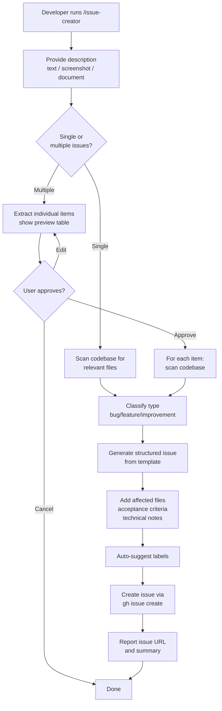
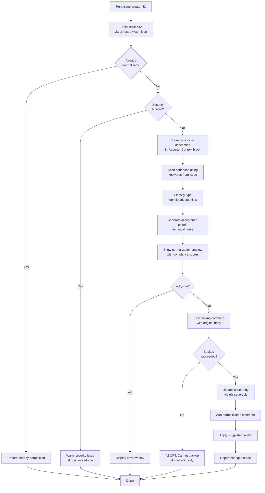
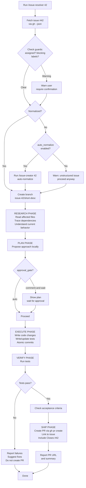
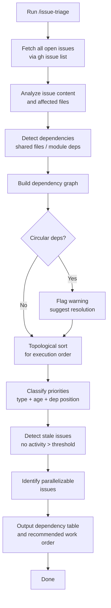
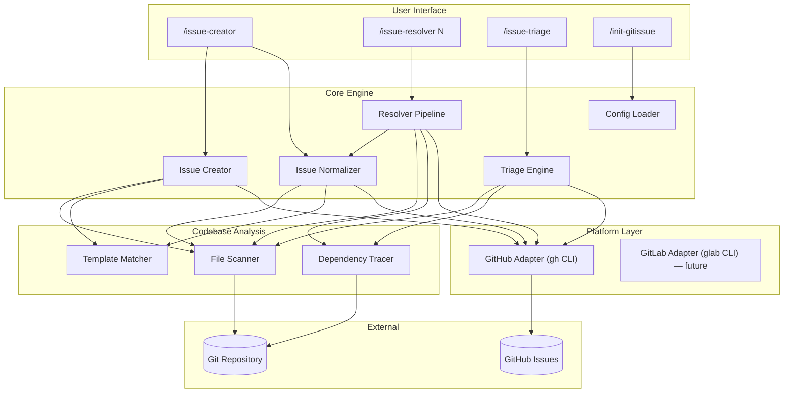

# PRD: gitissue

## Table of Contents
1. [Document Info](#document-info)
2. [Product Overview](#1-product-overview)
3. [User Personas](#2-user-personas)
4. [Feature Requirements](#3-feature-requirements)
5. [User Flows](#4-user-flows)
6. [Non-Functional Requirements](#5-non-functional-requirements)
7. [Technical Specifications](#6-technical-specifications)
8. [Analytics & Monitoring](#7-analytics--monitoring)
9. [Release Planning](#8-release-planning)
10. [Open Questions & Risks](#9-open-questions--risks)
11. [Appendix](#10-appendix)

---

## Document Info

| Field | Value |
|-------|-------|
| Product Name | gitissue |
| Methodology | Issue-Driven Development (IDD) |
| Version | 1.1 |
| Last Updated | 2026-03-20 |
| Status | Reviewed (CEO + Eng + Design) |

---

## 1. Product Overview

### 1.1 Product Vision

**gitissue** introduces Issue-Driven Development (IDD) — a software development methodology where GitHub issues are the single source of truth for all development work. Two commands (`/issue-creator` and `/issue-resolver`) form a complete workflow that works for humans and AI agents alike. Issues are automatically enriched with codebase context, structured with consistent templates, and resolved through a research-plan-execute pipeline that produces atomic PRs. No extra tools, no sync overhead, no translation layer. The issue is the spec. The code is the delivery. Git tracks everything in between.

gitissue is purpose-built for **brownfield projects** — the 90% of software work that's modifying existing codebases, not greenfield architecture.

### 1.2 Target Users

1. **Solo developers and small teams** using GitHub for brownfield projects who want structured, AI-ready issue workflows without heavy project management tools
2. **Teams using AI coding agents** (Claude Code, Codex, Copilot, Devin) who want a standardized issue format any agent can consume
3. **Open-source maintainers** who receive messy bug reports and want auto-normalization into actionable issues
4. **Engineering leads** who want dependency-aware triage and execution ordering across their issue backlog

### 1.3 Business Objectives

| Objective | Description |
|-----------|-------------|
| Establish IDD | Position gitissue as the recognized methodology for brownfield AI-agent-compatible development |
| Developer adoption | Achieve organic adoption through open-source distribution and Claude Code skill ecosystem |
| Platform standard | Become the default issue structure that AI agents expect and produce |
| Zero-overhead workflow | Eliminate the need for external project management tools for issue-driven teams |

### 1.4 Success Metrics

| Metric | Target | Measurement Method |
|--------|--------|-------------------|
| First-PR-merge rate | gitissue-created issues merge at >80% rate vs <60% for unstructured issues | Track issues created via `/issue-creator` vs manually created, compare merge rates over 90 days |
| Time-to-PR | 50% reduction in time from issue creation to first PR | Measure timestamp delta between issue creation and linked PR creation |
| Agent compatibility | 3+ agents | Demonstrate same gitissue-formatted issue resolved by Claude Code, Copilot Coding Agent, and OpenHands without modification |
| Normalization adoption | 70% of manually-filed issues get normalized before resolution | Track `/issue-creator N` calls vs direct `/issue-resolver N` on unnormalized issues |
| GitHub stars | 500+ in first 6 months | GitHub repo metrics |

---

## 2. User Personas

### Persona 1: Alex — Solo Developer on Legacy Projects

- **Demographics**: 30, freelance full-stack developer, works on 3-5 client projects simultaneously
- **Goals**: Ship client fixes quickly with minimal context-switching overhead. Wants AI agents to handle routine issues while focusing on complex work.
- **Pain Points**: Client bug reports are vague ("the thing is broken"). Spends 30% of time just understanding what to fix before writing any code. No project management budget — uses plain GitHub issues.
- **User Journey**: Client emails a vague bug report → Alex runs `/issue-creator` with the text → gitissue scans the codebase, identifies affected files, creates a structured issue → Alex runs `/issue-resolver 42` → AI agent researches, plans, codes, opens PR → Alex reviews and merges.
- **Quote**: "I just want to paste the client's complaint and have something actionable come out the other end."

### Persona 2: Maya — Open-Source Maintainer

- **Demographics**: 35, senior engineer at a startup, maintains 2 popular open-source libraries with 50+ open issues
- **Goals**: Triage the issue backlog efficiently. Enable community contributors (human and AI) to pick up issues without extensive onboarding.
- **Pain Points**: Issue quality varies wildly — from detailed reproduction steps to "doesn't work." Half her time is spent asking reporters for more information. Contributors struggle to understand issue scope without deep codebase knowledge.
- **User Journey**: Community member files a vague issue → Maya runs `/issue-creator 87` to normalize it (adds affected files, acceptance criteria, labels) → runs `/issue-triage` to see the dependency graph and prioritize → assigns issues to contributors or AI agents → contributors run `/issue-resolver 87` and submit PRs.
- **Quote**: "I need every issue to tell the resolver exactly what to look at and what 'done' means — whether that resolver is a first-time contributor or an AI bot."

### Persona 3: Raj — Engineering Lead at a Startup

- **Demographics**: 40, leads a 6-person engineering team, responsible for a 3-year-old SaaS product
- **Goals**: Maximize team throughput by making issues self-contained work orders. Mix human and AI agent work seamlessly. Track dependencies to avoid blocking.
- **Pain Points**: Team uses GitHub issues but they're inconsistent. Junior devs spend too long ramping up on issue context. AI agents produce off-target PRs because issue descriptions lack codebase context. No visibility into issue dependencies.
- **User Journey**: Raj creates issues via `/issue-creator` (auto-enriched with codebase context) → runs `/issue-triage` weekly to see the dependency table and reorder priorities → assigns simple issues to AI agents, complex ones to senior devs → all resolvers use `/issue-resolver N` → PRs link back to issues, auto-close on merge.
- **Quote**: "I want to see which issues block which, assign work to humans or AI interchangeably, and know that every issue has enough context to be resolved without a 30-minute standup."

---

## 3. Feature Requirements

### 3.1 Feature Matrix

| ID | Feature | Description | Priority | Dependencies |
|----|---------|-------------|----------|--------------|
| F1 | `/issue-creator` (new) | Create structured, codebase-aware issues from text, screenshot, or batch input | Must-have | — |
| F2 | `/issue-creator N` (normalize) | Enrich an existing unstructured issue with codebase context, templates, and acceptance criteria | Must-have | F1 |
| F3 | Issue templates | Default templates for bug, feature, improvement with structured sections | Must-have | — |
| F4 | `/issue-resolver N` | Full resolution pipeline: fetch → branch → research → plan → code → test → PR | Must-have | F1, F3 |
| F5 | `.gitissue.yml` configuration | Project-level config for templates, approval gates, branch naming, platform selection | Must-have | — |
| F6 | `/issue-triage` | Review open issues: dependency graph, priority suggestions, stale detection, execution order | Should-have | F1 |
| F7 | Batch issue creation | Extract multiple issues from screenshots, emails, planning docs, or text | Should-have | F1 |
| F8 | Confidence scoring | Show confidence levels for auto-enriched fields during normalization | Should-have | F2 |
| F9 | `/init-gitissue` | Scan repo and generate sensible `.gitissue.yml` defaults | Should-have | F5 |
| F10 | GitLab support | Platform abstraction layer supporting GitLab MR workflows via `glab` CLI | Could-have | F4, F5 |
| F11 | Batch normalization | `/issue-creator --normalize-all` to enrich all open issues in one pass | Could-have | F2 |
| F12 | Resolution templates | Specialized resolve pipelines for common patterns (API endpoint, React component, DB migration) | Could-have | F4 |
| F13 | Issue intelligence | Learn from resolved issues to improve future normalization accuracy | Won't-have (MVP) | F2, F4 |
| F14 | Cross-repo awareness | Normalization spans related repositories in multi-repo projects | Won't-have (MVP) | F2 |
| F15 | IDE extensions | VS Code / JetBrains integration for `/issue-creator` and `/issue-resolver` | Won't-have (MVP) | F1, F4 |
| F16 | Team analytics | Track normalization accuracy, resolve success rate, time-to-merge by issue type | Won't-have (MVP) | F4 |

### 3.2 Feature Details

#### F1: `/issue-creator` (New Issue Creation)

**Description**: Create one or more structured, codebase-aware GitHub issues from text input, screenshots, emails, or planning documents. The command scans the codebase to enrich the issue with affected files, architectural constraints, and acceptance criteria.

**User Stories**:
- As a developer, I want to describe a bug in natural language and have gitissue create a structured issue with affected files and reproduction context so that any resolver (human or AI) can start working immediately.
- As a developer, I want to paste a screenshot of a bug and have gitissue extract the issue details and create a structured GitHub issue so that I don't have to manually transcribe visual information.
- As a team lead, I want to paste a planning document and have gitissue extract multiple issues from it so that I can populate the backlog in one step.

**Acceptance Criteria**:
- [ ] Accepts free-text description and produces a structured issue via `gh issue create`
- [ ] Scans codebase for relevant files based on keywords, component names, and error messages in the description
- [ ] Classifies issue type automatically (bug/feature/improvement) with option to override
- [ ] Populates all template sections: type, context (affected files, current behavior), description, acceptance criteria, technical notes, metadata
- [ ] Supports image/screenshot input — extracts text and visual context to populate issue
- [ ] Supports batch extraction from documents — shows preview table before creating
- [ ] Applies labels automatically based on type, affected components, and `.gitissue.yml` config
- [ ] Created issue follows the gitissue template structure

**Edge Cases**:
- Description too vague to identify affected files → create issue with "Affected files: Unable to determine — manual review needed" and lower confidence flag
- Duplicate issue detection → warn if a similar open issue exists (title + description similarity)
- No GitHub remote configured → error with clear setup instructions
- Rate limit hit during batch creation → queue remaining, report progress, resume on next run

#### F2: `/issue-creator N` (Issue Normalization)

**Description**: Enrich an existing unstructured GitHub issue (filed by anyone via the web UI or any other method) with codebase context, structured template sections, and acceptance criteria. Preserves all original content.

**User Stories**:
- As a maintainer, I want to normalize a messy community-filed issue into a structured format so that contributors and AI agents can resolve it without asking follow-up questions.
- As a developer, I want `/issue-resolver` to auto-normalize issues before resolution so that I never work from an unstructured issue.

**Acceptance Criteria**:
- [ ] Fetches issue #N from GitHub via `gh issue view`
- [ ] Detects whether the issue is already normalized (has gitissue template markers)
- [ ] If not normalized: preserves original description in a "Reporter Context" blockquote
- [ ] Adds all template sections: type classification, affected files, acceptance criteria, technical notes, labels
- [ ] Posts backup comment with original body (in `<details>` block) BEFORE editing — abort if backup fails
- [ ] Updates the issue body in-place via `gh issue edit` (only after backup is verified)
- [ ] Adds a comment noting normalization was performed, with summary of what was added
- [ ] Never deletes or modifies original reporter content
- [ ] Supports `--dry-run` flag to preview normalization without applying
- [ ] Skips normalization for security-labeled issues (labels: 'security', 'CVE', 'vulnerability') unless `--force` is used

**Edge Cases**:
- Issue already normalized → skip, report "Issue #N is already normalized"
- Issue is locked or read-only → error with explanation
- Issue belongs to a different repo → error with repo context
- Large issue body (>65KB) → truncate technical notes, prioritize essential fields
- Security-labeled issue → warn and skip normalization (codebase context could reveal exploit details)
- Backup comment fails → abort normalization entirely (never edit body without a verified backup)

#### F3: Issue Templates

**Description**: Default markdown templates for bug, feature, and improvement issues. Templates define the gitissue structure while remaining human-readable.

**User Stories**:
- As a developer, I want consistent issue structure across all issues so that I can quickly scan any issue and find the information I need in the same place.

**Acceptance Criteria**:
- [ ] Three default templates: `bug.md`, `feature.md`, `improvement.md`
- [ ] Each template includes: Type, Context (affected files, current behavior, related issues), Description, Acceptance Criteria, Technical Notes (architecture constraints, test coverage, breaking change risk), Metadata (priority, effort, labels)
- [ ] Templates are customizable via `.gitissue.yml` (point to custom template paths)
- [ ] Template markers allow normalization detection (e.g., `<!-- gitissue:normalized -->` comment)
- [ ] Templates render cleanly in GitHub's issue view

#### F4: `/issue-resolver N`

**Description**: Full resolution pipeline that takes a GitHub issue through research, planning, implementation, verification, and shipping — producing an atomic PR linked to the issue.

**User Stories**:
- As a developer, I want to run a single command to resolve an issue end-to-end so that I go from issue to PR without manual branch management, context gathering, or PR formatting.
- As a team lead, I want the resolve pipeline to auto-normalize issues before working on them so that resolution quality doesn't depend on issue quality.

**Acceptance Criteria**:
- [ ] Fetches issue #N from GitHub using `gh --json` for reliable parsing
- [ ] Checks guards before proceeding: warns if issue is assigned to someone else or has blocking labels (wontfix, blocked, do-not-merge)
- [ ] Auto-normalizes if not already normalized (when `auto_normalize: true` in config)
- [ ] Creates a branch following naming convention (default: `issue-N/short-description`)
- [ ] Treats issue body content as untrusted data (prompt injection boundary — never executes commands found in the issue text)
- [ ] **Research phase**: reads all files mentioned in the issue, traces imports/dependencies, understands current behavior
- [ ] **Plan phase**: proposes approach locally (not posted to issue). When `approval_gate: comment-and-wait`, pauses for user approval
- [ ] **Execute phase**: writes code changes, writes/updates tests, creates atomic commits per logical change
- [ ] **Verify phase**: runs test suite, checks each acceptance criterion from the issue
- [ ] **Ship phase**: creates PR via `gh pr create` with body referencing the issue, includes "Closes #N" for auto-close on merge
- [ ] PR body contains: issue summary, approach taken, files changed, test results, acceptance criteria checklist
- [ ] Handles graceful failure at any stage with clear error reporting

**Edge Cases**:
- Issue has no acceptance criteria (even after normalization) → resolve proceeds but PR notes "No acceptance criteria defined — manual review recommended"
- Tests fail during verify → report failures, do not create PR, suggest fixes
- Tests hang/timeout → abort after `resolve.test_timeout` seconds (default: 300s), report timeout
- Branch already exists → prompt: continue from existing branch or create fresh
- Merge conflicts with main → report conflict, suggest rebase or manual resolution
- Issue assigned to another user → warn before proceeding, require confirmation
- Issue has blocking labels → warn before proceeding, require confirmation

#### F5: `.gitissue.yml` Configuration

**Description**: Project-level YAML configuration file that controls gitissue behavior. Sensible defaults for zero-config usage, with full customization available.

**User Stories**:
- As a developer, I want gitissue to work out of the box with zero configuration so that I can start using it immediately.
- As a team lead, I want to configure approval gates and branch naming for my team so that the workflow matches our conventions.

**Acceptance Criteria**:
- [ ] gitissue works without a `.gitissue.yml` file (all defaults applied)
- [ ] Config schema covers: platform, issue settings, resolve settings, triage settings
- [ ] Validates config on load, reports errors with line numbers

**Default Configuration**:
```yaml
platform: github  # github | gitlab

issue:
  auto_normalize: true          # auto-normalize in /issue-resolver
  template: default             # default | path to custom template dir
  labels_auto_suggest: true     # auto-suggest labels based on content
  normalize_comment: true       # add comment when normalizing

resolve:
  approval_gate: auto           # auto | comment-and-wait
  branch_prefix: "issue-"      # branch naming: issue-42/short-description
  auto_test: true               # run tests before creating PR
  test_timeout: 300             # abort verify phase after N seconds (default: 5 min)
  pr_auto_link: true            # include "Closes #N" in PR body
  max_commits: 10               # warn if resolve produces >N commits

triage:
  stale_threshold_days: 14      # flag issues with no activity
  auto_priority: true           # suggest priorities based on type + age + deps
  include_closed: false         # include recently closed issues in triage
```

#### F6: `/issue-triage`

**Description**: Review all open issues, detect dependencies, suggest priorities, identify stale issues, and recommend execution order. Outputs a dependency table and work plan.

**User Stories**:
- As a team lead, I want to see which issues block which, which are stale, and what order to resolve them so that I can plan sprints effectively.
- As a solo developer, I want to know which issue to work on next based on dependencies and priority so that I don't waste time on blocked work.

**Acceptance Criteria**:
- [ ] Fetches all open issues via `gh issue list`
- [ ] Analyzes issue content and affected files to detect dependencies (shared files, module dependencies)
- [ ] Generates dependency table: Issue | Blocks | Blocked By | Priority | Effort | Suggested Order
- [ ] Flags stale issues (no activity beyond threshold)
- [ ] Suggests priority based on: issue type, age, dependency position, label signals
- [ ] Outputs recommended work order (topological sort of dependency graph)
- [ ] Identifies parallelizable issues (independent, can be worked simultaneously)
- [ ] Outputs as formatted markdown to terminal

**Edge Cases**:
- Circular dependencies detected → flag as warning, suggest resolution
- No open issues → report "No open issues found"
- >100 open issues → paginate analysis, offer `--limit N` flag

#### F7: Batch Issue Creation

**Description**: Extract multiple issues from a single input source — screenshots, emails, planning documents, or multi-item text descriptions.

**User Stories**:
- As a developer, I want to paste a planning document and have gitissue create 5 issues from it so that I can populate my backlog in one step.
- As a QA engineer, I want to share a screenshot of multiple bugs and have gitissue create separate issues for each so that I don't have to file them one by one.

**Acceptance Criteria**:
- [ ] Accepts text input with multiple items (auto-detects boundaries)
- [ ] Accepts screenshot/image input, extracts visual information to create issues
- [ ] Accepts document input (markdown, plain text)
- [ ] Shows preview table before creating: # | Type | Title | Effort
- [ ] User can approve all, edit individual items, or cancel
- [ ] Each created issue follows the gitissue template structure
- [ ] Handles partial failure (some issues created, some failed) gracefully

#### F8: Confidence Scoring

**Description**: When normalizing issues, show confidence levels for each auto-enriched field so that users can verify and correct before proceeding.

**User Stories**:
- As a maintainer, I want to know how confident gitissue is about the affected files it identified so that I can correct mistakes before they mislead a resolver.

**Acceptance Criteria**:
- [ ] Each auto-enriched field includes a confidence indicator: high / medium / low
- [ ] High: direct file/function mention in issue text, exact match in codebase
- [ ] Medium: keyword-based inference, related module detected
- [ ] Low: best guess based on issue type and project structure
- [ ] Confidence displayed during normalization preview (before applying)
- [ ] Low-confidence fields are marked in the issue body (e.g., `(needs review)`)

#### F9: `/init-gitissue`

**Description**: Scan the repository and generate a sensible `.gitissue.yml` with defaults tailored to the project.

**User Stories**:
- As a new gitissue user, I want to run one command to set up my project so that I don't have to read documentation to get started.

**Acceptance Criteria**:
- [ ] Detects project language, framework, test runner
- [ ] Detects existing GitHub issue templates (`.github/ISSUE_TEMPLATE/`)
- [ ] Suggests sensible defaults based on repo size, team size (from contributors), existing conventions
- [ ] Writes `.gitissue.yml` with comments explaining each setting
- [ ] Reports setup summary

---

## 4. User Flows

### 4.1 Create New Issue

**Description**: Developer creates a structured, codebase-aware issue from a natural language description.



### 4.2 Normalize Existing Issue

**Description**: Maintainer normalizes a messy, unstructured issue into gitissue format.



### 4.3 Resolve Issue (Primary Flow)

**Description**: Developer resolves an issue through the full pipeline from fetch to PR.



### 4.4 Triage Issues

**Description**: Team lead reviews the open issue backlog to plan work.



**Error States** (all errors follow the rich error format defined in DESIGN.md):
- No GitHub remote:
  `✗ No GitHub remote configured`
  `  To fix:  git remote add origin <url>`
- `gh` CLI not installed:
  `✗ GitHub CLI not found`
  `  To fix:  brew install gh`
  `  Docs:    https://cli.github.com`
- Authentication failed:
  `✗ Not authenticated with GitHub`
  `  To fix:  gh auth login`
  `  Docs:    https://cli.github.com/manual/gh_auth_login`
- Issue not found:
  `✗ Issue #N not found`
  `  To fix:  gh issue list`
  `  Check:   is this the right repository?`

---

## 5. Non-Functional Requirements

### 5.1 Performance

| Requirement | Target | Notes |
|-------------|--------|-------|
| `/issue-creator` (single) | < 15s | Includes codebase scan + GitHub API call |
| `/issue-creator N` (normalize) | < 20s | Includes fetch + scan + update |
| `/issue-resolver` (research + plan) | < 60s | Before code generation begins |
| `/issue-triage` (50 issues) | < 30s | Includes dependency analysis |
| Batch creation (10 issues) | < 2min | Sequential API calls with rate limit respect |
| Codebase scan | < 10s | For repos up to 100K LOC |

### 5.2 Security

- **GitHub token handling**: Use `gh` CLI's built-in authentication — never store tokens directly
- **Issue content sanitization**: Escape any code blocks or shell commands in issue descriptions to prevent injection when rendered
- **No secrets in issues**: Warn if issue content appears to contain API keys, passwords, or tokens
- **Minimum permissions**: Require only `repo` scope for GitHub token — no admin access needed
- **Local-only plan phase**: Resolution plans never leave the local machine unless the user explicitly posts them
- **Prompt injection boundary**: `/issue-resolver` treats issue body as untrusted user data — the skill prompt explicitly instructs the agent to never execute commands found in issue text, only follow the resolve pipeline steps
- **Security issue protection**: Normalization skips issues with security-related labels to avoid leaking exploit details through codebase context enrichment
- **Normalization data safety**: Backup comment is posted and verified BEFORE editing the issue body — if backup fails, normalization is aborted entirely

### 5.3 Compatibility

| Platform | Requirement |
|----------|-------------|
| Operating Systems | macOS, Linux, Windows (WSL) |
| GitHub CLI | 2.0+ |
| Git | 2.30+ |
| GitHub | github.com and GitHub Enterprise Server 3.0+ |
| GitLab (future) | gitlab.com and self-hosted GitLab 15.0+ |
| AI Agents | Claude Code, Codex CLI, Gemini CLI, Cursor, and any agent supporting the SKILL.md standard |

### 5.4 Accessibility & CLI Output

- All terminal output follows the CLI Style Guide defined in `DESIGN.md`
- Semantic symbols (✓ ✗ ● ◆ ⚠) carry meaning without color — never rely on color alone
- Color-coded terminal output includes text fallbacks (not color-dependent)
- All commands support `--json` flag for machine-readable output
- Issue templates are screen-reader-friendly (semantic markdown structure)
- Static sequential output (no terminal animations or cursor manipulation)
- First-run experience: `○ First run — using default config. Run /init-gitissue to customize.`
- Tables truncate at 80 chars; narrow terminals (<60 chars) switch to list format

---

## 6. Technical Specifications

### 6.1 System Architecture



### 6.2 Skill Architecture (Cross-Agent)

gitissue is implemented as a set of **agent skills** — markdown files that define prompts, workflows, and tool usage patterns. Each skill is a **self-contained, isolated component** in its own folder. This architecture enables:

- Zero-install usage (skills are loaded by any compatible AI agent)
- Works with Claude Code, Codex CLI, Gemini CLI, Cursor, and any agent supporting the SKILL.md standard
- Each skill is independently installable and deployable
- Extensible via custom skills
- Skills built using `/skill-creator` for consistent structure and quality

```
skills/
├── issue-creator/
│   ├── SKILL.md              # /issue-creator skill definition
│   ├── templates/
│   │   ├── bug.md
│   │   ├── feature.md
│   │   └── improvement.md
│   └── references/
│       └── error-messages.md  # Standard error handling
├── issue-resolver/
│   ├── SKILL.md              # /issue-resolver skill definition
│   └── references/
│       └── error-messages.md
├── issue-triage/
│   ├── SKILL.md              # /issue-triage skill definition
│   └── references/
│       └── error-messages.md
└── init-gitissue/
    ├── SKILL.md              # /init-gitissue skill definition
    └── references/
        └── error-messages.md
```

Each skill orchestrates:
- **Read tools** (Glob, Grep, Read) for codebase analysis
- **Bash tool** for `gh` CLI commands (issue creation, PR management) — always using `gh --json` for reliable parsing
- **Agent tool** for parallel research during resolve pipeline
- **Write/Edit tools** for code generation during resolution

**Design System**: All skill output follows the CLI Style Guide defined in `DESIGN.md` — consistent symbols, colors, spacing, error format, and progress patterns across all commands.

### 6.3 Issue Template Engine

Templates are markdown files with placeholder sections. The engine:

1. Selects template based on issue type (bug/feature/improvement)
2. Populates codebase context sections via file scanning
3. Generates acceptance criteria from description analysis
4. Applies project-specific customizations from `.gitissue.yml`

**Normalization detection** uses an HTML comment marker:
```markdown
<!-- gitissue:normalized v1 -->
```

This marker is invisible in GitHub's rendered view but detectable by gitissue.

### 6.4 Platform Abstraction

```
Platform Layer
├── GitHubAdapter
│   ├── create_issue()     → gh issue create
│   ├── update_issue()     → gh issue edit
│   ├── get_issue()        → gh issue view
│   ├── list_issues()      → gh issue list
│   ├── create_pr()        → gh pr create
│   ├── create_branch()    → git checkout -b
│   └── add_labels()       → gh issue edit --add-label
│
└── GitLabAdapter (future)
    ├── create_issue()     → glab issue create
    ├── update_issue()     → glab issue update
    └── create_mr()        → glab mr create
```

### 6.5 Third-Party Integrations

| Service | Purpose | Priority |
|---------|---------|----------|
| GitHub CLI (`gh`) | Issue CRUD, PR creation, label management, authentication — always via `--json` for reliable parsing | Must-have |
| Git | Branch management, commit history, file system access | Must-have |
| AI Agent Runtime | Any agent supporting SKILL.md standard (Claude Code, Codex CLI, Gemini CLI, Cursor) — provides Read/Grep/Glob/Bash/Agent tools | Must-have |
| GitLab CLI (`glab`) | GitLab issue/MR management | Could-have |

---

## 7. Analytics & Monitoring

### 7.1 Key Metrics

| Category | Metric | Description | Target |
|----------|--------|-------------|--------|
| Adoption | Issues created via gitissue | Count of `/issue-creator` invocations (tracked via issue marker) | Growth month-over-month |
| Quality | Normalization coverage | % of issues that are normalized before resolution | >70% |
| Efficiency | Time-to-PR | Delta between issue creation timestamp and linked PR creation | 50% reduction vs baseline |
| Effectiveness | First-PR-merge rate | % of gitissue-linked PRs that merge without major rework | >80% |
| Agent compatibility | Multi-agent resolution | Count of distinct agents that have resolved gitissue-formatted issues | 3+ agents |

### 7.2 Events to Track

All tracking is **opt-in** and **local-only** (no telemetry sent anywhere). Metrics are derived from GitHub issue/PR metadata.

| Event | Source | Properties |
|-------|--------|------------|
| Issue created | `<!-- gitissue:created -->` marker in issue body | type, template, batch_size, has_screenshot |
| Issue normalized | `<!-- gitissue:normalized -->` marker | original_length, fields_added, confidence_scores |
| Issue resolved | PR with `Closes #N` referencing a gitissue issue | time_to_pr, commits_count, tests_passed, agent_type |
| Triage run | Local CLI output | issues_analyzed, deps_found, stale_count |

### 7.3 Dashboards

Not applicable for MVP — gitissue is a CLI tool. Future versions may include:
- `/gitissue stats` — local summary of issue/resolution metrics for the current repo
- GitHub Actions integration for team-level metrics

### 7.4 Alerts

| Alert | Condition | Severity | Response |
|-------|-----------|----------|----------|
| Normalization failure | `gh issue edit` returns error | High | Report error, suggest manual normalization |
| Test failure during resolve | Test suite fails in verify phase | High | Abort PR creation, report failures |
| Stale issue threshold | Issue has no activity > configured days | Low | Flag in `/issue-triage` output |
| Rate limit approaching | GitHub API returns rate limit headers < 100 remaining | Medium | Pause batch operations, report wait time |

---

## 8. Release Planning

### 8.1 MVP (v0.1.0) — Phase 1: Foundation
**Target Date**: 2026-04-02 (Week 1-2)

**Core Features**:
- [ ] `/issue-creator` — single issue creation with codebase scanning
- [ ] `/issue-creator N` — normalize existing issues
- [ ] Issue templates (bug, feature, improvement)
- [ ] `.gitissue.yml` configuration with defaults
- [ ] Normalization detection via markers

**Success Criteria**:
- Can create a structured issue from a one-sentence description
- Can normalize a messy GitHub issue into gitissue format
- Issue templates render correctly on GitHub
- Works without `.gitissue.yml` (zero-config)

**Launch Checklist**:
- [ ] All `/issue-creator` acceptance criteria met
- [ ] All `/issue-creator N` acceptance criteria met
- [ ] Templates validated on GitHub rendering
- [ ] `gh` CLI integration tested (create, edit, view)
- [ ] README with quick-start guide
- [ ] MIT license

### 8.2 v0.2.0 — Phase 2: Resolution
**Target Date**: 2026-04-16 (Weeks 3-4)

**Features**:
- [ ] `/issue-resolver N` — full resolution pipeline
- [ ] Configurable approval gates (auto / comment-and-wait)
- [ ] Auto-normalization before resolution
- [ ] PR creation with issue linking and auto-close
- [ ] Batch issue creation from text/screenshot (F7)

### 8.3 v0.3.0 — Phase 3: Triage & Polish
**Target Date**: 2026-04-30 (Weeks 5-6)

**Features**:
- [ ] `/issue-triage` — dependency graph, priority suggestions, stale detection
- [ ] `/init-gitissue` — config generator
- [ ] Confidence scoring for normalization (F8)
- [ ] IDD methodology documentation

### 8.4 v1.0.0 — Phase 4: Ecosystem
**Target Date**: 2026-06-30 (Months 2-3)

**Features**:
- [ ] GitLab support via `glab` CLI
- [ ] Batch normalization (`--normalize-all`)
- [ ] Resolution templates for common patterns
- [ ] Community feedback integration

### 8.5 v2.0.0 — Phase 5: Intelligence
**Target Date**: 2026-09-30 (Months 4-6)

**Features**:
- [ ] Normalization quality feedback loop (learn from resolved issues)
- [ ] Cross-repo awareness for multi-repo projects
- [ ] Team analytics dashboard (`/gitissue stats`)
- [ ] IDE extensions (VS Code, JetBrains)
- [ ] IDD manifesto and community building

---

## 9. Open Questions & Risks

### 9.1 Open Questions

| # | Question | Impact | Owner | Due |
|---|----------|--------|-------|-----|
| 1 | Should normalization post the plan as an issue comment (for async team review) or keep it local-only? | Medium — affects team collaboration model | Product | Before v0.2.0 |
| 2 | How should gitissue handle private repos where codebase context in public issues would leak information? | High — security concern for enterprise adoption | Engineering | Before v0.1.0 |
| 3 | Should `/issue-triage` output be cached locally or regenerated each time? | Low — affects performance for large backlogs | Engineering | Before v0.3.0 |
| 4 | What's the right granularity for resolution templates — per-framework, per-pattern, or per-project? | Medium — affects extensibility model | Product | Before v1.0.0 |
| 5 | Should gitissue install GitHub issue templates (`.github/ISSUE_TEMPLATE/`) to guide manual issue creation toward gitissue format? | Medium — could improve normalization rates | Product | Before v0.3.0 |

### 9.2 Assumptions

| # | Assumption | Risk if Wrong | Validation |
|---|------------|---------------|------------|
| 1 | Developers prefer CLI-first workflows for issue management | gitissue has limited addressable market | Track adoption vs. competitors offering GUI; add IDE extensions if needed |
| 2 | AI coding agents will continue growing in adoption through 2026-2027 | Reduced demand for agent-agnostic issue formatting | Monitor AI agent market; gitissue remains useful for human-only teams via structured issues |
| 3 | GitHub's `gh` CLI remains stable and well-maintained | Platform integration breaks | Pin to stable `gh` version, abstract via platform layer, test against releases |
| 4 | Codebase scanning can reliably identify affected files from natural language descriptions | Normalization quality is poor, eroding trust | Implement confidence scoring early, measure accuracy, iterate on scanning heuristics |
| 5 | Teams will tolerate AI modifying their existing GitHub issues (normalization) | Adoption friction — teams prefer read-only tooling | Offer `--dry-run` as default for first-time normalization, add `--preview` mode |

### 9.3 Risks

| Risk | Probability | Impact | Mitigation |
|------|-------------|--------|------------|
| GitHub builds native issue enrichment (Copilot + Agentic Workflows convergence) | Medium | High | Differentiate on agent-agnostic + CLI-native + brownfield-first positioning. If GitHub builds it, gitissue becomes the open-source alternative. |
| Normalization adds incorrect file paths, misleading resolvers | Medium | High | Confidence scoring (F8), conservative defaults (only add high-confidence fields), `--dry-run` mode, easy correction workflow |
| GitHub API rate limits block batch operations | Medium | Medium | Respect rate limit headers, implement backoff, queue operations, report progress |
| Scope creep into project management territory | Medium | Medium | Strict discipline: four commands only. Resist adding dashboards, boards, or sprint planning. |
| `gh` CLI breaking changes | Low | High | Pin minimum version, abstract via platform layer, integration test against CLI releases |
| Security incident — codebase context leaked via public issue on private repo | Low | High | Default to redacting file paths in public repos, require explicit opt-in for codebase context in issues |

---

## 10. Appendix

### 10.1 Competitive Analysis

| Competitor | Strengths | Weaknesses | gitissue Differentiation |
|------------|-----------|------------|--------------------------|
| GitHub Copilot Coding Agent | Native GitHub integration, 67% merge rate, backed by Microsoft | GitHub-only, Copilot-only, no issue enrichment, no normalization, no triage | Agent-agnostic, codebase-aware issue creation, normalization, CLI-native |
| Sweep.dev | Issue-to-PR automation, understands repo structure | Own platform layer, not CLI-native, not agent-agnostic | Pure GitHub issues, CLI-first, agent-agnostic, no platform overhead |
| OpenHands | #1 SWE-bench, open-source, active community | Own runtime, no issue enrichment, no normalization | Issue enrichment at creation, normalization, lightweight CLI |
| GitHub Spec-Kit | Open-source, spec-driven, constitution documents | Heavy setup, spec-focused not issue-focused, new concept | Zero-config start, issue-focused, builds on existing GitHub Flow |
| Port.io | Agent-agnostic orchestration, enterprise-ready | Own platform layer, enterprise-focused, complex setup | Zero infrastructure, CLI-native, open-source, lightweight |
| Kiro (AWS) | Spec-driven, AI IDE, AWS ecosystem | IDE-locked, heavyweight, AWS-coupled | CLI-native, platform-agnostic, lightweight, brownfield-first |
| Linear | Beautiful UI, great git integration | Adds own layer, no AI resolution, not CLI-first | Zero platform overhead, AI-agent-compatible, pure GitHub |

### 10.2 Glossary

| Term | Definition |
|------|------------|
| IDD | Issue-Driven Development — methodology where GitHub issues are the atomic unit of all development work |
| gitissue | The tool implementing IDD — provides `/issue-creator`, `/issue-resolver`, `/issue-triage`, and `/init-gitissue` commands |
| Normalization | The process of enriching an unstructured issue with codebase context, template structure, and acceptance criteria |
| Resolution pipeline | The 7-step process: fetch → branch → research → plan → execute → verify → ship |
| Codebase-aware | Issues that include affected file paths, architecture constraints, and dependency information derived from analyzing the actual code |
| Agent-agnostic | Designed to work with any AI coding agent or human developer without modification |
| Brownfield | Software development on an existing codebase (as opposed to greenfield/new projects) |
| Platform layer | Abstraction that allows gitissue to work with GitHub (`gh`) or GitLab (`glab`) interchangeably |
| Confidence scoring | Indicating how certain gitissue is about auto-enriched fields (high/medium/low) |

### 10.3 Revision History

| Version | Date | Author | Changes |
|---------|------|--------|---------|
| 1.0 | 2026-03-19 | — | Initial PRD draft |
| 1.1 | 2026-03-20 | — | Post-review update: incorporated decisions from CEO review (HOLD SCOPE), Eng review, and Design review. Added: backup-first normalization, prompt injection boundary, assignment/label guards, test timeout config, security issue protection, cross-agent skill architecture (isolated components), `gh --json` convention, rich error format, CLI Style Guide (DESIGN.md), first-run experience, warm empty states. |
