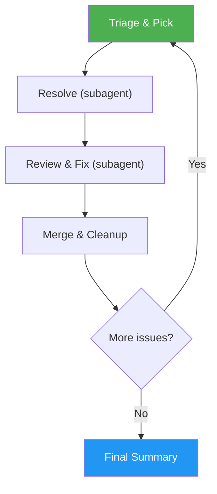

# Auto-Pilot

> Fully autonomous development loop that triages, resolves, reviews, and merges GitHub issues end-to-end with zero user prompts.

## Highlights

- **Zero-confirmation autonomy** — makes all non-critical decisions automatically, only asks for genuinely irreversible actions
- **Smart batching** — analyzes related issues and batch-resolves them in a single PR to save iterations
- **Self-healing** — auto-stashes dirty trees, auto-switches branches, auto-recovers from sync conflicts
- **Subagent architecture** — fresh context per issue keeps quality high across long runs
- **Graceful degradation** — skips failed issues and continues rather than blocking the entire loop

## When to Use

| Say this... | Skill will... |
|---|---|
| "/auto-pilot" | Triage all open issues, resolve them one by one, review, merge, repeat |
| "/auto-pilot --issues 5,10,12" | Analyze those issues for dependencies and batching, then resolve in optimal order |
| "/auto-pilot --limit 3" | Process at most 3 issues then stop |
| "/auto-pilot --dry-run" | Show the execution plan without resolving anything |

## How It Works



## Usage

```
/auto-pilot
/auto-pilot --issues 5,10,12
/auto-pilot --limit 5
/auto-pilot --dry-run
/auto-pilot --skip 7
```

## Autonomy Model

The auto-pilot classifies decisions into two categories:

- **Auto-decide** (99%) — branch switching, strategy selection, failure recovery, merging
- **Confirm with user** (rare) — force-push to shared branches, deleting remote resources, production deployments

When something fails, the auto-pilot skips and continues rather than stopping. All work is pushed to remote PRs, so nothing is lost.

## Resources

| Path | Description |
|---|---|
| `references/subagent-prompts.md` | Exact prompts for resolver, reviewer, analyzer, and batch-resolver subagents |
| `references/error-messages.md` | Complete error catalog with triggers and autonomous recovery actions |

## Output

Produces a structured summary after all iterations complete, showing per-issue pass/fail status, PR links, and batch savings.
