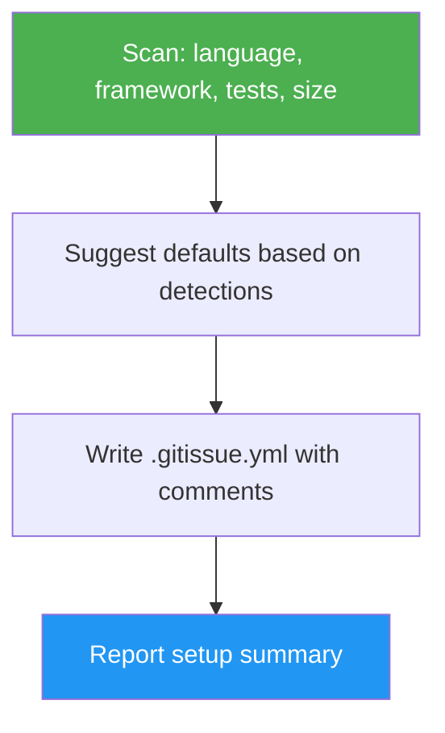

# Init Gitissue

> Scan your repository and generate a tailored `.gitissue.yml` config with project-specific defaults.

## Highlights

- Auto-detects language, framework, test runner, and repo size
- Generates config with inline comments explaining every setting
- Adjusts timeouts and thresholds based on project characteristics
- Handles existing configs with overwrite/merge/cancel options
- Works offline — no GitHub authentication required

## When to Use

| Say this... | Skill will... |
|---|---|
| `/init-gitissue` | Scan the repo and generate a `.gitissue.yml` with detected defaults |
| "set up gitissue for this project" | Detect language/framework/tests and write a tailored config |
| "configure my repo for IDD" | Generate project-specific gitissue configuration |
| "what settings should I use" | Scan the codebase and suggest appropriate settings |

## How It Works



## Installation

Install via [npx (Vercel)](https://www.npmjs.com/package/skills):

```bash
npx skills add https://github.com/luongnv89/idd --skill init-gitissue
```

Or via [agent-skill-manager (asm)](https://www.npmjs.com/package/agent-skill-manager):

```bash
asm install https://github.com/luongnv89/idd --skill init-gitissue
```

## Usage

```
/init-gitissue
```

## Resources

| Path | Description |
|---|---|
| `references/examples.md` | Full example outputs for typical detection and merge scenarios |
| `references/error-messages.md` | Error catalog for missing git repo, existing config, and detection failures |
| `templates/gitissue-template.yml` | Annotated `.gitissue.yml` template the skill fills in and writes |

## Output

A `.gitissue.yml` file in the repo root with:
- All config fields from the gitissue schema
- Inline comments explaining each setting
- Values tailored to the detected language, framework, test runner, and repo size
- Header comment documenting what was detected
