<!-- Generated from /docs/config-schema.md. Do not edit. Edit source and run ./scripts/build.sh. -->
# `.gitissue.yml` Configuration Schema

gitissue works with zero configuration — all settings have sensible defaults. When no `.gitissue.yml` file exists, the first-run hint is shown:

```
○ First run — using default config. Run /init-gitissue to customize.
```

Place `.gitissue.yml` in the repository root to customize behavior.

### Config Loading Flow

A skill loads the file once at start. Present and valid → use it. Present and
invalid → stop with the line-numbered errors under *Validation* below. Absent →
use the defaults and print the first-run hint above.

### Config Hierarchy

Three inputs, each with its own lifetime: `.gitissue.yml` is configuration, read
**once** at skill start; `.gitissue/` is state, read and written **during**
execution; the built-in skill defaults are the **fallback** when no config file
exists.

## Core Fields

Ten fields cover almost every customization in practice — `platform`, `issue.auto_normalize`, `resolve.branch_prefix`, `resolve.auto_test`, `resolve.test_timeout`, `triage.stale_threshold_days`, `autopilot.mode`, `autopilot.review_cycles`, `autopilot.skip_labels`, and `review.require_acceptance_criteria_check`. Start with those (the README shows a ready-to-copy sample); treat everything below as the **advanced reference** — useful when a specific behavior needs tuning, never required.

## Full Schema (advanced reference)

```yaml
# Tracker platform driver
# Type: string
# Values: "github" — the only implemented driver (see references/docs/platform-github.md);
#         a new driver becomes valid here once its docs/platform-<name>.md exists
# Default: "github"
platform: github

# Issue creation and normalization settings
issue:
  # Auto-normalize issues (structure-only, no codebase scan) in /issue-resolver before resolution
  # Type: boolean
  # Default: true
  auto_normalize: true

  # Issue template source
  # Type: string
  # Values: "default" | path to custom template directory
  # Default: "default"
  # When "default", uses built-in templates (bug.md, feature.md, improvement.md)
  # When a path, looks for bug.md, feature.md, improvement.md in that directory
  template: default

  # Auto-suggest labels based on issue content and type
  # Type: boolean
  # Default: true
  labels_auto_suggest: true

  # Post a comment when normalizing an issue
  # Type: boolean
  # Default: true
  normalize_comment: true

# Resolution pipeline settings
resolve:
  # Approval gate for the plan phase
  # Type: string
  # Values: "auto" | "comment-and-wait"
  # Default: "auto"
  # "auto": proceed immediately after planning
  # "comment-and-wait": show plan and wait for user approval
  # Note: with resolve.adaptive_effort: true (default), a light-profile (trivial
  #   XS/S) issue proceeds on a direct minimal plan without the option prompt —
  #   it produces no 3-option comparison to wait on. Set adaptive_effort: false
  #   to force the approval wait on every issue regardless of complexity.
  approval_gate: auto

  # Branch naming prefix
  # Type: string
  # Default: "auto"
  # "auto" uses type-based prefixes: fix/, feat/, refactor/, docs/, test/, chore/
  # Branch format: {type}/{issue_number}-{short-description}
  # Examples: fix/42-mobile-auth-redirect, feat/15-add-dark-mode
  # Set a custom string (e.g., "issue-") to override type-based naming
  branch_prefix: "auto"

  # Run tests before creating PR
  # Type: boolean
  # Default: true
  auto_test: true

  # Abort verify phase after N seconds
  # Type: integer
  # Default: 300 (5 minutes)
  # Minimum: 30
  # Maximum: 3600
  test_timeout: 300

  # (Removed) pr_auto_link — deprecated. SPEC §5.1 requires the PR body to open with
  # `Closes #N`; issue-resolver always includes that line unconditionally.

  # Warn if resolve produces more than N commits
  # Type: integer
  # Default: 10
  # Minimum: 1
  max_commits: 10

  # Max QA review-fix cycles during resolve Step 4
  # Type: integer
  # Default: 5
  # Minimum: 1
  # Maximum: 10
  qa_max_cycles: 5

  # Scale the resolve pipeline to each issue's complexity (adaptive effort).
  # Type: boolean
  # Default: true
  # When true, trivial issues (pre-work Effort band XS/S, asserted) take a
  # lighter, faster, lower-token path: a lighter Research step (the
  # already-resolved safety check still runs), the 3-option synthesis in Plan is
  # skipped for a direct minimal plan, the propose-relevant-skills sub-step is
  # skipped, and QA is capped at 1 cycle. The Decision Record and Acceptance
  # Criteria Verification table are always emitted regardless. Complex or
  # ambiguous issues (M/L/XL, low-confidence, or no band) keep the full pipeline.
  # When false, every issue gets the full pipeline as before — the profile is
  # pinned to "full". The chosen profile is surfaced on the [0/5] tracker line
  # and in the run log's `profile` field. See
  # https://github.com/luongnv89/idd/blob/main/docs/agent-model-effort.md
  # (Complexity → pipeline profile).
  adaptive_effort: true

  # UI/UX review settings (Step 4 — QA)
  # Code-level UI review is auto-detected per issue and always runs when UI
  # work is present; it needs no flag and runs in any environment (including
  # headless servers with no display). Only the optional browser (screenshot)
  # review is gated here.
  ui_review:
    # Browser (screenshot) review mode
    # Type: string enum
    # Values: "false" (never) | "ask" (prompt interactive, skip in auto) | "true" (always attempt)
    # Default: "ask"
    # Note: when enabled it still skips (fail-soft to code-only) if no app is
    #       running/reachable or capture is unsafe — it never blocks code review.
    browser_review: "ask"

# PR review settings (used by /issue-pr-review and /auto-pilot)
review:
  # Max review-fix cycles before stopping
  # Type: integer
  # Default: 3
  # Minimum: 1
  # Maximum: 10
  max_cycles: 3

  # Scale review depth to each PR's complexity (adaptive depth).
  # Type: boolean
  # Default: true
  # When true, /issue-pr-review derives a pre-work complexity signal from the PR
  # (diff size, files-changed, labels, and the linked issue's Effort band — the
  # fuller of any that disagree) and, for a trivial PR, caps the review-fix loop
  # at 1 cycle and skips optional passes. The acceptance-criteria and
  # traceability hard-blocks always run at full strength. Complex or ambiguous
  # PRs keep the full max_cycles depth. When false, every PR gets full review
  # depth as before — the profile is pinned to "full". The chosen depth is
  # surfaced on the [1/7] tracker line. See
  # https://github.com/luongnv89/idd/blob/main/docs/agent-model-effort.md
  # (Complexity → pipeline profile).
  adaptive_depth: true

  # Auto-merge PR when clean (overridden to true in --auto mode)
  # Type: boolean
  # Default: false
  auto_merge: false

  # Only report issues at or above this confidence level (0-100)
  # Type: integer
  # Default: 80
  # Minimum: 50
  # Maximum: 100
  confidence_threshold: 80

  # Run tests as part of the review pipeline
  # Type: boolean
  # Default: true
  run_tests: true

  # Check CI status as part of the review pipeline
  # Type: boolean
  # Default: true
  check_ci: true

  # Seconds between CI status polls
  # Type: integer
  # Default: 30
  # Minimum: 10
  # Maximum: 120
  ci_poll_interval: 30

  # Abort CI polling after N seconds
  # Type: integer
  # Default: 600 (10 minutes)
  # Minimum: 60
  # Maximum: 3600
  ci_timeout: 600

  # Abort test suite after N seconds
  # Type: integer
  # Default: 300 (5 minutes)
  # Minimum: 30
  # Maximum: 3600
  test_timeout: 300

  # Allow note findings and partial dimensions after all fixables are resolved.
  # Type: boolean
  # Default: true
  # When false, require every enabled review dimension to pass with no notes;
  # partial/note findings remain blockers for a clean result and auto-merge.
  soft_pass: true

  # Run per-criterion acceptance-criteria verification against the linked issue.
  # Type: boolean
  # Default: true
  # When true, /issue-pr-review parses the linked issue's `## Acceptance Criteria`
  # and reports each criterion as pass/fail/unverified; any `fail` blocks soft-pass.
  # When false, the acceptance_criteria dimension is reported as `pass` with a
  # "verification disabled" note and never blocks. Default true preserves the
  # contract from issue #36.
  require_acceptance_criteria_check: true

  # Run the four traceability checks against the PR body and commit history.
  # Type: boolean
  # Default: true
  # When true, /issue-pr-review verifies `Closes #N`, commit references,
  # Decision Record presence, and Acceptance Criteria Verification block; the
  # missing-`Closes #N` case blocks soft-pass even on green tests/CI.
  # When false, the traceability dimension is reported as `pass` with a
  # "verification disabled" note and never blocks. Default true preserves the
  # contract from issue #36.
  require_traceability_check: true

  # PR labels that exempt a PR from the `Closes #N` hard-fail (check 1 only).
  # Type: list of strings (label names — exact, case-sensitive match)
  # Default: ["refactor", "chore"]
  # When the PR carries any label in this list, /issue-pr-review skips the
  # `Closes #N` check and reports `traceability: pass — exempt`. The other
  # three traceability checks (commit reference, Decision Record, Acceptance
  # Criteria Verification block) still run and report `partial` if absent.
  # Set to [] to disable label-based exemption (see also traceability_exempt_pattern).
  traceability_exempt_labels:
    - refactor
    - chore

  # PR-body pattern that exempts a PR from the `Closes #N` hard-fail (check 1 only).
  # Type: string (regex, multiline-anchored, case-insensitive)
  # Default: "^\\s*Type:\\s*(refactor|chore)\\s*$"
  # When the PR body contains a line matching this pattern, /issue-pr-review
  # skips the `Closes #N` check and reports `traceability: pass — exempt`. The
  # other three traceability checks still run.
  # Set to "" to disable pattern-based exemption. Setting both this and
  # traceability_exempt_labels to empty restores strict issue #36 behavior.
  traceability_exempt_pattern: "^\\s*Type:\\s*(refactor|chore)\\s*$"

  # UI/UX review settings (Step 3 — Review)
  # Code-level UI review is auto-detected per PR and always runs when UI work is
  # present; it needs no flag and runs in any environment (including headless
  # servers with no display). Only the optional browser (screenshot) review is
  # gated here.
  ui_review:
    # Browser (screenshot) review mode
    # Type: string enum
    # Values: "false" (never) | "ask" (prompt interactive, skip in auto) | "true" (always attempt)
    # Default: "ask"
    # Note: when enabled it still skips (fail-soft to code-only) if no app is
    #       running/reachable or capture is unsafe — it never blocks code review.
    browser_review: "ask"

# Auto-pilot settings (used by /auto-pilot)
autopilot:
  # Merge mode — controls when /auto-pilot is allowed to merge PRs.
  # Type: string
  # Values: "conservative" | "balanced" | "aggressive"
  # Default: "balanced"
  # "balanced":     auto-merge clean PRs only. Unresolved issues create a follow-up
  #                 and leave the PR open. Recommended default for most projects.
  # "conservative": create PR, run review-fix cycles, leave PR open. Never auto-merges.
  # "aggressive":   auto-merge clean PRs AND, when merge_partial=true, merge partial
  #                 PRs with a follow-up issue. Documented as risky; opt-in only.
  # When set, this field is authoritative — autopilot.auto_merge is ignored.
  mode: balanced

  # Allow merging PRs that still have unresolved fixable review issues.
  # Type: boolean
  # Default: false
  # Only honored when mode is "aggressive"; ignored otherwise. Both keys must be
  # set explicitly to reach partial-merge behavior — there is no casual opt-in.
  merge_partial: false

  # Max iterations (issues to process) before stopping
  # Type: integer
  # Default: 10
  # Minimum: 1
  # Maximum: 50
  max_iterations: 10

  # Max review-fix cycles per PR (overrides review.max_cycles in subagent prompt)
  # Type: integer
  # Default: 3
  # Minimum: 1
  # Maximum: 10
  review_cycles: 3

  # Auto-merge PRs after review passes
  # Type: boolean
  # Default: true
  # LEGACY: kept for backwards compatibility. Ignored when autopilot.mode is set.
  # When mode is unset and auto_merge is not explicitly present in the file, effective mode is balanced.
  # When mode is unset but auto_merge is explicitly present, legacy interpretation applies:
  #   auto_merge: true  ≈ mode: aggressive + merge_partial: true (preserves prior 2.1.x behavior)
  #   auto_merge: false ≈ mode: conservative
  auto_merge: true

  # Pause loop on failure instead of skipping to next issue
  # Type: boolean
  # Default: false (skip failed issues and continue; set true to halt the loop on failure)
  pause_on_failure: false

  # Labels that cause an issue to be skipped
  # Type: array of strings
  # Default: ["wontfix", "blocked", "do-not-merge"]
  skip_labels:
    - wontfix
    - blocked
    - do-not-merge

  # Labels that mark an issue as critical (processed first)
  # Type: array of strings
  # Default: ["critical", "priority:critical"]
  critical_labels:
    - critical
    - priority:critical

  # Respect "Depends on #N" / "Blocked by #N" markers in issue bodies: never
  # merge a PR whose dependencies are not yet merged. The blocked PR is left
  # open with outcome blocked_by_dependency and the loop continues to the next
  # eligible issue — the run is not paused. When disabled, the merge gate is
  # skipped — useful for repos that do not use the convention. See
  # https://github.com/luongnv89/idd/blob/main/docs/idd-methodology.md
  # (Issue Dependencies) for the marker syntax.
  # Type: boolean
  # Default: true
  respect_dependencies: true

# Triage settings
triage:
  # Flag issues with no activity beyond this threshold (days)
  # Type: integer
  # Default: 14
  # Minimum: 1
  stale_threshold_days: 14

  # Suggest priorities based on type, age, and dependency position
  # Type: boolean
  # Default: true
  auto_priority: true

  # Include recently closed issues in triage analysis
  # Type: boolean
  # Default: false
  include_closed: false

  # Max seconds to scan codebase per issue for file dependencies
  # Type: integer
  # Default: 30
  # Minimum: 5
  # Maximum: 300
  scan_timeout_per_issue: 30

# Issue analysis settings
analysis:
  # Max files to read during deep analysis (more thorough than resolver's 20)
  # Type: integer
  # Default: 30
  # Minimum: 5
  # Maximum: 100
  max_files: 30

  # How many levels of import dependencies to trace
  # Type: integer
  # Default: 3
  # Minimum: 1
  # Maximum: 5
  trace_depth: 3

  # Max seconds for the full codebase scan phase
  # Type: integer
  # Default: 120
  # Minimum: 30
  # Maximum: 600
  scan_timeout: 120

# GitHub Projects board sync settings
# See https://github.com/luongnv89/idd/blob/main/docs/github-projects-sync.md
# for the full integration reference
projects:
  # Enable automatic project board status sync
  # Type: boolean
  # Default: false
  # When false, all project sync operations are silently skipped
  sync_enabled: false

  # Explicit project number (from the project URL)
  # Type: integer or null
  # Default: null (auto-detect first linked project)
  # Set this if the repo has multiple linked projects
  project_number: null

  # Name of the Status field on the project board
  # Type: string
  # Default: "Status"
  # Must match the exact field name on the project (case-sensitive)
  status_field: "Status"

  # Map of internal status keys to project board option values
  # Type: object
  # Each value must match an option name in the Status field
  status_map:
    # Status for newly created issues
    # Type: string
    # Default: "Todo"
    todo: "Todo"

    # Status when work starts (branch created)
    # Type: string
    # Default: "In Progress"
    in_progress: "In Progress"

    # Status when PR is created
    # Type: string
    # Default: "Done"
    done: "Done"

# Model suggestion settings (used by /issue-creator)
# See src/skills/issue-creator/references/model-suggestion.md for the full procedure
model_suggestion:
  # Suggest a cost-effective model + thinking level per issue, from CursorBench
  # data cached at the skill level in model-data-<date>.json (shared across all
  # repos, not per-project; force-refresh with --refresh-model-data)
  # Type: boolean
  # Default: true
  # When false, all model-suggestion behavior is silently skipped and the issue
  # body / preview are unchanged from the pre-feature behavior
  enabled: true

  # Source URL refreshed into the cache on opt-in
  # Type: string
  # Default: "https://cursor.com/cursorbench"
  data_url: "https://cursor.com/cursorbench"

  # Days before the cached model data is considered stale (warning + refresh prompt)
  # Type: integer
  # Default: 7
  cache_ttl_days: 7

# Pre-commit security scan settings (used by every skill that commits or pushes)
# The built-in rules always apply; these keys only *extend* them. There is no
# key that disables a rule — a scan a repository can switch off is not a gate.
# The rules themselves live in the pre-commit security conventions reference.
security:
  # Extra regex ORed onto the built-in secret-bearing *filename* pattern
  # Type: string (a Python regex; empty means built-ins only)
  # Default: ""
  # Example: "(^|/)service-account\\.json$"
  extra_secret_file_pattern: ""

  # Extra regex ORed onto the built-in real-API-key *value* pattern
  # Type: string (a Python regex; empty means built-ins only)
  # Default: ""
  # Prefer prefix + length over identifier + value — the latter false-positives
  # on docstrings and tests, which is how a scan gets disabled in practice
  # Example: "acme_live_[A-Za-z0-9]{24,}"
  extra_secret_value_pattern: ""

  # Paths matching this regex are skipped entirely (fixtures, golden files)
  # Type: string (a Python regex; empty means scan everything)
  # Default: ""
  # Every path it excludes is a path no rule can block — keep it narrow
  # Example: "^tests/fixtures/"
  allow_pattern: ""

  # Warn (never block) when a scanned file exceeds this size, in megabytes
  # Type: integer
  # Default: 10
  # Minimum: 1
  max_file_size_mb: 10
```

### Config Section Map

```mermaid
graph TD
    R[".gitissue.yml"] --> P["platform<br/>(driver: github)"]
    R --> I["issue"]
    R --> RS["resolve"]
    R --> RV["review"]
    R --> AP["autopilot"]
    R --> T["triage"]
    R --> A["analysis"]
    R --> PR["projects"]
    R --> MS["model_suggestion"]
    R --> SEC["security"]

    I --> I1["auto_normalize"]
    I --> I2["template"]
    I --> I3["labels_auto_suggest"]
    I --> I4["normalize_comment"]

    RS --> R1["approval_gate"]
    RS --> R2["branch_prefix"]
    RS --> R3["auto_test"]
    RS --> R4["test_timeout"]
    RS --> R5["pr_auto_link"]
    RS --> R6["max_commits"]
    RS --> R7["qa_max_cycles"]
    RS --> R8["adaptive_effort"]

    RV --> RV1["max_cycles"]
    RV --> RV14["adaptive_depth"]
    RV --> RV2["auto_merge"]
    RV --> RV3["confidence_threshold"]
    RV --> RV4["run_tests"]
    RV --> RV5["check_ci"]
    RV --> RV6["ci_poll_interval"]
    RV --> RV7["ci_timeout"]
    RV --> RV8["test_timeout"]
    RV --> RV9["soft_pass"]
    RV --> RV10["require_acceptance_criteria_check"]
    RV --> RV11["require_traceability_check"]
    RV --> RV12["traceability_exempt_labels"]
    RV --> RV13["traceability_exempt_pattern"]

    AP --> AP0["mode"]
    AP --> AP00["merge_partial"]
    AP --> AP1["max_iterations"]
    AP --> AP2["review_cycles"]
    AP --> AP3["auto_merge<br/>(legacy)"]
    AP --> AP4["pause_on_failure"]
    AP --> AP5["skip_labels"]
    AP --> AP6["critical_labels"]

    T --> T1["stale_threshold_days"]
    T --> T2["auto_priority"]
    T --> T3["include_closed"]
    T --> T4["scan_timeout_per_issue"]

    A --> A1["max_files"]
    A --> A2["trace_depth"]
    A --> A3["scan_timeout"]

    PR --> PR1["sync_enabled"]
    PR --> PR2["project_number"]
    PR --> PR3["status_field"]
    PR --> PR4["status_map"]

    MS --> MS1["enabled"]
    MS --> MS2["data_url"]
    MS --> MS3["cache_ttl_days"]

    SEC --> SEC1["extra_secret_file_pattern"]
    SEC --> SEC2["extra_secret_value_pattern"]
    SEC --> SEC3["allow_pattern"]
    SEC --> SEC4["max_file_size_mb"]

    style R fill:#4CAF50,color:#fff
```



## `.gitissue/` Directory

The `.gitissue/` directory at the repo root stores persistent state generated by gitissue skills. It sits alongside `.gitissue.yml` (configuration) and is created automatically on first use.

| File | Written by | Description |
|------|-----------|-------------|
| `.gitissue/triage.json` | `/issue-triage` | Cached triage analysis (JSON schema v1) — issue priorities, dependencies, execution order, and history |
| `.gitissue/analysis-<N>.json` | `/issue-analysis` | Deep analysis of issue #N — affected files, root cause, implementation options, complexity, and risk |
| `.gitissue/runs.jsonl` | `/issue-resolver`, `/auto-pilot` | Append-only run log — exactly one JSON line per processed issue (under `/auto-pilot`, the resolver runs with `--no-run-log` so only auto-pilot writes; see *Single writer* in [run-log-schema.md](https://github.com/luongnv89/idd/blob/main/docs/run-log-schema.md)). Cross-run telemetry for monitoring. |

> **Not in `.gitissue/`:** the model-suggestion cache is **skill-level**, not
> per-repo. `/issue-creator` caches CursorBench scoring data at the installed
> skill folder as `model-data-<date>.json` (one per machine, shared across all
> repos), seeded from the skill bundle and refreshed on opt-in or via
> `--refresh-model-data`. A legacy `.gitissue/model-data.json` from an older
> version is ignored and may be deleted. See
> `src/skills/issue-creator/references/model-suggestion.md`.

**Conventions:**
- Skills create `.gitissue/` via `mkdir -p` if it doesn't exist
- JSON files are formatted for readable git diffs
- A full re-triage overwrites `triage.json` entirely (not append)
- `runs.jsonl` is **append-only** — skills add one line per run and never edit prior lines; its absence or deletion is non-fatal
- The directory should be committed to the repo (it contains project state, not secrets)

### `.gitissue/runs.jsonl` — run log (monitoring)

The run log has its own canonical schema document — field set, append rules,
and the single-writer / `--no-run-log` suppression convention:
[run-log-schema.md](https://github.com/luongnv89/idd/blob/main/docs/run-log-schema.md).
Skills that only append a telemetry line read that document instead of this one.

## Validation

Config is validated on load at the start of every skill invocation. Errors include line numbers:

```
✗ Invalid config: .gitissue.yml

  Line 8: issue.template must be "default" or a valid directory path
  Line 15: resolve.test_timeout must be between 30 and 3600

  To fix:  edit .gitissue.yml and correct the values above
  Docs:    https://github.com/luongnv89/idd/blob/main/docs/config-schema.md
```

## Defaults Table

| Setting | Default | Description |
|---------|---------|-------------|
| `platform` | `github` | Tracker platform driver — `github` is the only implemented driver (references/docs/platform-github.md) |
| `issue.auto_normalize` | `true` | Auto-normalize in /issue-resolver |
| `issue.template` | `default` | Built-in templates |
| `issue.labels_auto_suggest` | `true` | Suggest labels from content |
| `issue.normalize_comment` | `true` | Comment on normalization |
| `resolve.approval_gate` | `auto` | No approval wait |
| `resolve.branch_prefix` | `auto` | Type-based branch prefix (fix/, feat/, etc.) |
| `resolve.auto_test` | `true` | Run tests before PR |
| `resolve.test_timeout` | `300` | 5 minute test timeout |
| *(removed)* `resolve.pr_auto_link` | — | Deprecated; `Closes #N` is unconditional per SPEC §5.1 |
| `resolve.max_commits` | `10` | Max commits warning |
| `resolve.qa_max_cycles` | `5` | Max QA review-fix cycles during resolve Step 4 |
| `resolve.adaptive_effort` | `true` | Scale the resolve pipeline to issue complexity — trivial issues (Effort XS/S) take a lighter path (lighter Research, skip 3-option Plan, skip propose-skills, QA capped at 1 cycle); `false` pins every issue to the full pipeline ([agent-model-effort.md](https://github.com/luongnv89/idd/blob/main/docs/agent-model-effort.md)) |
| `resolve.ui_review.browser_review` | `"ask"` | Browser (screenshot) UI review mode; code UI review is auto-detected and always runs |
| `review.max_cycles` | `3` | Max review-fix cycles |
| `review.adaptive_depth` | `true` | Scale review depth to PR complexity — a trivial PR caps the review-fix loop at 1 cycle and skips optional passes (AC + traceability hard-blocks still run); `false` pins every PR to full depth ([agent-model-effort.md](https://github.com/luongnv89/idd/blob/main/docs/agent-model-effort.md)) |
| `review.auto_merge` | `false` | Auto-merge PR when clean |
| `review.confidence_threshold` | `80` | Min confidence level for issues |
| `review.run_tests` | `true` | Run tests during review |
| `review.check_ci` | `true` | Check CI status during review |
| `review.ci_poll_interval` | `30` | Seconds between CI polls |
| `review.ci_timeout` | `600` | CI polling timeout |
| `review.test_timeout` | `300` | Review test timeout |
| `review.soft_pass` | `true` | Allow note findings and partial dimensions after fixables resolve; `false` requires no notes and all enabled dimensions pass |
| `review.require_acceptance_criteria_check` | `true` | Run per-criterion acceptance-criteria verification; `fail` blocks soft-pass |
| `review.require_traceability_check` | `true` | Run the four traceability checks; missing `Closes #N` blocks soft-pass |
| `review.traceability_exempt_labels` | `["refactor", "chore"]` | PR labels that exempt a PR from the `Closes #N` hard-fail (check 1 only; other three checks still run) |
| `review.traceability_exempt_pattern` | `"^\\s*Type:\\s*(refactor\|chore)\\s*$"` | Regex (multiline, case-insensitive) matched against PR body for exemption from check 1 |
| `review.ui_review.browser_review` | `"ask"` | Browser (screenshot) UI review mode; code UI review is auto-detected and always runs |
| `autopilot.mode` | `balanced` | Merge mode: `balanced` (auto-merge clean PRs), `conservative` (never merge), `aggressive` (merge clean + partial w/ `merge_partial: true`) |
| `autopilot.merge_partial` | `false` | Allow merging PRs with unresolved review issues. Only honored when `mode: aggressive` |
| `autopilot.max_iterations` | `10` | Max issues to process |
| `autopilot.review_cycles` | `3` | Max review-fix cycles per PR |
| `autopilot.auto_merge` | `true` | LEGACY — auto-merge PRs after review. Ignored when `autopilot.mode` is set |
| `autopilot.pause_on_failure` | `false` | Skip failed issues and continue (`true` pauses the loop) |
| `autopilot.skip_labels` | `["wontfix", "blocked", "do-not-merge"]` | Labels that skip issues |
| `autopilot.critical_labels` | `["critical", "priority:critical"]` | Labels that prioritize issues |
| `autopilot.respect_dependencies` | `true` | Honor `Depends on #N` / `Blocked by #N` markers — never merge a PR whose dependencies are unmerged; the PR is left open (`blocked_by_dependency`) and the loop continues |
| `triage.stale_threshold_days` | `14` | Stale issue threshold |
| `triage.auto_priority` | `true` | Auto-suggest priorities |
| `triage.include_closed` | `false` | Exclude closed from triage |
| `triage.scan_timeout_per_issue` | `30` | Max seconds per issue scan |
| `analysis.max_files` | `30` | Max files to read during analysis |
| `analysis.trace_depth` | `3` | Import trace depth levels |
| `analysis.scan_timeout` | `120` | Max seconds for codebase scan |
| `projects.sync_enabled` | `false` | Enable project board sync |
| `projects.project_number` | `null` | Explicit project number (null = auto-detect) |
| `projects.status_field` | `"Status"` | Name of the Status field on the board |
| `projects.status_map.todo` | `"Todo"` | Status for new issues |
| `projects.status_map.in_progress` | `"In Progress"` | Status when work starts |
| `projects.status_map.done` | `"Done"` | Status when PR is created |
| `model_suggestion.enabled` | `true` | Suggest a model + thinking level per issue |
| `model_suggestion.data_url` | `"https://cursor.com/cursorbench"` | CursorBench source refreshed into the cache |
| `model_suggestion.cache_ttl_days` | `7` | Days before cached model data is stale |
| `security.extra_secret_file_pattern` | `""` | Extra regex ORed onto the built-in secret-bearing filename pattern |
| `security.extra_secret_value_pattern` | `""` | Extra regex ORed onto the built-in real-API-key value pattern |
| `security.allow_pattern` | `""` | Paths matching this regex are skipped entirely — every exclusion is a path no rule can block |
| `security.max_file_size_mb` | `10` | Warn (never block) above this file size without Git LFS |
