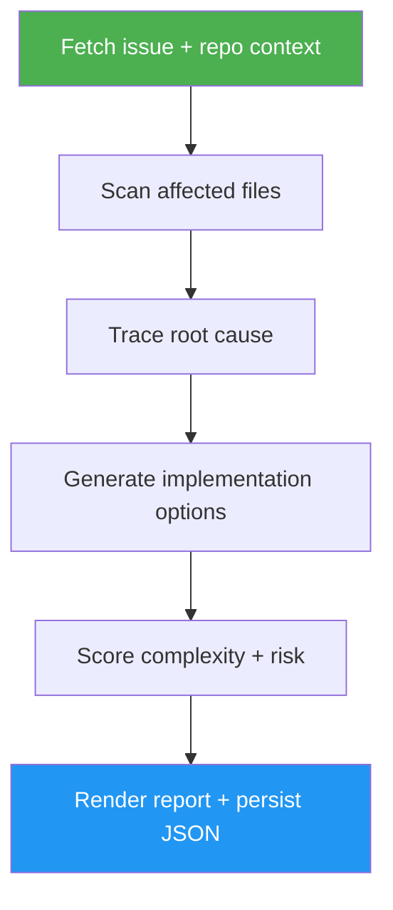

# Issue Analysis

> Deep analysis of a single GitHub issue — root cause, architecture impact, implementation options, complexity, and risk — persisted to `.gitissue/analysis-N.json`.

## Highlights

- Scans the codebase for files most relevant to the issue
- Traces root cause across modules rather than just symptoms
- Generates multiple implementation options with trade-offs (effort, risk, blast radius)
- Scores complexity and risk so planning decisions are explicit
- Persists full analysis to `.gitissue/analysis-N.json` for later reuse
- Offers a fast `view` mode that re-renders the cached report without re-scanning

## When to Use

| Say this... | Skill will... |
|---|---|
| `/issue-analysis 42` | Run a full root-cause + options analysis of issue #42 |
| `/issue-analysis 42 view` | Re-render the cached analysis without calling GitHub |
| "how hard is #42" | Score complexity/risk and outline implementation options |
| "investigate issue #42" | Trace root cause across affected files and modules |
| "impact analysis for #42" | Surface blast radius, dependencies, and migration concerns |

## How It Works



## Installation

Install via [npx (Vercel)](https://www.npmjs.com/package/skills):

```bash
npx skills add https://github.com/luongnv89/idd --skill issue-analysis
```

Or via [agent-skill-manager (asm)](https://www.npmjs.com/package/agent-skill-manager):

```bash
asm install https://github.com/luongnv89/idd --skill issue-analysis
```

## Usage

```
/issue-analysis <N>
/issue-analysis <N> view
```

## Resources

| Path | Description |
|---|---|
| `references/error-messages.md` | Error catalog for auth failures, missing issues, corrupted cache, and empty states |

## Output

A structured analysis report in the terminal with:
- Issue summary and reporter context
- Root cause + affected files
- 2–3 implementation options with effort/risk trade-offs
- Complexity score and recommended approach
- Persistent JSON report at `.gitissue/analysis-N.json`
