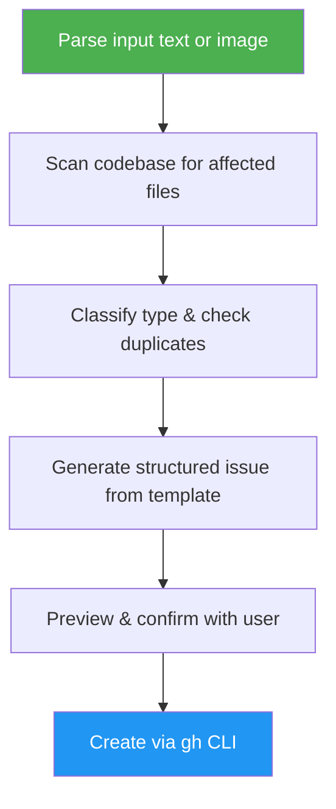
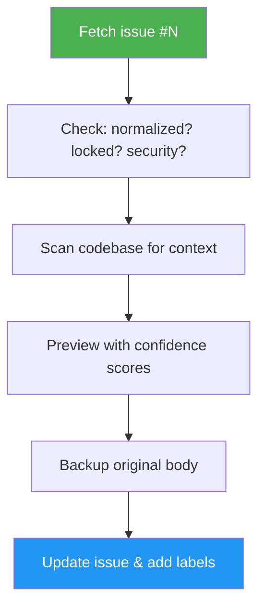

# Issue Creator

> Create structured, codebase-aware GitHub issues — single, batch, or normalize existing ones with codebase context.

## Highlights

- Scans your codebase to identify affected files with confidence levels (high/medium/low)
- Auto-classifies issues as bug, feature, or improvement
- **Batch mode**: extract multiple issues from a single input with preview table and approval
- Normalizes messy existing issues with backup safety and security-label protection
- Generates acceptance criteria, technical notes, and labels from codebase context

## When to Use

| Say this... | Skill will... |
|---|---|
| "/issue-creator the login page is broken on mobile" | Scan codebase, create structured bug issue with affected files and acceptance criteria |
| "/issue-creator 42" | Fetch issue #42, enrich with codebase context, preserve original text in backup |
| "/issue-creator 42 --dry-run" | Preview what normalization would add without changing anything |
| "file a bug about the checkout timeout" | Create a structured bug issue from the description |
| "/issue-creator 1. Fix auth bug 2. Add dark mode 3. Refactor DB" | Detect 3 items, show preview table, create all after approval |

## How It Works



**Normalization flow** (for existing issues):



## Installation

Install via [npx (Vercel)](https://www.npmjs.com/package/skills):

```bash
npx skills add https://github.com/luongnv89/idd --skill issue-creator
```

Or via [agent-skill-manager (asm)](https://www.npmjs.com/package/agent-skill-manager):

```bash
asm install https://github.com/luongnv89/idd --skill issue-creator
```

## Usage

```
/issue-creator <description>        # New issue from text
/issue-creator <multi-item text>    # Batch create from list/document
/issue-creator <N>                  # Normalize existing issue
/issue-creator <N> --dry-run        # Preview normalization
/issue-creator <N> --force          # Normalize security-labeled issue
```

## Resources

| Path | Description |
|---|---|
| `templates/` | Issue templates for bug, feature, and improvement types |
| `references/` | Error message catalog with exact output format |

## Output

- A structured GitHub issue with `<!-- gitissue:normalized v1 -->` marker
- Terminal preview with confidence scores before creation
- For batch: preview table of all items, per-item progress, summary with retry hints for failures
- For normalization: backup comment preserving original body, normalization summary comment
