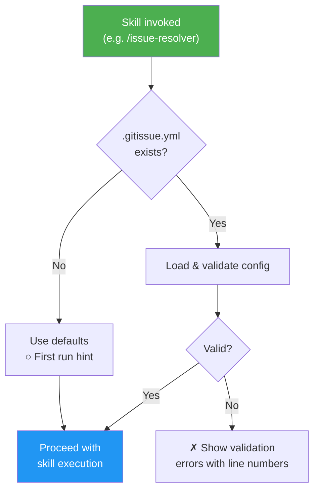
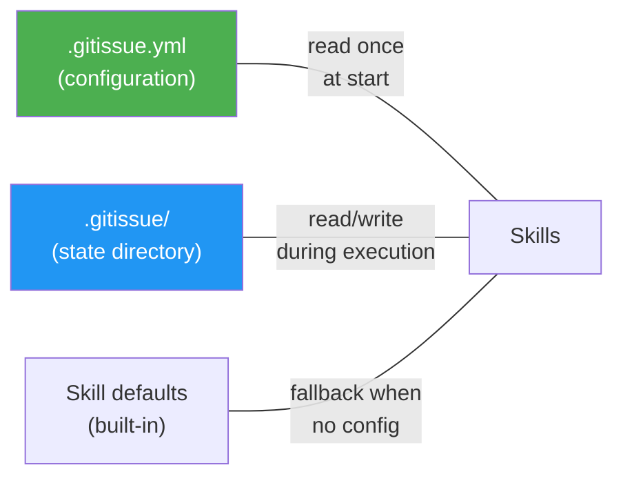

<!-- Generated from /docs/config-schema.md. Do not edit. Edit source and run ./scripts/build.sh. -->
# `.gitissue.yml` Configuration Schema

> **Per-skill excerpt (generated).** Only the configuration sections this skill reads are reproduced here: `issue`, `model_suggestion`, `platform`, `projects`, `triage`. The complete schema — every section and the full defaults table — is at [config-schema.md](https://github.com/luongnv89/idd/blob/main/docs/config-schema.md).

gitissue works with zero configuration — all settings have sensible defaults. When no `.gitissue.yml` file exists, the first-run hint is shown:

```
○ First run — using default config. Run /init-gitissue to customize.
```

Place `.gitissue.yml` in the repository root to customize behavior.

### Config Loading Flow



### Config Hierarchy



## Core Fields

Ten fields cover almost every customization in practice — `platform`, `issue.auto_normalize`, `resolve.branch_prefix`, `resolve.auto_test`, `resolve.test_timeout`, `triage.stale_threshold_days`, `autopilot.mode`, `autopilot.review_cycles`, `autopilot.skip_labels`, and `review.require_acceptance_criteria_check`. Start with those (the README shows a ready-to-copy sample); treat everything below as the **advanced reference** — useful when a specific behavior needs tuning, never required.

## Full Schema (advanced reference)

```yaml
# Tracker platform driver
# Type: string
# Values: "github" — the only implemented driver (see references/docs/platform-github.md);
#         a new driver becomes valid here once its docs/platform-<name>.md exists
# Default: "github"
platform: github

# Issue creation and normalization settings
issue:
  # Auto-normalize issues (structure-only, no codebase scan) in /issue-resolver before resolution
  # Type: boolean
  # Default: true
  auto_normalize: true

  # Issue template source
  # Type: string
  # Values: "default" | path to custom template directory
  # Default: "default"
  # When "default", uses built-in templates (bug.md, feature.md, improvement.md)
  # When a path, looks for bug.md, feature.md, improvement.md in that directory
  template: default

  # Auto-suggest labels based on issue content and type
  # Type: boolean
  # Default: true
  labels_auto_suggest: true

  # Post a comment when normalizing an issue
  # Type: boolean
  # Default: true
  normalize_comment: true

# Triage settings
triage:
  # Flag issues with no activity beyond this threshold (days)
  # Type: integer
  # Default: 14
  # Minimum: 1
  stale_threshold_days: 14

  # Suggest priorities based on type, age, and dependency position
  # Type: boolean
  # Default: true
  auto_priority: true

  # Include recently closed issues in triage analysis
  # Type: boolean
  # Default: false
  include_closed: false

  # Max seconds to scan codebase per issue for file dependencies
  # Type: integer
  # Default: 30
  # Minimum: 5
  # Maximum: 300
  scan_timeout_per_issue: 30

# GitHub Projects board sync settings
# See https://github.com/luongnv89/idd/blob/main/docs/github-projects-sync.md
# for the full integration reference
projects:
  # Enable automatic project board status sync
  # Type: boolean
  # Default: false
  # When false, all project sync operations are silently skipped
  sync_enabled: false

  # Explicit project number (from the project URL)
  # Type: integer or null
  # Default: null (auto-detect first linked project)
  # Set this if the repo has multiple linked projects
  project_number: null

  # Name of the Status field on the project board
  # Type: string
  # Default: "Status"
  # Must match the exact field name on the project (case-sensitive)
  status_field: "Status"

  # Map of internal status keys to project board option values
  # Type: object
  # Each value must match an option name in the Status field
  status_map:
    # Status for newly created issues
    # Type: string
    # Default: "Todo"
    todo: "Todo"

    # Status when work starts (branch created)
    # Type: string
    # Default: "In Progress"
    in_progress: "In Progress"

    # Status when PR is created
    # Type: string
    # Default: "Done"
    done: "Done"

# Model suggestion settings (used by /issue-creator)
# See src/skills/issue-creator/references/model-suggestion.md for the full procedure
model_suggestion:
  # Suggest a cost-effective model + thinking level per issue, from CursorBench
  # data cached at the skill level in model-data-<date>.json (shared across all
  # repos, not per-project; force-refresh with --refresh-model-data)
  # Type: boolean
  # Default: true
  # When false, all model-suggestion behavior is silently skipped and the issue
  # body / preview are unchanged from the pre-feature behavior
  enabled: true

  # Source URL refreshed into the cache on opt-in
  # Type: string
  # Default: "https://cursor.com/cursorbench"
  data_url: "https://cursor.com/cursorbench"

  # Days before the cached model data is considered stale (warning + refresh prompt)
  # Type: integer
  # Default: 7
  cache_ttl_days: 7
```

## `.gitissue/` Directory

The `.gitissue/` directory at the repo root stores persistent state generated by gitissue skills. It sits alongside `.gitissue.yml` (configuration) and is created automatically on first use.

| File | Written by | Description |
|------|-----------|-------------|
| `.gitissue/triage.json` | `/issue-triage` | Cached triage analysis (JSON schema v1) — issue priorities, dependencies, execution order, and history |
| `.gitissue/analysis-<N>.json` | `/issue-analysis` | Deep analysis of issue #N — affected files, root cause, implementation options, complexity, and risk |
| `.gitissue/runs.jsonl` | `/issue-resolver`, `/auto-pilot` | Append-only run log — exactly one JSON line per processed issue (under `/auto-pilot`, the resolver runs with `--no-run-log` so only auto-pilot writes; see *Single writer* in [run-log-schema.md](https://github.com/luongnv89/idd/blob/main/docs/run-log-schema.md)). Cross-run telemetry for monitoring. |

> **Not in `.gitissue/`:** the model-suggestion cache is **skill-level**, not
> per-repo. `/issue-creator` caches CursorBench scoring data at the installed
> skill folder as `model-data-<date>.json` (one per machine, shared across all
> repos), seeded from the skill bundle and refreshed on opt-in or via
> `--refresh-model-data`. A legacy `.gitissue/model-data.json` from an older
> version is ignored and may be deleted. See
> `src/skills/issue-creator/references/model-suggestion.md`.

**Conventions:**
- Skills create `.gitissue/` via `mkdir -p` if it doesn't exist
- JSON files are formatted for readable git diffs
- A full re-triage overwrites `triage.json` entirely (not append)
- `runs.jsonl` is **append-only** — skills add one line per run and never edit prior lines; its absence or deletion is non-fatal
- The directory should be committed to the repo (it contains project state, not secrets)

### `.gitissue/runs.jsonl` — run log (monitoring)

The run log has its own canonical schema document — field set, append rules,
and the single-writer / `--no-run-log` suppression convention:
[run-log-schema.md](https://github.com/luongnv89/idd/blob/main/docs/run-log-schema.md).
Skills that only append a telemetry line read that document instead of this one.

## Validation

Config is validated on load at the start of every skill invocation. Errors include line numbers:

```
✗ Invalid config: .gitissue.yml

  Line 8: issue.template must be "default" or a valid directory path
  Line 15: resolve.test_timeout must be between 30 and 3600

  To fix:  edit .gitissue.yml and correct the values above
  Docs:    https://github.com/luongnv89/idd/blob/main/docs/config-schema.md
```

## Defaults Table

| Setting | Default | Description |
|---------|---------|-------------|
| `platform` | `github` | Tracker platform driver — `github` is the only implemented driver (references/docs/platform-github.md) |
| `issue.auto_normalize` | `true` | Auto-normalize in /issue-resolver |
| `issue.template` | `default` | Built-in templates |
| `issue.labels_auto_suggest` | `true` | Suggest labels from content |
| `issue.normalize_comment` | `true` | Comment on normalization |
| `triage.stale_threshold_days` | `14` | Stale issue threshold |
| `triage.auto_priority` | `true` | Auto-suggest priorities |
| `triage.include_closed` | `false` | Exclude closed from triage |
| `triage.scan_timeout_per_issue` | `30` | Max seconds per issue scan |
| `projects.sync_enabled` | `false` | Enable project board sync |
| `projects.project_number` | `null` | Explicit project number (null = auto-detect) |
| `projects.status_field` | `"Status"` | Name of the Status field on the board |
| `projects.status_map.todo` | `"Todo"` | Status for new issues |
| `projects.status_map.in_progress` | `"In Progress"` | Status when work starts |
| `projects.status_map.done` | `"Done"` | Status when PR is created |
| `model_suggestion.enabled` | `true` | Suggest a model + thinking level per issue |
| `model_suggestion.data_url` | `"https://cursor.com/cursorbench"` | CursorBench source refreshed into the cache |
| `model_suggestion.cache_ttl_days` | `7` | Days before cached model data is stale |
