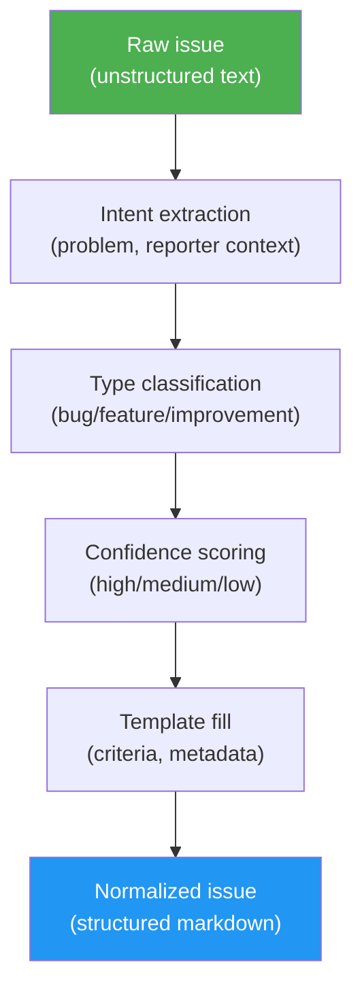

<!-- Generated from /docs/idd-methodology.md. Do not edit. Edit source and run ./scripts/build.sh. -->
# Issue-Driven Development (IDD)

*Capture intention, resolve against current code, remember in git.*

> **Normative contract:** this document explains the *why* of IDD. The precise, tool-neutral *what* — issue format, dependency markers, naming grammar, Decision Record fields, traceability requirements, and L1–L3 conformance levels — is versioned separately in [`SPEC.md`](https://github.com/luongnv89/idd/blob/main/SPEC.md) at the repository root. Where prose here and the spec disagree, the spec wins.

> **Runtime digest (generated).** This is the normative subset of [idd-methodology.md](https://github.com/luongnv89/idd/blob/main/docs/idd-methodology.md) that skills read at run time. The sections a skill run never acts on live in the full document.

## Core Concepts

### Capturing Intention

Expressing what you actually want is one of the hardest problems in software development. Even experienced developers struggle to articulate a bug or feature request clearly enough for someone else — human or AI — to act on it correctly. The result: wrong assumptions, wasted effort, and solutions that miss the point. Most bugs, missed features, and scope creep trace back to requirements that were never clearly stated.

IDD makes intention capture an explicit, iterative dialogue rather than a form to fill in:

1. **Describe the problem** — loosely, incompletely, however it comes to mind
2. **Disambiguate first** — when a core field is genuinely ambiguous (the type is unclear, the requirements are unstated), the interviewer asks one or two targeted questions before drafting, each with a recommended default, and resolves anything the repository can answer by inspecting it rather than asking. When the input is already clear, it skips straight to the draft — no needless questions
3. **Propose a structured issue** — classifying the type, preserving reporter context verbatim, generating acceptance criteria
4. **Read back what was captured** — and realize what you actually meant, what's missing, what's imprecise
5. **Refine through conversation** — correct, add detail, sharpen the intent until the issue says exactly what you want

This loop does something no template or form can do: it helps you **discover your own intention**. The interviewer — in gitissue, the `/issue-creator` agent — acts as both a mirror and a structured elicitor: reflecting your input back in a standardized format, and asking a precise question exactly when ambiguity would otherwise be guessed at. The questioning is targeted, not an interrogation: it engages only on fields that are genuinely unclear, and adds no friction when intent is already plain.

By the time the issue is finalized, it represents what the creator wants in a format that both humans and AI agents can inspect, question, and execute against. The structured issue becomes the **source of truth for intended behavior** — every downstream phase starts from it.

### Issue Normalization

Normalization restructures an existing unstructured issue into the standard contract. It is intentionally about **intent**, not code prediction.



A normalized issue contains:

- **Type classification** — bug, feature, or improvement (with confidence level)
- **Description** — synthesized from the original text with current/expected behavior
- **Acceptance criteria** — testable conditions for "done" (with confidence level)
- **Reporter Context** — original text preserved verbatim
- **Metadata** — suggested priority, effort, labels

Issues intentionally do **not** include predicted affected files, generated technical notes, or guessed architecture constraints. They may include file paths or constraints explicitly supplied by the reporter, but generated codebase analysis lives in the Analyze, Triage, and Resolve phases, because those scan the current code when they run.

The normalization marker `<!-- gitissue:normalized v1 -->` is invisible in the tracker's rendered view but detectable by tools.

### Confidence Scoring

Inferred fields — type classification, acceptance criteria, and tool-suggested Metadata values (priority, effort, labels) — carry confidence indicators:

| Level | Meaning | Display |
|-------|---------|---------|
| **high** | Explicit keywords — crash/error/500 → bug, "add new" → feature | `(high confidence)` |
| **medium** | Inferred from description context or tone | `(medium confidence)` |
| **low** | Ambiguous description, defaulted | `(needs review)` |

Low-confidence fields are marked `(needs review)` so reviewers know to verify. An unmarked field is asserted by its human author; a tool that infers a value must mark it.

### Agent-Agnostic Design

IDD issues are plain tracker markdown. Any tool that can read an issue can consume the structured format:

- **Claude Code** — reads the issue, follows the resolve pipeline
- **Codex CLI / Gemini CLI** — same structured issue, no gitissue-specific dependencies
- **Human developers** — readable sections, clear acceptance criteria
- **Future agents** — anything that can read markdown and follow a documented issue contract

No proprietary issue format, no parallel database. The workflow skills are optional automation around a human-readable issue body, and the [spec's conformance levels](https://github.com/luongnv89/idd/blob/main/SPEC.md) make the boundary explicit: **L1** (structured issues) is adoptable by a human-only team with zero tooling, **L2** adds the traceability chain, **L3** adds durable Decision Records.

### Low-Config Start

The reference implementation works without any configuration file — all settings have sensible defaults. When no `.gitissue.yml` exists:

```
○ First run — using default config. Run /init-gitissue to customize.
```

`/init-gitissue` auto-detects the project's language, framework, and test runner, and generates a tailored config.

## Intent-Code Boundary

The most important design rule in IDD is the **intent-code boundary**: do not freeze guessed code context into the issue. Code changes. Intent should remain stable.

IDD separates durable intent from time-sensitive codebase analysis:

| Artifact | Owns | Does not own |
|----------|------|--------------|
| **Issue** | Problem, reporter context, acceptance criteria, priority, labels | Predicted affected files or root cause |
| **Analysis** | Affected files, root cause, implementation options, complexity, risk | Final code changes |
| **PR** | Implementation, tests, review discussion, closing link | Rewriting the original intent |
| **Git history** | The durable story of what changed and why | Unstructured "WIP" progress logs |

This boundary keeps issues stable while allowing analysis to stay fresh. A file prediction made when an issue is created can become stale after one merge. A codebase scan run during analysis or resolution reflects the current repository.

## Analysis Artifacts and Durable Memory

`/issue-analysis` writes its findings to `.gitissue/analysis-<N>.json` so the resolver can reuse them and reviewers can inspect the current-code reality the analysis ran against. Reuse is conditional on the artifact still being true: `/issue-resolver` treats it as a research baseline — seeding a verify-first research pass and skipping synthesis — only when the checkable predicate that lives in one place, its *Step 0h — Analysis reuse gate*, holds (commit ancestry against this run's synced base, no predicted file moved since, issue unedited); any doubt falls back to the full pipeline. That JSON is **local cache**: not required to be committed, safe to delete, and regenerated by a fresh `/issue-analysis N`. Local cache is useful for the live workflow but cannot be the home of project memory — once the PR merges and the cache is cleared, the reasoning would disappear with it.

Durable project memory therefore lives in artifacts that already survive: the **issue body** (intent), the **PR body** (analysis lift, decision record, acceptance verification), and a **git-history artifact** on the default branch that carries the same content. The **dual-write rule** says: any analysis signal worth preserving must appear in both the PR body and git history.

Concretely, `/issue-resolver` lifts a five-field **Decision Record** — root cause, options considered, options rejected, selected option, residual risk — out of the analysis JSON and into the PR body, alongside an acceptance-criteria verification table. For **bug** issues, the Decision Record carries a sixth field — the **reproduction** evidence (the command confirmed red for the stated reason before the fix, and the regression test that proves the red → green transition) — produced by the bug-verification checkpoint that `/issue-resolver` runs before applying a fix, and likewise dual-written. `/issue-pr-review` checks for the presence of those fields as part of its traceability dimension. Deleting `.gitissue/analysis-<N>.json` after the PR merges does not destroy the reasoning — it is already in `git log -p`.

The PR body carries one more durable field: a **QA handoff marker** — `<!-- gitissue:qa v1 head=<sha40> … -->` on its last line, written by `/issue-resolver` only on a clean QA exit — recording what it already verified, pinned to the head commit, so `/issue-pr-review` collapses work it would otherwise repeat on an unchanged diff into one confirmation pass. The pin self-invalidates on any later commit yet survives a body edit: the binding is on code, not prose. It is deliberately **not** authentication — a PR body is author-editable — so it may gate duplicated work only; secret scanning, CI, acceptance-criteria verification and traceability always run at full strength.

The git-history half of the dual write is satisfied by one of three bindings ([SPEC.md §4.3](https://github.com/luongnv89/idd/blob/main/SPEC.md)): the **squash-merge body** (the platform copies the PR body verbatim into the squash commit), a **merge-commit body** (the record is appended to the merge commit message), or **git notes** (the record is attached to the landing commit under a documented notes ref). The reference implementation assumes **squash-merge as the default binding** — it is the only one that needs zero extra tooling on GitHub. Repos using a different merge strategy without declaring another binding keep durable memory only in the PR body (and therefore only on the tracker). `/init-gitissue` should warn when the repo's default merge strategy silently defeats the assumed binding.

## Issue Dependencies

When one issue cannot be merged until another is merged, the relationship is recorded in the issue body using one of two synonymous markers, anywhere in the body (typically under `## Metadata` or in a dedicated `## Dependencies` section):

- `Depends on #N` — explicit dependency on issue N (or its PR) being merged first
- `Blocked by #N` — same meaning, alternative phrasing

Multiple dependencies on one line are allowed: `Depends on #12, #15`. Cross-repo references (`org/repo#N`) are out of scope and ignored. The marker is case-insensitive and may appear in any list/sentence shape (`- Depends on #12`, `Depends on: #12`, `This depends on #12`).

Skills that read the marker:

- `/auto-pilot` — Phase 5 merge gate. Before merging PR-A for issue A, fetch issue A's body and parse `Depends on #N`. If any referenced issue is open, or has an open PR (unmerged), the auto-pilot refuses the merge: it prints a structured alert, records the outcome `blocked_by_dependency`, leaves PR-A open, and continues to the next eligible issue — the run is not paused. The user merges the dependency, and a later `/auto-pilot` run re-evaluates the gate and merges PR-A.
- `/issue-triage` — may use the marker as an additional dependency-graph signal alongside file-overlap detection (existing behavior unchanged; this is opt-in for future enhancement).

The convention is intentionally lightweight: it lives in plain prose in the issue body, requires no schema, and is grep-friendly for any tool — not just IDD skills.

## Hierarchy of Intent

IDD's unit of work is the issue, but larger efforts need one level above it: where does the design intent of a 15-issue effort live? The answer stays inside the tracker — an **epic is an ordinary issue** that parents other issues. No new artifact type, no separate roadmap database.

- **The parent (epic)** is a normal, normalized issue whose acceptance criteria describe the outcome of the whole effort. It lists its children as a markdown checklist (`- [ ] #12 — <title>`), so trackers with task-list references or native sub-issues track completion automatically. It closes only when all children close.
- **Each child** carries `Part of #N` in its body — the hierarchy marker defined in [SPEC.md §2.1](https://github.com/luongnv89/idd/blob/main/SPEC.md). Same grammar as `Depends on #N`: plain prose, case-insensitive, grep-friendly.
- **Scope is not order.** `Part of #N` says a child contributes to the parent's outcome; it never gates merging. When child B needs child A merged first, B additionally says `Depends on #A` — the two markers answer different questions.

**Decomposing a design document.** A PRD or design doc decomposes top-down: one epic per feature area, then independently resolvable children — each with its own acceptance criteria small enough for a single atomic PR. In gitissue, `/issue-creator`'s **batch mode** is the hook: feed it a PRD section or planning list and it creates the children in one pass; add the `Part of #N` markers and the parent checklist to bind them. The intent–code boundary applies at every level: the epic captures the *why* of the effort, the children capture the *what* of each slice, and no level predicts affected files.

Skills treat the marker conservatively today: `/issue-triage` may group children under their epic as a display signal, and `/auto-pilot`'s merge gate remains driven by `Depends on #N` alone.

## Maintainer Control and Safety

IDD is designed for maintainers who need automation without losing control:

- Normalization is previewed (`/issue-creator N --dry-run`) and existing issue bodies are backed up before rewriting
- Security-labeled issues require explicit force before rewriting
- Resolution creates branches and PRs instead of silently changing the default branch
- PRs use `Closes #N` so the tracker preserves the issue-to-code link
- Tests and build checks are part of the QA phase before delivery

## Principles

1. **The issue is the acceptance contract.** If intended behavior is not in the issue, it is not in scope.
2. **Intention before implementation.** The clarification loop ensures the issue captures what the creator actually wants before any code is written.
3. **Respect the intent-code boundary.** Issues capture durable intent; analysis and resolution inspect current code.
4. **History is a product.** Well-defined issues and commit messages create a development history that remains valuable for the lifetime of the project. Every artifact should be written for the person — or agent — who reads it six months from now.
5. **Current code beats stale assumptions.** Run codebase analysis when triaging, investigating, or resolving.
6. **Confidence over certainty.** Show what's inferred vs. what's known. Mark low-confidence fields for human review.
7. **Agent-agnostic.** The same issue works for any resolver — human, Claude, Codex, Copilot.
8. **Agent-assisted, maintainer-controlled.** Automation prepares and proposes changes; review gates preserve project ownership.
9. **Low ceremony.** Use the issue tracker and git history the project already has.
10. **Brownfield-first.** Built for existing codebases where context matters most.
11. **Data safety.** Preview and backup before mutating existing issue content.
