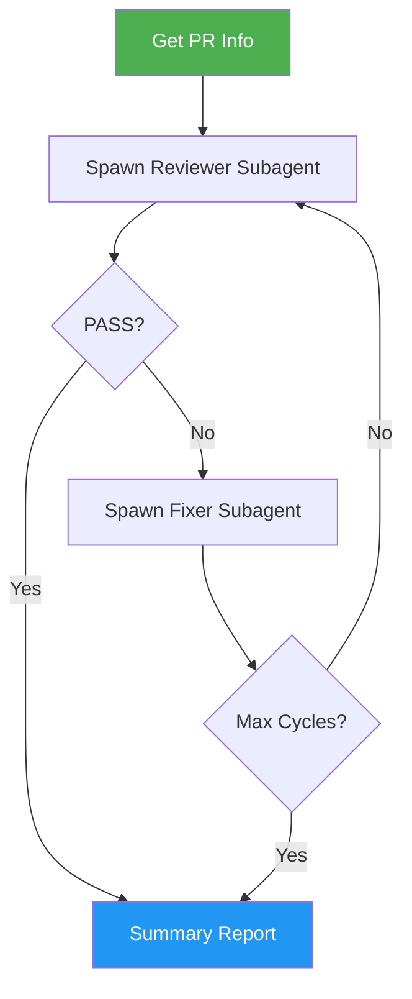

# Issue PR Review Fix Loop

> Outer review-fix loop with guaranteed fresh-eyes review each cycle — review, fix, commit, push, repeat until clean.

## Highlights

- Each review cycle spawns a **completely fresh reviewer subagent** with zero memory of prior passes
- Fixes are applied by a **separate fixer subagent** — the main agent never touches code
- Main agent is a pure orchestrator tracking only metadata (cycle count, pass/fail)
- Stagnation detection stops the loop when the same issues reappear across cycles
- Auto-merge support for hands-free operation in auto-pilot mode

## When to Use

| Say this... | Skill will... |
|---|---|
| "review and fix my PR" | Run the full review-fix loop for the current branch's PR |
| "/issue-pr-review-fix-loop 42" | Review-fix loop for PR #42 specifically |
| "polish this PR until clean" | Iterate until all review issues are resolved |
| "fresh review each pass" | Guarantee independent reviewer context per cycle |

## How It Works



## Usage

```
/issue-pr-review-fix-loop          # auto-detect PR for current branch
/issue-pr-review-fix-loop 42       # review-fix loop for PR #42
/issue-pr-review-fix-loop 42 --auto  # review-fix + auto-merge when clean
```

## Resources

| Path | Description |
|---|---|
| `references/error-messages.md` | Error catalog with triggers and fix commands |

## Output

Produces a structured summary report showing cycle history, total issues fixed, and final PR status. Each cycle creates an atomic commit with conventional commit format.
