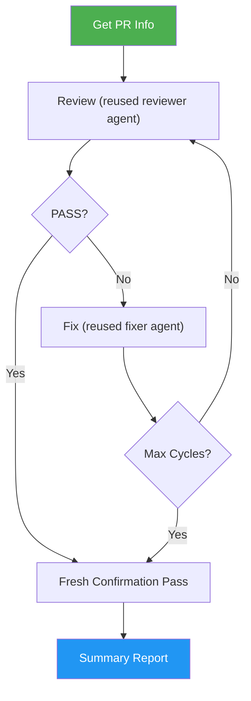

# Issue PR Review Fix Loop

> Outer review-fix loop with agent reuse across cycles and a fresh confirmation pass at the end — review, fix, commit, push, repeat until clean.

## Intent-Code Boundary

`/issue-pr-review-fix-loop` respects the intent-code boundary. It wraps `/issue-pr-review` in an outer loop; both reviewer and fixer subagents read the **PR diff** and the **current codebase** for every cycle — they do not rely on predicted file lists or implementation hints from the linked issue body. The linked issue's **acceptance criteria** define the pass condition; the loop converges by addressing live review findings, not by reconciling against stale issue-embedded notes. Cycle history and remaining issues stay in the PR thread, not in the issue body. See `docs/idd-methodology.md` for the full boundary contract.

## Highlights

- **Reuses reviewer and fixer agents** across cycles for efficiency — the reviewer verifies its own issues were fixed, and the fixer retains repo context
- A **fresh confirmation pass** at the end provides an unbiased final check after all fixes are applied
- Fixes are applied by a **separate fixer subagent** — the main agent never touches code
- Main agent is a pure orchestrator tracking only metadata (cycle count, pass/fail)
- Stagnation detection stops the loop when the same issues reappear across cycles
- Auto-merge support for hands-free operation in auto-pilot mode

## When to Use

| Say this... | Skill will... |
|---|---|
| "review and fix my PR" | Run the full review-fix loop for the current branch's PR |
| "/issue-pr-review-fix-loop 42" | Review-fix loop for PR #42 specifically |
| "polish this PR until clean" | Iterate until all review issues are resolved |
| "review loop with fresh confirmation" | Reuse agents across cycles, fresh check at the end |

## How It Works



## Usage

```
/issue-pr-review-fix-loop          # auto-detect PR for current branch
/issue-pr-review-fix-loop 42       # review-fix loop for PR #42
/issue-pr-review-fix-loop 42 --auto  # review-fix + auto-merge when clean
```

## Resources

| Path | Description |
|---|---|
| `references/error-messages.md` | Error catalog with triggers and fix commands |

## Output

Produces a structured summary report showing cycle history, total issues fixed, and final PR status. Each cycle creates an atomic commit with conventional commit format.
