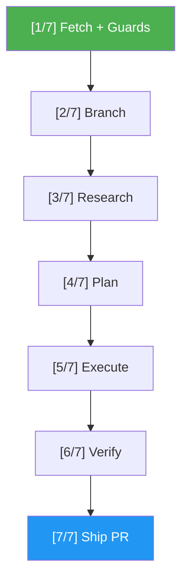

# Issue Resolver

> Resolve a GitHub issue end-to-end — from open issue to atomic PR in 7 steps.

## Highlights

- **Full pipeline**: Fetch → Guards → Normalize → Branch → Research → Plan → Execute → Verify → Ship
- **Auto-normalization**: Enriches unstructured issues with codebase context before resolving
- **Safety guards**: Warns on assigned issues, blocking labels, and prompt injection in issue bodies
- **Configurable gates**: Auto-proceed or pause for approval at the plan phase
- **Atomic PRs**: Creates a single PR with "Closes #N", summary, approach, files changed, and test results

## When to Use

| Say this... | Skill will... |
|---|---|
| `/issue-resolver 42` | Resolve issue #42 through the full 7-step pipeline |
| "fix issue #42" | Fetch, research, implement, test, and ship a PR for #42 |
| "work on #15" | Branch, implement changes, verify tests, create PR closing #15 |
| "implement the auth fix in issue 7" | Research the issue, plan the fix, execute, and ship |

## How It Works



## Installation

Install via [npx (Vercel)](https://www.npmjs.com/package/skills):

```bash
npx skills add https://github.com/luongnv89/idd --skill issue-resolver
```

Or via [agent-skill-manager (asm)](https://www.npmjs.com/package/agent-skill-manager):

```bash
asm install https://github.com/luongnv89/idd --skill issue-resolver
```

## Usage

```
/issue-resolver 42
```

## Resources

| Path | Description |
|---|---|
| `references/error-messages.md` | Complete error catalog with triggers and exact output for every failure scenario |

## Output

A pull request on GitHub linked to the resolved issue, containing:
- Issue summary and approach taken
- Table of files changed
- Test results
- Acceptance criteria checklist
- `Closes #N` for automatic issue closure on merge
