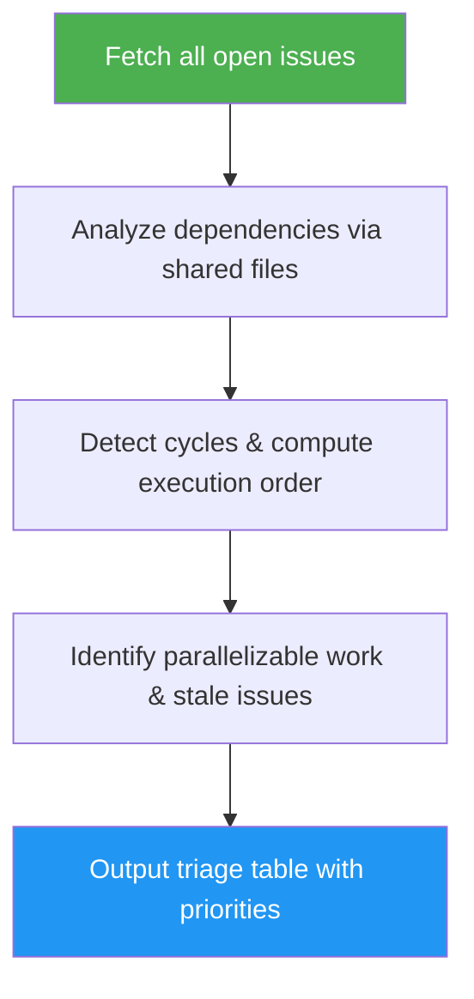

# Issue Triage

> Analyze open GitHub issues to surface dependencies, suggest priorities, identify parallelizable work, and flag stale issues.

## Highlights

- Builds a dependency graph from shared affected files across issues
- Computes execution order via topological sort with circular dependency detection
- Identifies parallelizable issues that can be worked on simultaneously
- Flags stale issues (configurable threshold, default 14 days)
- Suggests P1/P2/P3 priorities based on type, age, and blocking relationships

## When to Use

| Say this... | Skill will... |
|---|---|
| `/issue-triage` | Analyze all open issues, show dependency table with priorities and execution order |
| "what should I work on next" | Triage the backlog and recommend which issue to pick up first |
| "which issues are blocked" | Build dependency graph and show which issues depend on others |
| "sprint planning" | Output a prioritized, dependency-aware work plan |

## How It Works



## Installation

Install via [npx (Vercel)](https://www.npmjs.com/package/skills):

```bash
npx skills add https://github.com/luongnv89/idd --skill issue-triage
```

Or via [agent-skill-manager (asm)](https://www.npmjs.com/package/agent-skill-manager):

```bash
asm install github:luongnv89/idd:skills/issue-triage
```

## Usage

```
/issue-triage
/issue-triage --limit 20
```

## Resources

| Path | Description |
|---|---|
| `references/error-messages.md` | Error catalog for auth failures, rate limits, circular dependencies, and empty states |

## Output

A structured triage table in the terminal with:
- Dependency table: `# | Issue | Pri | Blocks | Status`
- Parallelizable issue groups
- Stale issue warnings
- Suggested execution order
