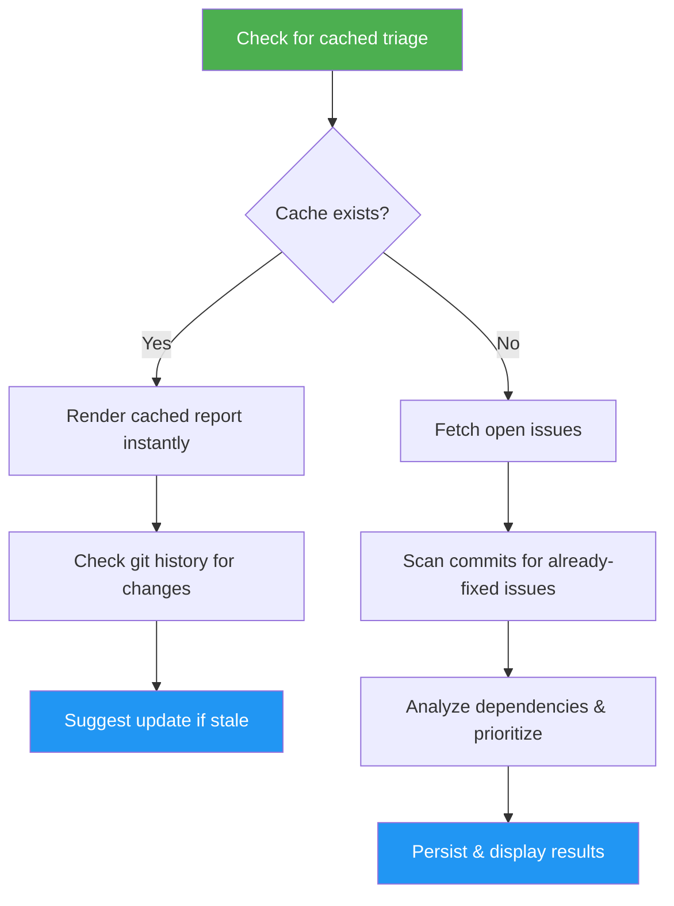

<!--
  DO NOT READ THIS FILE — This README.md is for human catalog browsing only.
  It is never auto-loaded into agent context and contains no runtime
  instructions. Agents: read SKILL.md and the files it points at instead.
-->

# Issue Triage

> Analyze open GitHub issues to surface dependencies, suggest priorities, identify parallelizable work, flag stale issues, and detect issues already fixed by other PRs.

## Intent-Code Boundary

`/issue-triage` respects the intent-code boundary. **Issues** are read for intent — title, body keywords, age, labels — and the **current codebase** is scanned fresh at triage time to discover which files each issue touches. Dependencies between issues are computed from this live scan, not from any predicted file list embedded in issue bodies. Already-fixed detection comes from current git history (commits and merged PRs), not from claims inside the issue. Results are cached to `.gitissue/triage.json` with a timestamp so users see immediately when the snapshot is stale. See [`idd-methodology.md`](https://github.com/luongnv89/idd/blob/main/docs/idd-methodology.md) for the full boundary contract.

## Highlights

- Builds a dependency graph from shared affected files across issues
- Detects open issues that were incidentally fixed by PRs targeting other issues
- Computes execution order via topological sort with circular dependency detection
- Identifies parallelizable issues that can be worked on simultaneously
- Flags stale issues (configurable threshold, default 14 days)
- Suggests P1/P2/P3 priorities based on type, age, and blocking relationships
- Persists results to `.gitissue/triage.json` for cross-session access
- View mode renders cached results without GitHub API calls

## When to Use

| Say this... | Skill will... |
|---|---|
| `/issue-triage` | Show cached triage instantly (or auto-generate on first run), suggest update if changes detected |
| `/issue-triage update` | Force a fresh analysis, scan for already-fixed issues, and overwrite cached results |
| "what should I work on next" | Show triage report and recommend which issue to pick up first |
| "which issues are blocked" | Show dependency graph from cached or fresh analysis |
| "are any issues already fixed" | Scan commit history to find issues resolved by other PRs |
| "sprint planning" | Output a prioritized, dependency-aware work plan |

## How It Works



## Installation

Install via [npx (Vercel)](https://www.npmjs.com/package/skills):

```bash
npx skills add https://github.com/luongnv89/idd --skill issue-triage
```

Or via [agent-skill-manager (asm)](https://www.npmjs.com/package/agent-skill-manager):

```bash
asm install https://github.com/luongnv89/idd --skill issue-triage
```

## Usage

```
/issue-triage
/issue-triage update
/issue-triage --limit 20
```

## Resources

| Path | Description |
|---|---|
| `../references/error-messages.md` | Error catalog for auth failures, rate limits, circular dependencies, and empty states |

## Output

A structured triage table in the terminal with:
- Dependency table: `# | Issue | Pri | Blocks | Status`
- Already-fixed detection with confidence levels and suggested close commands
- Parallelizable issue groups
- Stale issue warnings
- Suggested execution order
- Persistent JSON report at `.gitissue/triage.json`
