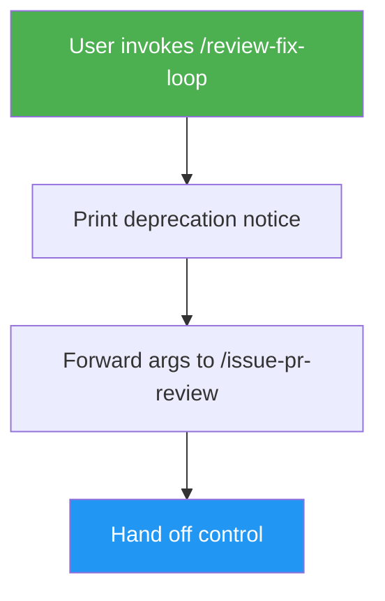

# Review Fix Loop (Deprecated)

> Deprecated alias — forwards all invocations to `/issue-pr-review`, which adds CI monitoring, end-to-end test execution, and auto-merge.

## Highlights

- Preserves the old `/review-fix-loop` command for muscle-memory users
- Prints a one-line deprecation notice before handing off
- Passes arguments through verbatim, including `--auto` and no-argument invocations
- Contains no review logic of its own — all behavior lives in `/issue-pr-review`

## When to Use

| Say this... | Skill will... |
|---|---|
| `/review-fix-loop 42` | Print deprecation notice and forward to `/issue-pr-review 42` |
| `/review-fix-loop` | Forward with no args so the target auto-detects the current branch's PR |
| "review and fix" | Forward verbatim to `/issue-pr-review` |

For any new project, prefer `/issue-pr-review` directly, or `/issue-pr-review-fix-loop` when you want the outer review-fix loop with fresh context per cycle.

## How It Works



## Installation

Install via [npx (Vercel)](https://www.npmjs.com/package/skills):

```bash
npx skills add https://github.com/luongnv89/idd --skill review-fix-loop
```

Or via [agent-skill-manager (asm)](https://www.npmjs.com/package/agent-skill-manager):

```bash
asm install https://github.com/luongnv89/idd --skill review-fix-loop
```

## Usage

```
/review-fix-loop [PR_NUMBER] [--auto]
```

## Resources

| Path | Description |
|---|---|
| `references/error-messages.md` | Short error catalog — mostly covers the case where `/issue-pr-review` is not installed |

## Output

One line from this skill:

```
○ /review-fix-loop is deprecated — forwarding to /issue-pr-review {args}
```

All further output comes from `/issue-pr-review`.
