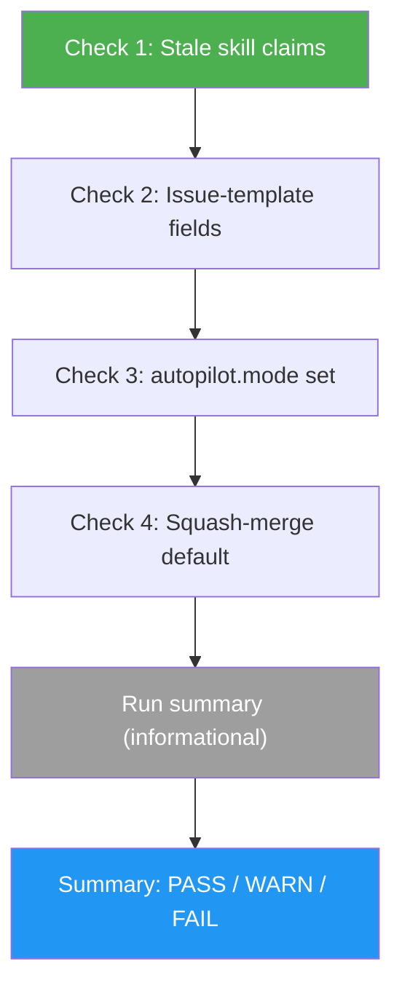

# IDD Doctor

> Report-only health check for IDD repositories. Catches doc drift on the intent-code boundary, missing `autopilot.mode` config, and unsafe merge defaults — no autofix, no surprises.

## Highlights

- Four mechanical checks, run in one pass — no short-circuit on failure
- Plus an informational **run summary** of recent `/issue-resolver` + `/auto-pilot` activity from `.gitissue/runs.jsonl` (resolve rate, median QA cycles, common skip reasons)
- Read-only by design — never modifies files, never opens issues, never creates PRs
- Skips gracefully when `.gitissue.yml`, `gh`, templates, or the run-log are missing
- Per-finding output points at the exact file and line for fast remediation
- Plain bash + `gh` — no extra runtime, no extra dependencies

## When to Use

| Say this... | Skill will... |
|---|---|
| `/idd-doctor` | Run the four-check health pass and report PASS / WARN / FAIL, then a run summary |
| "is my IDD setup healthy" | Run the doctor and surface drift before it becomes a footgun |
| "check the intent-only contract" | Verify `/issue-creator` claims and issue templates haven't drifted |
| "verify autopilot mode is set" | Confirm `.gitissue.yml` has `autopilot.mode` (when the file exists) |
| "what's my repo's merge strategy" | Report whether the repo is squash-only or has loose defaults |
| "how often does QA need extra cycles" | Summarize recent runs from `.gitissue/runs.jsonl` — resolve rate, median QA cycles, skip reasons |

## How It Works



All four checks always run — a fail in Check 1 does not skip Checks 2-4. The operator sees the full picture in a single pass. The run summary that follows is **informational only** — it reports recent run telemetry and never changes the PASS / WARN / FAIL result.

## Installation

Install via [npx (Vercel)](https://www.npmjs.com/package/skills):

```bash
npx skills add https://github.com/luongnv89/idd --skill idd-doctor
```

Or via [agent-skill-manager (asm)](https://www.npmjs.com/package/agent-skill-manager):

```bash
asm install https://github.com/luongnv89/idd --skill idd-doctor
```

## Usage

```
/idd-doctor
```

No arguments. The skill reads from the current repo and prints a four-line report plus per-finding details for any failures.

## Scope (v1)

| # | Check | Result type |
|---|-------|-------------|
| 1 | Stale `/issue-creator` claims in skill README/SKILL files | PASS / FAIL |
| 2 | Forbidden fields in `src/skills/issue-creator/templates/*.md` and `.github/ISSUE_TEMPLATE/*` | PASS / FAIL |
| 3 | `autopilot.mode` is set in `.gitissue.yml` (when the file exists) | PASS / FAIL / SKIP |
| 4 | Repo's default merge strategy is squash-only | PASS / WARN / SKIP |

### Out of scope for v1

- `gh` authentication checks (only the merge-strategy check uses `gh`, and it skips when `gh` is unavailable)
- Full schema validation of `.gitissue.yml`
- Stale-triage detection
- PR-format checks
- Commit-message linting
- README link validation
- **Any autofix** — v1 reports only

## Output

```
  ◆ /idd-doctor — health check
  ┄┄┄┄┄┄┄┄┄┄┄┄┄┄┄┄┄┄┄┄┄┄┄┄┄┄┄┄┄┄┄┄┄┄┄┄┄┄┄┄┄┄┄┄┄┄┄┄┄┄┄┄┄┄┄┄┄┄┄┄┄┄┄┄┄┄

    ✓ [1/4] Stale skill claims    no stale language in /issue-creator
    ✓ [2/4] Issue-template fields no forbidden fields in 5 templates
    ○ [3/4] Autopilot mode        skipped — no .gitissue.yml
    ⚠ [4/4] Squash-merge default  squash + merge-commit + rebase enabled — recommend squash-only
        Fix: in repo Settings → General → Pull Requests, allow only "Squash merging"
        Or:  gh api -X PATCH repos/:owner/:repo \
               -f allow_squash_merge=true \
               -f allow_merge_commit=false \
               -f allow_rebase_merge=false

    ○ Run summary             last 9 run(s) — resolve 78% (7/9 attempted), median QA 2
        outcomes: merged 5, left_open 2, skipped 2
        skip reasons: already_resolved 2

    ┄┄┄┄┄┄┄┄┄┄┄┄┄┄┄┄┄┄┄┄┄┄┄┄┄┄┄┄┄┄┄┄┄┄┄┄┄┄┄┄┄┄┄┄┄┄┄┄┄┄┄┄┄┄┄┄┄┄┄┄┄┄┄┄┄┄
    Result: WARN  (4 checks, 0 failed, 1 warned)
```

The run summary is informational (`○`) and never affects the result label. When `.gitissue/runs.jsonl` is absent, it collapses to a single `○ Run summary  no runs logged yet` line.

## Resources

| Path | Description |
|---|---|
| `SKILL.md` | Full check definitions, pattern catalogs, and exit-code semantics |
| `references/error-messages.md` | Error catalog for prerequisite failures and per-check output formats |

## Related Skills

- `/init-gitissue` — generates the `.gitissue.yml` that Check 3 verifies
- `/issue-creator` — the intent-only contract that Checks 1 and 2 enforce
- `/auto-pilot` — uses `autopilot.mode` from `.gitissue.yml`
