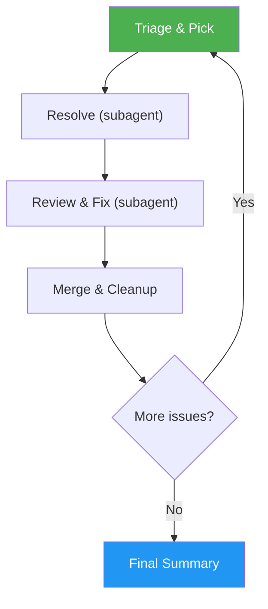

# Auto-Pilot

> Fully autonomous development loop that triages, resolves, reviews, and merges GitHub issues end-to-end with zero user prompts.

## Intent-Code Boundary

`/auto-pilot` respects the intent-code boundary at every step of the loop. It treats **issues as durable intent contracts** and orchestrates `/issue-triage`, `/issue-resolver`, and `/issue-pr-review` — each of which scans the **current codebase** when it needs file-level information. The auto-pilot itself never reads source files, predicts affected files into issue bodies, or freezes implementation guesses into stored state. When `/issue-creator` is invoked to normalize an unstructured issue mid-loop, it captures intent only — no codebase enrichment. See `docs/idd-methodology.md` for the full boundary contract.

## Highlights

- **Balanced-by-default merge modes** — fresh installs auto-merge clean PRs, while PRs with unresolved review issues stay open with follow-up issues. `autopilot.mode` (`conservative` | `balanced` | `aggressive`) controls when the loop is allowed to merge; aggressive partial-merge requires both `mode: aggressive` AND `merge_partial: true`. See SKILL.md *Merge Modes* for the full decision matrix.
- **Token-optimized review** — script pre-pass auto-fixes lint/format (zero tokens), LLM only reviews critical issues, soft pass skips nits
- **3-cycle review-fix loop** — with script pre-pass handling mechanical issues, 3 LLM cycles suffice; follow-up issues track anything left
- **Critical issue guard** — critical issues get human oversight: if the review can't fully resolve them, the loop stops and asks you for a decision
- **Zero-confirmation autonomy** — makes all non-critical decisions automatically (within the configured mode), only asks for genuinely irreversible actions
- **Smart batching** — analyzes related issues and batch-resolves them in a single PR to save iterations
- **Self-healing** — auto-stashes dirty trees, auto-switches branches, auto-recovers from sync conflicts
- **Subagent architecture** — fresh context per issue keeps quality high across long runs
- **Graceful degradation** — skips failed issues and continues rather than blocking the entire loop

## When to Use

| Say this... | Skill will... |
|---|---|
| "/auto-pilot" | Triage all open issues, resolve them one by one, review, merge, repeat |
| "/auto-pilot --issues 5,10,12" | Analyze those issues for dependencies and batching, then resolve in optimal order |
| "/auto-pilot --limit 3" | Process at most 3 issues then stop |
| "/auto-pilot --dry-run" | Show the execution plan without resolving anything |
| "/auto-pilot --skip 7" | Skip issue #7 (exclude from processing) |

## How It Works



## Usage

```
/auto-pilot
/auto-pilot --issues 5,10,12
/auto-pilot --limit 5
/auto-pilot --dry-run
/auto-pilot --skip 7
```

## Autonomy Model

The auto-pilot classifies decisions into two categories:

- **Auto-decide** (99%) — branch switching, strategy selection, failure recovery, and merging *within the bounds of `autopilot.mode`*
- **Confirm with user** (rare) — force-push to shared branches, deleting remote branches that others might depend on, production deployments, package publishing, modifying repository settings or branch protection rules

Merging itself is gated by `autopilot.mode`. The default `balanced` mode merges clean PRs and leaves PRs with unresolved review issues open with follow-up issues. Switch to `conservative` to never auto-merge, or to `aggressive` (with `merge_partial: true`) to also merge partial PRs alongside follow-up issues.

When something fails, the auto-pilot skips and continues rather than stopping. All work is pushed to remote PRs, so nothing is lost.

## Resources

| Path | Description |
|---|---|
| `references/orchestration.md` | Loop orchestration and the top-level control flow |
| `references/phases.md` | Full per-phase specification for each iteration |
| `references/preflight.md` | Environment and rate-budget preflight checks |
| `references/configuration.md` | Auto-pilot config options and merge-mode matrix |
| `references/explicit-list-mode.md` | Explicit `--issues` list mode: validation, analysis, batching |
| `references/subagent-prompts.md` | Exact prompts for resolver, reviewer, analyzer, and batch-resolver subagents |
| `references/summary-format.md` | Final summary template and the six iteration outcomes |
| `references/run-log.md` | `.gitissue/runs.jsonl` run-log schema and single-writer rules |
| `references/examples.md` | Full example sessions and edge-case scenarios |
| `references/error-messages.md` | Complete error catalog with triggers and autonomous recovery actions |

## Output

Produces a structured summary after all iterations complete, showing per-issue pass/fail status, PR links, and batch savings.
