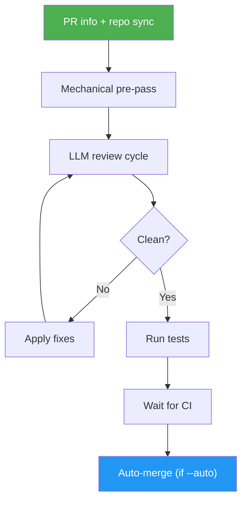

# Issue PR Review

> Review a pull request end-to-end — analyze, test, fix, check CI, and auto-merge when clean — with up to 3 token-optimized fix cycles.

## Intent-Code Boundary

`/issue-pr-review` respects the intent-code boundary. The reviewer reads the **PR diff** and the **current codebase** for findings — it never relies on a predicted file list embedded in the linked issue body. When the linked issue exists, its **acceptance criteria** are the contract the PR is evaluated against; everything else (root cause, affected files, implementation choices) is verified against the code as it is right now. Findings stay in the PR review thread and per-cycle reports — they are not written back into the issue body. See `docs/idd-methodology.md` for the full boundary contract.

## Highlights

- Mechanical pre-pass (lint, format, tests) before any LLM cycles to save tokens
- Up to 3 LLM-driven review-fix cycles, ending early when clean
- Runs the project's real test suite, not mocks
- Monitors CI status and waits for green before merging
- Auto-merge in `--auto` mode (used by `/auto-pilot`); read-only mode available
- Five-dimension review output — correctness, acceptance_criteria, traceability, maintainability, safety — so a PR can pass tests and still be flagged for missing issue links or unmet acceptance criteria
- Per-criterion acceptance-criteria verification (`pass` / `fail` / `unverified` with evidence) against the linked issue
- Soft-pass when zero "fix" issues remain, with **hard blocks** on `traceability: fail` (missing `Closes #N`) and any `acceptance_criteria: fail` — green tests do not override these
- Refactor/chore PRs (matching `review.traceability_exempt_labels` or `review.traceability_exempt_pattern`) are exempt from the `Closes #N` hard-fail; the other three traceability checks still run

## When to Use

| Say this... | Skill will... |
|---|---|
| `/issue-pr-review 42` | Review PR #42 interactively, report findings, offer fixes |
| `/issue-pr-review 42 --auto` | Review, fix, wait for CI, and auto-merge when green |
| `/issue-pr-review --review-only` | Review and report only — never fix or merge |
| "is this PR ready?" | Run the pipeline against the current branch's PR |
| "clean up this PR" | Iterate fix cycles until the review is clean |

## How It Works



## Installation

Install via [npx (Vercel)](https://www.npmjs.com/package/skills):

```bash
npx skills add https://github.com/luongnv89/idd --skill issue-pr-review
```

Or via [agent-skill-manager (asm)](https://www.npmjs.com/package/agent-skill-manager):

```bash
asm install https://github.com/luongnv89/idd --skill issue-pr-review
```

## Usage

```
/issue-pr-review
/issue-pr-review <PR_NUMBER>
/issue-pr-review <PR_NUMBER> --auto
/issue-pr-review --review-only
```

## Resources

| Path | Description |
|---|---|
| `references/error-messages.md` | Error catalog for auth failures, dirty trees, CI timeouts, and merge conflicts |

## Output

A structured 7-step pipeline report in the terminal with:
- PR title, number, and base/head branch
- Pre-pass results (lint, format, test counts)
- Per-cycle findings with confidence and severity
- Test and CI status
- Final verdict: pass, fix-and-retry, or hard-fail
