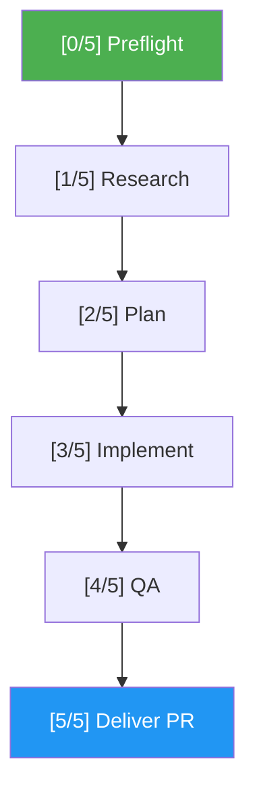

# Issue Resolver

> Resolve a GitHub issue end-to-end — from open issue to atomic PR in 6 steps.

## Intent-Code Boundary

`/issue-resolver` respects the intent-code boundary. The **issue body** owns durable intent: the problem statement, reporter context, and acceptance criteria. The resolver scans the **current codebase** during Research (Step 1) to discover affected files, dependencies, and constraints — it never trusts the issue body for predicted file lists or implementation hints. The atomic PR captures *how* the change was made; the linked issue captures *why* it mattered. If the issue body lacks structure (e.g., no acceptance criteria) and `issue.auto_normalize` is enabled, Step 0d normalizes it inline (same structure-only rules as `/issue-creator` Normalize) without inventing technical detail. Security-labeled issues are not rewritten without explicit operator confirmation (SPEC §1.4). See `docs/idd-methodology.md` for the full boundary contract.

## Highlights

- **Full pipeline**: Preflight → Research → Plan → Implement → QA → Deliver
- **Shared agents**: Delegates heavy work to `shared/agents/` (codebase-researcher, synthesizer, implementer, code-reviewer)
- **Built-in QA**: Code review + test + build + fix loop (max 5 cycles) before shipping
- **3-option planning**: Synthesizer proposes 3 approaches — user picks in interactive mode, auto-selected in auto-pilot
- **Safety guards**: Preflight checks for already-resolved issues, existing PRs, and blocking labels
- **Configurable gates**: Auto-proceed or pause for approval at the plan phase
- **Atomic PRs**: Creates a single PR with "Closes #N", summary, approach, files changed, and test results

## When to Use

| Say this... | Skill will... |
|---|---|
| `/issue-resolver 42` | Resolve issue #42 through the full 6-step pipeline |
| `/issue-resolver 42 --auto` | Resolve autonomously without user prompts |
| "fix issue #42" | Fetch, research, implement, test, and ship a PR for #42 |
| "work on #15" | Branch, implement changes, write tests, verify, create PR closing #15 |

## How It Works



## Installation

Install via [npx (Vercel)](https://www.npmjs.com/package/skills):

```bash
npx skills add https://github.com/luongnv89/idd --skill issue-resolver
```

Or via [agent-skill-manager (asm)](https://www.npmjs.com/package/agent-skill-manager):

```bash
asm install https://github.com/luongnv89/idd --skill issue-resolver
```

## Usage

```
/issue-resolver 42
```

## Resources

| Path | Description |
|---|---|
| `references/error-messages.md` | Complete error catalog with triggers and exact output for every failure scenario |

## Output

A pull request on GitHub linked to the resolved issue, containing:
- Issue summary and approach taken
- Table of files changed
- Test results
- Acceptance criteria checklist
- `Closes #N` for automatic issue closure on merge
